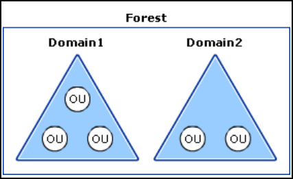

---
layout:
  title:
    visible: true
  description:
    visible: false
  tableOfContents:
    visible: true
  outline:
    visible: true
  pagination:
    visible: true
---

# 101

Active Directory (AD) is a Microsoft service for managing objects (e.g. users, computers, and groups) and access to resources on a network, structured into a hierarchy. Core components:

* **Forest** – The top-level container that represents the whole organization. It's the ultimate security and trust boundary and can contain multiple domains.
* **Domain** – A collection of users, computers, and other objects sharing the same AD database and security policies. Each domain has its own admins and trust relationships.
* **Organizational Unit (OU)** – A folder-like structure within a domain used to group objects (like users or computers) for easier management, delegated admin, and Group Policy application.

<figure><figcaption>
The relationships of OUs, domains, and forests in the logical structure architecture (<a href="https://learn.microsoft.com/en-us/previous-versions/windows/it-pro/windows-server-2003/cc759186(v=ws.10)#active-directory-domains-and-forests">source</a>).
</figcaption></figure>

A **Domain Controller (DC)** is a central server responsible for managing authentication requests and storing all AD object information. **DNS** is integral to AD's operation, supporting name resolution and service location.

AD also uses **Groups** to streamline access control by assigning permissions collectively to users or systems. Special attention should be given to **privileged groups** like **Domain Admins** (administrative control over a single domain) and **Enterprise Admins** (hold the highest level of privilege, with authority across the entire forest).

In more complex infrastructures, multiple domains can be organized within a **domain tree** or **forest**, allowing for scalability and delegated administration across business units or geographic locations.


When using AD credentials, it's best to connect with **RDP** instead of PowerShell Remoting or WinRM. This avoids the [**Kerberos Double Hop**](attacks/delegation/#tl-dr) issue, which can block AD enumeration tools. RDP passes your authentication cleanly, allowing smoother interaction with the domain.

