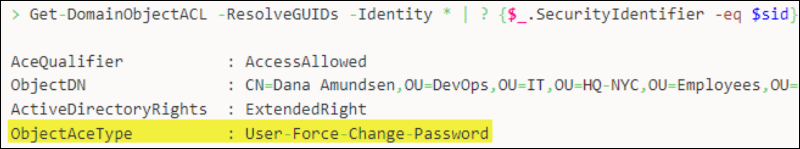

# PowerView


[SharpView](https://github.com/tevora-threat/SharpView) is the .NET version of PowerView; it can be useful when PowerShell is restricted.


## Enumeration


* `%` → `Foreach` alias
* `?` → `where` alias




```powershell
# Domain information
Get-Domain

# Domain SID
Get-DomainSID

# DC info
Get-DomainController
```

When forging tickets, the **Kerberos-related policies** are typically set to the default values by the tools (e.g. `mimikatz`, `rubeus`) automatically. If the domain has custom values, the mismatch will probably cause issues.

```powershell
# Domain policies
Get-DomainPolicyData
```



The unfiltered command will result in a massive output:

```powershell
# List the specified attributes of all domain users
Get-DomainUser | select samaccountname

# Query about a specified user
Get-DomainUser -Identity ca_svc

# Search for a particular string in a user's attribute
Get-DomainUser -LDAPFilter "Description=*built*" | select name,description
```


**OPSEC**: The `logonCount` attribute can help in **identifying honeypot or dormant accounts**; make sure to not attack these as they will generate a lot of alerts!


```powershell
# Filter by logonCount
Get-DomainUser | select samaccountname,logonCount

# Enumerate honeypot accounts
Get-DomainUser | Where-Object {$_.logoncount -eq 0}

# Discard honeypot accounts
Get-DomainUser | Where-Object {$_.logoncount -gt 0}
```



```powershell
# List the specified attributes of all computer objects
Get-DomainComputer | select operatingsystem,dnshostname
```

By default, a domain user can add up to 10 domain objects. As a result, there is a good chance that not all of them are real hosts. Use `logonCount` to check:

```powershell
Get-DomainComputer | select dnshostname,logonCount
```



When querying about `Domain Admins` members, `-500` indicates that this is the default `Administrator` account, while `-1000`+ indicates that it is user-created.


**OPSEC**: Stay away from DAs → the most well-protected and monitored account!


```powershell
# Domain groups
Get-DomainGroup | select name

# Domain groups that contain "admin"
Get-DomainGroup *admin* | select name

# Group members
Get-DomainGroup 'Domain Admins' | select member
Get-DomainGroupMember -Identity "Domain Admins" -Recurse

# User memberships
Get-DomainGroup -Username "user" | select name
```

If operating from a child domain, the forest root need to be enumerated separately using `-Domain` or cross-domain trust enumeration. For instance, the `Enterprise Admins` group only exists in the forest root.

```powershell
# Domain groups in the forest root (will include Enterprise Admins)
Get-DomainGroup -Domain forestroot.local | select name
```

Querying for local groups require admin rights on non-DC machines:

```powershell
# Local groups
Get-NetLocalGroup -ComputerName dcopr-dc

# Group members
Get-NetLocalGroupMember -ComputerName dcorp-dc -GroupName Administrators
```



```powershell
# Shares on domain hosts
Invoke-ShareFinder -Verbose
Find-DomainShare

# List all domain shares available to the current user
Find-DomainShare -CheckShareAccess

# Sensitive files on domain hosts
Invoke-FileFinder -Verbose

# All fileservers on the domain
Get-NetFileServer
```

The below command uses the `NetWkstaUserEnum` and `NetSessionEnum` Windows APIs. The former requires admin privileges, while the latter does not:

```powershell
# Active SMB sessions
Get-NetSession -ComputerName web01
```

For shares enumeration, [PowerHuntShares](https://github.com/NetSPI/PowerHuntShares) can be used. It can discover shares, sensitive files, ACLs for shares, network hosts, identities, etc. and generates an HTML report:


**OPSEC**: Remove the DC from the `servers.txt` file!



```powershell
# Create the servers.txt file (exclude the DC)
Get-DomainComputer | select -ExpandProperty dnshostname

# Import module
Import-Module c:\ad\tools\PowerHuntShares.psm1

# Execute script
Invoke-HuntSMBShares -NoPing -OutputDirectory c:\ad\tools -HostList c:\ad\tools\servers.txt
```




How to read an ACE → `SecurityIdentifier` has `ActiveDirectoryRights` on `ObjectDN`:


```powershell
ObjectDN              : CN=Control337User,CN=Users,DC=dollarcorp,DC=moneycorp,DC=local # 3. To this

ActiveDirectoryRights : CreateChild, Self, WriteProperty, ExtendedRight, Delete, GenericRead, WriteDacl, WriteOwner # 2. Can do these things

SecurityIdentifier    : S-1-5-32-544 # 1. This
```



```powershell
# Enumerate ACLs associated with the specified object
Get-DomainObjectAcl -samaccountname student337 -ResolveGUIDs
Get-DomainObjectAcl -Identity "Domain Admins" -ResolveGUIDs

# Enumerate ACLs associated with the specified prefix to be used for search
Get-DomainObjectAcl -SearchBase "LDAP://CN=Domain Admins,CN=Users,DC=dollarcorp,DC=moneycorp,DC=local" -ResolveGUIDs

# Search for interesting ACEs
Find-InterestingDomainAcl -ResolveGUIDs
Find-InterestingDomainAcl -ResolveGuids | ?{$_.identityreferencename -match "student337"}

# Get the ACLs associated with the specified path
Get-PathAcl -Path "\\dcorp-dc.dollarcorp.moneycorp.local\sysvol"

# Convert SID to name
Convert-SidToName <SID>

# Find user's SID
$sid = Convert-NameToSid <user>

# Search for all domain objects that the user has rights over
Get-DomainObjectACL -ResolveGUIDs -Identity * | ? ($_.SecurityIdentifier -eq $sid)
```


The `ObjectAceType` fields tells us what ACE the user has over the object:

<figure><figcaption></figcaption></figure>

Search for specific permissions:


```powershell
# List all objects for which the current user has the specified permission (SIDs output)
Get-ObjectAcl -Identity "Management Department" | ? {$_.ActiveDirectoryRights -eq "GenericAll"} | select SecurityIdentifier, ActiveDirectoryRights

SecurityIdentifier                            ActiveDirectoryRights
------------------                            ---------------------
S-1-5-21-1987370270-658905905-1781884369-512             GenericAll
S-1-5-21-1987370270-658905905-1781884369-1104            GenericAll
S-1-5-32-548                                             GenericAll
S-1-5-18                                                 GenericAll
S-1-5-21-1987370270-658905905-1781884369-519             GenericAll

# Convert SIDs to a readable format
> "S-1-5-21-1987370270-658905905-1781884369-512","S-1-5-21-1987370270-658905905-1781884369-1104","S-1-5-32-548","S-1-5-18","S-1-5-21-1987370270-658905905-1781884369-519" | Convert-SidToName
```


In case the script cannot be used, we can use native cmdlets. To convert the GUID into a human-readable format we can either perform a reverse search or just google it:


```powershell
# Make a list of all domain users
Get-ADUser -Filter * | Select-Object -ExpandProperty SamAccountName > ad_users.txt

# Retrieve ACL information about the target user
foreach($line in [System.IO.File]::ReadLines("C:\Windows\Temp\ad_users.txt")) {get-acl  "AD:\$(Get-ADUser $line)" | Select-Object Path -ExpandProperty Access | Where-Object {$_.IdentityReference -match '<DOMAIN>\\<USER>'}}

# Convert GUID into a human-readable format
$guid= "00299570-246d-11d0-a768-00aa006e0529"

# Reverse search to map the name to GUID
Get-ADObject -SearchBase "CN=Extended-Rights,$((Get-ADRootDSE).ConfigurationNamingContext)" -Filter {ObjectClass -like 'ControlAccessRight'} -Properties * |Select Name,DisplayName,DistinguishedName,rightsGuid| ?{$_.rightsGuid -eq $guid} | fl
```






```powershell
# List domain GPOs
Get-DomainGPO | select displayname
Get-DomainGPO -Identity <host>

# GPOs which use Restricted Groups or groups.xml for interesting users
Get-DomainGPOLocalGroup

# Users which are in a local group of a host using GPO
Get-DomainGPOComputerLocalGroupMapping -ComputerIdentity <host>

# Machines where the given user is member of a specific group
Get-DomainGPOUserLocalGroupMapping -Identity user
```



```powershell
# List domain OUs
Get-DomainOU
```

List the members of an OU:


```powershell
# Find the gplink attribute
Get-NetOU
(Get-DomainOu -Identity DevOps).gplink
[LDAP://cn={0BF8D01C-1F62-4BDC-958C-57140B67D147},cn=policies,cn=system,DC=dollarcorp,DC=moneycorp,DC=local;0]

# Find the name corresponding to the gplink
Get-DomainGPO -Identity "{0BF8D01C-1F62-4BDC-958C-57140B67D147}"
displayname              : DevOps Policy

# List hosts members of the OU
(Get-DomainOU -Identity DevOps).distinguishedname | %{Get-DomainComputer -SearchBase $_} | select name
```




```powershell
# Domain trusts for the current domain
Get-DomainTrust
Get-DomainTrust -Domain us.dollarcorp.moneycorp.local

# Forest details
Get-Forest
Get-Forest -Forest eurocorp.local

# All forest domains
Get-ForestDomain
Get-ForestDomain -Forest eurocorp.local

# GCs
Get-ForestGlobalCatalog

# Forest's map trusts
Get-ForestTrust
```

To enumerate external trusts between domains filter based on `TrustAttributes`:


```powershell
# Enumerate domain trusts
> Get-DomainTrust -domain eurocorp.local

SourceName      : eurocorp.local
TargetName      : eu.eurocorp.local
TrustAttributes : WITHIN_FOREST

SourceName      : eurocorp.local
TargetName      : dollarcorp.moneycorp.local
TrustAttributes : FILTER_SIDS # Filter by this attribute

# Enumerate external trusts
> Get-DomainTrust | ?{$_.TrustAttributes -eq "FILTER_SIDS"}                                                                                                                                                                                                                                                                                                                          SourceName      : dollarcorp.moneycorp.local                                                                                     TargetName      : eurocorp.local                                                                                                                                                                                      TrustAttributes : FILTER_SIDS                                                                                                
```


If an external trust exists, the domain can be enumerated. But remember, there is no transitivity, so other domains cannot be enumerated:


```powershell
# Enumerate trusts for a trusting forest
> Get-ForestDomain -Forest eurocorp.local | %{Get-DomainTrust -Domain $_.Name}

SourceName      : eurocorp.local # Forest root
TargetName      : eu.eurocorp.local # Parent-child
TrustAttributes : WITHIN_FOREST
TrustDirection  : Bidirectional

SourceName      : eurocorp.local
TargetName      : dollarcorp.moneycorp.local # external trust
TrustAttributes : FILTER_SIDS
TrustDirection  : Bidirectional

# No transitivity
> Get-DomainTrust -Domain eu.eurocorp.local
Exception calling "FindAll" with "0" argument(s): "A referral was returned from the server.
"
At C:\AD\Tools\PowerView.ps1:23860 char:20
+             else { $Results = $Searcher.FindAll() }
+                    ~~~~~~~~~~~~~~~~~~~~~~~~~~~~~~
    + CategoryInfo          : NotSpecified: (:) [], MethodInvocationException
    + FullyQualifiedErrorId : DirectoryServicesCOMException
```




Query for active sessions (requires admin rights):

```powershell
# Active logged on users
Get-NetLoggedon -ComputerName dcorp-adminsrv

# Locally logged on users
Get-LoggedonLocal -ComputerName dcorp-adminsrv

# Last logged on user
Get-LastLoggedOn -ComputerName dcorp-adminsrv
```

Query for DA sessions by asking the DC for the group members of the specified group (`Get-DomainGroupMember`) (`Domain Admins` by default), getting a list of hosts (`Get-DomainComputer`), and listing sessions (`Get-NetSession`) and logged on users (`Get-NetLoggedon`) from each one:


**OPSEC**: This is noisy as it leaves a `4624` (logon), `4634` (logoff) and, in case of a hit, `4672` (success). In addition, it tries to list sessions on the DC which will create alerts on MDI. Use the `ComputerName` parameter to scan hosts in batches and exclude the DC from the hosts.



Listing sessions requires admin rights from Server 2019 onwards.


```powershell
# Find DA session
Find-DomainUserLocation

# Find other group's sessions
Find-DomainUserLocation -UserGroupIdentity "RDPUsers"
```

Another way of listing sessions on remote machine is [Invoke-SessionHunter](https://github.com/Leo4j/Invoke-SessionHunter). This doesn't need admin privs as it uses Remote Registry and queries the `HKEY_USERS` hive:

```powershell
# Enumerate remote sessions
Invoke-SessionHunter -FailSafe

# OPSEC friendly
Invoke-SessionHuner -NoPortScan -Targets servers.txt
```



The below function queries the DC (of the current or provided domain) for a list of hosts (`Get-NetComputer`) and then uses `Invoke-CheckLocalAdminAccess` on each using RPC/SMB ports:


**OPSEC**: This is noisy as it leaves a `4624` (logon), `4634` (logoff) and, in case of a hit, `4672` (success). Use the `ComputerName` parameter to scan hosts in batches.


```powershell
Find-LocalAdminAccess
```

This command uses the `OpenServiceW` function to interact with the Service Control Manager (SCM) on a target machine. The SCM manages installed services and drivers. PowerView tries to connect to it with `SC_MANAGER_ALL_ACCESS` permissions, which **require administrative rights**. If it succeeds, it infers that the current user has **administrator privileges** on that machine.

In case ports used by `Find-LocalAdminAccess` are blocked try:

* `Find-WMILocalAdminAccess.ps1`
* `Find-PSRemotingLocalAdminAccess.ps1`



## Attacks

### Kerberoasting

For Kerberoasting see [here](../attacks/kerberoasting.md#attack).

### Password Change

For changing the password of an account see [here](../permissions/forcechangepassword.md).

### LAPS Password

For changing the LAPS password see here.




```powershell
# Enumerate Kerberoastable accounts
Get-DomainUser * -SPN | select samaccountname
# Kerberoast the enumerated accounts
Get-DomainUser * -SPN -verbose |  Get-DomainSPNTicket -Format Hashcat | Export-Csv .\ilfreight_spns.csv -NoTypeInformation
```





```powershell
Get-DomainComputer "MachineName" -Properties 'cn','ms-mcs-admpwd','ms-mcs-admpwdexpirationtime'
```




## Python Version

[PowerView.py](https://github.com/aniqfakhrul/powerview.py) is an alternative for the original [PowerView.ps1](https://github.com/PowerShellMafia/PowerSploit/blob/master/Recon/PowerView.ps1) script. Its main goal is to achieve interactive session without having to repeatedly authenticate to LDAP.



```bash
powerview <domain>/<user>:'<pass>'@<domain> -k
```



Add a user to a group:

```bash
# Add user to the group
PV > Add-DomainGroupMember -Identity <group> -Members <user>

# Confirm group membership
PV > Get-DomainGroupMember -Identity <group>
```



Check object's ACL:


```bash
# Check rights of oorend over winrm_svc
Get-DomainObjectAcl -Identity winrm_svc -Where "SecurityIdentifier contains oorend"
```



