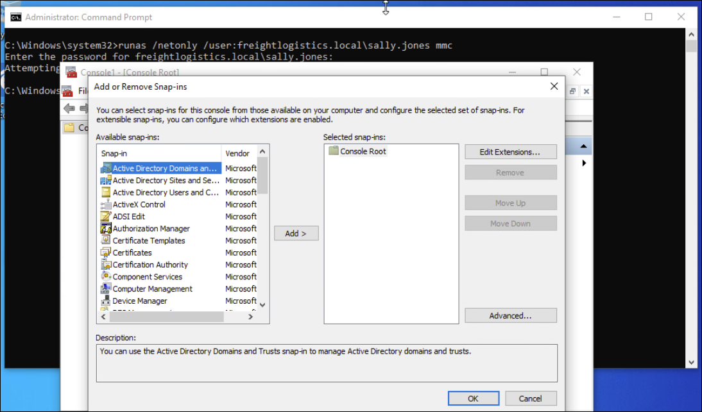
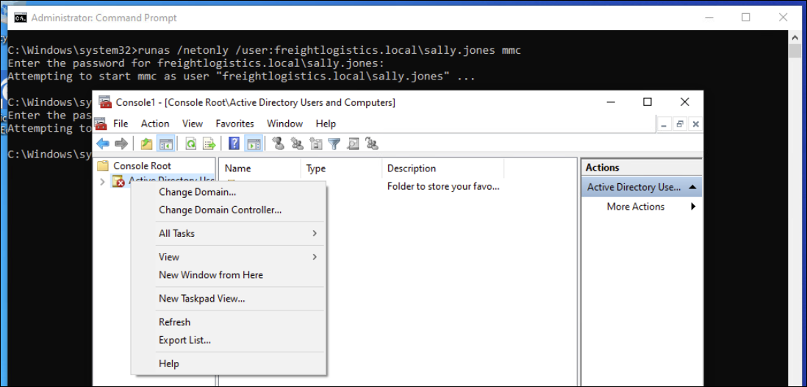

---
layout:
  width: default
  title:
    visible: true
  description:
    visible: false
  tableOfContents:
    visible: true
  outline:
    visible: true
  pagination:
    visible: true
  metadata:
    visible: true
  tags:
    visible: true
---

# RSAT

The [Remote Server Administrator Tool](https://learn.microsoft.com/en-us/troubleshoot/windows-server/system-management-components/remote-server-administration-tools) (RSAT) allows the remote management of roles and features (e.g. AD, DNS, DHCP) in Windows Server from a computer that is running Windows 10 and Windows 7 Service Pack 1. It can be installed only on Windows Pro or Enterprise editions.

Installing RSAT will make GUI tools (e.g. AD Users and Computers, ADSI Edit) available (_Control Panel_ → _Administrative Tools)._

```powershell
# Check if any RSAT tools are installed
Get-WindowsCapability -Name RSAT* -Online | Select-Object -Property Name, State

# Install all available tools
Get-WindowsCapability -Name RSAT* -Online | Add-WindowsCapability –Online

# Install a specific tool
Add-WindowsCapability -Name Rsat.ActiveDirectory.DS-LDS.Tools~~~~0.0.1.0  –Online
```

If needed, we can change the domain context with `runas` (built-in) or other third-party tools:


```powershell
runas /netonly /user:htb.local\\jackie.may powershell

rubeus.exe asktgt /user:<user> /domain:<domain> /dc:<dc-IP> /rc4:<hash>

mimikatz.exe sekurlsa::pth /domain:<domain> /user:<user> /rc4:<hash>
```


We can also launch any RSAT snap-ip (e.g. `mmc`) using `runas` and perform AD enumeration:


The MMC (Microsoft Management Console) is a framework that hosts admin tools (aka snap-ins), such as _Active Directory Users and Computers_, in a single interface. Think of it like this:

* MMC → Windows admin toolbox shell
* Snap-ins → the tools inside MMC


```powershell
runas /netonly /user:Domain_Name\\Domain_USER mmc
```



If we get an error message for the domain, right-click on the AD Users and Computers and change the domain to the target domain.


