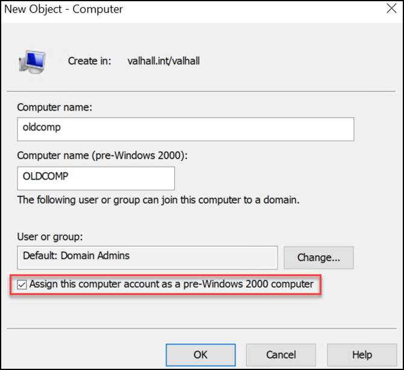

---
layout:
  width: default
  title:
    visible: true
  description:
    visible: false
  tableOfContents:
    visible: true
  outline:
    visible: true
  pagination:
    visible: true
  metadata:
    visible: true
  tags:
    visible: true
---

# Pre-Created Machines

> [Diving into Pre-Created Computer Accounts](https://trustedsec.com/blog/diving-into-pre-created-computer-accounts)

As explained [here](https://blog.joeware.net/2012/09/12/2590/), when a machine account is created via ADUC or the `net computer` command (and more!), by default Windows generates a random password for the computer account.

However, if the “Assign this computer account as a pre-Windows 2000 computer” option is selected, it takes the `sAMAccountName`, removes the trailing `$` and then takes the first 14 characters, converts them to all lowercase and that becomes the computer password (NT4 default computer password).

<div align="left"><figure><figcaption><p>The dangerous setting (image taken from <a href="https://trustedsec.com/blog/diving-into-pre-created-computer-accounts">here</a>).</p></figcaption></figure></div>

NetExec has the [`pre2k`](https://www.netexec.wiki/ldap-protocol/pre2k) module that identifies pre-created computer accounts and attempts to request a TGT using their default machine password:


```bash
nxc ldap dc01 -u poppy -p Pass123 -d mollysec.local -M pre2k
```


## Practice

The privilege escalation part of [Retro](https://www.hackthebox.com/machines/retro) and the foothold part of [RetroTwo](https://www.hackthebox.com/machines/retrotwo) leverage the pre2k setting.
