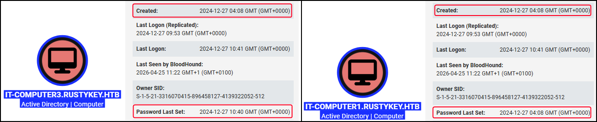

---
layout:
  width: default
  title:
    visible: true
  description:
    visible: false
  tableOfContents:
    visible: true
  outline:
    visible: true
  pagination:
    visible: true
  metadata:
    visible: true
  tags:
    visible: true
---

# Timeroasting


## Overview

As explained [here](https://cybersecurity.bureauveritas.com/uploads/whitepapers/Secura-WP-Timeroasting-v3.pdf), within an AD environment, machine accounts rely on the [Network Time Protocol (NTP)](https://learn.microsoft.com/en-us/windows-server/networking/windows-time-service/how-the-windows-time-service-works#network-time-protocol) to sync their clocks with a DC. When a system requests the time, it can specify the Relative ID (RID) of its machine account.&#x20;

In response, the server calculates a cryptographic Message Authentication Code (MAC) for the time data, using the NTLM password hash of the specified machine account as the secret key.

The issue in this process is that **the NTP server does not require any authentication from the client** **and blindly trusts the RID provided in the request**. As a result, an unauthenticated user can send a request for any machine account by simply specifying its RID. The server will look up that account's password hash, use it to sign the NTP response, and send this cryptographically signed packet back to the user.

## Practice

### RustyKey

The foothold part of [RustyKey](https://www.hackthebox.com/machines/rustykey) offers a chance to practice the Timeroasting attack.

After collection domain data, we notice that there is one machine account (`IT-COMPUTER3`) that differs from the rest. While every other machine's password was set the time of its creation, `IT-COMPUTER3`'s password was set a few hours after:

<figure><figcaption></figcaption></figure>

This indicates that this password might have been set by a user instead of the Windows operating system. Therefore, there is a chance to be weak. We can extract its hash via a Timeroasting attack and attempt to crack it:


```bash
# Timeroast attack
$ nxc smb dc.rustykey.htb -M timeroast

# Crack the hashes (the username is the RID of the machine account)
> .\hashcat.exe -m31300 '\\wsl$\kali-linux\home\mollysec\active-box\sntp-hashes' --username '\\wsl$\kali-linux\usr\share\wordlists\rockyou.txt' -O -d1
...
1125:$sntp-ms$34c...2ed:Rusty88!
```

