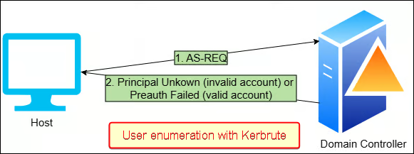

---
layout:
  width: default
  title:
    visible: true
  description:
    visible: false
  tableOfContents:
    visible: true
  outline:
    visible: true
  pagination:
    visible: true
  metadata:
    visible: true
  tags:
    visible: true
---

# User Enumeration

Kerberos responds differently to an AS‑REQ depending on whether the requested username exists in the domain. This behaviour allows attackers to **enumerate valid usernames without performing full authentication attempts**. Unlike traditional brute‑force methods, this approach does not generate the standard Windows logon failure event (Event ID 4625), because the authentication process does not reach the stage where a logon attempt is formally recorded. Instead, the username is validated by sending a **single UDP request** to the KDC and analysing the response. User enumeration is typically performed by sending AS‑REQ messages without pre‑authentication data:

* If the KDC returns a `PRINCIPAL UNKNOWN` error, the username does not exist.&#x20;
* If the KDC responds by requesting pre‑authentication, the username is valid.

<figure><figcaption></figcaption></figure>

**This process does not increment failed logon counters and therefore does not cause account lockouts**. In most environments, it also generates minimal logging, although if advanced Kerberos auditing is enabled, Event ID 4768 may still be recorded. This technique is commonly automated with tools such as [Kerbrute](https://github.com/ropnop/kerbrute), which streamlines username enumeration and password spraying using Kerberos protocol behaviour.

```shell
# Enumerate users
kerbrute userenum users.txt --dc dc01.marvel.local -d marvel.local
```
