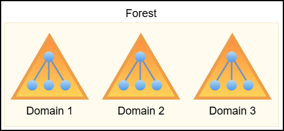
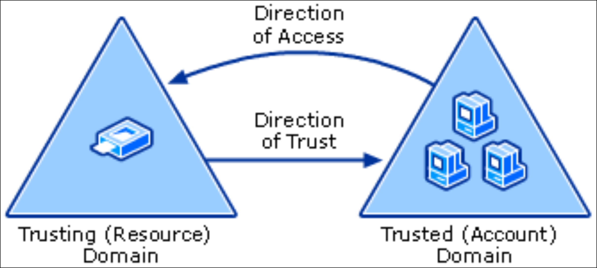
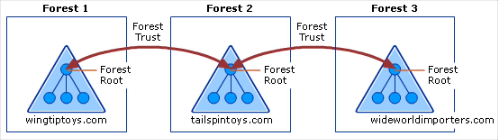
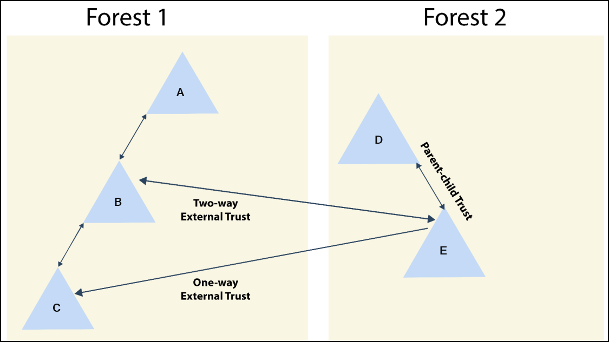
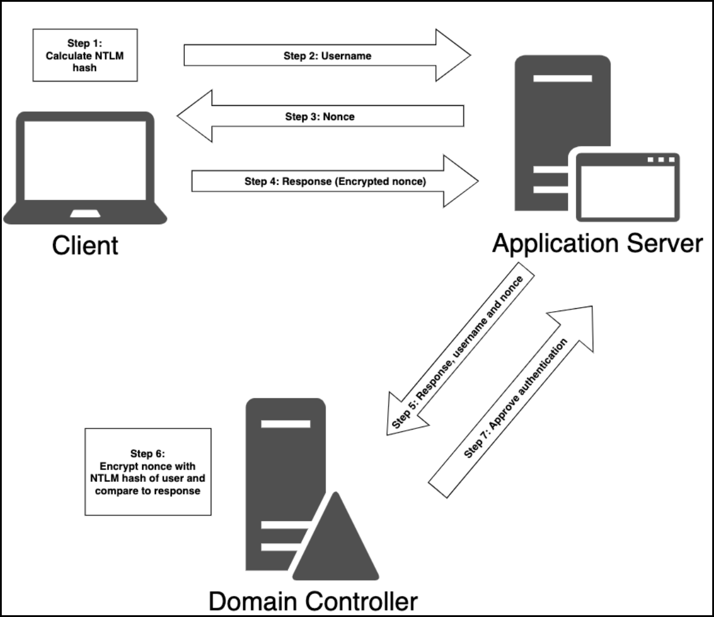
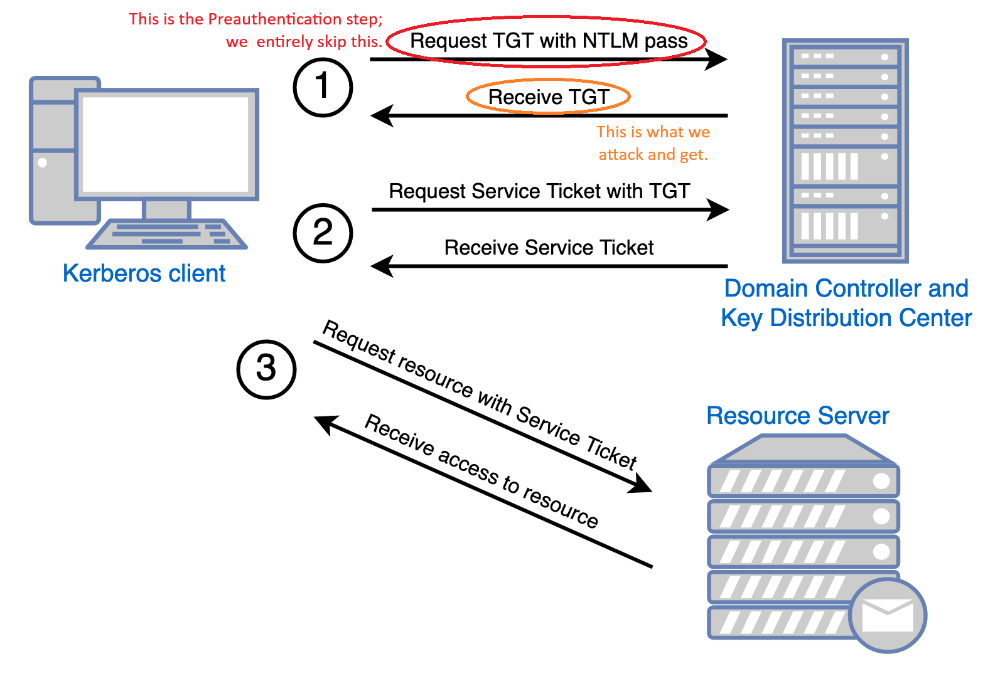

---
layout:
  title:
    visible: true
  description:
    visible: false
  tableOfContents:
    visible: true
  outline:
    visible: true
  pagination:
    visible: true
---

# General Info

## 101

### Components

Active Directory (AD) is Microsoft’s centralized identity and access management system, used to govern users, machines, groups, and permissions across enterprise Windows networks. It structures these objects hierarchically to enable scalable delegation and fine-grained access control. At the top of this hierarchy is the **forest**, which defines the ultimate trust and security boundary. Forests can contain multiple **domains**, each acting as an independent administrative unit with its own objects and policies, but capable of establishing trust with other domains. Inside domains, **Organizational Units (OUs)** provide logical grouping to streamline delegation and **Group Policy** enforcement without breaking domain boundaries.

<figure><figcaption></figcaption></figure>

A **Domain Controller (DC)** is the backbone of AD, responsible for authenticating users, authorizing access, and maintaining a synchronized copy of the domain’s directory data. AD relies heavily on DNS for name resolution and service location; without it, core functions like locating DCs or processing logons will fail. Group-based access control streamlines privilege management—particularly through high-value groups like **Domain Admins** (full control over a domain) and **Enterprise Admins** (control across the forest), which are primary targets during privilege escalation.

Under the hood, AD is driven by several critical components. The **Schema** defines the structure and rules for all directory objects, specifying what attributes they have and how they relate. The **Query and Index System** enables fast and flexible searching, crucial for both user workflows and attacker reconnaissance. The **Global Catalog (GC)** is hosted on select DCs and stores a partial, searchable view of all objects across the forest, supporting cross-domain queries and universal group resolution. Finally, the **Replication Service** keeps directory data consistent across DCs, making any change (e.g., password reset or group membership) quickly available throughout the environment. For red teamers, understanding these internals is essential for stealthy navigation and exploiting trust boundaries.

### GPOs & OUs

Group Policy settings are managed through **Group Policy Objects (GPOs)**, which can be linked to sites, domains, or—most commonly—Organizational Units (OUs). OUs represent the lowest level in AD to which GPOs can be directly applied, making them a key target for both administrators and attackers seeking to influence system behavior at scale.

Two common GPO-based mechanisms for managing local group membership are **Restricted Groups** and **Group Policy Preferences (GPP)** `groups.xml`. Restricted Groups, located under Security Settings in a GPO, enforce strict membership by explicitly defining who should (or shouldn't) be in a given local group—typically the local Administrators group. Any accounts not listed are removed, making this a rigid but reliable enforcement tool. In contrast, **groups.xml**, used in GPP, provides more granular control, allowing additions, removals, or replacements without purging existing members unless explicitly instructed. This flexibility makes `groups.xml` a frequent choice for incremental changes—such as temporarily adding support personnel—though its looser controls can leave openings for misconfiguration or abuse.

### Trusts

A **forest trust** establishes a trust relationship between two distinct AD forests, allowing cross-forest authentication and resource access. Trusts can be **one-way**—where users from Forest A can access Forest B but not vice versa—or **two-way**, where mutual access is permitted. Notably, the direction of access is always **opposite** to the direction of trust: if Forest A trusts Forest B, then users in B can access resources in A.

<figure><figcaption>
Trust path in a one-way trust (<a href="https://learn.microsoft.com/en-us/previous-versions/windows/it-pro/windows-server-2003/cc759554(v=ws.10)?redirectedfrom=MSDN#trust-paths">source</a>).
</figcaption></figure>

Forest trusts must be manually configured by administrators and require both forests to be at **Windows Server 2003 functional level or higher**. These trusts can be **transitive**, allowing access to other trusted domains within the forests, or **non-transitive**, restricting access to just the explicitly defined trust partner. For example, if Forest 2 holds two-way transitive trusts with both Forest 1 and Forest 3, users in Forests 1 and 3 can access resources in Forest 2—but not directly between each other. A direct two-way transitive trust between Forests 1 and 3 would be required for full access in both directions.

<figure><figcaption>
Diagram of forest trusts relationships within a single organization (<a href="https://learn.microsoft.com/en-us/entra/identity/domain-services/concepts-forest-trust#forest-trusts">source</a>).
</figcaption></figure>

In contrast, an **external trust** is a non-transitive relationship between two specific domains in separate forests. It’s typically used when a full forest trust isn’t feasible. If Domain B and Domain E are connected via an external trust, users in one can access resources in the other—but cannot traverse further. For example, Domain B cannot access Domain D through Domain E unless Domain E itself is compromised.&#x20;

<figure><figcaption></figcaption></figure>

From a red team perspective, this highlights a pivot potential: compromising a trusted domain (like E) can enable lateral movement across otherwise untrusted domains or forests.

## Authentication


AD authentication uses **NTLM** (legacy) and **Kerberos** (default) protocols. NTLM is vulnerable to brute force; Kerberos uses tickets and session keys but can be abused (e.g., ticket theft). Credentials are cached in **LSASS** memory for SSO, and can be extracted using tools like `mimikatz` if attackers gain `SYSTEM`-level access. Defenses include LSA Protection, disabling WDigest, and endpoint monitoring.



For enumeration or post-auth interaction, **RDP is preferred over PowerShell Remoting or WinRM** when using AD credentials. RDP cleanly passes credentials through the session, whereas Remoting protocols are impacted by the [**Kerberos double-hop limitation**](broken-reference), which interferes with tools that rely on impersonation or token delegation.


### NTML

**NTLM (NT LAN Manager)** is a legacy authentication protocol that still appears in modern AD environments, particularly in fallback situations—such as when connecting to resources via IP address rather than hostname, or when a service isn’t properly registered in AD DNS. Some third-party applications also continue to prefer NTLM over Kerberos due to compatibility reasons.

1. The client creates an NTLM hash from the user’s password (Step 1) and sends the username to the server (Step 2).
2. The server replies with a randomly generated nonce, aka **challenge** (Step 3).
3. The client sends the **response** (the NTML-encypted nonce) back the server (Step 4).
4. The server forwards the username, nonce, and response to the DC (Domain Controller) (Step 5).
5. The DC uses the stored NTLM hash for that user to encrypt the nonce (Step 6) and if the result matches the response, authentication succeeds (Step 7).

<figure><figcaption></figcaption></figure>

NTML stores unsalted hashed passwords in **SAM** database (`c:\windows\system32\config\sam`) which cannot be copied while the Windows OS is running. **Local Security Authority System (LSASS)** runs with `SYSTEM` privileges and caches NTLM hashes.

> _Although NTLM hashes are non-reversible, the algorithm is very fast, making **brute-force attacks** relatively easy. Despite its weaknesses, NTLM remains in use primarily for compatibility with legacy systems and fallback scenarios._

### Kerberos

Kerberos is the **default authentication protocol in modern AD environments**, replacing NTLM since Windows Server 2003. Built on MIT's Kerberos v5 standard, it operates on a ticket-based model and leverages a centralized authority called the Key Distribution Center (KDC). In AD, every Domain Controller (DC) functions as a KDC.

Unlike NTLM’s challenge-response mechanism, Kerberos is more secure and efficient. A critical operational detail for red teamers: **if a service is accessed using an IP address instead of a hostname, Kerberos cannot be used, and NTLM is forced**—often causing authentication to fail if NTLM is not supported or allowed.

The Kerberos authentication process works as follows:

1. **User Login (AS-REQ)**\
   When a user logs in, their machine sends an Authentication Service Request (AS-REQ) to the DC (KDC). This request includes a timestamp encrypted using a key derived from the user's password.
2. **KDC Response (AS-REP)**\
   The KDC retrieves the user’s password hash from `ntds.dit` and attempts to decrypt the timestamp. If successful and the timestamp is valid (a duplicate timestamp may indicate a replay attack), the KDC replies with an Authentication Service Reply (AS-REP). This contains a session key (encrypted with the user’s password hash) and a Ticket Granting Ticket (TGT), which is encrypted with the `krbtgt` account’s hash (this is known only to the KDC). The client can decrypt the session key and stores the TGT, which is typically valid for 10 hours and renewable.
3. **Service Request (TGS-REQ)**\
   When the user tries to access a service, the client sends a Ticket Granting Service Request (TGS-REQ) to the KDC. It includes the username, the encrypted TGT, a timestamp encrypted with the session key, and the name of the requested service.
4. **KDC Issues Service Ticket (TGS-REP)**\
   The KDC validates the TGT, checks the timestamp, and ensures the username and IP address match. If everything checks out, it sends a Ticket Granting Service Reply (TGS-REP), which includes a new session key (shared between client and service) and a service ticket encrypted with the service account’s password hash.
5. **Client to Service (AP-REQ)**\
   The client sends an Application Request (AP-REQ) to the service, containing the service ticket, the client’s username, and a timestamp encrypted with the new session key.
6. **Service Validates and Grants Access**\
   The service decrypts the ticket using its own password hash, extracts the session key and username, and verifies the timestamp. If valid, it checks group membership information from the ticket and grants access accordingly.

<figure><figcaption></figcaption></figure>

### Cached Credentials

The **Local Security Authority (LSA)** is a fundamental Windows subsystem responsible for enforcing security policies, managing authentication, and handling credential storage. Its functionality is carried out by the **Local Security Authority Subsystem Service (LSASS)** — the `lsass.exe` process — which runs in memory and performs tasks such as logon validation and credential caching.&#x20;


**OPSEC**: LSASS is the core auth component which makes it the most monitored process on a Windows host!


To support Single Sign-On (SSO) and optimize user experience, Windows stores authentication material (e.g., NTLM hashes, Kerberos tickets, and sometimes plaintext credentials) in the memory of LSASS. When users authenticate (via local login, RDP, `runas`, scheduled tasks, services, etc.), their credential artifacts are stored in LSASS. Although this memory is encrypted and undocumented, with sufficient privileges (typically `SYSTEM`-level), attackers can extract its contents to harvest credentials.

### Credentials Vault

The **Windows Credentials Vault**, also known as Credential Manager, is a secure credential storage mechanism in Windows that retains user credentials for websites, network shares, remote desktop connections, and applications. It enables seamless authentication by allowing the OS and applications to retrieve saved credentials without prompting the user repeatedly.

Stored credentials are encrypted and kept in a protected location on the system. They can be accessed via the Control Panel (Credential Manager UI) or programmatically through the Windows Credential API.

While not as commonly targeted as LSASS, the vault can contain plaintext domain credentials, particularly for scheduled tasks or service accounts. Tools like [Mimikatz](ad-tools/mimikatz.md) can extract these credentials using commands like `vault::cred /patch`, provided the attacker has elevated privileges.

## Access Controls

### **Permissions**


ACLs can be enumerated with [PowerView](ad-tools/powerview.md), but it is much easier with [BloodHound](ad-tools/bloodhound.md).


In AD, permissions are assigned to objects through **Access Control Entries (ACEs)**, which form an **Access Control List (ACL)**. When a user attempts to access an AD object, the object checks the ACL to verify if the user has the necessary permissions. For example, when a domain user tries to access a domain share (an AD object), the object checks the user's permissions through its ACL, which is a two-step process:

1. The user sends an **access token** containing their identity and permissions.
2. The object **compares the token against its ACL** to determine if access should be granted or denied.

If the ACL allows access, the user is granted permission to access the share; otherwise, the request is denied. The main permissions of interest to attackers include: _`GenericAll`_ (full access), _`GenericWrite`_ (edit attributes), _`WriteOwner`_ (change ownership), `WriteDACL` (edit ACE's applied), `AllExtendedRights` (change/reset password), `ForceChangePassword` (password change), and `Self` (add ourselves to a group).

There are two types of ACLs:

* **DACL (Discretionary)** → Defines the perms trustees have on an object.
* **SACL (System)** → Logs success/failure audit messages when an object is accessed.

Finally, the **Security Descriptor Propagator** (**SDProp)** is an AD process that periodically (every 60 minutes by default ) re-applies protected ACLs to high-privilege accounts/groups (like Domain Admins) to prevent ACL tampering by overwriting manual changes.

### **SIDs**

A **Security Identifier (SID)** is a unique value assigned to each entity, or _**principal**_, that can be authenticated by Windows, such as users and groups. The SID is unmutable and is generated when the user or group is created.

* The SID for local accounts and groups is generated by the **Local Security Authority (LSA)**
* The SID for domain users and domain groups, it's generated on a **Domain Controller (DC)**

SIDs have the following format: `S-R-X-Y`.

* `S`: Indicates it's a SID.
* `R` (Revision): Always `1`.
* `X` (Identifier Authority): Specifies the authority that issued the SID (e.g., `5` for NT Authority).
* `Y` (Sub Authorities): Includes the domain/machine identifier and the **Relative Identifier (RID)**, which uniquely identifies users or groups. For example, for `S-1-5-21-1336799502-1441772794-948155058-1001`, the RID `1001` suggests it's the second local user on the system, since local RIDs start at `1000`.&#x20;

Some SIDs have RIDs under `1000` (**well-known SIDs)** representing built-in users and groups:

* `S-1-0-0` → **Nobody**
* `S-1-1-0` → **Everybody**
* `S-1-5-11` → **Authenticated Users**
* `S-1-5-18` → **Local System**
* `S-1-5-domainidentifier-500` → **Administrator**

### **Access Tokens**

Once a user logs in, Windows creates an **access token** to determine what actions they can perform. This token contains important security details, forming the **security context** of the user. An access token consists of:

* The **SID** of the user as well as the **SIDs of groups** the user belongs to
* **Privileges** assigned to the user and groups
* Additional info defining **the token's scope**

There are different types of tokens:

1. **Primary Token:** assigned to a process when a user starts it and defines what actions the process can take based on the user’s permissions.
2. **Impersonation Token:** used by a thread to temporarily act as another user (provide a different security context than the process that owns the thread) and lets a process perform actions with different security privileges.

### **Mandatory Integrity Control**

Windows uses **MIC** to **restrict access** between processes based on their **integrity levels**. This prevents lower-trust processes from modifying higher-trust objects, even if they have the right permissions. **Processes and objects** inherit the integrity level of the user who creates them, unless the executable has a low integrity level, in which case any process it starts will also have a low level. **Lower-integrity processes** **cannot** modify higher-integrity objects. From Windows Vista onwards, there are five integrity levels:

1. `System`: Used by kernel-mode processes with `SYSTEM` privileges
2. `High`: Assigned to processes with `admin` privileges
3. `Medium`: The default for standard user processes
4. `Low`: Used for **sandboxed** processes (e.g., web browsers)
5. `Untrusted`: The most restricted level, assigned to risky processes

Integrity levels can be checked using Process Explorer (process integrity), via the `whoami /groups` command (user integrity), and via the `icalcs` command (file integrity).

### **User Account Control**

**UAC** is a security feature that prevents unauthorized privilege escalation by **restricting applications to standard user privileges**, even if the user is an `Administrator`. When an `Administrator` logs in, Windows creates two access tokens:

1. **Standard User Token** (default, used for regular tasks)
2. **Administrator Token** (activated only when elevated privileges are required)

> _To use admin privileges, the user must confirm a **UAC prompt**._

UAC ensures applications run at the right privilege level, protects system files and registry keys from accidental or malicious changes, and prevents malware from gaining full control of the system without user approval. Processes run at four different **integrity levels**:

1. `System`: Kernel-mode processes with `SYSTEM` privileges
2. `High`: Used for administrative tasks
3. `Medium`: Default level for standard user applications
4. `Low`: Used for sandboxed processes (e.g., web browsers)

> _Being an `Administrator` does not mean all processes run with **high integrity** by default. **UAC ensures privilege separation**, requiring explicit approval for **elevated actions**. Attackers and penetration testers often seek to **bypass UAC** to execute processes at high integrity, allowing unrestricted access to system resources._
