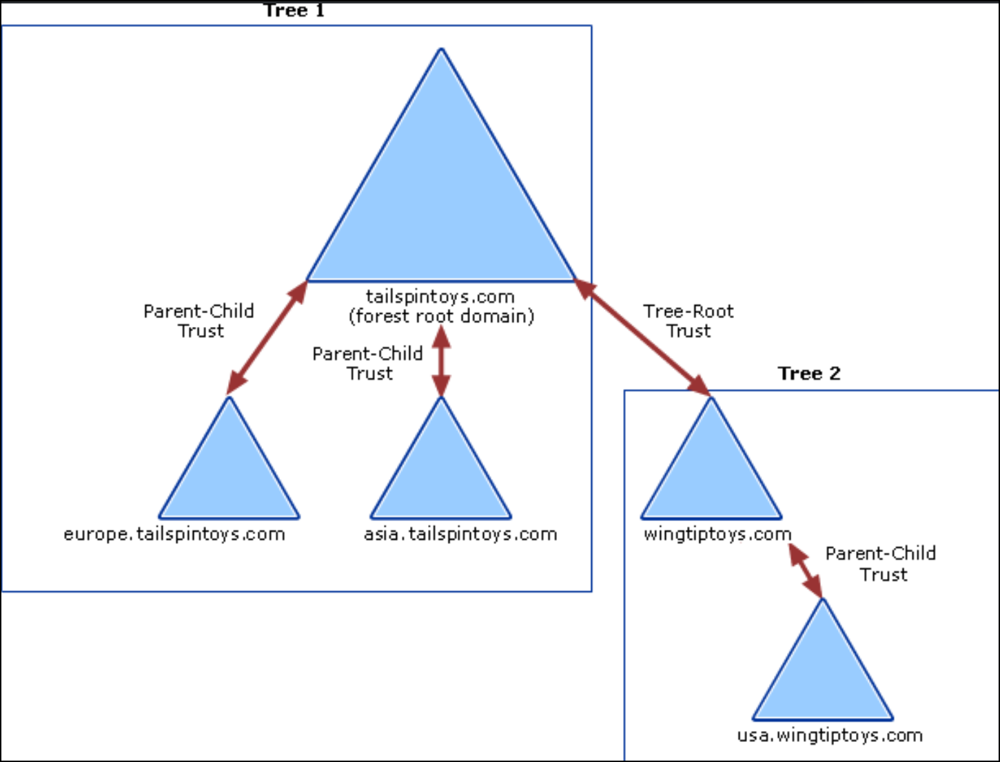

---
layout:
  title:
    visible: true
  description:
    visible: false
  tableOfContents:
    visible: true
  outline:
    visible: true
  pagination:
    visible: true
---

# General Info

## 101

### Components

**Active Directory (AD)** is Microsoft's centralized identity and access management system used to control **objects** (users, computers, and permissions) across a Windows-based network. It organizes resources into a hierarchical structure and enables scalable, granular access control across enterprise environments:

* At the top of this hierarchy is the **Forest**, which serves as the security and trust boundary for the entire organization.&#x20;
* A forest can contain multiple **Domains**, each of which holds its own set of users, computers, groups, and policies within a shared AD database. Domains are isolated security units but can establish trust relationships with others for cross-domain access.&#x20;
* Within each domain, **Organizational Units (OUs)** function like containers that help segment objects for targeted administrative control and Group Policy application.

<figure><figcaption></figcaption></figure>

A **Domain Controller (DC)** is the central server that handles authentication and authorization requests and maintains a replicated copy of all directory data. AD's operation depends heavily on DNS, which is used for name resolution and service discovery within the domain. Without functional DNS, key AD processes like locating DCs or authenticating users break down.

To simplify permission management, AD uses **Groups**, which allow access rights to be assigned collectively. Of particular importance are privileged groups such as **Domain Admins**, who have full control over a single domain, and **Enterprise Admins**, who have administrative access across all domains in the forest.

AD relies on several key internal components that define how objects are structured, queried, and replicated:

* The **Schema** defines the blueprint for all AD objects—their types, attributes, and relationships. It determines what can exist in the directory and how those objects behave.
* The **Query and Index Mechanism** allows efficient searching and publication of directory objects and their metadata. This underpins how tools and users find resources (e.g., users, printers, services).
* The **Global Catalog (GC)** is a partial, read-only replica of every object in the forest, containing a subset of each object's attributes. It’s hosted on selected DCs and is used to support universal group membership resolution and cross-domain queries.
* The **Replication Service** ensures consistency across DCs by synchronizing directory changes (e.g., user creation, password changes) throughout the domain or forest.

### GPOs & OUs

Group Policy settings are contained in a **Group Policy Object (GPO).** GPOs can be linked to domains, sites, and OUs, but most commonly are linked to OUs. An OU is the lowest-level AD container to which GPO can be applied.

**Restricted Groups** and **groups.xml** are two methods used to manage local group membership on domain-joined machines via GPOs:

* **Restricted Groups**, found under the security settings in a GPO, are used to strictly enforce who can and cannot be a member of a specified group. When applied, it either defines exactly who should be members—removing all others—or specifies what other groups a group should belong to. This approach is best suited for situations where tight control is required, such as ensuring only authorized IT personnel are members of the local Administrators group across all systems.
* **groups.xml** is part of **Group Policy Preferences** and offers a more flexible, granular approach to managing group memberships. It allows administrators to add, remove, or replace members in local groups without necessarily wiping out existing entries unless explicitly configured to do so. The XML configuration is applied to client machines and enables easier, more targeted changes, such as adding a single user to a local group for support purposes. While Restricted Groups are ideal for strict enforcement, `groups.xml` is often preferred for scenarios requiring more nuanced control.

### Trusts

A **forest trust** is a relationship between two separate AD forests that allows users in one forest to access resources in another.

* **One-way Trust:** Users in Forest A can access Forest B, but not the other way around.
* **Two-way Trust:** Both forests trust each other—users can access resources in either direction.


The direction of access is always opposite of the direction of trust.


<figure><figcaption>
Trust path in a one-way trust (<a href="https://learn.microsoft.com/en-us/previous-versions/windows/it-pro/windows-server-2003/cc759554(v=ws.10)?redirectedfrom=MSDN#trust-paths">source</a>).
</figcaption></figure>

Trusts must be **manually created** by admins and are only available if both forests are at **Windows Server 2003 forest functional level or higher**. Trusts can be **transitive** (extend trust relationships with other domains/forests) or **non-transitive** (deny trust relationships with other domains/forests).

<figure><figcaption>
Diagram of forest trusts relationships within a single organization (<a href="https://learn.microsoft.com/en-us/entra/identity/domain-services/concepts-forest-trust#forest-trusts">source</a>).
</figcaption></figure>

The above configuration provides the following access:

* Users in Forest 2 can access resources in any domain in either Forest 1 or Forest 3
* Users in Forest 3 can access resources in any domain in Forest 2
* Users in Forest 1 can access resources in any domain in Forest 2
* Users in Forest 1 cannot access resources in Forest 3 or vice versa.

To allow users in both Forest 1 and Forest 3 to share resources, a **two-way transitive trust** must be created between the two forests. This type of trust is the default intra-forest trusts (tree-root, parent-child).

<figure><figcaption>
Intra-forest trusts (<a href="https://learn.microsoft.com/en-us/entra/identity/domain-services/concepts-forest-trust#trust-relationship-flows">source</a>).
</figcaption></figure>

**External trusts** exist between two domains in different forests when the latter do not have a trust relationship. Can be one- or two-way and is **non-transitive**.

<figure><figcaption></figcaption></figure>

Domains B and E have an external trust established between them. This means that they can access resources, but there is no transitivity, thus, domain B cannot access resources on domain D. Only if domain E is compomised, an attacker from domain B can attack domain D.

## Authentication


AD authentication uses **NTLM** (legacy) and **Kerberos** (default) protocols. NTLM is vulnerable to brute force; Kerberos uses tickets and session keys but can be abused (e.g., ticket theft). Credentials are cached in **LSASS** memory for SSO, and can be extracted using tools like `mimikatz` if attackers gain `SYSTEM`-level access. Defenses include LSA Protection, disabling WDigest, and endpoint monitoring.



For enumeration or post-auth interaction, **RDP is preferred over PowerShell Remoting or WinRM** when using AD credentials. RDP cleanly passes credentials through the session, whereas Remoting protocols are impacted by the [**Kerberos double-hop limitation**](attacks/delegation/#tl-dr), which interferes with tools that rely on impersonation or token delegation.


### NTML

**NTLM (NT LAN Manager)** is a legacy authentication protocol that still appears in modern AD environments, particularly in fallback situations—such as when connecting to resources via IP address rather than hostname, or when a service isn’t properly registered in AD DNS. Some third-party applications also continue to prefer NTLM over Kerberos due to compatibility reasons.

1. The client creates an NTLM hash from the user’s password (Step 1) and sends the username to the server (Step 2).
2. The server replies with a randomly generated nonce, aka **challenge** (Step 3).
3. The client sends the **response** (the NTML-encypted nonce) back the server (Step 4).
4. The server forwards the username, nonce, and response to the DC (Domain Controller) (Step 5).
5. The DC uses the stored NTLM hash for that user to encrypt the nonce (Step 6) and if the result matches the response, authentication succeeds (Step 7).

<figure><figcaption></figcaption></figure>

NTML stores unsalted hashed passwords in **SAM** database (`c:\windows\system32\config\sam`) which cannot be copied while the Windows OS is running. **Local Security Authority System (LSASS)** runs with `SYSTEM` privileges and caches NTLM hashes.

> _Although NTLM hashes are non-reversible, the algorithm is very fast, making **brute-force attacks** relatively easy. Despite its weaknesses, NTLM remains in use primarily for compatibility with legacy systems and fallback scenarios._

### Kerberos

Kerberos is the **default authentication protocol** in modern AD environments, having replaced NTLM since Windows Server 2003. It is based on Kerberos version 5 (originally developed by MIT) and relies on a **ticket-based model** involving a central authority called the **Key Distribution Center (KDC)**. In AD, every Domain Controller functions as a KDC.

> The key differences between the NTML and Kerberos protocols are that:
>
> 1. Challenge-response (NTML) vs. ticket-based (Kerberos) system.
> 2. The client initiates authentication directly with the application server (NTML) vs. authentication begins with the KDC (Kerberos).

The Kerberos authentication process works as follows:

1. **User Login (AS-REQ)**\
   When a user logs in, their machine sends an Authentication Service Request (AS-REQ) to the DC (KDC). This request includes a timestamp encrypted using a key derived from the user's password.
2. **KDC Response (AS-REP)**\
   The KDC retrieves the user’s password hash from `ntds.dit` and attempts to decrypt the timestamp. If successful and the timestamp is valid (a duplicate timestamp may indicate a replay attack), the KDC replies with an Authentication Service Reply (AS-REP). This contains a session key (encrypted with the user’s password hash) and a Ticket Granting Ticket (TGT), which is encrypted with the `krbtgt` account’s hash (this is known only to the KDC). The client can decrypt the session key and stores the TGT, which is typically valid for 10 hours and renewable.
3. **Service Request (TGS-REQ)**\
   When the user tries to access a service, the client sends a Ticket Granting Service Request (TGS-REQ) to the KDC. It includes the username, the encrypted TGT, a timestamp encrypted with the session key, and the name of the requested service.
4. **KDC Issues Service Ticket (TGS-REP)**\
   The KDC validates the TGT, checks the timestamp, and ensures the username and IP address match. If everything checks out, it sends a Ticket Granting Service Reply (TGS-REP), which includes a new session key (shared between client and service) and a service ticket encrypted with the service account’s password hash.
5. **Client to Service (AP-REQ)**\
   The client sends an Application Request (AP-REQ) to the service, containing the service ticket, the client’s username, and a timestamp encrypted with the new session key.
6. **Service Validates and Grants Access**\
   The service decrypts the ticket using its own password hash, extracts the session key and username, and verifies the timestamp. If valid, it checks group membership information from the ticket and grants access accordingly.

<figure><figcaption></figcaption></figure>

### Cached Credentials

To support **Single Sign-On (SSO)** and **reduce the need for repeated authentication**, Windows stores user credentials in memory. These cached credentials include NTLM or SHA1 password hashes and Kerberos tickets (TGTs and TGSs). They are held within the memory space of a critical Windows process called **Local Security Authority Subsystem Service (LSASS)**.

Accessing LSASS memory requires `SYSTEM` or administrative privileges. The contents of LSASS are encrypted and undocumented, but attackers can still extract them with sufficient permissions. If they gain access, they can dump password hashes, cleartext passwords (if older protocols like `WDigest` are enabled), and even Kerberos tickets—allowing them to impersonate users or escalate privileges.

We can **dump LSASS credentials** or **extract Kerberos tickets** (TGS, TGT) using [`mimikatz`](ad-tools/mimikatz.md). However, running `mimikatz` directly on a machine is easily detected by antivirus and endpoint detection systems. To evade detection, attackers often inject it into memory via PowerShell or download LSASS memory for offline analysis using built-in tools like Task Manager or `comsvcs.dll`.

While inspecting LSASS or dumping credential materials, we may encounter various hash formats such as:

| Type      | Description                          |
| --------- | ------------------------------------ |
| NTLM      | Default for older AD (2003 level)    |
| SHA1      | Often used with AES in newer domains |
| DPAPI     | Protects local secrets               |
| Cleartext | If `WDigest` is enabled              |

> _Some **defensive measures** can reduce the risk of credential theft:_
>
> * _**LSA Protection** (also known as **Credential Guard**) restricts access to LSASS memory, even from administrative accounts. This can be enabled via registry configuration._
> * _**Disable WDigest** to prevent storage of cleartext passwords in memory._
> * _**Use Endpoint Detection and Response (EDR)** tools that can detect and alert on tools like Mimikatz or suspicious memory access patterns._

## Access Controls

### **Permissions**


ACLs can be enumerated with [PowerView](ad-tools/powerview.md), but it is much easier with [BloodHound](ad-tools/bloodhound.md).


In AD, permissions are assigned to objects through **Access Control Entries (ACEs)**, which form an **Access Control List (ACL)**. When a user attempts to access an AD object, the object checks the ACL to verify if the user has the necessary permissions. For example, when a domain user tries to access a domain share (an AD object), the object checks the user's permissions through its ACL, which is a two-step process:

1. The user sends an **access token** containing their identity and permissions.
2. The object **compares the token against its ACL** to determine if access should be granted or denied.

If the ACL allows access, the user is granted permission to access the share; otherwise, the request is denied. The main permissions of interest to attackers include: _`GenericAll`_ (full access), _`GenericWrite`_ (edit attributes), _`WriteOwner`_ (change ownership), `WriteDACL` (edit ACE's applied), `AllExtendedRights` (change/reset password), `ForceChangePassword` (password change), and `Self` (add ourselves to a group).

There are two types of ACLs:

* **DACL (Discretionary)** → Defines the perms trustees have on an object.
* **SACL (System)** → Logs success/failure audit messages when an object is accessed.

Finally, the **Security Descriptor Propagator** (**SDProp)** is an AD process that periodically (every 60 minutes by default ) re-applies protected ACLs to high-privilege accounts/groups (like Domain Admins) to prevent ACL tampering by overwriting manual changes.

### **SIDs**

A **Security Identifier (SID)** is a unique value assigned to each entity, or _**principal**_, that can be authenticated by Windows, such as users and groups. The SID is unmutable and is generated when the user or group is created.

* The SID for local accounts and groups is generated by the **Local Security Authority (LSA)**
* The SID for domain users and domain groups, it's generated on a **Domain Controller (DC)**

SIDs have the following format: `S-R-X-Y`.

* `S`: Indicates it's a SID.
* `R` (Revision): Always `1`.
* `X` (Identifier Authority): Specifies the authority that issued the SID (e.g., `5` for NT Authority).
* `Y` (Sub Authorities): Includes the domain/machine identifier and the **Relative Identifier (RID)**, which uniquely identifies users or groups. For example, for `S-1-5-21-1336799502-1441772794-948155058-1001`, the RID `1001` suggests it's the second local user on the system, since local RIDs start at `1000`.&#x20;

Some SIDs have RIDs under `1000` (**well-known SIDs)** representing built-in users and groups:

* `S-1-0-0` → **Nobody**
* `S-1-1-0` → **Everybody**
* `S-1-5-11` → **Authenticated Users**
* `S-1-5-18` → **Local System**
* `S-1-5-domainidentifier-500` → **Administrator**

### **Access Tokens**

Once a user logs in, Windows creates an **access token** to determine what actions they can perform. This token contains important security details, forming the **security context** of the user. An access token consists of:

* The **SID** of the user as well as the **SIDs of groups** the user belongs to
* **Privileges** assigned to the user and groups
* Additional info defining **the token's scope**

There are different types of tokens:

1. **Primary Token:** assigned to a process when a user starts it and defines what actions the process can take based on the user’s permissions.
2. **Impersonation Token:** used by a thread to temporarily act as another user (provide a different security context than the process that owns the thread) and lets a process perform actions with different security privileges.

### **Mandatory Integrity Control**

Windows uses **MIC** to **restrict access** between processes based on their **integrity levels**. This prevents lower-trust processes from modifying higher-trust objects, even if they have the right permissions. **Processes and objects** inherit the integrity level of the user who creates them, unless the executable has a low integrity level, in which case any process it starts will also have a low level. **Lower-integrity processes** **cannot** modify higher-integrity objects. From Windows Vista onwards, there are five integrity levels:

1. `System`: Used by kernel-mode processes with `SYSTEM` privileges
2. `High`: Assigned to processes with `admin` privileges
3. `Medium`: The default for standard user processes
4. `Low`: Used for **sandboxed** processes (e.g., web browsers)
5. `Untrusted`: The most restricted level, assigned to risky processes

Integrity levels can be checked using Process Explorer (process integrity), via the `whoami /groups` command (user integrity), and via the `icalcs` command (file integrity).

### **User Account Control**

**UAC** is a security feature that prevents unauthorized privilege escalation by **restricting applications to standard user privileges**, even if the user is an `Administrator`. When an `Administrator` logs in, Windows creates two access tokens:

1. **Standard User Token** (default, used for regular tasks)
2. **Administrator Token** (activated only when elevated privileges are required)

> _To use admin privileges, the user must confirm a **UAC prompt**._

UAC ensures applications run at the right privilege level, protects system files and registry keys from accidental or malicious changes, and prevents malware from gaining full control of the system without user approval. Processes run at four different **integrity levels**:

1. `System`: Kernel-mode processes with `SYSTEM` privileges
2. `High`: Used for administrative tasks
3. `Medium`: Default level for standard user applications
4. `Low`: Used for sandboxed processes (e.g., web browsers)

> _Being an `Administrator` does not mean all processes run with **high integrity** by default. **UAC ensures privilege separation**, requiring explicit approval for **elevated actions**. Attackers and penetration testers often seek to **bypass UAC** to execute processes at high integrity, allowing unrestricted access to system resources._
