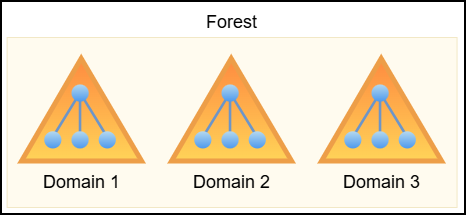
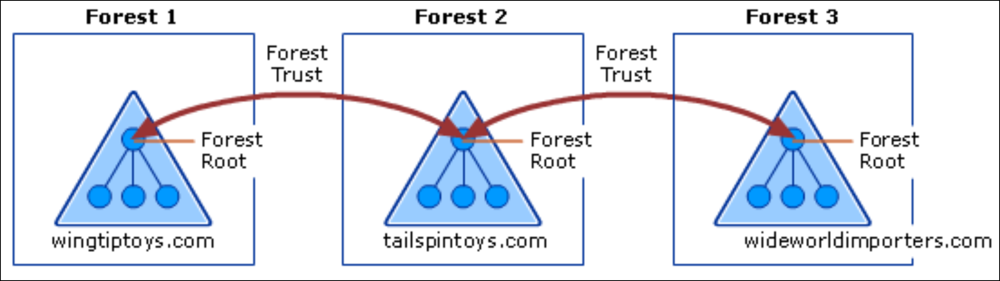

# AD 101

## Components

Active Directory (AD) is Microsoft’s centralized identity and access management system, used to govern users, machines, groups, and permissions across enterprise Windows networks. It structures these objects hierarchically to enable scalable delegation and fine-grained access control.

1. **Forest** → the top of this hierarchy, defines the ultimate trust and security boundary
2. **Domains** → forests can contain multiple domains, each acting as an independent administrative unit with its own objects and policies, but capable of establishing trust with other domains
3. **Organizational Units (OUs)** → domains can have multiple OUs which provide logical grouping to streamline delegation and Group Policy enforcement without breaking domain boundaries

<figure><figcaption></figcaption></figure>

Some crucial parts of an AD environment are:

<table><thead><tr><th width="147">Component</th><th>Description</th></tr></thead><tbody><tr><td>Domain Controller (DC)</td><td>The backbone of AD, responsible for authenticating users, authorizing access, and maintaining a synchronized copy of the domain’s directory data. </td></tr><tr><td>DNS</td><td>AD relies heavily on DNS for name resolution and service location; without it, core functions like locating DCs or processing logons will fail. </td></tr><tr><td>Schema</td><td>Defines the structure and rules for all directory objects, specifying what attributes they have and how they relate.</td></tr><tr><td>Global Catalog (GC)</td><td>Hosted on selected DCs, stores a partial, searchable view of all objects across the forest, supporting cross-domain queries and universal group resolution. </td></tr><tr><td>Replication Service</td><td>Keeps directory data consistent across DCs, making any change quickly available throughout the environment.</td></tr></tbody></table>

## GPOs & OUs

Group Policy settings are managed through **Group Policy Objects (GPOs)**, which can be linked to sites, domains, or, most commonly, OUs. OUs represent the lowest level in AD to which GPOs can be directly applied, making them a key target for both administrators and attackers seeking to influence system behavior at scale.

Two common GPO-based mechanisms for managing local group membership are **Restricted Groups** and **Group Policy Preferences (GPP)**:

* Restricted Groups, located under Security Settings in a GPO, enforce strict membership by explicitly defining who should (or shouldn't) be in a given local group, typically the local Administrators group. Any accounts not listed are removed, making this a rigid but reliable enforcement tool.&#x20;
* In contrast, `groups.xml`, used in GPP, provides more granular control, allowing additions, removals, or replacements without purging existing members unless explicitly instructed. This flexibility makes it a frequent choice for incremental changes, though its looser controls can leave openings for misconfiguration or abuse.

## ACLs <a href="#acls" id="acls"></a>

There are two types of ACLs:

* **Discretionary Access Control List (DACL)** → specifies which users or security principals (known as trustees) are allowed or denied specific types of access to an object in AD. It effectively defines who can read, write, modify, or take ownership of the object and its properties. If an object has no DACL, the system grants full access to everyone, making it a critical component for enforcing access control. Each entry in a DACL is called an **Access Control Entry (ACE)**, which defines a specific permission or denial for a single trustee. An ACE can be read as follows: `SecurityIdentifier` has `ActiveDirectoryRights` on `ObjectDN`:


```powershell
ObjectDN              : CN=Control337User,CN=Users,DC=dollarcorp,DC=moneycorp,DC=local
ActiveDirectoryRights : CreateChild, Self, WriteProperty, ExtendedRight, Delete, GenericRead, WriteDacl, WriteOwner
SecurityIdentifier    : S-1-5-32-544
```


* **System Access Control List (SACL)** → used for auditing purposes. It determines what types of access attempts, both successful and failed, should be logged in the system's security event log. SACLs are essential for tracking access to sensitive objects and are a core part of security monitoring and forensic visibility in AD environments.

One important feature is the **Security Descriptor Propagator (SDProp)**, a background process within AD responsible for maintaining the integrity of ACLs on privileged security principals such as Domain Admins, Enterprise Admins, and similar high-value groups or accounts. Its primary function is to periodically reapply a default, protected security descriptor to these sensitive objects to ensure that unauthorized or malicious changes to their permissions do not persist. Any manual modification to the ACLs of protected groups, such as adding an account with elevated privileges, will typically be overwritten by SDProp, restoring the ACLs to a clean, controlled state. This mechanism acts as a safeguard to enforce consistent and secure permissions on privileged entities. By default, **SDProp runs every 60 minutes**, making it a reliable but time-delayed enforcement method. In effect, it functions as **an ACL reset mechanism for critical AD objects**.

## Trusts

A **forest trust** establishes a trust relationship between two distinct AD forests, allowing cross-forest authentication and resource access. Trusts can be **one-way**, where users from Forest A can access Forest B but not vice versa, or **two-way**, where mutual access is permitted. The default intra-forest trusts (tree-root, parent-child) between domains are transitive two-way trusts. The direction of access is always **opposite** to the direction of trust: if Forest A trusts Forest B, then users in B can access resources in A.

<figure><figcaption><p>Trust path in a one-way trust (<a href="https://learn.microsoft.com/en-us/previous-versions/windows/it-pro/windows-server-2003/cc759554(v=ws.10)?redirectedfrom=MSDN#trust-paths">source</a>).</p></figcaption></figure>

Forest trusts must be manually configured by administrators and require both forests to be at **Windows Server 2003 functional level or higher**. These trusts can be **transitive**, allowing access to other trusted domains within the forests, or **non-transitive**, restricting access to just the explicitly defined trust partner. For example, if Forest 2 holds two-way transitive trusts with both Forest 1 and Forest 3, users in Forests 1 and 3 can access resources in Forest 2, but not directly between each other. A direct two-way transitive trust between Forests 1 and 3 would be required for full access in both directions.


**Forest trust transitivity does not extend beyond the two forests involved in a trust**:

* Forest 1 ⇄ Forest 2 ⇄ Forest 3 ≠ Forest 1 ⇄ Forest 3


<figure><figcaption><p>Diagram of forest trusts relationships within a single organization (<a href="https://learn.microsoft.com/en-us/entra/identity/domain-services/concepts-forest-trust#forest-trusts">source</a>).</p></figcaption></figure>

In contrast, an **external trust** is a non-transitive relationship between two specific domains in separate forests. It’s typically used when a full forest trust isn’t feasible. If Domain B and Domain E are connected via an external trust, users in one can access resources in the other but cannot traverse further. For example, Domain B cannot access Domain D through Domain E unless Domain E itself is compromised.&#x20;

<figure><figcaption></figcaption></figure>

From a red team perspective, this highlights a pivot potential: compromising a trusted domain (e.g. Domain E) can enable lateral movement across otherwise untrusted domains or forests.
