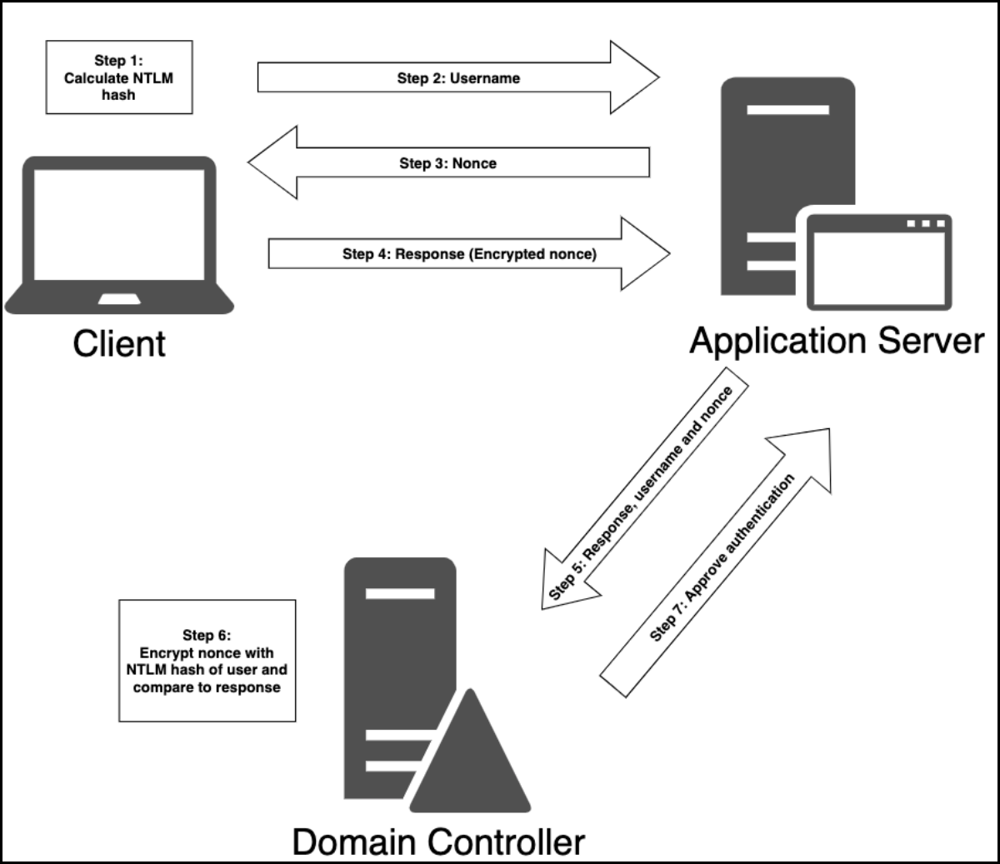

# Authentication


AD authentication uses **NTLM** (legacy) and **Kerberos** (default) protocols. NTLM is vulnerable to brute force; Kerberos uses tickets and session keys but can be abused (e.g., ticket theft). Credentials are cached in **LSASS** memory for SSO, and can be extracted using tools like `mimikatz` if attackers gain `SYSTEM`-level access. Defenses include LSA Protection, disabling WDigest, and endpoint monitoring.



For enumeration or post-authentication interaction, when using AD credentials with tools that rely on impersonation or token delegation, RDP is preferred over PowerShell Remoting or WinRM:

* RDP cleanly passes credentials through the session
* Remoting protocols are impacted by the [Kerberos double-hop limitation](https://techcommunity.microsoft.com/blog/askds/understanding-kerberos-double-hop/395463).


## NTML

**NTLM (NT LAN Manager)** is a legacy authentication protocol that still appears in modern AD environments, particularly in fallback situations—such as when connecting to resources via IP address rather than hostname, or when a service isn’t properly registered in AD DNS. Some third-party applications also continue to prefer NTLM over Kerberos due to compatibility reasons.

1. The client creates an NTLM hash from the user’s password (Step 1) and sends the username to the server (Step 2).
2. The server replies with a randomly generated nonce, aka **challenge** (Step 3).
3. The client sends the **response** (the NTML-encypted nonce) back the server (Step 4).
4. The server forwards the username, nonce, and response to the DC (Domain Controller) (Step 5).
5. The DC uses the stored NTLM hash for that user to encrypt the nonce (Step 6) and if the result matches the response, authentication succeeds (Step 7).

<figure><figcaption></figcaption></figure>

NTML stores unsalted hashed passwords in **SAM** database (`c:\windows\system32\config\sam`) which cannot be copied while the Windows OS is running. **Local Security Authority System (LSASS)** runs with `SYSTEM` privileges and caches NTLM hashes.

> _Although NTLM hashes are non-reversible, the algorithm is very fast, making **brute-force attacks** relatively easy. Despite its weaknesses, NTLM remains in use primarily for compatibility with legacy systems and fallback scenarios._

## Kerberos


If a service is accessed using an IP address instead of a hostname, Kerberos cannot be used, and NTLM is forced, often causing authentication to fail if NTLM is not supported or allowed.


### Overview

Kerberos is the default authentication protocol (TCP port 88) in modern Active Directory (AD) environments, replacing NTLM since Windows Server 2000. It operates on a ticket-based model and leverages a centralized authority called the Key Distribution Center (KDC). The core strength of Kerberos relies on the following characteristics:

* The user’s identity is verified only once during the initial authentication process, reducing the need for repeated credential validation. As a result, sensitive information (e.g. passwords) is not continually transmitted or exposed across the network, which significantly lowers the risk of interception or misuse.&#x20;
* The use of time-limited and service-specific tickets enhances security by ensuring that access is granted only for a defined period and only for a specific service. In addition, tickets are difficult to forge due to their protected and encrypted nature. Thus, even if a ticket is compromised, its limited validity window and scope helps minimise potential impact.

### Simplified Process

The Kerberos authentication process conists of three entities (client, service, KDC) and three main phases (AS, TGS, AP). It can be understood as being analogous to the process of checking into a hotel and subsequently accessing its various services.

#### 1 – Authentication Service (AS)

The primary objective of the AS phase in Kerberos is to enable a user to establish their identity once and subsequently access multiple services without repeatedly presenting their original credentials.

In this analogy, when a guest arrives at a hotel, they first report to reception (KDC) and present an official form of identification, such as a passport (password). The reception staff verify the guest’s identity and confirm their reservation details. Once this verification is successfully completed, the hotel issues a room key (TGT) which serves as proof that the hotel has authenticated the guest.

```
+-------------------+        +-------------------+
|     HOTEL WORLD   |        |   KERBEROS WORLD  |
+-------------------+        +-------------------+

      Reception   ----------------->   KDC
   (identity check)              (authentication server)

      Passport    ----------------->   Password
   (prove identity)              (user secret)

      Room Key    ----------------->   TGT
   (trusted credential)          (ticket granting ticket)
```

#### 2 – Ticket Granting Service (TGS)

If the guest wishes to access a specific hotel service, such as the spa (MSSQL) they are not required to present their passport (password) again. Instead, they return to reception (KDC) and present their room key (TGT) as proof of prior authentication. The reception staff verify its validity and, if it is confirmed, issue a temporary access pass (TGS) for the requested service. This pass includes relevant information such as the guest’s identity, the authorised service, a defined validity period, and a security mark confirming that it has been officially issued. This temporary pass enables the guest to access the spa service without further identity verification, as the service trusts the hotel’s central authentication process.

```
+------------------------+        +----------------------------+
|       HOTEL WORLD      |        |       KERBEROS WORLD        |
+------------------------+        +----------------------------+

   Room Key (TGT)   ----------------->   TGT
   (trusted proof)                    (ticket granting ticket)

   Reception       ----------------->   Ticket Granting Service
   (verifies key)                      (validates TGT)

   Temporary Pass ----------------->   Service Ticket (TGS)
   (spa access)                       (service-specific ticket)
```

#### 3 – Application Request (AP)

The guest presents the temporary access pass (TGS) at the spa entrance (MSSQL). The spa staff, trusting the authority of the hotel reception, verify the authenticity and validity of the pass, including its security markings and expiration time. If the pass is valid, access is granted without requiring the guest to present their original identification (password). The spa relies entirely on the hotel’s central authentication authority to confirm the guest’s identity. The same process applies to other facilities within the hotel, such as the gym, restaurant, or pool. Each service requires its own time-limited access pass, which is obtained using the room key previously issued during authentication.

```
+---------------------------+        +------------------------------+
|        HOTEL WORLD        |        |        KERBEROS WORLD        |
+---------------------------+        +------------------------------+

   Hotel Services (e.g. Spa)  -------->   Windows Services (e.g. MSSQL)
   (trusts reception)                     (trusts KDC)

   Temporary Pass             -------->   Service Ticket
   (time-limited access)                  (encrypted ticket)
```

The entire analogy flow can be found below:

<pre><code>Guest/User                 Reception / KDC                 Spa / MSSQL
(Hotel Guest)              (Authentication Server)       (Service Server)
-------------              -----------------             ----------------
1. Arrives at hotel 
   with official ID (pass)
   
                           2. Verifies ID (pass) &#x26; 
                              issues a room key (TGT)
                              
3. Wants spa (MSSQL) access
   &#x26; shows room key (TGT) 
   to reception (KDC)
   
                            4. Verifies room key (TGT) &#x26;
                               issues a temporary access
                               pass (TGS)
<strong>
</strong><strong>5. Shows temp access pass 
</strong><strong>   (TGS) to spa entrance 
</strong><strong>   (MSSQL server)                    
</strong><strong>   
</strong><strong>                                                            6. Validates temp access pass 
</strong><strong>                                                               (TGS) &#x26; grants access to spa 
</strong><strong>                                                               (MSSQL)   
</strong></code></pre>

### Detailed Process

The Kerberos authentication process works as follows:

1. **User Login (AS-REQ)**\
   When a user logs in, their machine sends an Authentication Service Request (AS-REQ) to the DC (KDC). This request includes a timestamp encrypted using a key derived from the user's password.
2. **KDC Response (AS-REP)**\
   The KDC retrieves the user’s password hash from `ntds.dit` and attempts to decrypt the timestamp. If successful and the timestamp is valid (a duplicate timestamp may indicate a replay attack), the KDC replies with an Authentication Service Reply (AS-REP). This contains a session key (encrypted with the user’s password hash) and a Ticket Granting Ticket (TGT), which is encrypted with the `krbtgt` account’s hash (this is known only to the KDC). The client can decrypt the session key and stores the TGT, which is typically valid for 10 hours and renewable.
3. **Service Request (TGS-REQ)**\
   When the user tries to access a service, the client sends a Ticket Granting Service Request (TGS-REQ) to the KDC. It includes the username, the encrypted TGT, a timestamp encrypted with the session key, and the name of the requested service.
4. **KDC Issues Service Ticket (TGS-REP)**\
   The KDC validates the TGT, checks the timestamp, and ensures the username and IP address match. If everything checks out, it sends a Ticket Granting Service Reply (TGS-REP), which includes a new session key (shared between client and service) and a service ticket encrypted with the service account’s password hash.
5. **Client to Service (AP-REQ)**\
   The client sends an Application Request (AP-REQ) to the service, containing the service ticket, the client’s username, and a timestamp encrypted with the new session key.
6. **Service Validates and Grants Access**\
   The service decrypts the ticket using its own password hash, extracts the session key and username, and verifies the timestamp. If valid, it checks group membership information from the ticket and grants access accordingly.

<figure><figcaption><p>The Kerberos authentication process (image taken from <a href="https://www.optiv.com/insights/source-zero/blog/kerberos-domains-achilles-heel">here</a>).</p></figcaption></figure>

## Cached Credentials

The **Local Security Authority (LSA)** is a fundamental Windows subsystem responsible for enforcing security policies, managing authentication, and handling credential storage. Its functionality is carried out by the **Local Security Authority Subsystem Service (LSASS)** — the `lsass.exe` process — which runs in memory and performs tasks such as logon validation and credential caching.&#x20;


**OPSEC**: LSASS is the core auth component which makes it the most monitored process on a Windows host!


To support Single Sign-On (SSO) and optimize user experience, Windows stores authentication material (e.g., NTLM hashes, Kerberos tickets, and sometimes plaintext credentials) in the memory of LSASS. When users authenticate (via local login, RDP, `runas`, scheduled tasks, services, etc.), their credential artifacts are stored in LSASS. Although this memory is encrypted and undocumented, with sufficient privileges (typically `SYSTEM`-level), attackers can extract its contents to harvest credentials.

## Credentials Vault

The **Windows Credentials Vault**, also known as Credential Manager, is a secure credential storage mechanism in Windows that retains user credentials for websites, network shares, remote desktop connections, and applications. It enables seamless authentication by allowing the OS and applications to retrieve saved credentials without prompting the user repeatedly.

Stored credentials are encrypted and kept in a protected location on the system. They can be accessed via the Control Panel (Credential Manager UI) or programmatically through the Windows Credential API.

While not as commonly targeted as LSASS, the vault can contain plaintext domain credentials, particularly for scheduled tasks or service accounts. Tools like [Mimikatz](../ad-tools/mimikatz.md) can extract these credentials using commands like `vault::cred /patch`, provided the attacker has elevated privileges.
