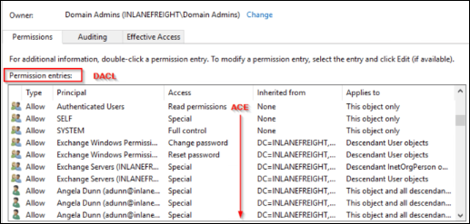
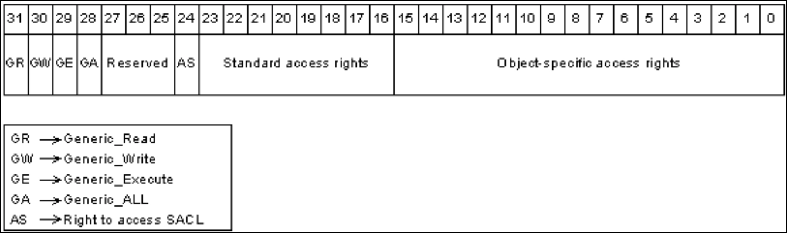
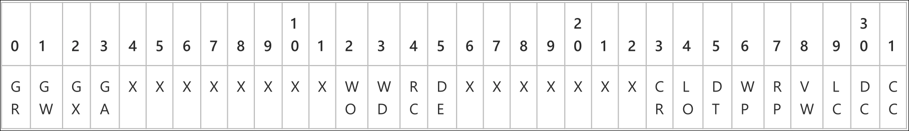

# Access Controls

## **Overview**


ACLs can be enumerated with [PowerView](../ad-tools/powerview.md), but it is much easier with [BloodHound](../ad-tools/bloodhound.md).


In Windows and Active Directory (AD), access to resources is determined by the interaction between **access tokens**, **security descriptors**, and **access control lists (ACLs)**. Together, these components define who can access an object and what actions they are allowed to perform.

## Access Tokens

When a user authenticates, Windows generates an [**access token**](https://learn.microsoft.com/en-us/windows/win32/secauthz/access-tokens) that represents the user’s security context. This token includes the user’s **Security Identifier (SID)**, the SIDs of any groups they belong to, assigned privileges, and other contextual information.&#x20;

Every process started by the user inherits a **primary token**, which determines what the process can do. In some cases, a thread may use an **impersonation token** to temporarily act as another user and perform actions with different privileges.

Each securable object, such as a file, share, user, or group, contains a security descriptor that stores its security configuration. When access is requested, the object compares the requester’s token with its ACL to determine whether the operation should be allowed or denied.

## Security Identifiers

A [**Security Identifier (SID)**](https://learn.microsoft.com/en-us/windows-server/identity/ad-ds/manage/understand-security-identifiers) is a unique and immutable value assigned to each security principal, including users and groups. Local SIDs are generated by the Local Security Authority (LSA), while domain SIDs are created by a domain controller (DC). The SID format follows the structure:

```
S-R-X-Y
```

<table><thead><tr><th width="112.39999389648438">Character</th><th width="631.6000061035156">Description</th></tr></thead><tbody><tr><td><code>S</code></td><td>Indicates a SID.</td></tr><tr><td><code>R</code></td><td>The revision (always 1).</td></tr><tr><td><code>X</code></td><td>Represents the issuing authority.</td></tr><tr><td><code>Y</code></td><td>Contains the domain or machine identifier and the <strong>Relative Identifier (RID)</strong>. The RID uniquely identifies an account within a domain or system. RIDs below 1000 typically correspond to built‑in or well‑known accounts.</td></tr></tbody></table>

Some example SIDs can be found below.

<table><thead><tr><th width="224.4000244140625">SID</th><th width="193.19989013671875">Description</th></tr></thead><tbody><tr><td><code>S-1-5-&#x3C;domain>-500</code></td><td>Domain Administrator</td></tr><tr><td><code>S-1-5-21-&#x3C;machine>-500</code></td><td>Local Administrator</td></tr><tr><td><code>S-1-5-21-&#x3C;machine>-501</code></td><td>Guest account</td></tr><tr><td><code>S-1-5-21-&#x3C;domain>-513</code></td><td>Domain users</td></tr><tr><td><code>S-1-5-21-&#x3C;domain>-516</code></td><td>Domain Controllers</td></tr></tbody></table>

## Security Descriptors


AD protects high‑privilege objects through the [**Security Descriptor Propagator**](https://learn.microsoft.com/en-us/openspecs/windows_protocols/ms-adts/05c8a4b6-43aa-49f7-8c31-df3ac72230f3) **(SDProp)** process. This mechanism periodically restores protected ACLs on sensitive accounts and groups, such as Domain Admins, preventing unauthorized modifications and reducing the risk of privilege escalation.


A [**security descriptor**](https://learn.microsoft.com/en-us/windows/win32/secauthz/security-descriptors) stores all security information for an object. It is implemented through the [`SECURITY_DESCRIPTOR`](https://learn.microsoft.com/en-us/windows/win32/api/Winnt/ns-winnt-security_descriptor) structure and contains the owner, primary group, auditing rules, and access control rules.&#x20;


```cpp
typedef struct _SECURITY_DESCRIPTOR {
  BYTE                        Revision;
  BYTE                        Sbz1;
  SECURITY_DESCRIPTOR_CONTROL Control;
  PSID                        Owner; // Owser's SID
  PSID                        Group; // Primary group's SID
  PACL                        Sacl; // Defines which access attempts should be logged
  PACL                        Dacl; // Defines which users/groups are allowed/denied access
} SECURITY_DESCRIPTOR, *PISECURITY_DESCRIPTOR;
```


Security descriptors can be **absolute**, which use pointers to reference security information, or **self‑relative**, which store all data in a contiguous block suitable for storage or transmission. The former is the form typically encountered when working with Windows objects.The most relevant components for access control are:

<table><thead><tr><th width="138.79998779296875">Property</th><th>Description</th></tr></thead><tbody><tr><td><a href="https://learn.microsoft.com/en-gb/windows/win32/secauthz/security-descriptor-control#remarks"><code>Control</code></a></td><td>A 16-bit set of bit flags that qualify the meaning of an SD or its components. Its value, when retrieved with the function <a href="https://learn.microsoft.com/en-us/windows/win32/api/securitybaseapi/nf-securitybaseapi-getsecuritydescriptorcontrol"><code>GetSecurityDescriptorControl</code></a>, can include a combination of 13 bits flags. One of those, <code>SE_DACL_PRESENT</code>, Indicates an SD that has a DACL. If not set, or if set and the DACL is <code>NULL</code>, the SD allows full access to everyone. An empty DACL permits access to no one.</td></tr><tr><td><code>Owner</code> / <code>Group</code></td><td>Contain a pointer to the SID of the object's owner and primary group, respectively. Object owners are always granted full control of the SD, as they are granted the access rights <code>RIGHT_WRITE_DAC</code> (<code>WriteDacl</code>) and <code>RIGHT_READ_CONTROL</code> (<code>ReadControl</code>) implicitly.</td></tr><tr><td><a href="https://learn.microsoft.com/en-gb/windows/win32/ad/retrieving-an-objectampaposs-sacl"><code>SACL</code></a></td><td>Contains <strong>Access Control Entries (ACEs)</strong> that dictate the types of access attempts that generate audit records in the security event log of a DC; therefore, a SACL allows administrators to log access attempts to securable objects.</td></tr><tr><td><code>DACL</code></td><td>Holds ACEs that dictate what principals have control rights over a specific object.</td></tr></tbody></table>

## ACEs

An ACL consists of multiple [**Access Control Entries**](https://learn.microsoft.com/en-us/windows-hardware/drivers/ifs/access-control-entry) **(ACEs)**.

<div align="left"><figure><figcaption></figcaption></figure></div>

Each ACE contains a SID identifying a user or group and an **access mask** that specifies allowed or denied rights. When access is requested, Windows evaluates ACEs in order to determine the effective permissions.

```cpp
typedef struct _ACE_HEADER {
  BYTE AceType;
  BYTE AceFlags;
  WORD AceSize;
} ACE_HEADER;
```

There are several ACE types, but the most relevant can be found below.

<table><thead><tr><th width="235.5999755859375">ACE</th><th>Implication</th></tr></thead><tbody><tr><td><a href="https://learn.microsoft.com/en-us/windows/win32/api/winnt/ns-winnt-access_allowed_ace"><code>ACCESS_ALLOWED_ACE</code></a></td><td>Allows a particular security principal (user or group) to access an AD object, such as a user account or group, by specifying which permissions the security principal can perform on the object, such as read, write, or modify.</td></tr><tr><td><a href="https://learn.microsoft.com/en-us/windows/win32/api/winnt/ns-winnt-access_allowed_object_ace"><code>ACCESS_ALLOWED_OBJECT_ACE</code></a></td><td>Applied to an object and grants access to the object itself and any child objects it contains. Can grant a security principal the necessary permissions to access an object and its child objects without applying separate ACEs to each child object.</td></tr><tr><td><a href="https://learn.microsoft.com/en-us/windows/win32/api/winnt/ns-winnt-access_denied_ace"><code>ACCESS_DENIED_ACE</code></a></td><td>Denies a particular security principal access to an AD object by specifying which permissions the security principal is not allowed to perform on the object.</td></tr><tr><td><a href="https://learn.microsoft.com/en-us/windows/win32/api/winnt/ns-winnt-access_denied_object_ace"><code>ACCESS_DENIED_OBJECT_ACE</code></a></td><td>Applied to an object and restricts access to the object itself and any child objects it contains. Prevents a security principal from accessing an object and its child objects without having to apply separate ACEs to each child object.</td></tr></tbody></table>

Each ACE contains a 32‑bit [**access mask**](https://learn.microsoft.com/en-gb/windows/win32/secauthz/access-mask-format) that defines specific rights.

<figure><figcaption></figcaption></figure>

For AD objects, the access mask contains a combination of the below values (`X` indicates bits that are ignored).

<figure><figcaption></figcaption></figure>

From a security and attack perspective, the most relevant permissions are listed below.

<table><thead><tr><th width="149.40005493164062" align="center">Permission</th><th>Interpretation</th></tr></thead><tbody><tr><td align="center"><code>GenericAll</code><br>(<code>GA</code>)</td><td>Allows creating or deleting child objects, deleting a subtree, reading and writing properties, examining child objects and the object itself, adding and removing the object from the directory, and reading or writing with an <code>extended right</code>. This is equivalent to the <code>object-specific</code> access rights bits (<code>DE</code> | <code>RC</code> | <code>WD</code> | <code>WO</code> | <code>CC</code> | <code>DC</code> | <code>DT</code> | <code>RP</code> | <code>WP</code> | <code>LC</code> | <code>LO</code> | <code>CR</code> | <code>VW</code>) for AD objects.</td></tr><tr><td align="center"><code>GenericExecute</code><br>(<code>GX</code>)</td><td>Allows reading permissions on and listing the contents of a container object. This is equivalent to the <code>object-specific</code> access rights bits (<code>RC</code> | <code>LC</code>) for AD objects.</td></tr><tr><td align="center"><code>GenericWrite</code><br>(<code>GW</code>)</td><td>Allows reading permissions on this object, writing all the properties on this object, and performing all validated writes to this object. This is equivalent to the <code>object-specific</code> access rights bits (<code>RC</code> | <code>WP</code> | <code>VW</code>) for AD objects.</td></tr><tr><td align="center"><code>GenericRead</code><br>(<code>GR</code>)</td><td>Allows reading permissions on this object, reading all the properties on this object, listing this object name when the parent container is listed, and listing the object's contents if it is a container. This is equivalent to the <code>object-specific</code> access rights bits (<code>RC</code> | <code>LC</code> | <code>RP</code> | <code>LO</code>) for AD objects.</td></tr><tr><td align="center"><code>WriteDacl</code><br>(<code>WD</code>)</td><td>Allows modifying the object's security descriptor’s DACL.</td></tr><tr><td align="center"><code>WriteOwner</code><br>(<code>WO</code>)</td><td>Allows modifying the object's security descriptor's owner. A user can only take ownership of an object but cannot transfer ownership of an object to other users.</td></tr><tr><td align="center"><code>ReadControl</code><br>(<code>RC</code>)</td><td>Allows reading the data from the object's security descriptor. This does not include the data of the SACL.</td></tr><tr><td align="center"><code>Delete</code><br>(<code>DE</code>)</td><td>Allows deleting the object.</td></tr><tr><td align="center"><code>CR</code></td><td>Allows performing an operation controlled by a <a href="https://learn.microsoft.com/en-us/openspecs/windows_protocols/ms-adts/b645c125-a7da-4097-84a1-2fa7cea07714#gt_42f6c9e0-a2b3-4bc3-9b87-fdb902e5505e">control access right</a>. The <code>ObjectType</code> member of an ACE can contain a GUID that identifies the control access right. If <code>ObjectType</code> does not contain a GUID, the ACE controls the right to perform all control access right controlled operations associated with the object. Also referred to as <code>AllExtendedRights</code>, especially when <code>ObjectType</code> does not contain a GUID.</td></tr><tr><td align="center"><code>WP</code></td><td>Allows writing properties of the object. The <code>ObjectType</code> member of an ACE can contain a GUID that identifies a property set or an attribute. If <code>ObjectType</code> does not contain a GUID, the ACE controls the right to write all object's attributes.</td></tr><tr><td align="center"><code>VW</code></td><td>Allows performing an operation controlled by a <a href="https://learn.microsoft.com/en-us/openspecs/windows_protocols/ms-adts/20504d60-43ec-458f-bc7a-754eb64446df">validated write</a> access right. The <code>ObjectType</code> member of an ACE can contain a GUID that identifies the validated write. If <code>ObjectType</code> does not contain a GUID, the ACE controls the rights to perform all validated write operations associated with the object. Also referred to as <code>Self</code>.</td></tr></tbody></table>

Active Directory also defines [**extended rights**](https://learn.microsoft.com/en-gb/windows/win32/adschema/extended-rights), which control sensitive operations such as password resets and directory replication. Important examples include:

<table><thead><tr><th width="287.5999755859375">Common Name</th><th>Interpretation</th></tr></thead><tbody><tr><td><a href="https://learn.microsoft.com/en-gb/windows/win32/adschema/r-user-force-change-password"><code>User-Force-Change-Password</code></a></td><td>Allows a user's account password to be reset without knowing the old one. This is in contrast to <a href="https://learn.microsoft.com/en-gb/windows/win32/adschema/r-user-change-password"><code>User-Change-Password</code></a>, which does require knowing the old password.</td></tr><tr><td><a href="https://learn.microsoft.com/en-gb/windows/win32/adschema/r-ds-replication-get-changes"><code>DS-Replication-Get-Changes</code></a></td><td>Required to replicate changes from a given Naming Context. Required for DCSync.</td></tr><tr><td><a href="https://learn.microsoft.com/en-gb/windows/win32/adschema/r-ds-replication-get-changes-all"><code>DS-Replication-Get-Changes-All</code></a></td><td>Allows the replication of secret domain data. Required for DCSync attack.</td></tr></tbody></table>

Similarly, **validated writes** allow controlled modifications to specific attributes, such as adding oneself to a group ([`Self-Membership`](https://learn.microsoft.com/en-gb/windows/win32/adschema/r-self-membership)) or modifying Service Principal Names ([Validated-SPN](https://learn.microsoft.com/en-gb/windows/win32/adschema/r-validated-spn)).

## **Mandatory Integrity Control**

Windows uses **MIC** to **restrict access** between processes based on their **integrity levels**. This prevents lower-trust processes from modifying higher-trust objects, even if they have the right permissions. **Processes and objects** inherit the integrity level of the user who creates them, unless the executable has a low integrity level, in which case any process it starts will also have a low level. **Lower-integrity processes** **cannot** modify higher-integrity objects. From Windows Vista onwards, there are five integrity levels:

1. `System`: Used by kernel-mode processes with `SYSTEM` privileges
2. `High`: Assigned to processes with `admin` privileges
3. `Medium`: The default for standard user processes
4. `Low`: Used for **sandboxed** processes (e.g., web browsers)
5. `Untrusted`: The most restricted level, assigned to risky processes

Integrity levels can be checked using Process Explorer (process integrity), via the `whoami /groups` command (user integrity), and via the `icalcs` command (file integrity).

## **User Account Control**

**UAC** is a security feature that prevents unauthorized privilege escalation by **restricting applications to standard user privileges**, even if the user is an `Administrator`. When an `Administrator` logs in, Windows creates two access tokens:

1. **Standard User Token** (default, used for regular tasks)
2. **Administrator Token** (activated only when elevated privileges are required)

> _To use admin privileges, the user must confirm a **UAC prompt**. For example, if a privileged account is compromised, typing `whoami /priv` in a normal shell won't reveal all privileges. We will need to open an elevated shell and use the UAC prompt to reveal all privileges._

UAC ensures applications run at the right privilege level, protects system files and registry keys from accidental or malicious changes, and prevents malware from gaining full control of the system without user approval. Processes run at four different **integrity levels**:

1. `System` → Kernel-mode processes with `SYSTEM` privileges
2. `High` → Used for administrative tasks
3. `Medium` → Default level for standard user applications
4. `Low` → Used for sandboxed processes (e.g., web browsers)

> _Being an `Administrator` does not mean all processes run with **high integrity** by default. **UAC ensures privilege separation**, requiring explicit approval for **elevated actions**. Attackers and penetration testers often seek to **bypass UAC** to execute processes at high integrity, allowing unrestricted access to system resources._
