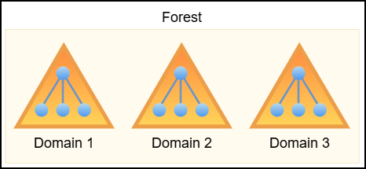
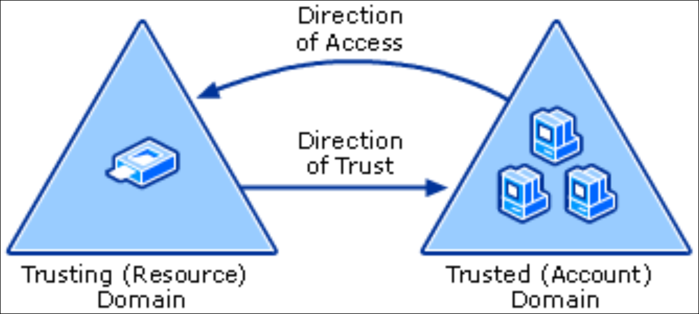
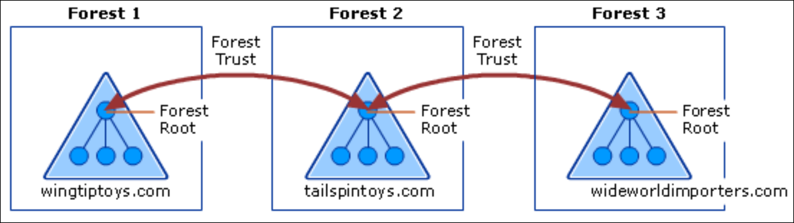
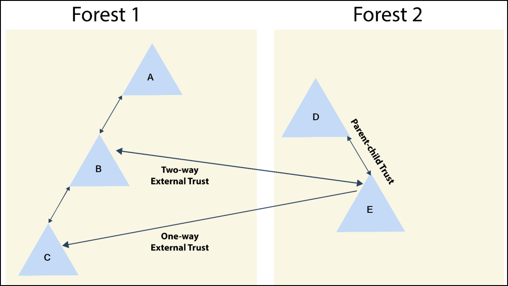

# Trusts

> [Not A Security Boundary: Breaking Forest Trusts](https://specterops.io/blog/2018/11/28/not-a-security-boundary-breaking-forest-trusts/)

Active Directory (AD) is Microsoft’s centralized identity and access management system, used to govern users, machines, groups, and permissions across enterprise Windows networks. It structures these objects hierarchically to enable scalable delegation and fine-grained access control.

1. **Forest** is at the top of this hierarchy and defines the ultimate trust and security boundary.
2. **Domains** are located within forests (a forest can contain multiple domains), each acting as an independent administrative unit with its own objects and policies.
3. **Organizational Units (OUs)** are located withn domains (a domain can have multiple OUs) and provide logical grouping to streamline delegation and Group Policy enforcement.

<div align="left"><figure><figcaption></figcaption></figure></div>

## Trusts

A **forest trust** establishes a trust relationship between two distinct AD forests, allowing cross-forest authentication and resource access.

Trusts can be **one-way**, where users from Forest A can access Forest B but not vice versa, or **two-way**, where mutual access is permitted. The default intra-forest trusts (tree-root, parent-child) between domains are transitive two-way trusts.

The direction of access is always **opposite** to the direction of trust: if Forest A trusts Forest B, then users in the latter can access resources in the former.

<div align="left"><figure><figcaption><p>Trust path in a one-way trust (<a href="https://learn.microsoft.com/en-us/previous-versions/windows/it-pro/windows-server-2003/cc759554(v=ws.10)?redirectedfrom=MSDN#trust-paths">source</a>).</p></figcaption></figure></div>

Forest trusts must be manually configured by administrators and require both forests to be at Windows Server 2003 functional level or higher. These trusts can be **transitive**, allowing access to other trusted domains within the forests, or **non-transitive**, restricting access to just the explicitly defined trust partner.

For example, if Forest 2 holds two-way transitive trusts with both Forest 1 and Forest 3, users in Forests 1 and 3 can access resources in Forest 2, but not directly between each other. A direct two-way transitive trust between Forests 1 and 3 would be required for full access in both directions.

Forest trust transitivity does not extend beyond the two forests involved in a trust:

```
Forest 1 ⇄ Forest 2 ⇄ Forest 3 ≠ Forest 1 ⇄ Forest 3
```

<figure><figcaption><p>Diagram of forest trusts relationships within a single organization (<a href="https://learn.microsoft.com/en-us/entra/identity/domain-services/concepts-forest-trust#forest-trusts">source</a>).</p></figcaption></figure>

In contrast, an **external trust** is a non-transitive relationship between two specific domains in separate forests. It’s typically used when a full forest trust isn’t feasible. If Domain B and Domain E are connected via an external trust, users in one can access resources in the other but cannot traverse further. For example, Domain B cannot access Domain D through Domain E unless Domain E itself is compromised.&#x20;

<div align="left"><figure><figcaption></figcaption></figure></div>
