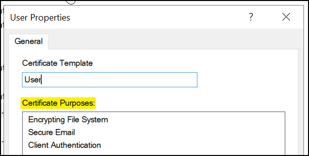
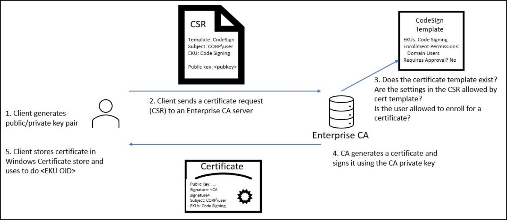
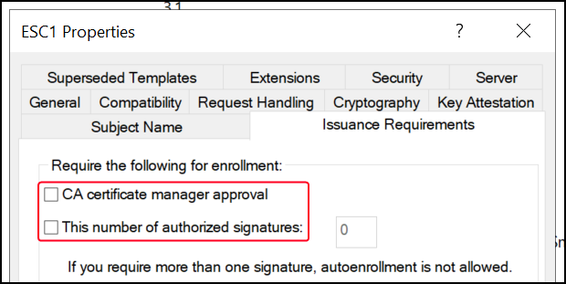

---
layout:
  width: default
  title:
    visible: true
  description:
    visible: false
  tableOfContents:
    visible: true
  outline:
    visible: true
  pagination:
    visible: true
  metadata:
    visible: true
  tags:
    visible: true
tags:
  - cape
  - crtp
  - active-directory
  - adcs
---

# AD CS

## Overview

Active Directory Certificate Services (AD CS) is a Windows Server role that provides certificate-based authentication and Public Key Infrastructure (PKI) within Active Directory (AD) environments. It operates over TCP 135 and dynamic RPC ports, with optional use of ports 80 and 443 if Web Enrollment is enabled.

AD CS acts as an internal digital ID system for a Windows domain. Instead of printing physical ID cards, it issues digital certificates that users and computers can use to log in, encrypt communications, or sign data. These **certificates are trusted across the domain**, so if an attacker can trick AD CS into giving them a certificate, it's similar to getting a valid employee badge, i.e., they can impersonate someone and gain access.

### Certificate Authorities

A Certificate Authority (CA) is an entity responsible for issuing and managing digital certificates. These certificates are used to verify the identity of entities such as individuals, organizations, or devices and to ensure the integrity and authenticity of data exchanged over networks.

There are two types of CAs:

1. **Standalone CAs**: These operate independently of AD and are typically used in environments where integration with AD is not required. They manually validate certificate requests and are often used for issuing certificates to external or non-domain entities.
2. **Enterprise CAs**: Integrated with AD, these CAs automatically issue certificates to domain-joined devices and users. They leverage AD's authentication and authorization features to streamline and automate the certificate issuance process.

**Root CAs** are the top-most level in the certificate hierarchy and are self-signed by AD CS. They serve as the ultimate trust anchor within a domain, and their certificates are trusted across the entire domain. These Root CA certificates are stored in specific AD containers to establish a trust framework within the network.

A CA essentially acts as the digital equivalent of a notary, validating identities and ensuring secure, encrypted communication between parties.

### Digital Certificates

**Digital certificates** are electronic documents binding a public key to an entity, such as a person, organization, device, or service. These certificates are issued and signed by a CA, which verifies the holder’s identity and the integrity of the public key.&#x20;

Each certificate includes a public key, subject name, issuer’s name, validity period, and more, formatted as `X.509` digitally signed documents.


```powershell
# List the certificate's attributes
PS C:\Users\Administrator> GCI Cert:\localmachine\My\ | Format-List

Subject      : CN=marvel-DC01-CA, DC=marvel, DC=local
Issuer       : CN=marvel-DC01-CA, DC=marvel, DC=local
Thumbprint   : EAD64F050635552A285A59D1311E11E8B82392B8
FriendlyName :
NotBefore    : 5/31/2025 12:13:55 PM
NotAfter     : 5/31/2030 12:23:55 PM
Extensions   : {System.Security.Cryptography.Oid, System.Security.Cryptography.Oid, System.Security.Cryptography.Oid,
               System.Security.Cryptography.Oid}

Subject      : CN=DC01.marvel.local
Issuer       : CN=marvel-DC01-CA, DC=marvel, DC=local
Thumbprint   : 8D56ACFD2A01D4B31C7599E06D3B4D051ED0D206
FriendlyName :
NotBefore    : 5/31/2025 12:14:29 PM
NotAfter     : 5/31/2026 12:14:29 PM
Extensions   : {System.Security.Cryptography.Oid, System.Security.Cryptography.Oid, System.Security.Cryptography.Oid,
               System.Security.Cryptography.Oid...}
```


Trusted certificates and related data are organized in several AD containers:

* **CAs Container**: Stores root CA certificates.
* **Enrollment Services Container**: Contains information about Enterprise CAs.
* **NTAuthCertificates AD Object**: Essential for AD authentication.
* **Authority Information Access (AIA) Container**: Holds intermediate and cross CA certificates.

These containers ensure efficient management and retrieval of certificate-related data within the directory.

### Certificate Templates

Certificate templates, referred to as `pKICertificateTemplate`, offer preconfigured settings tailored for specific purposes. These templates streamline the certificate issuance process by defining necessary parameters and usage scenarios.

**Extended Key Usages (EKUs)** are a set of enabled Object Identifiers (OIDs) that specify the intended functions of a certificate. They define precise roles for certificates, such as:

* **Client Authentication**: Ensures secure user verification.
* **PKINIT Client Authentication**: Facilitates Kerberos authentication with public key cryptography.
* **Smart Card Logon**: Supports authentication via smart cards.
* **Any Purpose**: Allows the certificate to be used for any intended purpose.

These templates and EKUs are essential for ensuring that certificates are issued with the correct settings and for their intended use cases.

<div align="left"><figure><figcaption></figcaption></figure></div>

As operators we are mostly intersted in OIDs that enable AD authentication:

| Description                  | OID                    |
| ---------------------------- | ---------------------- |
| Client Authentication        | 1.3.6.1.5.5.7.3.2      |
| PKINIT Client Authentication | 1.3.6.1.5.2.3.4        |
| Smart Card Logon             | 1.3.6.1.4.1.311.20.2.2 |
| Any Purpose                  | 2.5.29.37.0            |
| SubCA                        | (no EKUs)              |

### Enrolment

The certificate enrollment process involves the following steps:

1. **Locate an Enterprise CA**: Identify the responsible CA.
2. **Generate a Key Pair and Create a CSR**: Develop a public/private key pair and prepare a Certificate Signing Request (CSR).
3. **Sign and Submit the CSR**: Sign the CSR with the private key and submit it to the Enterprise CA.
4. **CA Verification**: The CA verifies the client’s authorization and the CSR's validity.
5. **Certificate Issuance**: The CA generates, signs, and issues the certificate to the client.
6. **Store the Certificate**: The client stores the certificate in the Windows Certificate Store.

This streamlined process ensures secure and authenticated certificate issuance.

<figure><figcaption><p>The certificate enrollment process (image taken from <a href="https://specterops.io/wp-content/uploads/sites/3/2022/06/Certified_Pre-Owned.pdf">here</a>).</p></figcaption></figure>

### Issuance Requirements

Issuance requirements ensure secure certificate enrolment by enforcing specific conditions:

* **Manager Approval**: Requires managerial authorization before a certificate is issued, adding an extra layer of oversight.
* **Number of Authorized Signatures**: Specifies the required number of signatures from authorized personnel, ensuring multiple levels of validation.

<div align="left"><figure><figcaption></figcaption></figure></div>

These settings help maintain strict control over the certificate issuance process, enhancing security and compliance.

## AD CS Attacks

The attacks leveraging can be categorised as follows:

| Core Issue            | ESC        |
| --------------------- | ---------- |
| Certificate Templates | 1, 2, 3, 9 |
| CA Configuration      | 6          |
| Access Controls       | 4, 5, 7    |
| NTLM Relay            | 8, 11      |

For AD CS attacks-related information, see [here](../../attacks/adcs.md).
