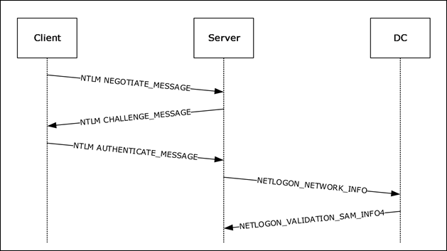

---
layout:
  width: default
  title:
    visible: true
  description:
    visible: false
  tableOfContents:
    visible: true
  outline:
    visible: true
  pagination:
    visible: true
  metadata:
    visible: true
  tags:
    visible: true
tags:
  - cape
  - crtp
  - active-directory
---

# NTLM

## Overview

NT LAN Manager (NTLM) is a family of Microsoft authentication protocols historically used to authenticate users and computers in Windows environments. The NTLM family includes **LAN Manager (LM)**, **NTLMv1**, and **NTLMv2**, with NTLMv2 being the modern and more secure implementation. Although largely superseded by Kerberos in Active Directory (AD) environments, NTLM remains present in many networks for compatibility and fallback scenarios.

NTLM is commonly used when Kerberos authentication cannot be performed. This typically occurs when a client connects to a resource using an **IP address instead of a hostname**, when a service is **not properly registered in AD DNS**, or when **legacy systems and third-party applications** require NTLM for compatibility.

Unlike Kerberos, NTLM is not implemented as a dedicated network protocol. Instead, it functions as an **embedded authentication mechanism** that can be used by higher-level application protocols such as SMB, HTTP(S), and LDAP(S). These protocols call NTLM through the Windows authentication framework rather than implementing authentication themselves.

For application protocols that use it, **NTLMv2 can provide three security services**:

* Authentication
* Message integrity (signing)
* Message confidentiality (sealing)

NTLM is implemented in Windows as a [**Security Support Provider (SSP)**](https://learn.microsoft.com/en-us/windows/win32/rpc/security-support-providers-ssps-) and accessed through the [**Security Support Provider Interface (SSPI)**](https://learn.microsoft.com/en-us/windows/win32/rpc/sspi-architectural-overview).

SSPI is a Windows API that allows applications to establish authenticated connections by calling one of several available security providers. Each provider implements a specific authentication protocol and exposes it through a security package. The NTLM security package is implemented by the [**NTLM SSP**](https://learn.microsoft.com/en-us/windows-server/security/windows-authentication/security-support-provider-interface-architecture#BKMK_NTLMSSP), located at:

```
%Windir%\System32\msv1_0.dll
```

A few important characteristics of NTLM should be kept in mind:

* NTLM configuration is determined [**out-of-band**](https://learn.microsoft.com/en-us/windows/security/threat-protection/security-policy-settings/network-security-lan-manager-authentication-level) through system and domain policy before authentication occurs.
* The client and the authenticating authority already share a **secret key**, derived from the user’s password hash.
* **Neither the plaintext password nor the password hash is transmitted across the network** during authentication.

Historically, Windows stored password hashes locally in the **Security Account Manager (SAM)** database located at:

```
C:\Windows\System32\config\SAM
```

This file cannot normally be copied while the operating system is running. The **Local Security Authority Subsystem Service (LSASS)** runs with `SYSTEM` privileges and manages authentication operations, including caching credential material in memory.

Although NTLM hashes are not reversible, the hashing algorithm is computationally fast. As a result, captured hashes can be vulnerable to **offline brute-force and dictionary attacks**, which is one reason NTLM is considered weaker than Kerberos.

## Authentication Workflow

NTLM authentication uses a **challenge–response mechanism** based on nonces to prevent replay attacks. When a client connects to a service that supports NTLM, three protocol messages are exchanged.

1. `NEGOTIATE_MESSAGE` (Type 1) (Client → Server)

The client initiates authentication by sending a `NEGOTIATE_MESSAGE`. This message indicates that the client wishes to authenticate using NTLM and includes a set of `NegotiateFlags`, which advertise the features and capabilities supported by the client.

2. `CHALLENGE_MESSAGE` (Type 2) (Server → Client)

The server responds with a `CHALLENGE_MESSAGE`. This message contains the NTLM options selected by the server and a randomly generated value called the `ServerChallenge`. The `ServerChallenge` is a **nonce**, meaning a number used only once. This random value ensures that authentication responses cannot be replayed later by an attacker.

Security assessment tools (e.g. [NTLM Challenger](https://github.com/nopfor/ntlm_challenger), [ntlm-info](https://gitlab.com/Zer1t0/ntlm-info), [NTLMRecon](https://github.com/praetorian-inc/NTLMRecon), [DumpNTLMInfo.py](https://github.com/fortra/impacket/blob/impacket_0_11_0/examples/DumpNTLMInfo.py)) often query servers that support NTLM and analyze the information returned in the `CHALLENGE_MESSAGE` to reveal information about the target system's authentication configuration.&#x20;

3. `AUTHENTICATE_MESSAGE` (Type 3) (Client → Server)

The client responds with an `AUTHENTICATE_MESSAGE`. In this step, the client proves knowledge of the shared secret (the user’s password hash) by computing a cryptographic response derived from:

* the password hash
* the server challenge
* additional client-generated data (such as a client challenge and timestamp in NTLMv2)

Because the server itself does not possess the user’s password hash, it typically forwards the authentication data to a **Domain Controller (DC)** for verification. This process is known as **pass-through authentication**. The DC performs the same calculation using the stored password hash. If the computed result matches the response sent by the client, authentication succeeds.

<div align="left"><figure><figcaption><p>NTLM pass-through authentication (<a href="https://learn.microsoft.com/en-us/openspecs/windows_protocols/ms-apds/5bfd942e-7da5-494d-a640-f269a0e3cc5d">source</a>).</p></figcaption></figure></div>

Captured NTLM authentication exchanges often appear in formats such as:

```
# NTLMv1
User::HostName:LmChallengeResponse:NtChallengeResponse:ServerChallenge:

# NTLMv2
User::Domain:ServerChallenge:Response:NTLMv2_CLIENT_CHALLENGE
```

## Session Security

The NTLM authentication exchange itself does not directly provide session protection. Instead, session security features are provided through **SSPI** after authentication succeeds.&#x20;

Two forms of message protection may be negotiated:

* **Message Integrity (Signing)**\
  Signing ensures that messages exchanged between the client and server cannot be modified in transit. A negotiated **session key** is used to generate cryptographic signatures for each message.
* **Message Confidentiality (Sealing)**\
  Sealing encrypts the contents of messages exchanged between the client and server. In NTLM, sealing also implies signing, since encrypted messages are always integrity-protected.

NTLMv1 does not support sealing, whereas NTLMv2 does.

These protections are frequently used with protocols such as **SMB**, which can require message signing depending on system configuration. Typical [SMB signing defaults](https://learn.microsoft.com/en-us/archive/blogs/josebda/the-basics-of-smb-signing-covering-both-smb1-and-smb2) include:

| Host Type          | Default Signing Setting |
| ------------------ | ----------------------- |
| SMB1 Client        | Enabled                 |
| SMB1 Server        | Disabled                |
| SMB2/SMB3 Clients  | Not Required            |
| SMB2/SMB3 Servers  | Not Required            |
| Domain Controllers | Required                |

## Extended Protection for Authentication

**Extended Protection for Authentication (EPA)** is a security enhancement designed to mitigate certain NTLM relay and Machine-in-the-Middle attacks.

EPA introduces the concept of a **Channel Binding Token (CBT)**. A CBT binds the authentication process to the cryptographic properties of the underlying TLS session, typically by including a hash of the server’s TLS certificate. This ties the authentication to the specific secure channel established between the client and server, preventing the authentication data from being replayed over a different connection.

Because the authentication exchange becomes cryptographically tied to the specific connection, attackers cannot replay the authentication data over a different network channel.

EPA is commonly used with protocols such as **SMB** and **HTTP** to strengthen NTLM authentication in environments where NTLM cannot be fully disabled.

## NTLM Attacks

For NTLMv2-related attacks, see [here](/broken/pages/sFHVuJ6AoRFIjTzRfoGy).
