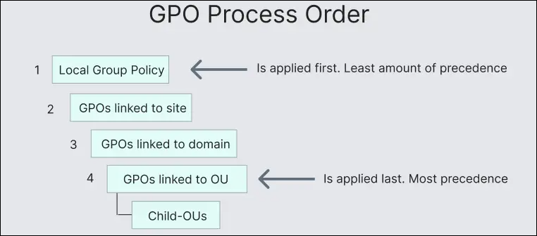
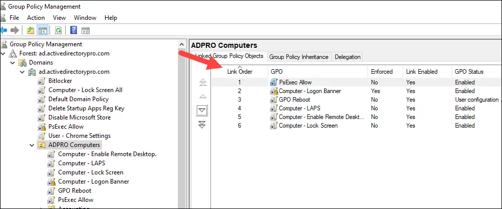

---
layout:
  width: default
  title:
    visible: true
  description:
    visible: false
  tableOfContents:
    visible: true
  outline:
    visible: true
  pagination:
    visible: true
  metadata:
    visible: true
  tags:
    visible: true
tags:
  - active-directory
  - gpos
  - cape
  - dacl
---

# GPOs

## Overview

**Group Policy** is a feature in Active Directory (AD) that allows administrators to centrally manage and enforce configuration settings for users and computers across a domain.

The primary tool used to manage these policies is the [Group Policy Management Console (GPMC)](https://learn.microsoft.com/en-us/windows-server/identity/ad-ds/manage/group-policy/group-policy-management-console), which can be opened using `gpmc.msc`. This console provides a centralized interface for creating, editing, linking, and delegating Group Policy Objects (GPOs).

A GPO is a collection of policy settings that control the configuration of systems and user environments in a domain. Each GPO is composed of two main components.

* The first component is the **Group Policy Container (GPC)**. This is an object stored in AD and represents the GPO itself. It contains metadata about the policy, including its unique identifier (GUID). The object is stored in the directory structure under a path similar to: `CN={GUID},CN=Policies,CN=System,DC=marvel,DC=local`.
* The second component is the **Group Policy Template (GPT)**. This contains the actual policy settings and configuration files. These files are stored in the `SYSVOL` share on a domain controller (DC) and are replicated across DCs. A typical GPT path looks like: `\\dc01.marvel.local\SYSVOL\marvel.local\Policies\{GUID}`

In most environments, GPOs are applied to **Organizational Units (OUs)**. By linking a GPO to an OU, administrators can ensure that all users or computers within that OU receive the defined configuration settings.

Group policies are automatically applied in several situations. They are processed when a computer boots and when a user logs into a domain-joined machine. In addition, policies refresh periodically in the background. This typically happens every **90 minutes**, with a random offset of up to **30 minutes** to avoid simultaneous refresh requests across many systems.

Group Policy settings are managed through **Group Policy Objects (GPOs)**, which can be linked to sites, domains, or, most commonly, OUs. OUs represent the lowest level in AD to which GPOs can be directly applied, making them a key target for both administrators and attackers seeking to influence system behavior at scale.

There are two common GPO-based mechanisms for **managing local group memberships**:

* **Restricted Groups**, located under Security Settings in a GPO, enforce strict membership by explicitly defining who should (or shouldn't) be in a given local group. Any accounts not listed are removed, making this a rigid but reliable enforcement tool.&#x20;
* In contrast, `groups.xml`, used in **Group Policy Preferences (GPP)**, provides more granular control, allowing additions, removals, or replacements without purging existing members unless explicitly instructed.

## GPO Delegation

By default, only members of the **Domain Admins** and **Enterprise Admins** groups have permission to modify GPOs. However, administrative tasks can be delegated to other users or groups.

Delegation is configured through the **Delegation** tab of a GPO in the GPMC. Administrators can assign different levels of access depending on the responsibilities of the delegated user.

The main permission levels are:

* **Read** – allows the user to view the GPO.
* **Edit Settings** – allows modification of the policy settings.
* **Edit Settings, Delete, Modify Security** – provides full control over the GPO, including editing settings, deleting the policy, and managing its permissions (including delegation).

Delegation is commonly used in larger organizations to allow specific teams (such as desktop support or server administrators) to manage only the policies relevant to their responsibilities.

## GPO Links

A **GPO link** determines where a policy is applied within the AD structure. Policies can be linked at several levels, including the local computer, site, domain, and organizational unit.&#x20;


An **AD Site** represents a **physical or network location**, typically defined by IP subnets and used to group computers and DCs that are located on the same local network. GPOs can be linked to a site, causing the policy to apply to **all computers within that physical or network location**, regardless of their OU.


Group Policy follows a specific processing order often referred to as **LSDOU**:

1. Local
2. Site
3. Domain
4. Organizational Unit (OU)

If multiple policies configure the same setting differently, the **last policy processed takes precedence**. Because OU policies are processed last, they typically override settings defined at the domain or site level.&#x20;

<figure><figcaption>
GPO proceess order (<a href="https://activedirectorypro.com/group-policy-processing-order/">source</a>).
</figcaption></figure>

Within the same level, the **link order** determines which GPO is processed last and therefore has higher priority.

<figure><figcaption>
GPO Link order (<a href="https://activedirectorypro.com/group-policy-processing-order/">source</a>).
</figcaption></figure>

In practice, this means that policies applied closer to the user or computer object in the AD hierarchy generally have the highest priority. Two additional features influence this behavior.

* **Enforced (No Override)** ensures that a GPO always takes precedence over conflicting policies. If a GPO is enforced, its settings will apply even if other policies at lower levels attempt to override them.
* **Block Inheritance** can be configured on an OU to prevent it from receiving GPOs applied at the domain or site level. However, enforced GPOs will still apply even when inheritance is blocked.

It is also important to note that **Local GPOs are processed before AD–based policies**. Even if inheritance is blocked at the OU level, the local policy on the machine will still be applied because it exists outside of the AD hierarchy.

## GPO Abuse

See [here](../attacks/gpo-abuse.md).
