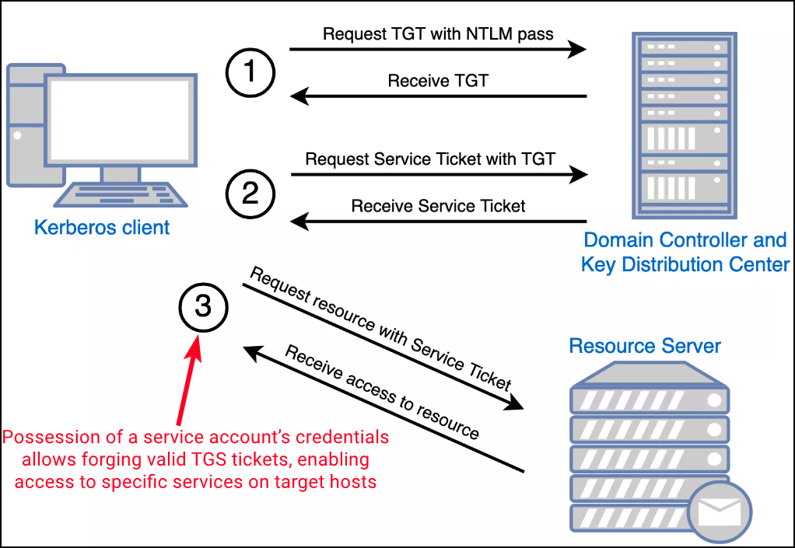

---
layout:
  title:
    visible: true
  description:
    visible: false
  tableOfContents:
    visible: true
  outline:
    visible: true
  pagination:
    visible: true
---

# Silver Tickets

Silver Tickets are **forged** [**Kerberos**](../general-info.md#kerberos) **service tickets (TGS)** that allow attackers to authenticate to specific services without ever interacting with a Domain Controller (DC), making them a highly stealthy technique. Unlike [Golden Tickets](golden-ticket.md), which target the Kerberos TGT and require the `krbtgt` hash for domain-wide impersonation, Silver Tickets focus on a narrower scope: **service-level access on a specific host**. The attack hinges on the compromise of a service account’s secret—typically its NTLM hash or AES key.

When a client requests access to a service via Kerberos, the DC issues a TGS encrypted with the service account’s key. However, if an attacker already possesses this key—often extracted from memory using tools like [Mimikatz](../ad-tools/mimikatz.md)—they can forge a TGS offline. Since the target service only verifies the ticket using its own key and doesn’t consult the DC, forged Silver Tickets can appear entirely legitimate from the service’s perspective.

<figure><figcaption></figcaption></figure>

In practice, this allows red teamers to impersonate any user, including privileged ones, when accessing services like SMB (CIFS), HTTP (e.g., for WinRM), HOST (for scheduled tasks), or RPCSS (needed for WMI). For instance, compromising a machine account (e.g., `dcorp-dc$`), which often runs various services, can unlock broad access to services hosted on that system. These **machine accounts rotate their passwords every 30 days by default**, limiting the long-term usefulness of the ticket for persistence, but offering a powerful short-term privilege escalation vector.

<table data-header-hidden><thead><tr><th width="140.66668701171875">Service (SPN)</th><th>Provides Access To</th></tr></thead><tbody><tr><td><code>HTTP</code></td><td>WinRM (Windows Remote Management)</td></tr><tr><td><code>CIFS</code></td><td>File system (SMB shares)</td></tr><tr><td><code>HOST</code></td><td>Scheduled tasks, remote service control, WMI (partial, combined with <code>RPCSS</code>)</td></tr><tr><td><code>RPCSS</code></td><td>WMI (combined with <code>HOST</code>), DCOM/RPC endpoint mapper</td></tr><tr><td><code>LDAP</code></td><td>DCSync (requires elevated permissions)</td></tr></tbody></table>

The effectiveness of Silver Ticket attacks is often boosted by the lack of strict PAC (Privilege Attribute Certificate) validation on many services. Without PAC validation, services accept forged tickets without verifying user group memberships with the DC. While Microsoft introduced `PAC_REQUESTOR` validation post-October 2022 to mitigate such attacks—especially for non-existent users—this check is not universally enforced, particularly on non-critical services.

Operationally, once the hash is obtained, the attack involves crafting a valid-looking TGS using tools like Rubeus. **Proper construction of the SPN (Service Principal Name) is critical**: it must conform to Kerberos naming conventions (e.g., `HTTP/web04.corp.com`) rather than URL formats and is case-sensitive in some deployments. Missteps here—such as using an invalid or misformatted SPN, or forging a ticket for a non-existent user—are common pitfalls that can cause the attack to fail.

Once injected into memory, the forged ticket allows immediate access to the target service as the specified user. The attack remains largely undetected by traditional DC-side logging, as the ticket is never requested from the DC. This OPSEC-safe nature makes it attractive for stealth operations, and many detection platforms, including Microsoft Defender for Identity (MDI), may overlook such activity since **AP-REQ traffic doesn’t always raise flags**.

## **Tools**



A service ticket can be requested using [Rubeus](../ad-tools/rubeus.md). Similar to the [Golden Ticket](golden-ticket.md) attack, the `/ldap` flag is used to query the DC for user information:


```powershell
# Forge a ST with Rubeus
.\Rubeus.exe silver /service:http/dcorp-dc.dollarcorp.moneycorp.local /rc4:<rc4> /sid:<domainSID> /ldap /user:Administrator /domain:dollarcorp.moneycorp.local /ptt
```




A service ticket can be requested using [Mimikatz](../ad-tools/mimikatz.md):


```powershell
# Forge a ST with Mimikatz
.\mimikatz.exe "kerberos::golden /sid:<domainSID> /domain:corp.com /ptt /target:web04.corp.com /service:http /rc4:<rc4> /user:jeffadmin" "exit"
```




